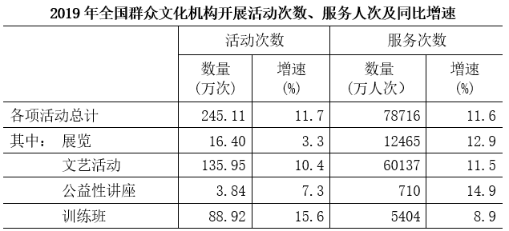
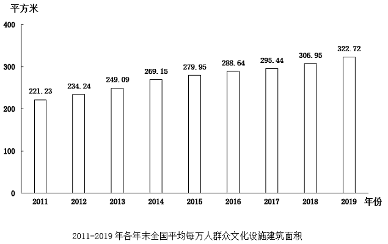
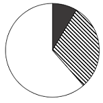
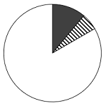
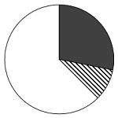
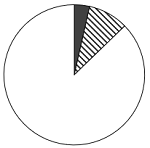
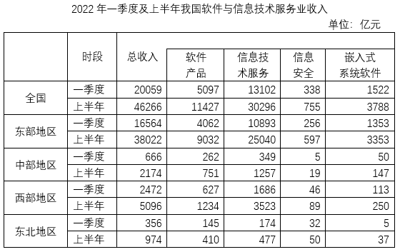

# 2025年四川省考/选调公务员录用考试《行测》试题（网友回忆版）

> 资料分析 · 15 题 · 四川 2025

## 材料 1

        2023年上半年，全国新注册登记机动车1688万辆，同比增长1.9%。新注册登记汽车1175万辆，同比增长5.8%。其中，新注册登记载客汽车1034万辆，同比增长5.6%；新注册登记载货汽车133万辆，同比增长8.1%。新注册登记新能源汽车313万辆，同比增长41.6%。

        2023年上半年，全国办理机动车转让登记业务1134万辆。其中，办理汽车转让登记业务1057万辆，同比增长5.3%；异地直接办理交易登记二手小客车157万辆。

        2023年6月末，全国机动车保有量4.26亿辆，同比增长4.9%。其中，汽车3.28亿辆，同比增长5.8%；新能源汽车1620万辆，同比增长61.8%。新能源汽车中，纯电动汽车保有量1259万辆，同比增长55.4%；2023年6月末，全国机动车驾驶人为5.13亿人，同比增长4.3%。其中，汽车驾驶人4.75亿人，同比增长4.6%。2023年上半年，全国新领证驾驶人1191万人，同比增长8.0%。

        2023年6月末，全国有88个城市汽车保有量超过100万辆，同比增加7个城市。其中，41个城市超过200万辆，24个城市超过300万辆，3个城市超过500万辆，2个城市超过600万辆。

### 第 1 题　qid 10297391 · 增长

2023年上半年，我国办理汽车转让登记业务同比增加：

- **A**. 不到40万辆
- **B**. 40多万辆
- **C**. 50多万辆　✅
- **D**. 60万辆以上

**答案**：C

**官方解析**

根据题干“······同比增加”，结合选项带单位，可判定本题为增长量计算问题。定位文字材料第二段可得：2023年上半年，办理汽车转让登记业务1057万辆，同比增长5.3%。根据公式：增长量，则所求万辆，在C项范围内。

故正确答案为C。

---

### 第 2 题　qid 10297392 · 增长

2023年上半年，全国新注册登记非汽车类机动车数量比上年同期：

- **A**. 增长了不到2%
- **B**. 增长了2%以上
- **C**. 减少了不到2%
- **D**. 减少了2%以上　✅

**答案**：D

**官方解析**

根据题干“······全国新注册登记非汽车类机动车数量比上年同期”，结合选项为增长/减少+%，且材料给出2023年上半年全国新注册登记机动车、新注册登记汽车的数量和增长率，可判定本题为混合增长率问题。定位文字资料第一段可得：2023年上半年，全国新注册登记机动车1688万辆，同比增长1.9%，新注册登记汽车1175万辆，同比增长5.8%。设所求增长率为x，根据混合增长率口诀“整体增长率居中”，可知：5.8%&gt;1.9%&gt;x，排除B项。根据混合增长率口诀“整体增长率偏向基数较大的”，且新注册登记汽车1175万辆、新注册登记非汽车类机动车1688-1175=513万辆，可知5.8%-1.9%&lt;1.9%-x，解得x&lt;-2%，即减少了2%以上。
故正确答案为D。

---

### 第 3 题　qid 10297394 · 比重

2023年6月末，新能源汽车保有量占汽车保有量的比重，比当年上半年新注册登记新能源汽车数量占新注册登记汽车数量的比重约低多少个百分点？

- **A**. 12
- **B**. 17
- **C**. 22　✅
- **D**. 27

**答案**：C

**官方解析**

根据题干“2023年6月末······的比重，比当年上半年······的比重约低多少个百分点”，结合材料时间为2023年上半年及6月末，可判定本题为现期比重问题。定位文字材料第一段可得：2023年上半年，新注册登记汽车1175万辆，新注册登记新能源汽车313万辆；定位文字材料第三段可得：2023年6月末，汽车保有量3.28亿辆，新能源汽车保有量1620万辆。根据公式：比重，则所求，即前者比后者约低21个百分点，与C项最接近。

故正确答案为C。

---

### 第 4 题　qid 10297396 · 比重

以下饼图中，最能准确反映2023年6月末全国汽车保有量超过100万辆的城市中，保有量在100~200万辆之间的城市（白色）、保有量在200~300万辆之间的城市（斜线）和保有量超过300万辆的城市（黑色）个数占比关系的是：

- **A**. 

- **B**. 

- **C**. 

- **D**. 

　✅

**答案**：D

**官方解析**

根据题干“······2023年6月末······占比关系的是”，结合材料时间为2023年6月末，可判定本题为现期比重问题。定位文字材料第四段可得：2023年6月末，全国有88个城市汽车保有量超过100万辆，其中，41个城市超过200万辆，24个城市超过300万辆。则保有量在100~200万辆之间的城市（白色）有88-41=47个、保有量在200~300万辆之间的城市（斜线）有41-24=17个、保有量超过300万辆的城市（黑色）有24个。，即白色区域约是黑色区域的2倍，只有D项符合。

故正确答案为D。

---

### 第 5 题　qid 10297397 · 增长

在①2023年6月末除汽车驾驶人之外的机动车驾驶人数量同比增速和②2022年下半年全国新领证驾驶人数量两个指标中：

- **A**. 仅①能够从上述资料中推出　✅
- **B**. 仅②能够从上述资料中推出
- **C**. 两者均能从上述资料中推出
- **D**. 两者均不能从上述资料中推出

**答案**：A

**官方解析**

①定位文字材料第三段可得：2023年6月末，全国机动车驾驶人为5.13亿人，同比增长4.3%，其中，汽车驾驶人4.75亿人，同比增长4.6%。2023年6月末除汽车驾驶人之外的机动车驾驶人数量为（5.13-4.75）亿人。根据公式：基期量，可得2022年6月末除汽车驾驶人之外的机动车驾驶人数量为（）亿人。根据公式：增长率，可得所求，可以推出；

②定位文字材料第三段可得：2023年上半年，全国新领证驾驶人1191万人，同比增长8.0%。材料并未给出与2022年下半年全国新领证驾驶人数量相关的数据，故无法推出。

综上，仅①能够从上述资料中推出。

故正确答案为A。

注：由于驾驶人增长量新领证驾驶人数量（存在因驾驶证被吊销、驾驶证持有人死亡等原因造成的驾驶人减少的情况），所以不能用“ 2023年6月末驾驶人同比增长量-2023年上半年新领证驾驶人数量” 计算“2022年下半年新领证驾驶人数量”。

---

## 材料 2

        2019年末，全国共有群众文化机构44073个，比上年末减少391个。其中乡镇综合文化站33530个，比上年末减少328个。年末全国群众文化机构从业人员190068人，比上年末增加4431人。其中具有高级职称的人员6675人，具有中级职称的人员17503人。

        2019年末，全国群众文化机构实际使用房屋建筑面积4518.18万平方米，比上年末增长5.5%；业务用房面积3295.21万平方米，比上年末增长4.7%。年末全国平均每万人群众文化设施建筑面积322.72平方米，比上年末提高15.77平方米。

### 第 6 题　qid 10297448 · 比重

2018年末，乡镇综合文化站占全国群众文化机构的比重约为：

- **A**. 70%
- **B**. 73%
- **C**. 76%　✅
- **D**. 79%

**答案**：C

**官方解析**

根据题干“2018年末······占······的比重约为”，结合材料时间为2019年末，可判定本题为基期比重问题。定位文字材料第一段可得：2019年末，全国共有群众文化机构44073个，比上年末减少391个。其中乡镇综合文化站33530个，比上年末减少328个。根据公式：比重，基期量=现期量-增长量，则2018年末，乡镇综合文化站占全国群众文化机构的比重。

故正确答案为C。

---

### 第 7 题　qid 10297450 · 增长

以下各年份中，年末全国平均每万人群众文化设施建筑面积同比增速最快的是：

- **A**. 2012年
- **B**. 2013年
- **C**. 2014年　✅
- **D**. 2019年

**答案**：C

**官方解析**

根据题干“······同比增速最快的是”，可判定本题为一般增长率问题。定位统计图可得：2011-2014年、2018年、2019年年末全国平均每万人群众文化设施建筑面积分别为221.23平方米、234.24平方米、249.09平方米、269.15平方米、306.95平方米、322.72平方米。根据公式：增长率，可得各选项增速分别为：

2012年：；

2013年：；

2014年：；

2019年：。

综上可知，上述年份中同比增速最快的是2014年。

故正确答案为C。

---

### 第 8 题　qid 10297452 · 比重

以下饼图中，最能准确反映2019年末全国群众文化机构从业人员中，具有高级职称的人员（黑色）、具有中级职称的人员（斜线）及其他人员（白色）占比情况的是（    ）。

- **A**. 

- **B**. 

- **C**. 

- **D**. 

　✅

**答案**：D

**官方解析**

根据题干“以下饼图中，最能准确反映2019年末······占比情况的是”，结合材料时间为2019年末，可判定本题为现期比重问题。定位文字材料第一段可知：2019年末，全国群众文化机构从业人员190068人，比上年末增加4431人。其中具有高级职称的人员6675人，具有中级职称的人员17503人。

方法一：其他人员有190068-（6675+17503）=165890人。比较可知，高级职称的人员数（黑色）最少，排除B、C两项；根据公式：比重，可知其他人员占比为，排除A项。

方法二：倍。根据中级职称人员数（斜线）和高级职称人员数（黑色）倍数大于2倍，排除B、C两项；同时倍数小于3倍，排除A项。

故正确答案为D。

---

### 第 9 题　qid 10297453 · 平均数

在2019年全国群众文化机构开展的各项活动中，平均每次活动服务人次数最多的是：

- **A**. 展览　✅
- **B**. 文艺活动
- **C**. 公益性讲座
- **D**. 训练班

**答案**：A

**官方解析**

根据题干“在2019年······各项活动中，平均每次······最多的是”，结合材料时间为2019年，可判定本题为现期平均数问题。定位表格材料可知：2019年全国群众文化机构开展的展览、文艺活动、公益性讲座、训练班的活动次数分别为16.40万次、135.95万次、3.84万次、88.92万次；服务次数分别为12465万人次、60137万人次、710万人次、5404万人次。根据公式：平均每次活动服务人次数，则四个选项的平均每次活动服务人次数分别为：

展览，人；

文艺活动，人；

公益性讲座，人；

训练班，人。

比较可知，平均每次活动服务人次数最多的是展览。

故正确答案为A。

---

### 第 10 题　qid 10297454 · 综合

能够从上述资料中推出的是：

- **A**. 2011~2019年全国平均每万人群众文化设施建筑面积年均增量（以2011年为基期）小于11平方米
- **B**. 2018年全国群众文化机构开展活动中，文艺活动的服务人次占总服务人次的比重超过80%
- **C**. 2019年全国群众文化机构开展的活动次数比2018年多不到30万次　✅
- **D**. 2019年末全国群众文化机构实际使用业务用房建筑面积与实际使用房屋建筑面积的比值高于上年

**答案**：C

**官方解析**

A项：定位统计图可得，2011年、2019年全国平均每万人群众文化设施建筑面积分别为221.23平方米、322.72平方米。根据公式：年均增量，则所求年均增量平方米&gt;11平方米，错误；

B项：定位统计表可得，2019年全国群众文化机构开展活动的总服务次数为78716万人次（B），同比增速为11.6%（b）；文艺活动的服务次数为60137万人次（A），同比增速为11.5%（a）。根据公式：基期比重，则所求比重，错误；

C项：定位统计表可得，2019年全国群众文化机构开展活动次数为245.11万次，同比增速为11.7%。根据公式：增长量，则所求增长量万次&lt;30万次，正确；

D项：定位文字材料第二段可得，2019年末，全国群众文化机构实际使用房屋建筑面积······比上年末增长5.5%（b）；业务用房面积······比上年末增长4.7%（a）。根据两期比例比较结论：当分子增长率（a）&gt;分母增长率（b）时，比值上升；当分子增长率（a）&lt;分母增长率（b）时，比值下降。因4.7%（a）&lt;5.5%（b），故比值下降，错误。

故正确答案为C。

---

## 材料 3

        2022年上半年，我国软件与信息技术服务业总收入同比增长10.9%，增速较1~5月份提高0.3个百分点。软件与信息技术服务业收入中，软件产品收入、信息技术服务收入、信息安全收入、嵌入式系统软件收入同比分别增长10.2%、12%、11.4%和5%。信息技术服务收入中，云计算、大数据服务收入4790亿元，同比增长9.3%；集成电路设计收入1279亿元，同比增长15.2%。

        2022年上半年，我国东部、中部、西部、东北地区完成软件与信息技术服务业总收入同比增速分别为10.2%、14.4%、15.9%和6.3%。

 

### 第 11 题　qid 10297461 · 综合

2022年二季度，我国中部地区软件与信息技术服务业总收入约是东北地区的：

- **A**. 不到2倍
- **B**. 2~3倍之间　✅
- **C**. 3~4倍之间
- **D**. 4倍以上

**答案**：B

**官方解析**

根据题干“2022年二季度······是······”，结合选项为倍数，且材料给出2022年一季度与上半年数据，可判定本题为现期倍数问题。定位统计表可得：2022年一季度我国中部地区和东北地区软件与信息技术服务业总收入分别为666亿元和356亿元，上半年分别为2174亿元和974亿元。根据公式：倍数，则所求倍，在B项范围内。

故正确答案为B。

---

### 第 12 题　qid 10297462 · 比重

2022年上半年，我国东部地区信息技术服务收入在全国软件与信息技术服务业总收入中的占比在以下哪个范围内？

- **A**. 不到50%
- **B**. 50%~60%之间　✅
- **C**. 60%~70%之间
- **D**. 超过70%

**答案**：B

**官方解析**

根据题干“2022年上半年，······占比······”，结合材料给出2022年上半年具体值，可判定本题为现期比重问题。定位统计表可得：2022年上半年，全国软件与信息技术服务业总收入为46266亿元、东部地区信息技术服务收入为25040亿元。根据公式：比重，则所求比重，在B项范围内。

故正确答案为B。

---

### 第 13 题　qid 10297463 · 综合

在全国4个地区中，2022年二季度四类软件与信息技术服务业收入均高于一季度水平的有几个？

- **A**. 4
- **B**. 3
- **C**. 2　✅
- **D**. 1

**答案**：C

**官方解析**

定位表格可知2022年上半年和一季度全国四个地区四类软件与信息技术服务业的收入。则全国四个地区2022年二季度四类软件与信息技术服务业收入与一季度的比较如下：

东部地区：软件产品，亿元；信息技术服务，亿元；信息安全，亿元；嵌入式系统软件，亿元。则2022年二季度东部地区四类软件与信息技术服务业收入均高于一季度水平；

中部地区：软件产品，亿元；信息技术服务，亿元；信息安全，亿元；嵌入式系统软件，亿元。则2022年二季度中部地区四类软件与信息技术服务业收入均高于一季度水平；

西部地区：软件产品，1234-627=607亿元&lt;627亿元。则2022年二季度西部地区不满足四类软件与信息技术服务收入均高于一季度水平；

东北地区：软件产品，亿元；信息技术服务，亿元；信息安全，亿元。则2022年二季度东北地区不满足四类软件与信息技术服务收入均高于一季度水平。

综上，符合题意的有东部地区、中部地区，共2个。

故正确答案为C。

---

### 第 14 题　qid 10297464 · 增长

将我国4个地区按2022年二季度嵌入式系统软件收入环比增速从快到慢排序，下列正确的是：

- **A**. 东部地区>东北地区>西部地区>中部地区
- **B**. 东北地区>中部地区>西部地区>东部地区
- **C**. 东部地区>西部地区>中部地区>东北地区
- **D**. 东北地区>中部地区>东部地区>西部地区　✅

**答案**：D

**官方解析**

根据“······2022年二季度······环比增速从快到慢排序······”，可判定本题为一般增长率问题。定位统计表可得2022年一季度和上半年我国4个地区嵌入式系统软件收入。根据公式：增长率，结合“二季度收入=上半年收入-一季度收入”可得各地区二季度环比增速分别为：

东部地区：；

中部地区：；

西部地区：；

东北地区：。

则4个地区按环比增速从快到慢排序为：东北地区&gt;中部地区&gt;东部地区&gt;西部地区。

故正确答案为D。

---

### 第 15 题　qid 10297465 · 综合

能够从上述资料中推出的是：

- **A**. 2021年上半年，我国东北地区软件与信息技术服务业月均收入不足150亿元
- **B**. 2022年6月，我国软件与信息技术服务业总收入增速超过10%　✅
- **C**. 2022年上半年，我国嵌入式系统软件收入同比增量小于信息安全收入同比增量
- **D**. 2022年上半年，我国集成电路设计收入占信息技术服务收入比重低于上年同期

**答案**：B

**官方解析**

A项：定位文字材料第二段可得：2022年上半年，我国东北地区完成软件与信息技术服务业总收入同比增速为6.3%；定位表格材料可得：2022年上半年，我国东北地区完成软件与信息技术服务业总收入为974亿元。根据公式：基期量，可得2021年上半年我国东北地区完成软件与信息技术服务业总收入为亿元，则题干所求为亿元&gt;150亿元，错误；

B项：定位文字材料第一段可得：2022年上半年，我国软件与信息技术服务业总收入同比增长10.9%，增速较1~5月提高0.3个百分点。则2022年1~5月我国软件与信息技术服务业总收入同比增速为10.9%-0.3%=10.6%。根据混合增长率口诀：“总体增长率居中，但不正中”可知：6月同比增长率&gt;10.9%&gt;10.6%，即6月同比增长率&gt;10%，正确；

C项：定位文字材料第一段可得：2022年上半年，我国信息安全收入、嵌入式系统软件收入同比分别增长11.4%和5%；定位表格材料可得：2022年上半年，我国信息安全收入、嵌入式系统软件收入分别为755亿元、3788亿元。根据公式：增长量，则信息安全收入同比增量为亿元；嵌入式系统软件收入同比增量为亿元。则嵌入式系统软件收入同比增量（亿元）大于信息安全收入同比增量（75.5亿元），错误；

D项：定位文字材料第一段可得：2022年上半年，我国信息技术服务收入同比增长12%（b）；信息技术服务收入中，集成电路设计收入同比增长15.2%（a）。根据两期比重比较的结论：当部分增长率（a）&gt;整体增长率（b）时，比重上升。由15.2%（a）&gt;12%（b），故比重高于上年同期，错误。

故正确答案为B。

---
