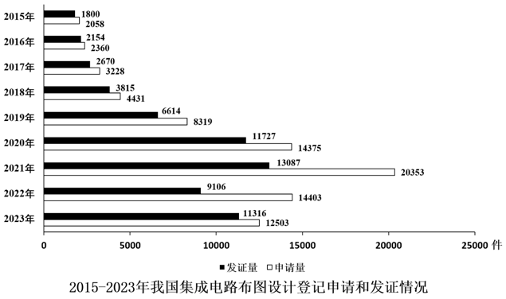
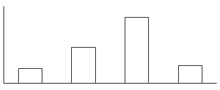
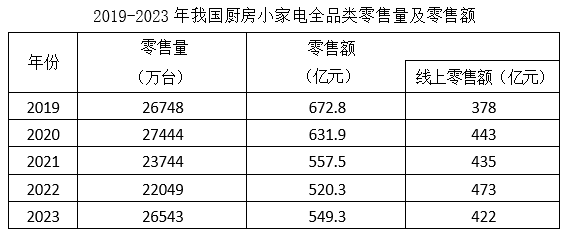
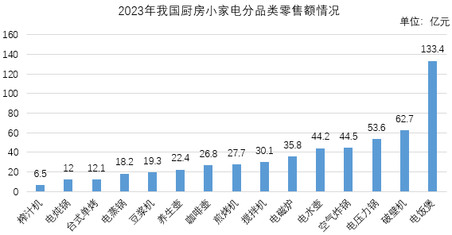
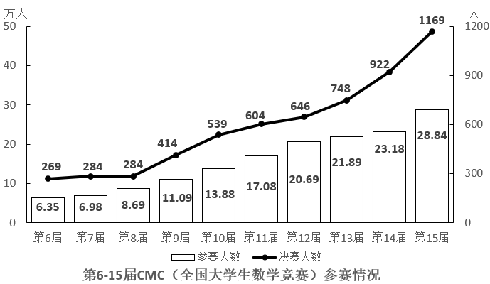
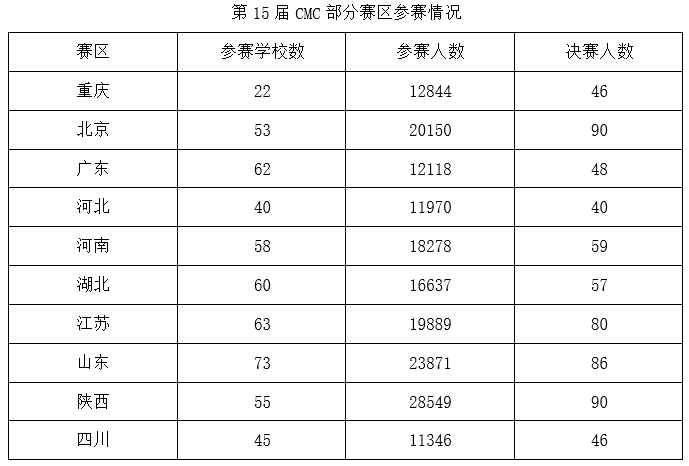

# 2025年国家公务员录用考试《行测》题（副省级网友回忆版）

> 资料分析 · 20 题 · 国考 2025

## 材料 1

        截至2023年末，我国集成电路布图设计登记累计申请93147件，发证72378件，2024年1-4月，我国集成电路布图设计登记申请3503件，发证4189件。

### 第 1 题　qid 19283741 · 综合

截至2014年末，我国集成电路布图设计登记累计申请量在以下哪个范围内？

- **A**. 0.8万-1.5万件之间　✅
- **B**. 不到0.8万件
- **C**. 1.5万-2.2万件之间
- **D**. 超过2.2万件

**答案**：A

**官方解析**

定位文字材料可得：截至2023年末，我国集成电路布图设计登记累计申请93147件；定位统计图可知2015-2023年我国集成电路布图设计登记申请量。则截至2014年末，我国集成电路布图设计登记累计申请量=2023年末累计申请量-2015至2023年申请量之和件=1.1万件，在A项范围内。

故正确答案为A。

---

### 第 2 题　qid 19283742 · 增长

如2024年5-12月，我国集成电路布图设计登记月均发证量与1-4月水平相同，则2024年全年，我国集成电路布图设计登记发证量将比上年：

- **A**. 下降不到20%
- **B**. 下降20%以上
- **C**. 上升不到20%　✅
- **D**. 上升20%以上

**答案**：C

**官方解析**

根据题干“······我国集成电路布图设计登记发证量将比上年”，结合选项为百分数，可判定本题为一般增长率问题。定位文字材料可知：2024年1-4月，我国集成电路布图设计登记申请3503件，发证4189件。定位统计图可知：2023年我国集成电路布图设计登记发证11316件。则2024年1-4月我国集成电路布图设计登记月均发证量件，2024年全年我国集成电路布图设计登记发证量=4189+1047×（12-4）=12565件。根据公式：增长率，可得2024年全年我国集成电路布图设计登记发证量比上年增长，即上升不到20%。

故正确答案为C。

---

### 第 3 题　qid 19283744 · 增长

2019-2021年，我国集成电路布图设计登记申请量三年的同比增速：

- **A**. 先升后降
- **B**. 先降后升
- **C**. 逐年上升
- **D**. 逐年下降　✅

**答案**：D

**官方解析**

根据题干“2019-2021······三年的同比增速”，可判定本题为一般增长率问题。定位统计图可得：2018-2021年我国集成电路布图设计登记申请量分别为4431件、8319件、14375件、20353件。根据公式：增长率，则2019-2021年我国集成电路布图设计登记申请量同比增速分别为：

2019年，；

2020年，；

2021年，。

综上所述，2019-2021年，我国集成电路布图设计登记申请量同比增速逐年下降。

故正确答案为D。

---

### 第 4 题　qid 19283745 · 综合

2015-2023年，我国集成电路布图设计登记当年发证量与当年申请量比值大于0.9的年份有几个？

- **A**. 2　✅
- **B**. 3
- **C**. 4
- **D**. 5

**答案**：A

**官方解析**

根据题干“2015-2023年······与······比值大于0.9的年份有几个”，可判定本题为比值计算问题。定位统计图可知2015-2023年我国集成电路布图设计登记当年发证量与当年申请量。2015-2023年各年份比值分别为：

2015年，；

2016年，；

2017年，；

2018年，；

2019年，；

2020年，；

2021年，；

2022年，；

2023年，。

综上，2015-2023年我国集成电路布图设计登记当年发证量与当年申请量比值大于0.9的年份有2016年、2023年，共2个。

故正确答案为A。

---

### 第 5 题　qid 19283747 · 增长

以下柱状图反映了哪一时间段内，我国集成电路布图设计登记发证量同比增量的变化趋势（横轴位置表示增量为0）？

- **A**. 2017-2020年
- **B**. 2016-2019年
- **C**. 2019-2022年
- **D**. 2018-2021年　✅

**答案**：D

**官方解析**

根据题干“······同比增量的变化趋势”，可判定本题为增长量比较问题。定位统计图可得2015-2022年我国集成电路布图设计登记发证量。根据公式：增长量=现期量-基期量，则2016-2022年我国集成电路布图设计登记发证量同比增量分别为：

2016年，；

2017年，；

2018年，；

2019年，；

2020年，；

2021年，；

2022年，9106-13087&lt;0。

观察可知，柱状图呈现先上升再下降的趋势，且第三个柱子最高，与2018-2021年同比增量的变化趋势一致。

故正确答案为D。

---

## 材料 2

### 第 6 题　qid 19283968 · 综合

2019-2023年我国厨房小家电全品类零售总量在以下哪个范围？

- **A**. 12亿台-13亿台之间　✅
- **B**. 13亿台-14亿台之间
- **C**. 不到12亿台
- **D**. 超过14亿台

**答案**：A

**官方解析**

定位统计表可得：2019-2023年我国厨房小家电全品类零售量分别为26748万台、27444万台、23744万台、22049万台、26543万台。则2019-2023年我国厨房小家电全品类零售总量为万台=12.7亿台，在A项范围内。

故正确答案为A。

---

### 第 7 题　qid 19283969 · 比重

2019-2023年，我国厨房小家电全品类零售额中线上零售额占比超过75%的年份有几个？

- **A**. 4
- **B**. 3　✅
- **C**. 2
- **D**. 1

**答案**：B

**官方解析**

根据题干“2019-2023年······中······占比超过75%的年份有几个”，可判定本题为现期比重问题。定位统计表可得：2019-2023年，我国厨房小家电全品类零售额分别为672.8亿元、631.9亿元、557.5亿元、520.3亿元、549.3亿元；线上零售额分别为378亿元、443亿元、435亿元、473亿元、422亿元。根据公式：比重，可得各年份我国厨房小家电全品类零售额中线上零售额占比分别为：

2019年：，不满足；

2020年：，不满足；

2021年：，满足；

2022年：，满足；

2023年：，满足。

综上，2019-2023年，我国厨房小家电全品类零售额中线上零售额占比超过75%的年份有2021年、2022年、2023年，共3个。

故正确答案为B。

---

### 第 8 题　qid 19283971 · 综合

资料所列厨房小家电品类当中，2023年零售额超过全品类零售总额10%的有几类？

- **A**. 4
- **B**. 3
- **C**. 2　✅
- **D**. 1

**答案**：C

**官方解析**

根据题干“······2023年······超过······10%的有几类”，结合材料时间为2023年，可判定本题为现期比重问题。定位表格可得：2023年，我国厨房小家电全品类零售总额为549.3亿元。定位柱形图可知2023年我国厨房小家电分品类零售额情况。根据公式：部分=整体×比重，则2023年超过全品类零售总额10%的小家电品类零售额应超过549.3×10%=54.93亿元，故符合题意的有破壁机（62.7亿元）、电饭煲（133.4亿元），共2类。
故正确答案为C。

---

### 第 9 题　qid 19283972 · 综合

2023年电饭煲、破壁机和电压力锅零售额之和约是台式单烤、电炖锅和榨汁机零售额之和的多少倍？

- **A**. 8　✅
- **B**. 7
- **C**. 6
- **D**. 5

**答案**：A

**官方解析**

根据题干“2023年······约是······的多少倍”，结合材料时间为2023年，可判定本题为现期倍数问题。定位图形材料可得：2023年，电饭煲、破壁机、电压力锅零售额分别为133.4亿元、62.7亿元、53.6亿元，台式单烤、电炖锅、榨汁机零售额分别为12.1亿元、12亿元、6.5亿元。则所求倍。

故正确答案为A。

---

### 第 10 题　qid 19283973 · 平均数

以下折线图中，最能准确反映2019-2023年我国厨房小家电平均每台零售价变化趋势的是：

- **A**. 

- **B**. 

- **C**. 

- **D**. 

　✅

**答案**：D

**官方解析**

根据题干“······2019-2023年······平均每台零售价变化趋势的是”，可判定本题为现期平均数问题。定位统计表可得：2019-2023年，我国厨房小家电全品类零售量及零售额。平均每台零售价，可得2019-2023年我国厨房小家电平均每台零售价分别为：

2019年，元/台；

2020年，元/台；

2021年，元/台；

2022年，元/台；

2023年，元/台。

比较可知，2019年我国厨房小家电平均每台零售价比其它年份都明显高，排除A、B两项；2020年-2022年这三年数值接近，排除C项，只有D项符合。

故正确答案为D。

---

## 材料 3

### 第 11 题　qid 19283959 · 平均数

表中所列赛区中，第15届CMC平均每个参赛学校参赛人数最少的是：

- **A**. 河北
- **B**. 湖北
- **C**. 四川
- **D**. 广东　✅

**答案**：D

**官方解析**

根据题干“······第十五届······平均每个······”，结合材料给出第十五届CMC各赛区参赛情况，可判定本题为现期平均数问题。定位统计表可知第十五届CMC各赛区参赛学校数及参赛人数，根据公式：平均数，可得：河北为，湖北为，四川为，广东为。比较可知，广东赛区平均每个参赛学校参赛人数最少。

故正确答案为D。

---

### 第 12 题　qid 19283960 · 综合

如果第15届CMC参赛人数是首届的10.85倍，问第10届CMC参赛人数是首届参赛人数的多少倍？

- **A**. 3
- **B**. 5　✅
- **C**. 7
- **D**. 9

**答案**：B

**官方解析**

根据题干“······第10届······是首届······倍”，可判定本题为现期倍数问题。定位统计图可知：第15届CMC参赛人数为28.84万人，第10届CMC参赛人数为13.88万人。由题干可知：第15届CMC参赛人数是首届的10.85倍，即首届CMC参赛人数为万人。则所求倍数为。

故正确答案为B。

---

### 第 13 题　qid 19283961 · 综合

若保持第15届CMC参赛人数环比增量不变，问哪一届CMC参赛人数将第一次超过50万人？

- **A**. 第19届　✅
- **B**. 第20届
- **C**. 第21届
- **D**. 第22届

**答案**：A

**官方解析**

根据题干“若保持······环比增量不变，······将第一次超过50万人”，可判定本题为现期计算问题。定位图1可得：第14届CMC参赛人数为23.18万人，第15届CMC参赛人数为28.84万人。根据公式：增长量=现期量-基期量，则第15届CMC参赛人数环比增量=28.84-23.18=5.66万人。根据公式：现期量=基期量+增长量×n，可得28.84+5.66×n&gt;50，解得n&gt;3.7，则n至少取到4，故第15+4=19届CMC参赛人数将第一次超过50万人。
故正确答案为A。

---

### 第 14 题　qid 19283962 · 综合

表中所列赛区中，参加第15届CMC决赛人数占当届决赛总人数的：

- **A**. 不到40%
- **B**. 40%-50%之间
- **C**. 50%-60%之间　✅
- **D**. 超过60%

**答案**：C

**官方解析**

根据题干“······参加第15届······占当届······的”，结合选项为百分数，可判定本题为现期比重问题。定位统计图可得：参加第15届CMC决赛的总人数为1169人；定位统计表可得：表中所列赛区参加第15届CMC决赛的人数=46+90+48+40+59+57+80+86+90+46=642人。根据公式：比重，则所求比重，在C项范围内。

故正确答案为C。

---

### 第 15 题　qid 19283963 · 比重

以下折线图中，最能准确反映第10-14届CMC决赛人数占参赛人数比重变化趋势的是：

- **A**. 

- **B**. 

　✅
- **C**. 

- **D**. 

**答案**：B

**官方解析**

根据题干“······第10-14届······比重······”，结合材料给出第10-14届CMC参赛人数情况，可判定本题为现期比重问题。定位统计图可知第10-14届CMC参赛人数及决赛人数。根据公式：比重，可得第10-14届CMC决赛人数占参赛人数比重分别为：

第10届，；

第11届，；

第12届，；

第13届，；

第14届，。

比较可知，第12届比重最小，第14届比重最大，只有B项满足。

故正确答案为B。

---

## 材料 4

        2023年三季度，支付系统共处理支付业务3358.88亿笔，金额3151.37万亿元，同比分别增长12.59%和6.97%。

        三季度，人民银行清算总中心系统共处理支付业务54.79亿笔，金额2379.52万亿元，同比分别增长0.92%和9.53%，其中，大额实时支付系统处理业务9518.17万笔，同比下降10.39%，金额2254.07万亿元，同比增长9.72%；小额批量支付系统处理业务11.51亿笔，金额46.69万亿元，同比分别增长5.73%和10.03%；网上支付跨行清算系统处理业务42.31亿笔，同比下降0.03%，金额74.66万亿元，同比增长5.38%；境内外币支付系统处理业务134.46万笔，同比增长2.83%，金额5707.35亿美元，同比下降14.63%。

        在其他支付系统中，银行行内业务系统三季度处理业务54.42亿笔，同比增长11.14%，金额539.56万亿元，同比下降4.10%；银联跨行支付系统处理业务837.93亿笔，金额70.27万亿元，同比分别增长21.37%和8.70%；城银清算支付清算系统处理业务1056.40万笔，金额9744.45亿元，同比分别增长34.61%和36.31%；农信银支付清算系统处理业务7.41亿笔，金额7162.13亿元，同比分别下降39.98%和13.55%；人民币跨境支付系统处理业务176.43万笔，金额33.42万亿元，同比分别增长43.23%和31.41%；网联清算平台处理业务2404.21亿笔，金额126.92万亿元，同比分别增长10.42%和6.28%。

### 第 16 题　qid 19283733 · 平均数

2023年三季度，支付系统平均每笔支付业务金额比上年同期：

- **A**. 下降了不到1000元　✅
- **B**. 下降了1000元以上
- **C**. 上升了不到1000元
- **D**. 上升了1000元以上

**答案**：A

**官方解析**

根据题干“2023年三季度······平均每······比上年同期”，结合选项带单位，可判定本题为平均数的增长量问题。定位文字材料第一段可得：2023年三季度，支付系统共处理支付业务3358.88亿笔（B），金额3151.37万亿元（A），同比分别增长12.59%（b）和6.97%（a）。根据公式：平均数的增长量，可得所求为元，即下降了不到1000元。

故正确答案为A。

---

### 第 17 题　qid 19283734 · 增长

2023年三季度，人民银行清算总中心系统处理支付业务中，小额批量支付系统处理业务笔数的占比同比：

- **A**. 下降了2个百分点以上
- **B**. 下降了不到2个百分点
- **C**. 上升了2个百分点以上
- **D**. 上升了不到2个百分点　✅

**答案**：D

**官方解析**

根据题干“2023年三季度，······中······的占比同比”，结合选项为“上升/下降+百分点”，可判定本题为两期比重计算问题。定位文字材料第二段可得：2023年三季度，人民银行清算总中心系统共处理支付业务54.79亿笔（B），同比增长0.92%（b），其中，小额批量支付系统处理业务11.51亿笔（A），同比增长5.73%（a）。根据公式：两期比重差，则题干所求，即上升了不到2个百分点。

故正确答案为D。

---

### 第 18 题　qid 19283737 · 综合

2022年三季度，人民银行清算总中心系统境内外币支付系统处理业务日均处理金额在以下哪个范围内？

- **A**. 超过80亿美元
- **B**. 70亿-80亿美元之间　✅
- **C**. 60亿-70亿美元之间
- **D**. 不到60亿美元

**答案**：B

**官方解析**

根据题干“2022年三季度······日均处理金额······”，结合材料时间为2023年三季度，可判定本题为基期平均数问题。定位文字材料第二段可得：2023年三季度，人民银行清算总中心系统境内外币支付系统处理金额5707.35亿美元，同比下降14.63%。根据公式：基期量，可得2022年三季度，人民银行清算总中心系统境内外币支付系统处理金额亿美元。由于2022年7月有31天，8月有31天，9月有30天，则三季度共有31+31+30=92天，可得三季度日均处理金额亿美元，在B项范围内。

故正确答案为B。

---

### 第 19 题　qid 19283738 · 增长

将其他支付系统中①银行行内业务系统、②银联跨行支付系统、③城银清算支付清算系统和④农信银支付清算系统按2023年三季度平均每笔业务金额同比增速从高到低排列，以下正确的是：

- **A**. ①②③④
- **B**. ③②①④
- **C**. ④③②①　✅
- **D**. ④①②③

**答案**：C

**官方解析**

根据题干“······2023年三季度平均每笔业务金额同比增速······”，可判定本题为平均数的增长率问题。定位文字资料第三段可得：（2023年三季度）在其他支付系统中，银行行内业务系统三季度处理业务数量同比增长11.14%（），金额同比下降4.10%（）；银联跨行支付系统处理业务数量和金额同比分别增长21.37%（）和8.70%（）；城银清算支付清算系统处理业务数量和金额同比分别增长34.61%（）和36.31%（）；农信银支付清算系统处理业务数量和金额同比分别下降39.98%（）和13.55%（）。根据公式：平均数的增长率，则2023年三季度①银行行内业务系统、②银联跨行支付系统、③城银清算支付清算系统和④农信银支付清算系统平均每笔业务金额同比增速分别为：

①银行行内业务系统：；

②银联跨行支付系统：；

③城银清算支付清算系统：；

④农信银支付清算系统：。

综上可知，同比增速从高到低排列为：④③②①。

故正确答案为C。

---

### 第 20 题　qid 19283743 · 综合

关于2023年三季度支付系统运行情况，不能从上述资料中推出的是：

- **A**. 网上支付跨行清算系统处理业务平均每笔金额同比增长了5%以上
- **B**. 银联跨行支付系统处理业务金额同比增量高于城银清算支付清算系统处理业务金额同比增量
- **C**. 大额实时支付系统处理业务金额占人民银行清算总中心系统处理支付业务总金额的95%以上　✅
- **D**. 人民币跨境支付系统处理业务笔数同比增长了40万笔以上

**答案**：C

**官方解析**

A项：定位文字材料第二段可得，2023年三季度，网上支付跨行清算系统处理业务42.31亿笔，同比下降0.03%（b），金额74.66万亿元，同比增长5.38%（a）。根据公式：平均数的增长率，可得所求，正确；

B项：定位文字材料第三段可得，2023年三季度，银联跨行支付系统处理业务金额70.27万亿元，同比增长8.70%；城银清算支付清算系统处理业务金额9744.45亿元，同比增长36.31%。根据公式：增长量，可得银联跨行支付系统处理业务金额同比增量亿元；城银清算支付清算系统处理业务金额同比增量亿元。故银联跨行支付系统处理业务金额同比增量高于城银清算支付清算系统处理业务金额同比增量，正确；

C项：定位文字材料第二段可得，2023年三季度，人民银行清算总中心系统共处理支付业务金额2379.52万亿元，其中，大额实时支付系统处理业务金额2254.07万亿元。根据公式：比重，可得所求，错误；

D项：定位文字材料第三段可得，2023年三季度，人民币跨境支付系统处理业务176.43万笔，同比增长43.23%。根据公式：增长量，可得所求万笔&gt;40万笔，正确。

本题为选非题，故正确答案为C。

---
