# 2025年国家公务员录用考试《行测》题（地市级网友回忆版）

> 资料分析 · 20 题 · 国考 2025

## 材料 1

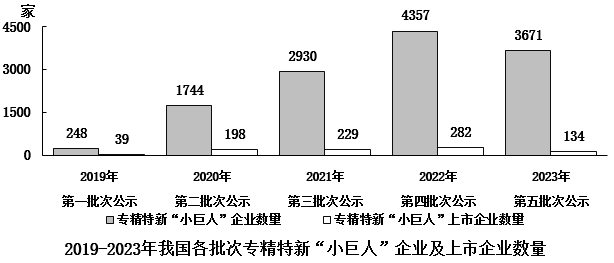

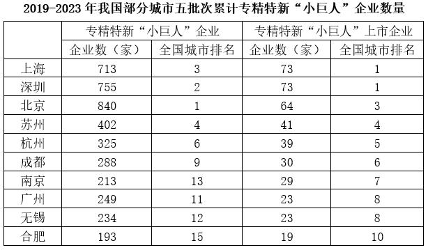

### 第 1 题　qid 19283748 · 比重

2019-2023年，有几个城市五批次累计公示的专精特新“小巨人”上市企业数量占全国的比重超过5%？

- **A**. 1
- **B**. 2
- **C**. 3　✅
- **D**. 4

**答案**：C

**官方解析**

根据题干“2019-2023年，有几个城市······占全国的比重超过5%”，结合材料时间为2019-2023年，可判定本题为现期比重问题。定位柱状图可知2019-2023年我国各批次专精特新“小巨人”上市企业数量，则2019-2023年我国五批次累计公示的专精特新“小巨人”上市企业数量为39+198+229+282+134=882家。根据公式：比重，题目求，则满足城市&gt;全国×5%=882×5%=44.1家即可。定位表格可知全国排名前10的城市五批次累计专精特新“小巨人”上市企业数量，观察发现，从第4名开始均小于44.1家，即只有3个城市的占比超过5%。

故正确答案为C。

---

### 第 2 题　qid 19283749 · 比重

以下批次中，公示的专精特新“小巨人”上市企业数量占同批次专精特新“小巨人”企业数量比重最高的是：

- **A**. 第二批次　✅
- **B**. 第三批次
- **C**. 第四批次
- **D**. 第五批次

**答案**：A

**官方解析**

根据题干“以下批次中······占同批次······比重最高的是”，可判定本题为现期比重问题。定位统计图可知各批次公示的专精特新“小巨人”上市企业数量及企业数量，根据公式：比重，各批次公示的专精特新“小巨人”上市企业数量占同批次专精特新“小巨人”企业数量比重分别为：第二批次，；第三批次，；第四批次，；第五批次，，则第二批次公示的专精特新“小巨人”上市企业数量占同批次专精特新“小巨人”企业数量比重最高。

故正确答案为A。

---

### 第 3 题　qid 19283750 · 平均数

已知2023年第五批次公示的专精特新“小巨人”企业分布于全国300个城市中，则这些城市平均每个有多少家第五批次公示的专精特新“小巨人”非上市企业？

- **A**. 不到11家
- **B**. 11-12家之间　✅
- **C**. 12-13家之间
- **D**. 超过13家

**答案**：B

**官方解析**

根据题干“已知2023年第五批次公示······平均每个有多少家······”，结合材料给出2023年第五批次公示相关数据，可判定本题为现期平均数问题。定位统计图可得：2023年第五批次公示专精特新“小巨人”企业数量为3671家，专精特新“小巨人”上市企业数量为134家。根据平均数，可得全国300个城市中，平均每个城市第五批次公示的专精特新“小巨人”非上市企业数量家，在B项范围内。

故正确答案为B。

---

### 第 4 题　qid 19283752 · 综合

2019-2023年，北京、上海、广州、深圳4个城市五批次累计公示的专精特新“小巨人”企业数量之和约占全国总数的：

- **A**. 35%
- **B**. 30%
- **C**. 25%
- **D**. 20%　✅

**答案**：D

**官方解析**

根据题干“2019-2023年······约占······”，结合材料给出2019-2023年的相关数据，可判定本题为现期比重问题。定位统计图可得：2019-2023年我国五批次公示的专精特新“小巨人”企业数量分别为248家、1744家、2930家、4357家、3671家；定位统计表可得：2019-2023年北京、上海、广州、深圳4个城市五批次累计专精特新“小巨人”企业数量分别为840家、713家、249家、755家。根据公式：比重，可得题干所求。

故正确答案为D。

---

### 第 5 题　qid 19283765 · 比重

以下饼状图中，最能准确反映2019-2023年五批次公示的专精特新“小巨人”上市企业中，第一批次（黑色）、第二批次（横线）、第三批次（竖线）、第四批次（白色）和第五批次（网格）企业数量比例关系的是：

- **A**. 

- **B**. 
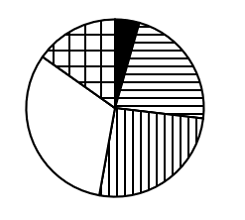
　✅
- **C**. 
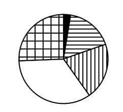

- **D**. 
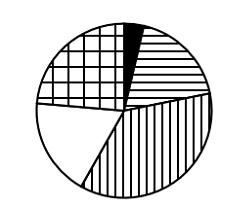

**答案**：B

**官方解析**

根据题干“······最能准确反映2019-2023年······企业数量比例关系的是”，结合材料时间为2019-2023年，可判定本题为现期比重问题。定位统计图可知：2019-2023年五批次公示的专精特新“小巨人”上市企业数量分别为39家、198家、229家、282家、134家。根据第四批次公示上市企业数量（282家）最多，可知第四批次（白色）占比最大，排除A、D两项；第五批次公示上市企业数量（134家）&lt;第二批次公示上市企业数量（198家），可知第五批次（网格）占比&lt;第二批次（横线）占比，排除C项，B项当选。
故正确答案为B。

---

## 材料 2

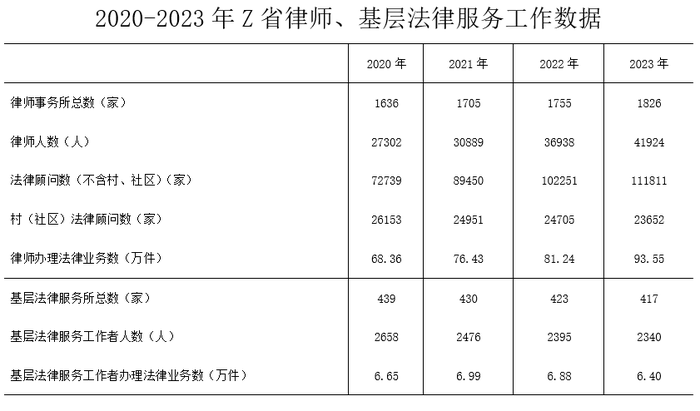

### 第 6 题　qid 19283761 · 综合

2021-2023年，Z省各年律师人数与律师事务所总数的比值：

- **A**. 先升后降
- **B**. 先降后升
- **C**. 持续下降
- **D**. 持续上升　✅

**答案**：D

**官方解析**

根据题干“2021-2023年······与······的比值”，结合选项为判断升降变化，可判定本题为比值比较问题。定位统计表可得：2021-2023年，Z省各年律师人数分别为30889人、36938人、41924人；各年律师事务所总数分别为1705家、1755家、1826家。则比值分别为2021年：；2022年：；2023年：，故2021-2023年，Z省各年律师人数与律师事务所总数的比值持续上升。

故正确答案为D。

---

### 第 7 题　qid 19283760 · 综合

2020-2023年，Z省律师办理法律业务数之和约是同期基层法律服务工作者办理法律业务数之和的多少倍？

- **A**. 12　✅
- **B**. 15
- **C**. 18
- **D**. 21

**答案**：A

**官方解析**

根据题干“2020-2023年······之和约是······之和的多少倍”，可判定本题为现期倍数问题。定位统计表可知：2020-2023年每年Z省律师办理法律业务数、基层法律服务工作者办理法律业务数。可得题干所求倍数为倍。

故正确答案为A。

---

### 第 8 题　qid 19283759 · 综合

2023年，Z省含村、社区在内的法律顾问数约是2020年的多少倍？

- **A**. 1.2
- **B**. 1.4　✅
- **C**. 1.6
- **D**. 1.8

**答案**：B

**官方解析**

根据题干“2023年······约是······多少倍”，可判定本题为现期倍数问题。定位统计表可得：2023年Z省（不含村、社区）法律顾问数为111811家，村(社区)法律顾问数为23652家；2020年Z省（不含村、社区）法律顾问数为72739家，村（社区）法律顾问数为26153家。则题干所求倍。

故正确答案为B。

---

### 第 9 题　qid 19283763 · 增长

如保持2023年同比增量不变，则到哪一年Z省律师办理法律业务数将首次超过150万件？

- **A**. 2026年
- **B**. 2027年
- **C**. 2028年　✅
- **D**. 2029年

**答案**：C

**官方解析**

根据题干“如保持2023年同比增量不变，则到哪一年······将首次超过150万件”，结合材料时间为2023年，可判定本题为现期追赶问题。定位统计表可得：2022年、2023年Z省律师办理法律业务数分别为81.24万件、93.55万件。根据公式：增长量=现期量-基期量，则2023年Z省律师办理法律业务数的同比增长量=93.55-81.24=12.31万件。根据公式：现期量=基期量＋n×增长量，可列式：93.55＋n×12.31&gt;150，解得n&gt;4.6，则n至少为5，即2023+5=2028年Z省律师办理法律业务数将首次超过150万件。
故正确答案为C。

---

### 第 10 题　qid 19283764 · 增长

以下柱状图反映了2021、2022和2023年Z省律师、基层法律服务工作哪一指标的同比增量变化趋势（横轴位置表示增量为0）？

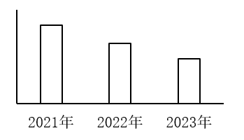

- **A**. 律师事务所总数
- **B**. 律师人数
- **C**. 村（社区）法律顾问数
- **D**. 法律顾问数（不含村、社区）　✅

**答案**：D

**官方解析**

根据题干“以下柱状图反映了2021、2022和2023年······同比增量变化趋势（横轴位置表示增量为0）”，可判定本题为增长量比较问题。定位统计表可得2020-2023年Z省律师事务所总数、律师人数、村（社区）法律顾问数、法律顾问数（不含村、社区）。根据公式：增长量=现期量-基期量，可得2021-2023年各指标同比增长量：

A项，律师事务所总数：2022年，1755-1705=50家；2023年，1826-1755=71家。2022年同比增长量＜2023年同比增长量，不符合柱状图变化趋势，排除；

B项，律师人数：2021年，30889-27302=人；2022年，36938-30889=人。2021年同比增长量＜2022年同比增长量，不符合柱状图变化趋势，排除；

C项，村（社区）法律顾问数：2021年（24951家）＜2020年（26153家），同比增长量＜0，而柱状图（横轴位置表示增量为0）中2021年同比增长量＞0，不符合，排除；

D项，法律顾问数（不含村、社区）：2021年，89450-72739=家；2022年，102251-89450=家；2023年，111811-102251=家。2021年同比增长量＞2022年同比增长量＞2023年同比增长量，符合柱状图变化趋势，当选。

故正确答案为D。

---

## 材料 3

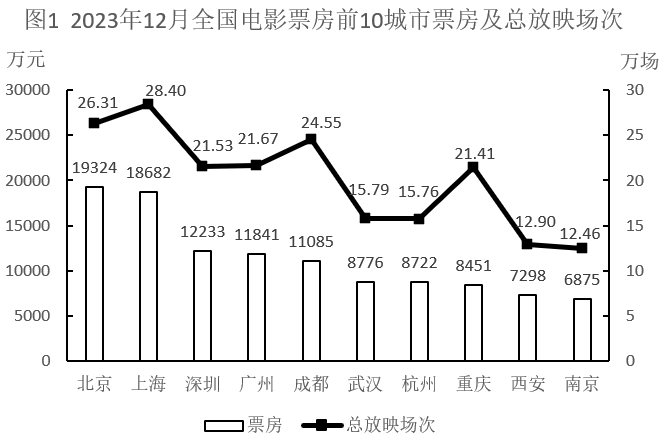

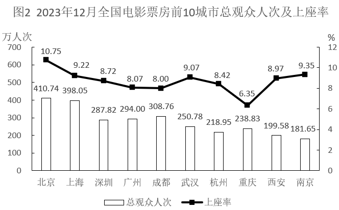

注：上座率

### 第 11 题　qid 19283939 · 综合

2023年12月，资料中电影总放映场次最多的三个城市票房之和在以下哪个范围内？

- **A**. 超过5亿元
- **B**. 4.5亿~4.75亿元之间
- **C**. 4.75亿~5亿元之间　✅
- **D**. 不到4.5亿元

**答案**：C

**官方解析**

定位图1可知2023年12月电影总放映场次最多的三个城市分别为上海、北京、成都，其票房分别为18682万元、19324万元、11085万元，则所求为18682+19324+11085=49091万元亿元，在C项范围内。

故正确答案为C。

---

### 第 12 题　qid 19283940 · 平均数

以下城市中2023年12月平均每场电影观众人次数最多的是：

- **A**. 武汉　✅
- **B**. 杭州
- **C**. 重庆
- **D**. 南京

**答案**：A

**官方解析**

根据题干“以下城市中2023年12月平均······最多的是”，结合材料时间为2023年12月，可判定本题为现期平均数问题。定位图1、图2可得2023年12月各城市电影总放映场次以及总观众人次。根据平均每场电影观众人次数，则以下城市2023年12月平均每场电影观众人次数分别为：

武汉：人次；

杭州：人次；

重庆：人次；

南京：人次。

综上，2023年12月平均每场电影观众人次数最多的是武汉。

故正确答案为A。

---

### 第 13 题　qid 19283941 · 平均数

2023年12月资料中有几个城市平均每人次观众创造的票房超过40元？

- **A**. 3
- **B**. 4　✅
- **C**. 5
- **D**. 6

**答案**：B

**官方解析**

根据题干“2023年12月······平均每人次······”，结合材料时间为2023年12月，可判定本题为现期平均数问题。定位图1可知2023年12月各个城市电影票房，定位图2可知2023年12月各个城市电影总观众人次。根据公式：平均每人次观众创造的票房，则：

北京：元/人次，符合；

上海：元/人次，符合；

深圳：元/人次，符合；

广州：元/人次，符合；

成都：元/人次，不符合；

武汉：元/人次，不符合；

杭州：元/人次，不符合；

重庆：元/人次，不符合；

西安：元/人次，不符合；

南京：元/人次，不符合。

综上，2023年12月资料中北京、上海、深圳、广州平均每人次观众创造的票房超过40元，即有4个城市。

故正确答案为B。

---

### 第 14 题　qid 19283942 · 平均数

如某月北京的电影总放映场次和平均每场座位数与2023年12月相同，但上座率增加5个百分点，则该月北京将有约多少万人次观众观影？

- **A**. 602　✅
- **B**. 431
- **C**. 794
- **D**. 696

**答案**：A

**官方解析**

根据题干“······与2023年12月相同，但上座率增加5个百分点······”，结合材料时间为2023年12月，可判定本题为现期比重问题。

方法一：根据上座率，可知总观众人次=总放映场次×平均每场座位数×上座率，则2023年12月北京总观众人次=12月总放映场次×12月平均每场座位数×12月上座率。定位图2可得：2023年12月北京总观众人次为410.74万人次，上座率为10.75%。则2023年12月总放映场次×12月平均每场座位数，结合题干“某月北京的电影总放映场次和平均每场座位数与2023年12月相同，但上座率增加5个百分点”，则该月北京总观众人次=12月总放映场次×12月平均每场座位数×该月上座率万人次，与A项最接近。

方法二：定位图2可得：2023年12月北京总观众人次为410.74万人次，上座率为10.75%。结合题干“某月北京的电影总放映场次和平均每场座位数与2023年12月相同，但上座率增加5个百分点”，则北京该月上座率=10.75%+5%=15.75%。根据上座率，则座位数，可得：，整理可得：该月总观众人次万人次，与A项最接近。

故正确答案为A。

---

### 第 15 题　qid 19283943 · 综合

关于资料中城市2023年12月电影票房状况，能够从上述资料中推出的是：

- **A**. 总观众人次数最多的三个城市，当月总观众之和不到1100万人次
- **B**. 广州平均每场电影的座位数少于深圳
- **C**. 上座率最高的城市，当月票房是上座率最低城市的2倍以上　✅
- **D**. 上海、杭州、南京总放映场次是成都、重庆总放映场次的1.5倍以上

**答案**：C

**官方解析**

A项：定位图2可得2023年12月全国电影票房前10城市总观众人次。最多的三个城市分别为北京（410.74万人次）、上海（398.05万人次）、成都（308.76万人次），410.74+398.05+308.76&gt;410+398+308=1116万人次&gt;1100万人次，错误；

B项：定位图1可得：2023年12月广州、深圳总放映场次分别为21.67万场、21.53万场；定位图2可得：2023年12月广州观众人次数和上座率分别为294.00万人次、8.07%；深圳观众人次数和上座率分别为287.82万人次、8.72%。根据公式：上座率，可得座位数，故2023年12月广州平均每场电影的座位数，深圳平均每场电影的座位数，根据分数比较原则：分子大、分母小，分数值大，则2023年12月广州平均每场电影的座位数多于深圳，错误；

C项：定位图1可得2023年12月全国电影票房前10城市票房；定位图2可得2023年12月全国电影票房前10城市上座率。资料中城市2023年12月上座率最高的城市是北京（10.75%），其票房为19324万元；上座率最低的城市是重庆（6.35%），其票房为8451万元。倍，正确；

D项：定位图1可得：2023年12月上海、杭州、南京、成都、重庆总放映场次分别为28.40万场、15.76万场、12.46万场、24.55万场、21.41万场。倍倍，错误。

故正确答案为C。

---

## 材料 4

        2023年一季度，我国外贸进出口总额为9.89万亿元，同比增加0.45万亿元。其中，东部地区进出口7.75万亿元，同比增长2.9%；中西部、东北地区分别进出口1.84万亿元、2975.4亿元，同比分别增长12.6%、9.4%。

        2月份，东部地区进出口同比增速由1月份的下降11.1%转为增长7%，3月份增速扩大至15.8%。一季度有进出口实绩企业数量38.7万家，同比增长5.2%。一季度，东部地区出口高技术产品7741.7亿元，同比增长9.8%，占东部地区出口额比重为17.9%，同比提升0.7个百分点，其中3月增速为21%。

        一季度，中西部地区民营企业进出口1.08万亿元，同比增长32.8%，中西部地区对“一带一路”沿线国家进出口7400.9亿元，同比增长38%。一般贸易占中西部地区进出口总额的56.6%，同比提升4.9个百分点。

        一季度，东北地区黑色金属冶炼和压延加工业、汽车制造业、铁路船舶等其他运输设备制造业出口同比分别增长42.9%、62.3%、136.4%。化肥、种子分别进口25亿元、5867.6万元，同比分别增长117.8%、119.9%。

### 第 16 题　qid 19283904 · 比重

以下饼状图中，最能准确反映2023年一季度我国外贸进出口总额中，东部地区（白色）、中西部地区（斜线）和东北地区（黑色）外贸进出口额占比关系的是：

- **A**. 
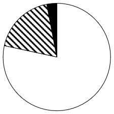
　✅
- **B**. 
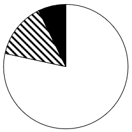

- **C**. 
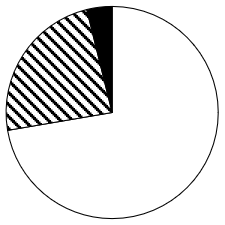

- **D**. 
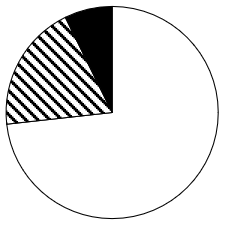

**答案**：A

**官方解析**

根据题干“以下饼状图中，最能准确反映2023年一季度······占比关系的是”，结合材料时间为2023年一季度，可判定本题为现期比重问题。定位文字材料第一段可得：2023年一季度，我国外贸进出口总额为9.89万亿元。其中，东部地区进出口7.75万亿元；中西部、东北地区分别进出口1.84万亿元、2975.4亿元。根据公式：比重，则东部地区外贸进出口额占我国外贸进出口总额的比重为，排除C、D两项；中西部地区与东北地区外贸进出口额的倍数关系为，排除B项。

故正确答案为A。

---

### 第 17 题　qid 19283907 · 综合

2023年一季度，东部地区外贸进口额约为多少万亿元？

- **A**. 2.2
- **B**. 2.8
- **C**. 3.4　✅
- **D**. 4.0

**答案**：C

**官方解析**

根据题干“2023年一季度，东部地区外贸进口额约为多少万亿元”，结合材料给出2023年一季度东部地区外贸进出口总额、东部地区高技术产品出口额及其占东部地区出口额的比重，可判定本题为现期比重问题。定位文字材料第一段可得：2023年一季度，东部地区进出口7.75万亿元。定位文字材料第二段可得：（2023年）一季度，东部地区出口高技术产品7741.7亿元，占东部地区出口额比重为17.9%。根据公式：整体，则2023年一季度东部地区外贸出口额为万亿元。故2023年一季度东部地区外贸进口额为7.75-4.3=3.45万亿元，与C项最接近。

故正确答案为C。

---

### 第 18 题　qid 19283908 · 增长

2023年一季度，中西部地区对“一带一路”沿线国家进出口贸易额同比增量约占同期中西部地区外贸进出口总额同比增量的：

- **A**. 33%
- **B**. 55%
- **C**. 77%
- **D**. 99%　✅

**答案**：D

**官方解析**

根据题干“2023年一季度······占······”，结合材料时间为2023年一季度，可判定本题为现期比重问题。定位文字材料第一段可得：2023年一季度，中西部地区进出口1.84万亿元，同比增长12.6%。定位文字材料第三段可得：（2023年）一季度，中西部地区对“一带一路”沿线国家进出口7400.9亿元，同比增长38%。根据公式：增长量、比重，可得所求，与D项最接近。

故正确答案为D。

---

### 第 19 题　qid 19283911 · 比重

2023年一季度，东部地区外贸进出口额占我国外贸进出口总额比重比上年同期：

- **A**. 上升了5个百分点以上
- **B**. 上升了不到5个百分点
- **C**. 下降了5个百分点以上
- **D**. 下降了不到5个百分点　✅

**答案**：D

**官方解析**

根据题干“2023年一季度······占······比重比上年同期”，结合选项为“上升了/下降了+百分点”，可判定本题为两期比重问题。定位文字材料第一段可得：2023年一季度，我国外贸进出口总额为9.89万亿元（B），同比增加0.45万亿元。其中，东部地区进出口7.75万亿元（A），同比增长2.9%（a）。根据公式：增长率，可得2023年一季度我国外贸进出口总额同比增长率（b）；根据公式：两期比重差，则所求，即下降了不到1.9个百分点，在D项范围内。

故正确答案为D。

---

### 第 20 题　qid 19283913 · 综合

关于我国外贸进出口状况，能够从上述资料中推出的是：

- **A**. 2023年3月东部地区高技术产品出口额
- **B**. 2022年一季度中西部地区一般贸易进出口额　✅
- **C**. 2023年一季度全国高技术产品出口额
- **D**. 2022年东北地区汽车制造业出口额同比增量

**答案**：B

**官方解析**

A项：定位文字材料第二段可得：（2023年）一季度，东部地区出口高技术产品7741.7亿元，3月增速为21%。但是材料缺少2023年1-2月份东部地区高技术产品出口额的相关数据，故2023年3月东部地区高技术产品出口额无法推出；

B项：定位文字材料第一段可得：2023年一季度，中西部地区进出口1.84万亿元，同比增长12.6%；定位文字材料第三段可得：（2023年）一季度，中西部地区一般贸易进出口占中西部地区进出口总额的56.6%，同比提升4.9个百分点。根据公式：基期量，可得2022年一季度中西部地区进出口总额，2022年一季度，中西部地区一般贸易进出口占中西部地区进出口总额的比重为（56.6%-4.9%），则2022年一季度中西部地区一般贸易进出口额，可以推出；

C项：材料没有涉及全国高技术产品出口额的相关数据，故无法推出；

D项：定位文字材料第四段可得：（2023年）一季度，东北地区汽车制造业出口同比增长62.3%，但是材料缺少2022年东北地区汽车制造业出口额的相关数据，故2022年东北地区汽车制造业出口额同比增量无法推出。

故正确答案为B。

---
