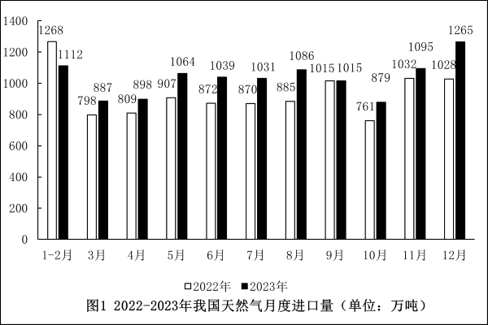
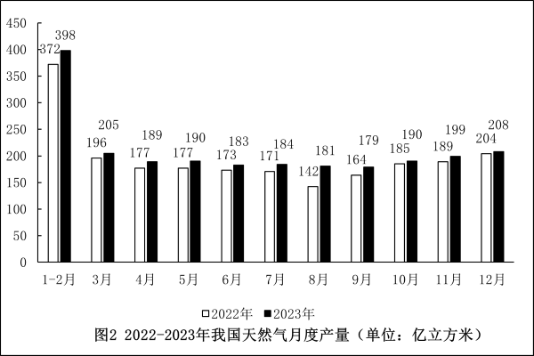
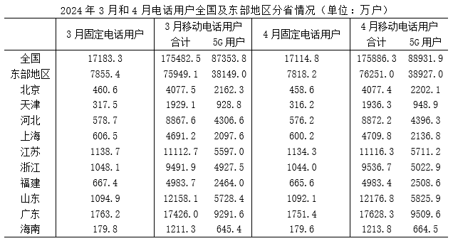
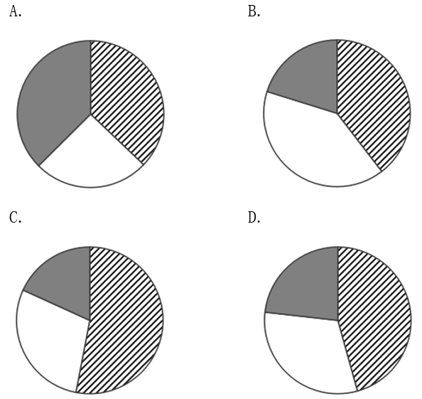
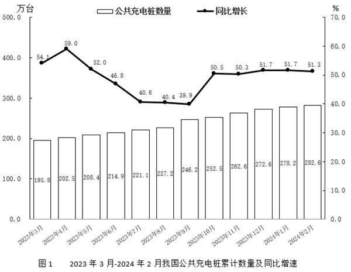
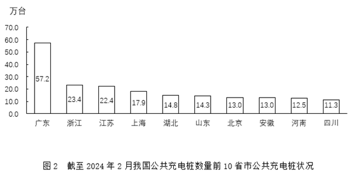

# 2025年天津市公务员录用考试《行测》题（网友回忆版）

> 资料分析 · 20 题 · 天津 2025

## 材料 1

### 第 1 题　qid 10297062 · 增长

2023年3-12月，我国天然气月度进口量同比增量超过200万吨的月份有几个？

- **A**. 1
- **B**. 2　✅
- **C**. 3
- **D**. 4

**答案**：B

**官方解析**

根据题干“······同比增量超过······万吨······”，可判定本题为增长量比较问题。定位图1可知：2022年3-12月和2023年3-12月我国天然气月度进口量。根据公式：增长量=现期量-基期量，可得2023年3-12月天然气月度进口量同比增量分别为：
3月：887-798=89万吨&lt;200万吨；
4月：898-809=89万吨&lt;200万吨；
5月：1064-907=157万吨&lt;200万吨；
6月：1039-872=167万吨&lt;200万吨；
7月：1031-870=161万吨&lt;200万吨；
8月：1086-885=201万吨&gt;200万吨；
9月：1015-1015=0万吨&lt;200万吨；
10月：879-761=118万吨&lt;200万吨；
11月：1095-1032=63万吨&lt;200万吨；
12月：1265-1028=237万吨&gt;200万吨。
综上所述，2023年3-12月天然气月度进口量同比增量超过200万吨的月份有8月和12月，共2个月份。
故正确答案为B。

---

### 第 2 题　qid 10297064 · 综合

2022年，我国天然气第四季度进口量比第一季度多约多少万吨？

- **A**. 585
- **B**. 650
- **C**. 755　✅
- **D**. 1240

**答案**：C

**官方解析**

根据题干“······比······多”，可判定本题为增长量计算问题。定位图1可得：2022年1-2月和3月，我国天然气进口量分别为1268万吨、798万吨；2022年10-12月，我国天然气进口量分别为761万吨、1032万吨、1028万吨。根据公式：增长量=现期量-基期量，可得2022年我国天然气第四季度进口量比第一季度多（761+1032+1028）-（1268+798）=2821-2066=755万吨。
故正确答案为C。

---

### 第 3 题　qid 10297066 · 增长

2023年3-12月，我国天然气月度进口量同比增速最高的月份，当月天然气月度产量同比增加多少亿立方米？

- **A**. 4　✅
- **B**. 10
- **C**. 13
- **D**. 39

**答案**：A

**官方解析**

根据题干“······同比增加多少亿立方米”，可判定本题为增长量计算问题。定位图1可知：2022年3-12月和2023年3-12月我国天然气月度进口量。根据公式：增长率，可得2023年3-12月各个月份的同比增长率：3月，；4月，；5月，；6月，；7月，；8月，；9月，；10月，；11月，；12月，。比较可知，2023年3-12月我国天然气月度进口量同比增速最高的月份为12月。定位图2可知，2023年12月、2022年12月我国天然气月度产量分别为208亿立方米、204亿立方米。根据公式：增长量=现期量-基期量，可得2023年12月天然气月度产量同比增加=208-204=4亿立方米。

故正确答案为A。

---

### 第 4 题　qid 10297069 · 综合

2023年3-12月，我国天然气月度进口量与月度产量的比值最高的月份是：

- **A**. 8月
- **B**. 9月
- **C**. 11月
- **D**. 12月　✅

**答案**：D

**官方解析**

根据题干“······比值最高的月份”，可判定本题为比值比较问题。定位图1可得：2023年8月、9月、11月、12月我国天然气月度进口量分别为1086万吨、1015万吨、1095万吨、1265万吨。定位图2可得：2023年8月、9月、11月、12月我国天然气月度产量分别为181亿立方米、179亿立方米、199亿立方米、208亿立方米。则2023年8月、9月、11月、12月我国天然气月度进口量与月度产量的比值分别为：2023年8月：；2023年9月：；2023年11月：；2023年12月：。比较可得，比值最高的月份是2023年12月。

故正确答案为D。

---

### 第 5 题　qid 10297072 · 增长

以下折线图最能反映2023年哪几个月天然气月度产量同比增量的变化趋势？

- **A**. 5-8月
- **B**. 6-9月
- **C**. 7-10月
- **D**. 8-11月　✅

**答案**：D

**官方解析**

根据题干“以下折线图最能反映2023年哪几个月······同比增量的变化趋势”，可判定本题为增长量比较问题。定位图2可知2022年3-12月、2023年3-12月天然气月度产量。根据公式：增长量=现期量-基期量。则2023年5-11月天然气月度产量同比增量分别为：
5月：190-177=13亿立方米；
6月：183-173=10亿立方米；
7月：184-171=13亿立方米；
8月：181-142=39亿立方米；
9月：179-164=15亿立方米；
10月：190-185=5亿立方米；
11月：199-189=10亿立方米。
综上可知，符合先下降两个月后上升趋势的为8-11月。
故正确答案为D。

---

## 材料 2

### 第 6 题　qid 10297101 · 综合

2024年4月，我国东部地区固定电话用户数环比减少10万户以上的省市有几个？

- **A**. 1　✅
- **B**. 2
- **C**. 3
- **D**. 4

**答案**：A

**官方解析**

根据题干“······环比减少10万户以上的省市有几个”，可判定本题为增长量计算问题。定位统计表可知2024年3月、4月我国东部地区各省市固定电话用户数。根据公式：增长量=现期量-基期量，可得2024年4月我国东部地区各省市固定电话用户数环比增长量如下：
北京：458.6-460.6=-2万户；
天津：316.2-317.5=-1.3万户；
河北：576.2-578.7=-2.5万户；
上海：600.2-606.5=-6.3万户；
江苏：1134.3-1138.7=-4.4万户；
浙江：1044.0-1048.1=-4.1万户；
福建：665.6-667.4=-1.8万户；
山东：1092.1-1094.9=-2.8万户；
广东：1751.4-1763.2=-11.8万户；
海南：179.6-179.8=-0.2万户。
比较可知，2024年4月，我国东部地区固定电话用户数环比减少10万户以上的省市只有广东，共1个。
故正确答案为A。

---

### 第 7 题　qid 10297102 · 比重

2024年4月，我国东部地区移动电话用户数合计占全国比重在以下哪个范围内？

- **A**. 40%以下
- **B**. 40%~42%之间
- **C**. 42%~44%之间　✅
- **D**. 44%以上

**答案**：C

**官方解析**

根据题干“2024年4月······占······比重在以下哪个范围内”，结合材料时间有2024年4月，可判定本题为现期比重问题。定位表格可知，2024年4月东部地区移动电话用户数合计为76251.0万户，全国移动电话用户数合计为175886.3万户。故2024年4月，我国东部地区移动电话用户数合计占全国比重，在C项范围内。

故正确答案为C。

---

### 第 8 题　qid 10297104 · 综合

2024年3月，我国东部地区固定电话用户数最高的4个省市，其5G用户数之和在以下哪个范围内？

- **A**. 2.5亿户以下
- **B**. 2.5亿~2.7亿户之间　✅
- **C**. 2.7亿~3亿户之间
- **D**. 3亿户以上

**答案**：B

**官方解析**

定位统计表可知2024年3月我国东部地区固定电话用户数及5G用户数。观察发现，我国东部地区固定电话用户数最高的4个省市分别为：广东（1763.2万户）、江苏（1138.7万户）、山东（1094.9万户）、浙江（1048.1万户），上述4个省市的5G用户数之和为：亿户，在B项范围内。

故正确答案为B。

---

### 第 9 题　qid 10297109 · 比重

以下省市中，2024年4月5G用户数占移动电话用户数的比重最高的是：

- **A**. 北京　✅
- **B**. 上海
- **C**. 浙江
- **D**. 山东

**答案**：A

**官方解析**

根据题干“2024年4月······占······比重最高的是”，结合材料时间，可判定本题为现期比重问题。定位表格材料可知2024年4月北京、上海、浙江和山东的5G用户数和移动电话用户数。结合公式：比重，则2024年4月5G用户数占移动电话用户数的比重为：北京：；上海：；浙江：；山东：。比较可得，比重最高的是北京。

故正确答案为A。

---

### 第 10 题　qid 10297116 · 比重

已知2024年4月我国西部地区固定电话用户数为5324.4万户，以下饼状图中，最能准确反映2024年4月我国东部地区（斜线）、西部地区（白色）和其他地区（灰色）固定电话用户数比例关系的是：

- **A**. A
- **B**. B
- **C**. C
- **D**. D　✅

**答案**：D

**官方解析**

根据题干“已知2024年4月我国······最能准确反映······比例关系的是”，结合材料时间为2024年4月，可判定本题为现期比重问题。定位统计表可得，2024年4月全国固定电话用户数17114.8万户，东部地区7818.2万户；结合题干可得，2024年4月西部地区固定电话用户数5324.4万户。根据公式：比重，则东部地区占比，占比不足，排除C项；西部地区占比，占比不足，且明显大于，排除A、B两项，D项当选。

故正确答案为D。

---

## 材料 3

        2023年，我国互联网企业完成互联网业务收入17483亿元，同比增长6.8%。实现利润总额1295亿元，同比增长0.5%。共投入研发经费943.2亿元，同比下降3.7%。

        2023年，东部地区互联网企业完成互联网业务收入15608亿元，同比增长7.3%；中部地区互联网企业完成互联网业务收入781.6亿元，同比增长8.1%；西部地区互联网企业完成互联网业务收入1054亿元，同比增长0.2%；东北地区互联网企业完成互联网业务收入39.4亿元，同比下降25.1%。

        2023年，京津冀地区互联网企业完成互联网业务收入6777亿元，同比增长6.4%；长三角地区（上海、浙江、江苏和安徽）互联网企业完成互联网业务收入6624亿元，同比增长12.9%。

        2023年，互联网企业互联网业务累计收入居前5名的省级行政区为北京（5721.4亿元，增长4.2%）、上海（4167.8亿元，增长17.5%）、浙江（1955.9亿元，增长4.8%）、广东（1754.5亿元，下降4.6%）和天津（981.7亿元，增长20.3%）。全国互联网企业互联网业务增速实现正增长的省级行政区有16个，数量较2022年全年增长3个。

### 第 11 题　qid 10297073 · 比重

2023年，我国互联网企业投入的研发经费占业务收入的比重比上年下降了约多少个百分点？

- **A**. 0.2
- **B**. 0.6　✅
- **C**. 1.9
- **D**. 9.8

**答案**：B

**官方解析**

根据题干“2023年······占······的比重比上年下降了约多少个百分点”，可判定本题为两期比重问题。定位文字材料第一段可得：2023年，我国互联网企业完成互联网业务收入17483亿元（B），同比增长6.8%（b）。共投入研发经费943.2亿元（A），同比下降3.7%（a）。根据公式：两期比重差，则所求为，即2023年，我国互联网企业投入的研发经费占业务收入的比重比上年下降了约0.6个百分点。

故正确答案为B。

---

### 第 12 题　qid 10297082 · 增长

2023年，东部地区互联网企业完成互联网业务收入同比增量是西部地区的：

- **A**. 10倍以下
- **B**. 10～50倍之间
- **C**. 50～300倍之间
- **D**. 300倍以上　✅

**答案**：D

**官方解析**

根据题干“2023年······是······的多少倍”，结合选项为倍数且材料时间为2023年，可判定本题为现期倍数问题。定位文字材料第二段可得：2023年，东部地区互联网企业完成互联网业务收入15608亿元，同比增长7.3%；西部地区互联网企业完成互联网业务收入1054亿元，同比增长0.2%。根据公式：增长量，可得2023年东部地区互联网企业完成互联网业务收入同比增量亿元；西部地区互联网企业完成互联网业务收入同比增量亿元。则所求倍数为倍，在D项范围内。

故正确答案为D。

---

### 第 13 题　qid 10297088 · 综合

2023年，河北互联网企业完成互联网业务收入约占全国的：

- **A**. 0.4%　✅
- **B**. 0.7%
- **C**. 1.2%
- **D**. 1.9%

**答案**：A

**官方解析**

根据题干“2023年······占······的”，结合选项为百分数且材料时间为2023年，可判定本题为现期比重问题。定位文字材料第一段可得：2023年，我国互联网企业完成互联网业务收入17483亿元；定位文字材料第三、四段可得：2023年，京津冀地区互联网企业完成互联网业务收入6777亿元；2023年，互联网企业互联网业务累计收入居前5名的省级行政区为北京（5721.4亿元）······天津（981.7亿元）。根据公式：，则2023年，河北互联网企业完成互联网业务收入约占全国的。

故正确答案为A。

---

### 第 14 题　qid 10297090 · 增长

2023年，互联网企业互联网业务累计收入居前5名的省级行政区完成互联网业务收入比上年：

- **A**. 减少了不到500亿元
- **B**. 减少了500亿元以上
- **C**. 增长了不到500亿元
- **D**. 增长了500亿元以上　✅

**答案**：D

**官方解析**

根据题干“2023年······收入比上年”，结合选项为减少/增长+单位，可判定本题为增长量计算问题。定位文字材料第四段可得：2023年，互联网企业互联网业务累计收入居前5名的省级行政区为北京（5721.4亿元，增长4.2%）、上海（4167.8亿元，增长17.5%）、浙江（1955.9亿元，增长4.8%）、广东（1754.5亿元，下降4.6%）和天津（981.7亿元，增长20.3%）。根据公式：增长量，则前5名省级行政区完成互联网业务收入同比增长量分别如下：

北京：亿元；

上海：亿元；

浙江：亿元；

广东：亿元；

天津：亿元。

故所求增量亿元&gt;500亿元，即增长了500亿元以上。

故正确答案为D。

---

### 第 15 题　qid 10297091 · 综合

能够从上述资料中推出的是：

- **A**. 2023年，我国互联网企业实现利润总额同比增长了不到6亿元
- **B**. 2023年，西部地区互联网企业完成互联网业务收入占全国比重高于上年水平
- **C**. 2023年，江苏和安徽互联网企业完成互联网业务收入占长三角地区的一成以下　✅
- **D**. 2022年，全国互联网企业互联网业务增速实现正增长的省级行政区有19个

**答案**：C

**官方解析**

A项：定位文字材料第一段可得：2023年，我国互联网企业实现利润总额1295亿元，同比增长0.5%。根据公式：增长量，则所求增长量亿元&gt;6亿元，错误；

B项：定位文字材料第一段可得：2023年，我国互联网企业完成互联网业务收入17483亿元，同比增长6.8%（b）。定位文字材料第二段，2023年，西部地区互联网企业完成互联网业务收入1054亿元，同比增长0.2%（a）。根据两期比重比较结论“当部分增长率（a）&lt;整体增长率（b）时，比重下降”，由于a（0.2%）&lt;b（6.8%），则2023年西部地区互联网企业完成互联网业务收入占全国比重低于上年水平，错误；

C项：定位文字材料第三段可得：2023年，长三角地区(上海、浙江、江苏和安徽)互联网企业完成互联网业务收入6624亿元；定位文字材料第四段，2023年，互联网企业互联网业务累计收入居前5名的省级行政区······上海(4167.8亿元，增长17.5%)、浙江(1955.9亿元，增长4.8%)······。则2023年，江苏和安徽互联网企业完成互联网业务收入占长三角地区的比重，即所占比重在一成以下，正确；

D项：定位文字材料第四段可得：2023年，全国互联网企业互联网业务增速实现正增长的省级行政区有16个，数量较2022年全年增长3个，则2022年全国互联网企业互联网业务增速实现正增长的省级行政区有16-3=13个，错误；

故正确答案为C。

---

## 材料 4

截至2024年2月，我国公共充电桩数量为282.6万台，环比增加4.4万台，同比增长51.3%。其中直流充电桩123.9万台，环比增长2.1%；交流充电桩158.6万台，环比增长1.2%。

### 第 16 题　qid 10297054 · 综合

截至2024年2月，我国交流充电桩数量环比增量比直流充电桩数量环比增量：

- **A**. 低不到1万台　✅
- **B**. 低1万台以上
- **C**. 高不到1万台
- **D**. 高1万台以上

**答案**：A

**官方解析**

根据题干“截至2024年2月······环比增量比······环比增量”，可判定本题为增长量计算问题。定位文字材料可得：截至2024年2月，我国直流充电桩123.9万台，环比增长2.1%；交流充电桩158.6万台，环比增长1.2%。根据公式：增长量，则所求增长量差值万台，即低不到1万台。

故正确答案为A。

---

### 第 17 题　qid 10297057 · 综合

2023年下半年，我国月均新增公共充电桩约多少万台？

- **A**. 6.5
- **B**. 7.9
- **C**. 8.8
- **D**. 9.6　✅

**答案**：D

**官方解析**

根据题干“2023年下半年······月均······多少万台”，可判定本题为现期平均数问题。定位图1可得：2023年6月、12月，我国公共充电桩累计数量分别为214.9万台、272.6万台。则2023年下半年（7-12月），我国公共充电桩新增总量=272.6-214.9=57.7万台，所求月均新增量万台。

故正确答案为D。

---

### 第 18 题　qid 10297060 · 比重

截至2024年2月，我国公共充电桩数量前10省市公共充电桩总数占全国的比重约为：

- **A**. 61%
- **B**. 66%
- **C**. 71%　✅
- **D**. 76%

**答案**：C

**官方解析**

根据“截至2024年2月······占······比重约为”，结合材料时间为2024年2月，可判定本题为现期比重问题。定位文字材料可得：截至2024年2月，我国公共充电桩数量为282.6万台。定位图2可得：截至2024年2月我国公共充电桩数量前10省市公共充电桩数量分别为57.2万台、23.4万台、22.4万台、17.9万台、14.8万台、14.3万台、13.0万台、13.0万台、12.5万台、11.3万台。根据公式：比重，可得所求，与C项最接近。

故正确答案为C。

---

### 第 19 题　qid 10297061 · 增长

已知截至2024年2月广东公共充电桩数量同比增加17.2万台，则同期广东公共充电桩数量占全国比重同比：

- **A**. 上升3个百分点以上
- **B**. 上升不到3个百分点
- **C**. 下降3个百分点以上
- **D**. 下降不到3个百分点　✅

**答案**：D

**官方解析**

根据题干“已知截至2024年2月······占······同比”，结合选项为上升/下降+百分点，可判定本题为两期比重问题。定位文字材料可得：截至2024年2月我国公共充电桩数量为282.6万台（B），同比增速为51.3%（b）；定位图2以及题干补充条件可得：截至2024年2月广东公共充电桩数量为57.2万台（A），同比增加17.2万台，根据公式：增长率，则截至2024年2月广东公共充电桩数量同比增速（a）。根据公式：两期比重差，则截至2024年2月广东公共充电桩数量占全国比重较上年同期变化为，即下降了不到3个百分点。

故正确答案为D。

---

### 第 20 题　qid 10297067 · 增长

以下折线图最能准确反映2023年哪几个月我国公共充电桩累计数量同比增量的变化趋势？

- **A**. 5-8月
- **B**. 6-9月　✅
- **C**. 7-10月
- **D**. 8-11月

**答案**：B

**官方解析**

根据题干“······2023年哪几个月······同比增量的变化趋势”，可判定本题为增长量比较问题。定位图1可知2023年5-11月各月我国公共充电桩累计数量及对应的同比增速。根据公式：增长量，则各选项对应月份我国公共充电桩累计数量同比增量分析如下：

A项：5月：万台；6月：万台；7月：万台。比较可知，6月同比增量&gt;7月同比增量，与折线图中第二个点低于第三个点不符，排除；

B项：8月：万台；9月：万台。结合A项可知6月、7月的同比增量，比较可知，折线图应先降再升且第二个点为最低点、第四个点为最高点，符合题干折线图趋势，当选；

C项：结合A、B两项可知，7月同比增量&lt;8月同比增量，与折线图第一个点高于第二个点不符，排除；

D项：结合B项可知，8月同比增量&lt;9月同比增量，与折线图第一个点高于第二个点不符，排除。

故正确答案为B。

---
