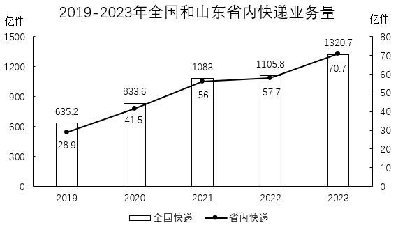
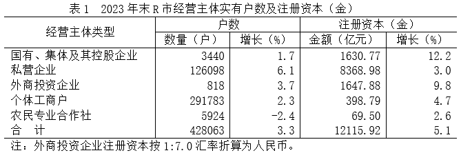
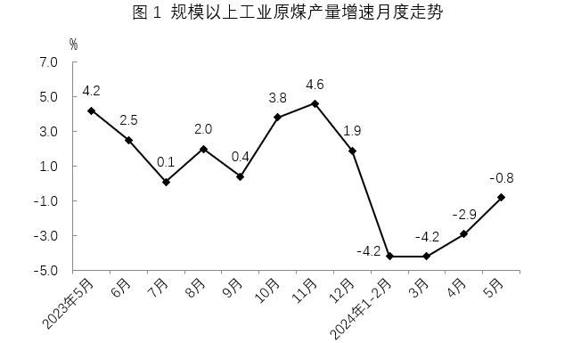
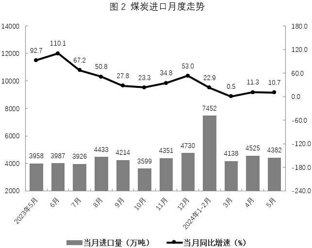
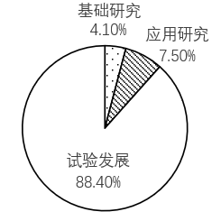
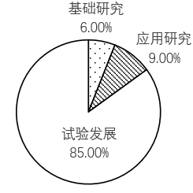
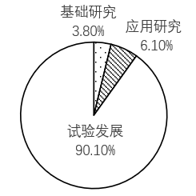
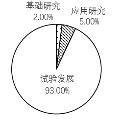

# 2025年山东省公务员录用考试《行测》试题（网友回忆版）

> 资料分析 · 20 题 · 山东 2025

## 材料 1

        2023年，邮政行业寄递业务量累计完成1624.8亿件，同比增长16.8%。其中，快递业务量（不包含邮政集团包裹业务）累计完成1320.7亿件，同比增长19.4%。

        从收入来看，2023年，邮政行业业务收入（不包括邮政储蓄银行直接营业收入）累计完成15293.0亿元，同比增长13.2%。其中，快递业务收入累计完成12074.0亿元，同比增长14.3%。

### 第 1 题　qid 14403672 · 增长

2023年，我国邮政寄递业务总量比2022年增加多少亿件？

- **A**. 234　✅
- **B**. 237
- **C**. 243
- **D**. 273

**答案**：A

**官方解析**

根据题干“2023年······比2022年增加多少亿件”，可判定本题为增长量计算问题。定位文字材料可得：2023年，邮政行业寄递业务量累计完成1624.8亿件，同比增长16.8%。根据公式：增长量，则所求增长量亿件，与A项最接近。

故正确答案为A。

---

### 第 2 题　qid 14403673 · 比重

2023年，全国快递业务量占邮政寄递业务总量的比重约为：

- **A**. 79%
- **B**. 81%　✅
- **C**. 83%
- **D**. 85%

**答案**：B

**官方解析**

根据题干“2023年······占······的比重约为”，结合材料时间为2023年，可判定本题为现期比重问题。定位文字材料可得：2023年全国邮政行业寄递业务量累计完成1624.8亿件，其中快递业务量（不包含邮政集团包裹业务）累计完成1320.7亿件 。根据公式：比重，则所求比重，与B项最接近。

故正确答案为B。

---

### 第 3 题　qid 14403675 · 增长

2020-2023年全国快递业务总量同比增速最大的是：

- **A**. 2023年
- **B**. 2022年
- **C**. 2021年
- **D**. 2020年　✅

**答案**：D

**官方解析**

根据题干“2020-2023年······同比增速最大的是”，可判定本题为一般增长率问题。定位统计图可知：2019-2023年全国快递业务总量分别为635.2亿件、833.6亿件、1083亿件、1105.8亿件、1320.7亿件。根据公式：增长率，则选项各年份全国快递业务总量同比增速分别为：

2020年：；

2021年：；

2022年：；

2023年：。

综上可知，全国快递业务总量同比增速最大的是2020年。

故正确答案为D。

---

### 第 4 题　qid 14403681 · 比重

2019-2023年，省内快递业务量占全国比重最高和最低的相差：

- **A**. 0.1个百分点
- **B**. 0.2个百分点
- **C**. 0.4个百分点
- **D**. 0.8个百分点　✅

**答案**：D

**官方解析**

根据题干“2019-2023年······比重最高和最低的相差”，结合选项为百分点，可判定本题为两期比重问题。定位统计图可知2019-2023年全国、省内快递业务量。根据公式：比重，可得2019-2023年每年省内快递业务量占全国的比重分别为：2019年，；2020年，；2021年，；2022年，；2023年，。比较可知，2019-2023年省内快递业务量占全国的比重最低的是4.5%，最高的是5.4%，两者相差5.4%-4.5%=0.9%，即0.9个百分点，与D项最接近。

故正确答案为D。

---

### 第 5 题　qid 14403682 · 综合

能够从上述材料中推出的是：

- **A**. 若按照当年的同比增长率，2023年全国快递业务量翻一番约需4年　✅
- **B**. 2023年全国快递每件收入约为9元，比2022年有所增加
- **C**. 2019-2023年，全国快递业务量年均增长率高于山东省内快递业务量
- **D**. 2023年，全国快递业务占邮政寄递业务的比重比2022年高1个百分点

**答案**：A

**官方解析**

A项：定位文字材料第一段可得：2023年，全国快递业务量同比增长19.4%。根据公式：现期量，即，可得4年后：，故2023年全国快递翻一番约需4年，正确；

B项：定位文字材料第一段可得：2023年，全国快递业务量同比增长19.4%（b）；定位文字材料第二段可得：2023年，快递业务收入同比增长14.3%（a）。根据公式：单件收入，结合两期平均数比较的方法：当分子增长率（a）&gt;分母增长率（b）时，平均数上升，反之下降。a（14.3%）＜b（19.4%），可判断平均数下降，即2023年全国快递每件收入比2022年有所下降，错误；

C项：定位统计图可得：2019年全国快递业务量为635.2亿件，2023年为1320.7亿件；2019年山东省内快递业务量为28.9亿件，2023年为70.7亿件。根据年均增长率结论：当年份差相同时，直接比较，若大，则年均增长率大。全国快递业务量：；山东省内快递业务量：。比较可知，2019-2023年，全国快递业务量年均增长率低于山东省内快递业务量，错误；

D项：定位文字材料第一段可得：2023年，我国邮政寄递业务总量1624.8亿件（B），比上年增长了16.8%（b）。其中，快递业务量1320.7亿件（A），同比增长19.4%（a）。根据公式：两期比重差，代入数据，则所求两期比重差，即高1.8个百分点，错误。

故正确答案为A。

---

## 材料 2

        2023年末R市户籍人口308.36万人，比上年末增加0.44万人，其中城镇人口152.45万人，比上年末增加0.53万人。2023年新登记各类经营主体5.97万户，其中，新登记企业1.87万户。年末实有经营主体42.81万户，增长3.3%，其中，民营经营主体42.38万户，占比99%。

### 第 6 题　qid 10886472 · 增长

根据户籍登记，2023年末，R市人口城镇化率同比增速计算公式为：

- **A**. 

　✅
- **B**. 

- **C**. 

- **D**. 

**答案**：A

**官方解析**

根据题干“······2023年末······同比增速计算公式为”，可判定本题为一般增长率问题。定位文字材料可得：2023年末R市户籍人口308.36万人，比上年末增加0.44万人，其中城镇人口152.45万人，比上年增加0.53万人。根据公式：基期量=现期量-增长量，可得2022年末R市户籍人口为（308.36-0.44）万人，城镇人口为（152.45-0.53）万人。根据公式：增长率，可得题干所求。

故正确答案为A。

---

### 第 7 题　qid 10886476 · 综合

2023年末，R市外商投资企业的注册资本约为多少亿美元？

- **A**. 1501
- **B**. 1648
- **C**. 214
- **D**. 235　✅

**答案**：D

**官方解析**

根据题干“2023年末······注册资本约为多少亿美元”，结合材料给出人民币折算的汇率，可判定本题为比值计算问题。定位统计表可得：2023年末R市外商投资企业注册资本为1647.88亿元；定位注释可得：外商投资企业注册资本按1：7.0汇率折算为人民币。则2023年末，R市外商投资企业的注册资本为亿美元。

故正确答案为D。

---

### 第 8 题　qid 10886478 · 综合

2023年R市注销的各类经营主体的数量约为多少万户？

- **A**. 0.43
- **B**. 1.37
- **C**. 4.60　✅
- **D**. 7.34

**答案**：C

**官方解析**

定位文字材料可知：2023年R市新登记各类经营主体5.97万户，年末实有经营主体42.81万户，增长3.3%。根据公式：增长量，可得2023年末R市实有经营主体比上年末增加万户。因为年末同比增加量=当年新登记数量-当年注销数量，所以2023年R市注销的各类经营主体的数量=5.97-1.38=4.59万户，与C项最接近。

故正确答案为C。

---

### 第 9 题　qid 10886479 · 综合

2023年末，民营经营主体数量较2022年末约（    ）。

- **A**. 下降6.0%
- **B**. 下降3.3%
- **C**. 上升3.3%　✅
- **D**. 上升6.0%

**答案**：C

**官方解析**

方法一：根据题干“2023年末······较2022年末”，结合选项为上升/下降+%，可判定本题为一般增长率问题。定位文字材料可得：2023年末民营经营主体42.38万户；定位统计表可得：2023年末R市私营企业实有户数为126098户，同比增长6.1%；个体工商户实有户数为291783户，同比增长2.3%；农民专业合作社实有户数为5924户，同比增长-2.4%。根据材料数据可知：民营经营主体数量=私营企业实有户数+个体工商户实有户数+农民专业合作社实有户数，根据公式：基期量，可得2022年末私营企业实有户数万户；个体工商户实有户数万户；农民专业合作社实有户数万户，则2022年末民营经营主体数量=11.90+28.61+0.61=41.12万户。根据公式：增长率，则题干所求，即约上升3.1%，与C项最接近。

方法二：根据题干“2023年末······较2022年末”，结合选项为上升/下降+%，材料给出2023年末私营企业、个体工商户、农民专业合作社实有户数和同比增长率，且民营经营主体数量=私营企业实有户数+个体工商户实有户数+农民专业合作社实有户数，可判定本题为混合增长率问题。定位统计表可得：2023年末R市私营企业实有户数为126098户，同比增长6.1%；个体工商户实有户数为291783户，同比增长2.3%；农民专业合作社实有户数为5924户，同比增长-2.4%（因为农民专业合作社实有户数远远小于私营企业实有户数及个体工商户实有户数，可以忽略不考虑）。先根据混合增长率口诀：①混合居中不正中，可得，排除A、B两项；再根据混合增长率口诀：②偏向基期量大的一方（一般用现期量代替基期量），又可得，即，排除D项。

故正确答案为C。

---

### 第 10 题　qid 10886480 · 综合

根据材料，下面选项能够推出的是：

- **A**. 2022年末R市农村居民人口数量比2023年末少0.09万人
- **B**. 2022年末R市农民专业合作社数量约为国有、集体及其控股企业的2倍　✅
- **C**. 2023年末R市登记的各类经营主体中企业占比不足30%
- **D**. 2023年末R市各类经营主体中外商投资企业数量和户均注册资本均最少

**答案**：B

**官方解析**

A项：定位文字材料可得，2023年末R市户籍人口308.36万人，比上年末增加0.44万人，其中城镇人口152.45万人，比上年末增加0.53万人。则2023年末R市农村居民人口数量同比增长量=0.44-0.53=-0.09万人，即2022年末R市农村居民人口数量比2023年末多0.09万人，错误；

B项：定位表格材料可得，2023年末R市农民专业合作社数量为5924户（A），同比增长-2.4%（a）；国有、集体及其控股企业数量为3440户（B），同比增长1.7%（b）。根据公式：基期倍数，可得所求倍，即约为2倍，正确；

C项：定位表格材料可得，2023年末R市经营主体数量合计428063户，国有、集体及其控股企业3440户，私营企业126098户，外商投资企业818户。根据公式：比重，可得2023年末R市登记的各类经营主体中企业占比，即超过30%，错误；

D项：定位表格材料可得2023年末R市各类经营主体数量和注册资本。比较可得，2023年末R市各类经营主体数量最少的是外商投资企业（818户），其户均注册资本亿元/户，而私营企业户均注册资本亿元/户，因此2023年末R市外商投资企业户均注册资本并非最少，错误。

故正确答案为B。

---

## 材料 3

        2024年5月，规模以上工业原煤产量3.8亿吨，同比增长-0.8%，降幅比4月收窄2.1个百分点，日均产量1238.2万吨，进口4382万吨，同比增长10.7%，2024年1-5月规模以上工业原煤产量18.6亿吨，同比下降3%，进口煤炭2亿吨，同比增长12.6%。

### 第 11 题　qid 18508028 · 增长

2023年，规模以上工业原煤产量各月同比增速排序正确的是：

- **A**. 5月>8月>10月>12月
- **B**. 11月>6月>9月>8月
- **C**. 11月>5月>10月>9月　✅
- **D**. 6月>7月>12月>8月

**答案**：C

**官方解析**

根据题干“······同比增速排序正确的是”，可判定本题为一般增长率比较问题。定位图1可得2023年规模以上工业原煤产量各月同比增速。选项各月同比增速排序如下：
A项：8月（2.0%）&lt;10月（3.8%），错误；
B项：9月（0.4%）&lt;8月（2.0%），错误；
C项：11月（4.6%）&gt;5月（4.2%）&gt;10月（3.8%）&gt;9月（0.4%），正确；
D项：7月（0.1%）&lt;12月（1.9%），错误。
故正确答案为C。

---

### 第 12 题　qid 18508080 · 综合

2024年第一季度煤炭进口情况与2023年第四季度相比：

- **A**. 进口总量增加1090万吨
- **B**. 月均进口量约减少363万吨　✅
- **C**. 进口总量环比约下降10.6%
- **D**. 进口总量环比约上升8.6%

**答案**：B

**官方解析**

根据题干“2024年第一季度······与2023年第四季度相比”，结合选项为“进口总量增加+单位”“月均进口量减少+单位”“进口总量环比上升/下降+%”，可判定本题为增长量计算和一般增长率计算问题。定位图2可知2023年10月至2024年3月的月度煤炭进口量。则2024年第一季度（1-3月）煤炭进口总量为7452+4138=11590万吨，2023年第四季度（10-12月）煤炭进口总量为3599+4351+4730=12680万吨。前者明显低于后者，则进口总量的环比增长量与环比增长率均应为负，排除A、D两项。

月均进口量的差值为万吨，B项正确；

进口总量的环比增长率，C项错误。

故正确答案为B。

---

### 第 13 题　qid 18508046 · 增长

下列月份中，煤炭进口量环比增速最快的是:

- **A**. 2023年8月　✅
- **B**. 2022年11月
- **C**. 2023年12月
- **D**. 2024年4月

**答案**：A

**官方解析**

根据题干“······环比增速最快的是”，可判定本题为一般增长率问题。定位图2可知2023年5月-2024年5月煤炭进口量及同比增速。根据公式：增长率，可得选项中各月份的环比增速分别为：

A项：2023年8月，；

B项：2022年11月，；

C项：2023年12月，；

D项：2024年4月，。

综上可知，煤炭进口量环比增速最快的是2023年8月。

故正确答案为A。

---

### 第 14 题　qid 18508051 · 增长

2024年1-4月，规模以上工业原煤产量同比约下降：

- **A**. 2.9%
- **B**. 3.9%　✅
- **C**. 5.0%
- **D**. 11.3%

**答案**：B

**官方解析**

根据题干“2024年1-4月，规模以上工业原煤产量同比约下降”，结合选项为百分数，且材料已知2024年1-2月、3月、4月规模以上工业原煤产量的同比增速，可判定本题为混合增长率问题。定位图1可得：2024年1-2月、3月、4月规模以上工业原煤产量的同比增速分别为-4.2%、-4.2%、-2.9%。（1-4）月=（1-2）月+3月+4月，根据混合增长率口诀：混合后居中，则，可排除A、C、D三项。

故正确答案为B。

---

### 第 15 题　qid 14403687 · 综合

下列说法正确的是：

- **A**. 2022年9月煤炭进口量低于2022年8月
- **B**. 2023年三季度煤炭月均进口量高于四季度
- **C**. 2022年5月原煤产量高于2024年5月
- **D**. 2024年5月原煤产量比1-4月的月均产量高0.1亿吨　✅

**答案**：D

**官方解析**

A项：定位图2可得：2023年9月煤炭进口量为4214万吨，同比增长27.8%；2023年8月煤炭进口量为4433万吨，同比增长50.8%。根据公式：基期量，则2022年9月煤炭进口量为万吨；2022年8月煤炭进口量为万吨，故2022年9月煤炭进口量高于2022年8月，错误；

B项：定位图2可得：2023年7-12月每月煤炭进口量。则2023年三季度煤炭月均进口量为万吨；2023年四季度煤炭月均进口量为万吨，比较可知，2023年三季度煤炭月均进口量低于四季度，错误；

C项：定位图1可得：2024年5月原煤产量同比增长-0.8%（），2023年5月原煤产量同比增长4.2%（）。根据公式：，则2024年5月原煤产量比2022年5月增长-0.8%+4.2%-0.8%×4.2%＞0，即2024年5月原煤产量高于2022年5月，错误；

D项：定位文字材料可得：2024年5月，规模以上工业原煤产量3.8亿吨，2024年1-5月产量18.6亿吨。2024年1-4月原煤月均产量为亿吨，则2024年5月原煤产量比1-4月的月均产量高3.8-3.7=0.1亿吨，正确。

故正确答案为D。

---

## 材料 4

        2022年，全省R&amp;D经费投入达到2180.4亿元，比上年增长12.1%；全省R&amp;D经费投入强度（R&amp;D经费与地区生产总值之比）达到2.49%，比上年提高0.14个百分点。

       分活动类型看，全省基础研究经费89.5亿元，比上年增长21.4%；应用研究经费163.8亿元，增长37.2%；试验发展经费1927.1亿元，增长10.0%。基础研究、应用研究、试验发展经费所占比重分别为4.1%、7.5%和88.4%。

       分活动主体看，企业R&amp;D经费1943.2亿元，比上年增长11.3%；政府属研究机构R&amp;D经费79.1亿元，增长0.3%；高等学校R&amp;D经费114.3亿元，增长20.5%；其他主体R&amp;D经费43.8亿元，增长74.9%。企业、政府属研究机构、高等学校R&amp;D经费所占比重分别为89.1%、3.6%和5.2%。

        分行业看，规模以上工业企业R&amp;D经费投入为1728.7亿元，增长10.4%；其中高技术制造业R&amp;D经费363.6亿元，增长33.7%。规模以上工业企业R&amp;D经费投入强度（R&amp;D经费与营业收入之比）为1.59%，比上年提高0.08个百分点；其中高技术制造业投入强度达到3.86%，提高0.47个百分点。规模以上工业企业R&amp;D经费投入超过100亿元的行业大类有6个，分别为化学原料和化学制品制造业，计算机、通信和其他电子设备制造业，医药制造业，通用设备制造业，专用设备制造业，电气机械和器材制造业。这6个行业的R&amp;D经费占全部规模以上工业企业的比重为50.2%。

        分地区看，R&amp;D经费投入超过100亿元的市有8个，依次是青岛（400.2亿元）、济南（346.8亿元）、烟台（197.5亿元）、潍坊（169.1亿元）、临沂（129.6亿元）、淄博（129.4亿元）、滨州（110.7亿元）、德州（109.0亿元）。R&amp;D经费投入强度超过全省平均水平的市有10个，依次为滨州（3.72%）、日照（3.14%）、聊城（3.13%）、德州（3.00%）、淄博（2.94%）、济南（2.88%）、青岛（2.68%）、泰安（2.63%）、威海（2.55%）、东营（2.53%）。

### 第 16 题　qid 10886500 · 综合

2022年德州市地区生产总值是多少？

- **A**. 3456亿元
- **B**. 3523亿元
- **C**. 3633亿元　✅
- **D**. 3758亿元

**答案**：C

**官方解析**

根据题干“2022年······地区生产总值是多少”，且材料给出2022年德州市R&amp;D经费及投入强度，可判定本题为现期比重问题。定位文字材料第五段可得：（2022年）德州市R&amp;D经费投入109.0亿元，投入强度3.00%。根据公式：整体，可得所求亿元。

故正确答案为C。

---

### 第 17 题　qid 10886502 · 比重

以下哪个选项能够反映2021年各活动类型的比例范围？

- **A**. 

- **B**. 

- **C**. 

　✅
- **D**. 

**答案**：C

**官方解析**

根据题干“······2021年各活动类型的比例范围”，结合材料时间为2022年，可判定本题为基期比重问题。定位文字材料第一段可得：2022年，全省R&amp;D经费投入比上年增长12.1%（b）；定位文字材料第二段可得：（2022年）分活动类型看，全省基础研究经费比上年增长21.4%（）；应用研究经费增长37.2%()；试验发展经费增长10.0%()。基础研究、应用研究、试验发展经费所占比重分别为4.1%、7.5%和88.4%。根据公式：基期比重，可得2021年基础研究占比，只有C项符合。

故正确答案为C。

---

### 第 18 题　qid 10886504 · 增长

2022年规模以上工业企业R&D经费投入的增长量是高技术制造业R&D经费的多少倍？

- **A**. 1.5
- **B**. 1.8　✅
- **C**. 1.9
- **D**. 2.0

**答案**：B

**官方解析**

根据题干“2022年······是······的多少倍”，可判定本题为现期倍数问题。定位文字材料第四段可得：（2022年）规模以上工业企业R&amp;D经费投入为1728.7亿元，增长10.4%；其中高技术制造业R&amp;D经费363.6亿元，增长33.7%。根据公式：增长量。可得所求倍数倍。

故正确答案为B。

---

### 第 19 题　qid 10886507 · 增长

2022年高技术制造业营业收入的同比增长率约为多少？

- **A**. 10%
- **B**. 15%
- **C**. 20%
- **D**. 17%　✅

**答案**：D

**官方解析**

根据题干“2022年高技术制造业营业收入的同比增长率约为多少”，结合文字材料给出了2022年高技术制造业投入强度（R&amp;D经费与营业收入之比）及其变化情况，可判定本题为两期比重问题。定位文字材料第四段可得，（2022年）高技术制造业R&amp;D经费增长33.7%（a），高技术制造业投入强度达到3.86%（），比上年提高0.47个百分点。根据公式：两期比重差，可得：，解得，即2022年高技术制造业营业收入的同比增长率约为17.4%，与D项最接近。

故正确答案为D。

---

### 第 20 题　qid 10886509 · 综合

以下四个选项正确的是：

- **A**. 
2021年高技术制造业投入强度为4.33%

- **B**. 
2022年青岛、济南、烟台经费投入占全省经费投入的40％以下

- **C**. 
2022年山东省地区生产总值的增长量为4500亿元 

- **D**. 
2022年试验发展经费占总经费比重不到90%
　✅

**答案**：D

**官方解析**

A项：定位文字材料第四段可得，（2022年）高技术制造业投入强度达到3.86%，提高0.47个百分点。则2021年高技术制造业投入强度为3.86%-0.47%=3.39%，错误；

B项：定位文字材料第一段可得，2022年，全省R&amp;D经费投入达到2180.4亿元。定位文字材料第五段可得，（2022年）R&amp;D经费投入超过100亿元的市有8个，依次是青岛（400.2亿元）、济南（346.8亿元）、烟台（197.5亿元）。根据公式：比重，可知2022年青岛、济南、烟台R&amp;D经费投入占全省经费投入的比重为，错误；

C项：定位文字材料第一段可得，2022年，全省R&amp;D经费投入达到2180.4亿元，比上年增长12.1%；全省R&amp;D经费投入强度（R&amp;D经费与地区生产总值之比）达到2.49%，比上年提高0.14个百分点。根据公式：整体，可知2022年山东省地区生产总值为亿元。

方法一：根据公式：基期量，可知2021年全省R&amp;D经费投入为。根据公式：增长量=现期量-基期量，可知2022年山东省地区生产总值的增长量为亿元，并非4500亿元，错误；

方法二：根据公式：两期比重，可得：，解得，根据公式：增长量，可知2022年山东省地区生产总值的增长量为亿元，并非4500亿元，错误；

D项：定位文字材料第一段可得，2022年，全省R&amp;D经费投入达到2180.4亿元。定位文字材料第二段可得，试验发展经费1927.1亿元，所占比重为88.4%。根据材料数据，88.4%＜90%，正确。

故正确答案为D。

---
