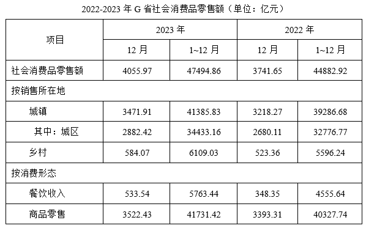
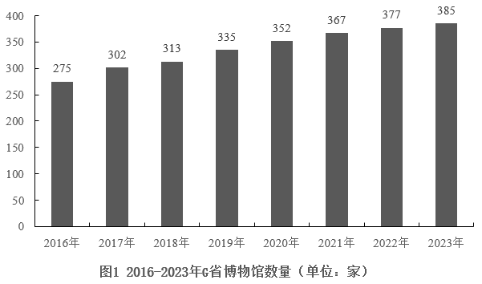
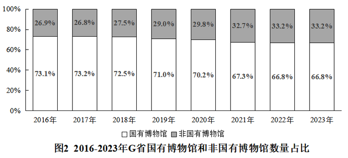
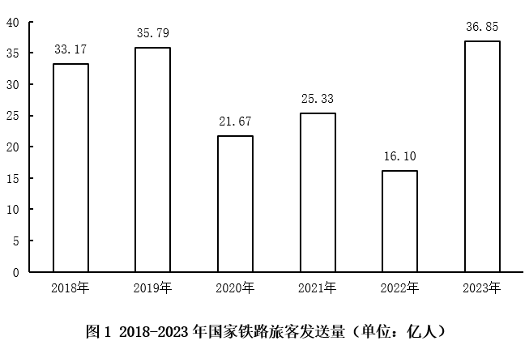
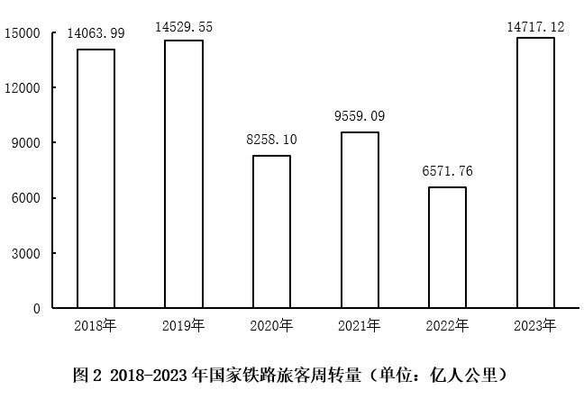

# 2025年广东省公务员录用考试《行测》题（网友回忆版）

> 资料分析 · 20 题 · 广东 2025

## 材料 1

### 第 1 题　qid 12881974 · 综合

2023年1~11月，G省社会消费品零售额约为（    ）万亿元。

- **A**. 4.34　✅
- **B**. 4.43
- **C**. 4.54
- **D**. 4.63

**答案**：A

**官方解析**

定位统计表可得，2023 年1~12月、12月G省社会消费品零售额分别为47494.86亿元、4055.97亿元。则2023年1~11月G省社会消费品零售额=1~12月零售额-12月零售额亿元万亿元。

故正确答案为A。

---

### 第 2 题　qid 12881975 · 增长

2023年，G省社会消费品零售额同比增长（    ）。

- **A**. 不到5%
- **B**. 在5%到10%之间　✅
- **C**. 在10%到15%之间
- **D**. 超过15%

**答案**：B

**官方解析**

根据题干“2023年······同比增长”，结合选项为百分数，可判定本题为一般增长率问题。定位统计表可得：2022年1~12月、2023年1~12月G省社会消费品零售额分别为44882.92亿元、47494.86亿元。根据公式：增长率，可得2023年G省社会消费品零售额同比增长率，在B项范围内。

故正确答案为B。

---

### 第 3 题　qid 12881976 · 综合

2023年，G省城镇社会消费品零售额约占社会消费品零售额的（    ）。

- **A**. 79.8%
- **B**. 83.4%
- **C**. 87.1%　✅
- **D**. 90.0%

**答案**：C

**官方解析**

根据题干“2023年······占······”，结合材料给出2023年相关数据，可判定本题为现期比重问题。定位统计表可得：2023年1-12月，G省社会消费品零售额为47494.86亿元， G省城镇社会消费品零售额为41385.83亿元。根据公式：比重，则题干所求。

故正确答案为C。

---

### 第 4 题　qid 12881977 · 增长

2023年，G省下列指标的社会消费品零售额同比增长率最高的是（    ）。

- **A**. 城镇
- **B**. 乡村
- **C**. 商品零售
- **D**. 餐饮收入　✅

**答案**：D

**官方解析**

根据题干“2023年·····同比增长率最高的是”，可判定本题为一般增长率问题。定位表格可得2022年、2023年G省城镇、乡村、商品零售、餐饮收入等指标的社会消费品零售额。根据公式：增长率，则四个指标的社会消费品零售额同比增长率分别为：

A项，城镇：；

B项，乡村：；

C项，商品零售：；

D项，餐饮收入：。

综上，同比增长率最高的是餐饮收入。

故正确答案为D。

---

### 第 5 题　qid 12881978 · 综合

根据资料，以下说法有误的是（    ）。

- **A**. 2023年12月G省社会消费品零售额高于当年月平均数
- **B**. 2023年12月G省餐饮收入社会消费品零售额同比增长率超过50%
- **C**. 2022年12月G省城镇社会消费品零售额中，城区占比超过九成　✅
- **D**. 2022年12月G省社会消费品零售额中，餐饮收入占比不足一成

**答案**：C

**官方解析**

A项：定位统计表，2023年12月G省社会消费品零售额为4055.97亿元，1-12月G省社会消费品零售额为47494.86亿元。2023年G省平均每月社会消费品零售额为亿元（2023年12月），正确；

B项：定位统计表，2022年12月、2023年12月G省餐饮收入社会消费品零售额分别为348.35亿元、533.54亿元。根据公式：增长率，可得2023年12月G省餐饮收入社会消费品零售额同比增长率，即同比增长率超过50%，正确；

C项：定位统计表，2022年12月G省城镇社会消费品零售额为3218.27亿元，其中城区社会消费品零售额为2680.11亿元。根据公式：比重，可得题干所求，即占比不到90%，错误；

D项：定位统计表，2022年12月G省社会消费品零售额为3741.65亿元，餐饮收入社会消费品零售额为348.35亿元。根据公式：比重，可得题干所求，即占比不足一成，正确。

本题为选非题，故正确答案为C。

---

## 材料 2

        2013~2023年，中国深入推进能源生产和消费方式变革，能源绿色低碳发展实现历史性突破。2023年，清洁能源消费占比26.4%，较2013年提高10.9个百分点，煤炭消费比率累计下降12.1个百分点，发电总装机容量达29.2亿千瓦。其中，清洁能源发电装机容量达17亿千瓦，清洁能源发电约3.8万亿千瓦时，占总发电量的39.7%，比2013年提高约15个百分点。十年来，新增清洁能源发电量占全社会用电增量一半以上。

       中国能源转型支撑经济社会高质量发展。十年来，能源领域固定资产投资39万亿元，推动上下游产业链及相关产业的投资增长。一系列能源领域，重大工程建成投产，建立起完备的能源装备制造产业链，新能源、水电、核电、输变电、新型储能等领域技术创新加快，推动清洁能源产业成长为现代化产业体系新支柱。

       中国能源转型保障人民美好生活需要，十年来，14亿多人的能源安全得到有效保障。全国人均生活用电量从约500千瓦时增至接近1000千瓦时，天然气用户达5.6亿人，农村电网改造升级中央预算内总投资超千亿元。2015年历史性解决全国无电人口用电问题。农村地区户用光伏规模达到1.2亿千瓦。每年可为农户增收110亿元，增加就业岗位约200万个。2023年底，全国充电基础设施从不到10万台增至近860万台。

       中国能源转型为全球能源转型作出重要贡献，2023年中国能源转型投资达6760亿美元，是全球能源转型投资最多的国家。十年来，中国向全球提供优质的清洁能源产品和服务，有力促进全球风电，光伏成本大幅下降，中国与100多个国家和地区开展绿色能源项目合作，2023年出口风电光伏产品助力其他国家减排二氧化碳约8.1亿吨。中国新能源产业丰富了全球供给，缓解了全球通胀压力，助力全球应对气候变化和绿色转型。

### 第 6 题　qid 12881981 · 综合

以下判断正确的是（    ）。

- **A**. 我国清洁能源消费比重已经超过煤炭消费比重
- **B**. 我国清洁能源发电装机容量不到发电总装机容量的一半
- **C**. 我国清洁能源发电量占总发电量的比重较10年前翻了一番
- **D**. 我国总发电量超过9万亿千瓦时　✅

**答案**：D

**官方解析**

A项：定位文字材料第一段可得：2023年，清洁能源消费占比26.4%，未给出2023年煤炭消费占比，无法比较两者比重大小，错误；

B项：定位文字材料第一段可得：2023年，发电总装机容量达29.2亿千瓦。其中，清洁能源发电装机容量达17亿千瓦。由于17亿千瓦亿千瓦，即我国清洁能源发电装机容量超过发电总装机容量的一半，错误；

C项：定位文字材料第一段可得：2023年清洁能源发电量占总发电量的39.7%，比2013年提高约15个百分点。则2013年清洁能源发电量占总发电量的39.7%-15%=24.7%，39.7%&lt;24.7%×2=49.4%，即不到翻一番，错误；

D项：定位文字材料第一段可得：2023年清洁能源发电约3.8万亿千瓦时，占总发电量的39.7%。根据公式：整体，则2023年我国总发电量万亿千瓦时，正确。

故正确答案为D。 

---

### 第 7 题　qid 12881982 · 综合

根据资料，以下说法有误的是（    ）。

- **A**. 
农村地区户用光伏可为农户增加收入和就业岗位

- **B**. 
2023年我国已有超过的人口用上了天然气
　✅
- **C**. 
2013~2023年，我国人均生活用电量几乎翻了一番

- **D**. 
2013~2023年，新增清洁能源发电量占全社会用电增量一半以上

**答案**：B

**官方解析**

A项：定位文字材料第三段可得：农村地区户用光伏规模达到1.2亿千瓦。每年可为农户增收110亿元，增加就业岗位约200万个。即农村地区户用光伏可为农户增加收入和就业岗位，正确；

B项：定位文字材料第三段可得：2023年我国天然气用户达5.6亿人，总人数为14亿多人。根据公式：比重，可得所求为，错误；

C项：定位文字材料第三段可得：2013~2023年十年来，全国人均生活用电量从约500千瓦时增至接近1000千瓦时。，即2013~2023年，我国人均生活用电量几乎翻了一番，正确；

D项：定位文字材料第一段可得：2013~2023年十年来，新增清洁能源发电量占全社会用电增量一半以上，正确。

本题为选非题，故正确答案为B。

---

### 第 8 题　qid 12881983 · 增长

2013-2023年，全国充电基础设施年均增加约（    ）万台。

- **A**. 60
- **B**. 75
- **C**. 85　✅
- **D**. 95

**答案**：C

**官方解析**

根据题干“2013-2023年······年均增加约······万台”，可判定本题为年均增长量问题。定位文字材料第三段可得：十年来······2023年底，全国充电基础设施从不到10万台增至近860万台。根据公式：年均增长量，可得所求万台。

故正确答案为C。

---

### 第 9 题　qid 12881984 · 综合

中国新能源产业对世界的影响，主要包括（    ）。
①丰富全球供给
②缓解全球通胀压力
③应对气候变化和绿色转型
④支撑经济社会高质量发展

- **A**. ①②③　✅
- **B**. ①③④
- **C**. ②③④
- **D**. ①②③④

**答案**：A

**官方解析**

定位文字材料第四段可知，中国能源转型为全球能源转型作出重要贡献，中国新能源产业丰富了全球供给，缓解了全球通胀压力，助力全球应对气候变化和绿色转型。
故正确答案为A。

---

### 第 10 题　qid 12881985 · 综合

根据材料，以下说法不正确的是（    ）。

- **A**. 2023年，我国已建立起完备的能源装备制造产业链
- **B**. 2023年，我国是全球能源转型投资最多的国家
- **C**. 2013-2023年，我国累计出口的清洁能源产品助力其他国家减排二氧化碳约8.1亿吨　✅
- **D**. 2013-2023年，我国与100多个国家和地区开展绿色能源项目合作

**答案**：C

**官方解析**

A项：定位文字材料第二段可得，（2013~2023年）我国一系列能源领域重大工程建成投产，建立起完备的能源装备制造产业链，正确；
B项：定位文字材料第四段可得，2023年中国能源转型投资达6760亿美元，是全球能源转型投资最多的国家，正确；
C项：定位文字材料第四段可得，2023年我国出口风电光伏产品助力其他国家减排二氧化碳约8.1亿吨，而非2013-2023年累计出口的清洁能源产品，错误；
D项：定位文字材料第四段可得，十年来（2013-2023年）······中国与100多个国家和地区开展绿色能源项目合作，正确。
本题为选非题，故正确答案为C。

---

## 材料 3

        2023年，G省博物馆系统落实国家文物局、G省人民政府关于推进文物事业高质量发展战略合作协议，锚定博物馆事业高质量发展任务，全省博物馆事业发展取得明显成效。

        截至2023年来，G省备案博物馆385家。其中，国有博物馆257家，非国有博物馆128家。国有博物馆中，文物系统国有博物馆227家，行业国有博物馆30家。G省国家一、二、三级博物馆共82家，数量位居全国第二。

### 第 11 题　qid 12881986 · 增长

2023年，G省博物馆数量同比增长约（    ）。

- **A**. 2.1%　✅
- **B**. 4.2%
- **C**. 6.3%
- **D**. 8.4%

**答案**：A

**官方解析**

根据题干“2023年，······同比增长约”，结合选项为百分数，可判定本题为一般增长率问题。定位图1可得：2022年、2023年G省博物馆数量分别为377家、385家。根据公式：增长率，则所求。

故正确答案为A。

---

### 第 12 题　qid 12881987 · 增长

2016～2022年，G省博物馆年均增加（    ）家。

- **A**. 15
- **B**. 16
- **C**. 17　✅
- **D**. 18

**答案**：C

**官方解析**

根据题干“2016～2022年······年均增加（    ）家”，可判定本题为年均增长量问题。定位图1可知：2016年、2022年G省博物馆数量分别为275家、377家。根据公式：年均增长量，则所求家。

故正确答案为C。

---

### 第 13 题　qid 12881988 · 综合

2023年，G省文物系统国有博物馆约占国有博物馆总量的（    ）。

- **A**. 55%
- **B**. 66%
- **C**. 77%
- **D**. 88%　✅

**答案**：D

**官方解析**

根据题干“2023年······约占······”，结合材料时间为2023年，可判定本题为现期比重问题。定位文字材料第二段可得， 2023年G省国有博物馆257家；国有博物馆中，文物系统国有博物馆227家。根据公式：比重，可得所求比重为，满足的只有D项。

故正确答案为D。

---

### 第 14 题　qid 12881989 · 增长

2017~2023年间，G省国有博物馆同比增加数量最多的是（    ）。

- **A**. 2017年　✅
- **B**. 2018年
- **C**. 2019年
- **D**. 2020年

**答案**：A

**官方解析**

据题干“2017-2023年间······同比增加数量最多的是”，可判定本题为增长量比较问题。定位统计图1可知2016-2023年各年G省博物馆数量；定位统计图2可知2016-2023年各年G省国有博物馆数量占比。根据公式：部分=整体×比重，结合选项时间，可知2016-2020年，G省国有博物馆分别为：

2016年，家；

2017年，家；

2018年，家；

2019年，家；

2020年，家。

根据公式：增长量=现期量-基期量，则2017-2020年G省国有博物馆同比增量分别为：

2017年，220-201=19家；

2018年，228-220=8家；

2019年，238-228=10家；

2020年，246-238=8家。

综上可知，同比增加数量最多的是2017年。

故正确答案为A。

---

### 第 15 题　qid 12881990 · 综合

根据资料，以下说法正确的是（    ）。

- **A**. 2017～2023年，G省国有博物馆数量逐年增加
- **B**. 2017～2023年，G省非国有博物馆数量逐年增加　✅
- **C**. 2019年，G省非国有博物馆首次超过100家
- **D**. 2023年，按G省常住人口1.27亿计算，每40万人拥有1家博物馆

**答案**：B

**官方解析**

A项：定位统计图1、2可得：2017～2023年G省博物馆数量及国有博物馆所占比重。根据公式：部分=整体×比重，可得国有博物馆数量为：2020年：；2021年：。则2021年国有博物馆数量&lt;2020年国有博物馆数量，并非逐年增加，错误；

B项：定位统计图1、2可得：2017～2023年，G省博物馆数量及非国有博物馆所占比重。根据公式：部分=整体×比重，2017～2023年G省博物馆数量逐年增加，非国有博物馆所占比重也逐年增加（2022年与2023年所占比重相同），故2017～2023年，G省博物馆数量×非国有博物馆所占比重=非国有博物馆数量也逐年增加，正确；

C项：定位统计图1、2可得：2019年G省博物馆数量为335家，非国有博物馆所占比重为29%。根据公式：部分=整体×比重，可得2019年非国有博物馆数量为：，错误；

D项：定位统计图1可得：2023年G省博物馆数量为385家；结合题干条件：2023年，按G省常住人口1.27亿计算。根据公式：平均数，则题干所求为：万，错误。

故正确答案为B。

---

## 材料 4

        2023年，我国铁路客运创历史最好水平，服务保障国家重大战略成效显著旅客运输。国家铁路旅客发送量完成36.85亿人，比上年增加20.75亿人；国家铁路旅客周转量（旅客周转量=旅客发送量×旅客平均运送距离）完成14717.12亿人公里，比上年增加8145.36亿人公里。

### 第 16 题　qid 12881991 · 增长

2023年，国家铁路旅客发送量同比增长约（    ）。

- **A**. 30%
- **B**. 55%
- **C**. 130%　✅
- **D**. 155%

**答案**：C

**官方解析**

根据题干“2023年······同比增长约”，结合选项为百分数，可判定本题为一般增长率问题。定位文字资料可得，2023年国家铁路旅客发送量完成36.85亿人，比上年增加20.75亿人；定位图1可得，2022年国家铁路旅客发送量为16.10亿人。根据公式：增长率，则2023年国家铁路旅客发送量同比增长率。

故正确答案为C。

---

### 第 17 题　qid 12881992 · 增长

2018~2023年，国家铁路旅客发送量年均增长约（    ）万人。

- **A**. 6130
- **B**. 7360　✅
- **C**. 8280
- **D**. 9200

**答案**：B

**官方解析**

根据题干“2018~2023年······年均增长约（    ）万人”，可判定本题为年均增长量问题。定位统计图1可得：2018年、2023年国家铁路旅客发送量分别为33.17亿人、36.85亿人。根据公式：年均增长量，则题干所求亿人=7360万人。

故正确答案为B。

---

### 第 18 题　qid 12881993 · 增长

2021~2023年，国家铁路旅客周转量年均增长率（    ）。

- **A**. 不到15%
- **B**. 在15%到30%之间　✅
- **C**. 在30%到45%之间
- **D**. 超过45%

**答案**：B

**官方解析**

根据题干“2021~2023年······年均增长率”，可判定本题为年均增长率问题。定位图2可得：2021年、2023年国家铁路旅客周转量分别为9559.09亿人公里、14717.12亿人公里。根据公式：（n为年份差），可得。由于，，可知，因此20%&lt;年均增长率&lt;30%，在B项范围内。

故正确答案为B。

---

### 第 19 题　qid 12881994 · 平均数

在2020~2023年间，国家铁路旅客平均运送距离量最短的年份是（    ）。

- **A**. 2020年
- **B**. 2021年　✅
- **C**. 2022年
- **D**. 2023年

**答案**：B

**官方解析**

根据题干“在2020~2023年间······平均运送距离量最短的年份是”，结合材料给出2020-2023年相关数据，可判定本题为现期平均数问题。定位图1可得：2020-2023年国家铁路旅客发送量分别为21.67亿人、25.33亿人、16.10亿人、36.85亿人；定位图2可得：2020-2023年国家铁路旅客周转量分别为8258.10亿人公里、9559.09亿人公里、6571.76亿人公里、14717.12亿人公里。根据公式：旅客周转量=旅客发送量×旅客平均运送距离，则铁路旅客平均运送距离，故2020-2023年，国家铁路旅客平均运送距离分别为：

2020年：公里；

2021年：公里；

2022年：公里；

2023年：公里。

比较可知，2021年国家铁路旅客平均运送距离量最短。

故正确答案为B。

---

### 第 20 题　qid 12881995 · 综合

根据材料，以下说法不正确的是（    ）。

- **A**. 2019~2023年，国家铁路旅客发送量与周转量的同比变化趋势基本一致
- **B**. 2023年，国家铁路旅客发送量较2019年增长不到3%
- **C**. 2018年~2023年，国家铁路旅客发送量增速高于周转量
- **D**. 2018~2023年，国家铁路旅客年均周转量超过12000亿人公里　✅

**答案**：D

**官方解析**

A项：定位图1可知2019~2023年国家铁路旅客发送量的同比变化趋势为上升-下降-上升-下降-上升；定位图2可知2019~2023年国家铁路旅客周转量的同比变化趋势也为上升-下降-上升-下降-上升，变化趋势一致，正确；

B项：定位图1可知：2023年和2019年国家铁路旅客发送量分别为36.85亿人、35.79亿人。根据公式：增长率，则2023年国家铁路旅客发送量较2019年的增长率，正确；

C项：定位图1可知2023年和2018年国家铁路旅客发送量分别为36.85亿人、33.17亿人；定位图2可知2023年和2018年国家铁路旅客周转量分别为14717.12亿人公里、14063.99亿人公里。根据公式：增长率，则2023年国家铁路旅客发送量较2018年的增速，2023年国家铁路旅客周转量较2018年的增速，则2018年-2023年国家铁路旅客发送量增速高于周转量，正确；

D项：定位图2可知：2018～2023年国家铁路旅客周转量分别为14063.99亿人公里、14529.55亿人公里、8258.10亿人公里、9559.09亿人公里、6571.76亿人公里、14717.12亿人公里。则2018-2023年国家铁路旅客年均周转量亿人公里，未超过12000亿人公里，错误。

本题为选非题，故正确答案为D。

---
