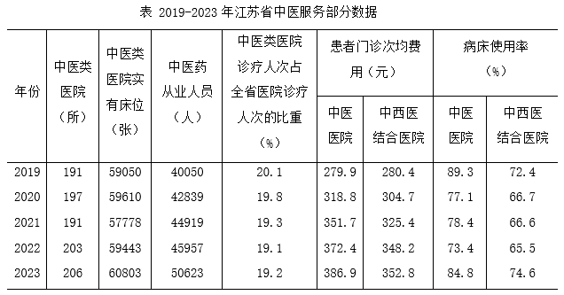
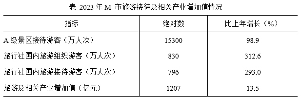
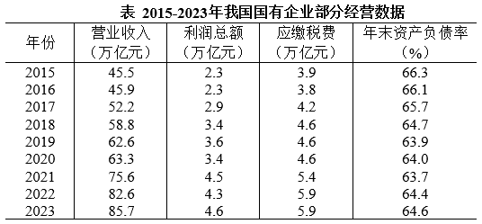
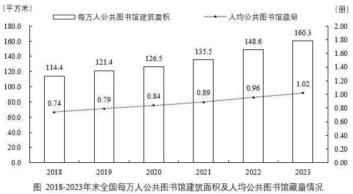

# 2025年江苏省公务员录用考试《行测》题（B类）（网友回忆版）

> 资料分析 · 20 题 · 江苏 2025

## 材料 1

### 第 1 题　qid 13319337 · 增长

2020-2023年，江苏省中医类医院实有床位的年均增长量约是：

- **A**. 239张
- **B**. 298张
- **C**. 351张
- **D**. 438张　✅

**答案**：D

**官方解析**

根据题干“2020-2023年······年均增长量约是”，可判定本题为年均增长量问题。定位统计表可得：江苏省2019年中医类医院实有床位59050张，2023年中医类医院实有床位60803张。根据公式：年均增长量，可得题干所求张。

故正确答案为D。

---

### 第 2 题　qid 13319339 · 增长

已知2022年、2023年江苏省医院诊疗人次分别为26015万人次、30002万人次，则可算出2023年江苏省中医类医院诊疗人次比上年增加了：

- **A**. 438万人次
- **B**. 624万人次
- **C**. 792万人次　✅
- **D**. 912万人次

**答案**：C

**官方解析**

根据题干“······2023年······比上年增加了”，结合选项带单位，可判定本题为增长量计算问题。定位统计表可得：2022年、2023年江苏省中医类医院诊疗人次占全省医院诊疗人次的比重分别为：19.1%、19.2%。根据题干：2022年、2023年江苏省医院诊疗人次分别为26015万人次、30002万人次。根据公式：部分=整体×比重，增长量=现期量-基期量，则题干所求万人次，与C项最接近。

故正确答案为C。

---

### 第 3 题　qid 13319340 · 增长

2020-2023年，江苏全省中西医结合医院患者门诊次均费用增速最快的年份是：

- **A**. 2020年　✅
- **B**. 2021年
- **C**. 2022年
- **D**. 2023年

**答案**：A

**官方解析**

根据题干“2020-2023年······增速最快的年份是”，可判定本题为一般增长率问题。定位统计表可得：2019-2023年江苏省中西医结合医院患者门诊次均费用分别为：280.4元、304.7元、325.4元、348.2元、352.8元。根据公式：增长率，则2020-2023年，江苏省中西医结合医院患者门诊次均费用同比增速分别为：

2020年，；

2021年，；

2022年，；

2023年，。

比较可知，同比增速最快的年份是2020年。

故正确答案为A。

---

### 第 4 题　qid 13319341 · 增长

按2023年的增长率估算，江苏省中医服务的下列指标率先达到2019年水平2倍的是：

- **A**. 中医类医院数
- **B**. 中医药从业人员数　✅
- **C**. 中医类医院实有床位数
- **D**. 中医医院患者门诊次均费用

**答案**：B

**官方解析**

根据题干“按2023年的增长率估算······率先达到2019年水平2倍的是“，可判定本题为现期追赶问题。定位统计表可知2019年、2022年、2023年中医类医院数、中医药从业人员数、中医类医院实有床位数、中医医院患者门诊次均费用。根据公式：增长率、现期量，可得题干所求为，即。

A项：中医类医院数，2023年增长率，则；

B项：中医药从业人员数，2023年增长率，则；

C项：中医类医院实有床位数，2023年增长率，则；

D项：中医医院患者门诊次均费用，2023年增长率，则。

A、B、C三项相比，B项2023年增长率更大，更小，因此B项n更小，排除A、C两项。

计算B项：当n=4时，；当n=5时，，则中医药从业人员数将在5年后达到2019年水平的2倍。

将n=5代入D项，，则5年后中医医院患者门诊次均费用不能达到2019年水平的2倍。

因此，中医药从业人员数率先达到2019年水平的2倍。

故正确答案为B。

---

### 第 5 题　qid 13319342 · 综合

下列选项中，能够从上述资料推出的是：

- **A**. 2023年江苏省中医药从业人数比2019年增长了26%以上　✅
- **B**. 2020-2023年，江苏省中医类医院院均实有床位数逐年增加
- **C**. 2019-2023年，江苏全省中医医院患者门诊次均费用均高于中西医结合医院
- **D**. 2019-2023年，江苏全省中西医结合医院病床使用率与中医医院的差距逐年缩小

**答案**：A

**官方解析**

A项：定位统计表可得，2023年江苏省中医药从业人员为50623人，2019年为40050人。根据公式：增长率，可得2023年江苏省中医药从业人数比2019年的增长率，正确；

B项：定位统计表可得2019-2023年江苏省中医类医院数量及实有床位数。根据公式：院均实有床位数，可得2021年江苏省中医类医院院均实有床位数张，2022年院均实有床位数张，则2022年江苏省中医类医院院均实有床位数低于2021年，并非逐年增加，错误；

C项：定位统计表可得2019-2023年江苏全省中医医院及中西医结合医院的患者门诊次均费用。则2019年江苏全省中医医院患者门诊次均费用（279.9元）低于中西医结合医院患者门诊次均费用（280.4元），错误；

D项：定位统计表可得2019-2023年江苏全省中医医院及中西医结合医院的病床使用率。则2020年江苏全省中西医结合医院病床使用率与中医医院的差距为77.1%-66.7%=10.4%，2021年差距为78.4%-66.6%=11.8%，故2021年病床使用率差距&gt;2020年病床使用率差距，并非逐年缩小，错误。

故正确答案为A。

---

## 材料 2

        2023年，M市接待过夜游客10190万人次，比上年增长88.1%。其中，核心片区接待过夜游客8326万人次，增长99.9%；东北片区接待过夜游客1125万人次，增长38.2%；东南片区接待过夜游客739万人次，增长70.1%。旅游及相关产业增加值占全市地区生产总值的比重为4.0%，比上年提高0.3个百分点。

### 第 6 题　qid 11226433 · 增长

2023年M市东南片区接待的过夜游客比上年多：

- **A**. 221万人次
- **B**. 305万人次　✅
- **C**. 434万人次
- **D**. 519万人次

**答案**：B

**官方解析**

根据“2023年······比上年多”，结合选项带单位，可判定本题为增长量计算问题。定位文字材料可得：2023年，M市东南片区接待过夜游客739万人次，增长70.1%。根据公式：增长量=，则所求万人次，与B项最接近。

故正确答案为B。

---

### 第 7 题　qid 11226435 · 增长

2023年M市东北片区接待过夜游客人次增长对全市接待过夜游客增长的贡献率为：

- **A**. 

　✅
- **B**. 

- **C**. 

- **D**. 

**答案**：A

**官方解析**

根据“2023年······对······增长的贡献率为”，可判定本题为现期比重问题。定位文字材料可得：2023年，M市接待过夜游客10190万人次，比上年增长88.1%。东北片区接待过夜游客1125万人次，增长38.2%。 根据公式：增长量，增长贡献率，则所求。

故正确答案为A。

---

### 第 8 题　qid 11226436 · 综合

2023年M市地区生产总值为：

- **A**. 14223亿元
- **B**. 15088亿元
- **C**. 24140亿元
- **D**. 30175亿元　✅

**答案**：D

**官方解析**

根据题干“2023年······总值为”，结合材料中给出了2023年M市旅游及相关产业增加值和其占全市地区生产总值的比重，可判定本题为现期比重问题。定位文字材料可得：2023年M市旅游及相关产业增加值占全市地区生产总值的比重为4.0%；定位统计表可得：2023年M市旅游及相关产业增加值为1207亿元。根据公式：整体，则所求亿元。

故正确答案为D。

---

### 第 9 题　qid 11226437 · 比重

2023年M市核心片区接待过夜游客人次占全市接待过夜游客人次的比重比上年提高的幅度：

- **A**. 超过8.2个百分点
- **B**. 介于7.3~8.2个百分点之间
- **C**. 介于4.5~7.3个百分点之间　✅
- **D**. 不足4.5个百分点

**答案**：C

**官方解析**

根据“2023年······占······比重比上年提高······”，可判定本题为两期比重问题。定位文字材料可得：2023年，M市接待过夜游客10190万人次（B），比上年增长88.1%（b）。其中，核心片区接待过夜游客8326万人次（A），增长99.9%（a）。根据公式：两期比重差，可得所求，即提高的幅度约为4.8个百分点，在C项范围内。

故正确答案为C。

---

### 第 10 题　qid 11226438 · 综合

下列选项中，不能从上述资料推出的是：

- **A**. 2022年M市旅游社国内旅游组织游客200多万人次
- **B**. 2023年M市A级景区接待的游客中有60%以上的游客在该市过夜　✅
- **C**. 2023年M市旅游及相关产业增加值增速快于该市地区生产总值的增速
- **D**. 2023年M市东北和东南片区接待过夜游客人次之和的增速不超过54.2%

**答案**：B

**官方解析**

A项：定位表格材料可得，2023年，M市旅游社国内旅游组织游客830万人次，比上年增长312.6%。根据公式：基期量，则所求万人次，正确；

B项：定位表格材料可得2023年M市A级景区接待游客人次。但材料并未给出A级景区接待过夜游客数量，无法推出其过夜游客占比，错误；

C项：定位文字材料可得，2023年，M市旅游及相关产业增加值占全市地区生产总值的比重比上年提高0.3个百分点。根据两期比重逆运用结论：当比重上升时，部分增长率&gt;整体增长率，则2023年M市旅游及相关产业增加值增速快于该市地区生产总值的增速，正确；

D项：定位文字材料可得，2023年，M市东北片区接待过夜游客1125万人次，增长38.2%；东南片区接待过夜游客739万人次，增长70.1%。根据混合增长率口诀“混合后居中，偏向基期较大的（一般用现期量代替基期量）”，2023年M市东北片区接待过夜游客人次（1125万人次）&gt;东南片区接待过夜游客人次（739万人次），则，正确。

本题为选非题，故正确答案为B。

---

## 材料 3

        2024年1-8月，我国国有及国有控股企业（以下简称国有企业）营业收入53.8万亿元，同比增长1.4%；利润总额2.9万亿元，下降2.1%；应缴税费3.9万亿元，增长0.7%。8月末，国有企业资产负债率64.9%，同比上升0.1个百分点。

### 第 11 题　qid 11226440 · 综合

2015-2023年，我国国有企业年末资产负债率的中位数是：

- **A**. 63.9%
- **B**. 64.0%
- **C**. 64.6%　✅
- **D**. 64.7%

**答案**：C

**官方解析**

定位表格材料可得：2015-2023年，我国国有企业年末资产负债率从大到小排序为：66.3%、66.1%、65.7%、64.7%、64.6%、64.4%、64.0%、63.9%、63.7%，共9个数据，则所求中位数为64.6%（第五位）。
故正确答案为C。

---

### 第 12 题　qid 11226442 · 增长

2016-2023年，我国国有企业营业收入、利润总额、应缴税费均增长的年份有：

- **A**. 2个
- **B**. 3个　✅
- **C**. 4个
- **D**. 5个

**答案**：B

**官方解析**

定位表格材料可知2015-2023年我国国有企业的营业收入、利润总额、应缴税费。观察发现，2016-2023年，我国国有企业营业收入每年均增长；利润总额增长的年份有2017年、2018年、2019年、2021年、2023年；应缴税费增长的年份有2017年、2018年、2021年、2022年。因此，2016-2023年，我国国有企业营业收入、利润总额、应缴税费均增长的年份有2017年、2018年、2021年，共3个。
故正确答案为B。

---

### 第 13 题　qid 11226443 · 综合

2016-2023年，我国国有企业营业收入利润率最高的年份是：

- **A**. 2017年
- **B**. 2018年
- **C**. 2019年
- **D**. 2021年　✅

**答案**：D

**官方解析**

据题干“2016-2023年······营业收入利润率最高的年份是”，结合营业收入利润率，可判定本题为现期比重问题。定位表格材料可得2015-2023年我国国有企业的营业收入和利润总额。则2017年、2018年、2019年、2021年我国国有企业营业收入利润率依次为：、、、，比较可知，2021年我国国有企业营业收入利润率最高。

故正确答案为D。

---

### 第 14 题　qid 11226447 · 增长

若2016-2023年我国国有企业营业收入、利润总额和应缴税费年均增速分别用、、表示，则下列关系正确的是：

- **A**. 

　✅
- **B**. 

- **C**. 

- **D**. 

**答案**：A

**官方解析**

根据题干“······年均增速······”，可判定本题为年均增长率问题。定位统计表可得2015年、2023年我国国有企业营业收入、利润总额和应缴税费。根据年均增长率公式：（n为年份差），当年份差相同时，直接比较即可。则2016-2023年我国国有企业营业收入、利润总额和应缴税费的分别为：营业收入，；利润总额，；应缴税费，。则年均增速的排序为应缴税费（）&lt;营业收入（）&lt;利润总额（）。

故正确答案为A。

---

### 第 15 题　qid 11226449 · 综合

下列选项中，能够根据上述资料算出的是：

- **A**. 2015年我国国有企业应缴税费增量
- **B**. 2024年8月末我国国有企业资产总额
- **C**. 2022年1-8月我国国有企业营业收入
- **D**. 2023年末与当年8月末我国国有企业资产负债率之差　✅

**答案**：D

**官方解析**

A项：定位表格材料可得，2015年我国国有企业应缴税费为3.9万亿元。材料中无其他数据，无法推出2015年我国国有企业应缴税费增量，错误；
B项：定位文字材料可得，2024年8月末，国有企业资产负债率64.9%。材料中无其他数据，无法推出2024年8月末我国国有企业资产总额，错误；
C项：定位文字材料可得，2024年1-8月，我国国有及国有控股企业（以下简称国有企业）营业收入53.8万亿元，同比增长1.4%。材料中无其他数据，无法推出2022年1-8月我国国有企业营业收入，错误；
D项：定位文字材料可得，2024年8月末，国有企业资产负债率64.9%，同比上升0.1个百分点；定位表格材料可得，2023年末我国国有企业资产负债率为64.6%。则2023年8月末我国国有企业资产负债率为64.9%-0.1%=64.8%，题干所求资产负债率之差=64.8%-64.6%=0.2%，即0.2个百分点，可以推出，正确。
故正确答案为D。

---

## 材料 4

        2023年末，全国共有公共图书馆3309个，从业人员6.1万人。其中，高级职称人员0.8万人，占13.0%；中级职称人员1.9万人，占31.2%。全国公共图书馆实际使用面积2260万平方米，比上年末增长7.7%；图书总藏量14.4亿册，增长5.6%。

### 第 16 题　qid 13319360 · 平均数

2023年末全国公共图书馆平均实际使用面积是：

- **A**. 0.66万平方米
- **B**. 0.68万平方米　✅
- **C**. 0.76万平方米
- **D**. 0.78万平方米

**答案**：B

**官方解析**

根据题干“2023年末······平均实际使用面积是”，结合材料时间为2023年末，可判定本题为现期平均数问题。定位文字材料可得：2023年末，全国共有公共图书馆3309个，全国公共图书馆实际使用面积2260万平方米。根据公式：公共图书馆平均实际使用面积，则所求万平方米。

故正确答案为B。

---

### 第 17 题　qid 13319362 · 增长

2023年末全国公共图书馆图书总藏量比上年多：

- **A**. 0.69亿册
- **B**. 0.76亿册　✅
- **C**. 0.81亿册
- **D**. 1.03亿册

**答案**：B

**官方解析**

根据题干“2023年末······比上年多”，结合选项带单位，可判定本题为增长量计算问题。定位文字材料可得：2023年末，全国公共图书馆图书总藏量14.4亿册，增长5.6%。根据公式：增长量，则所求亿册。

故正确答案为B。

---

### 第 18 题　qid 13319363 · 增长

2019-2023年末，全国每万人公共图书馆建筑面积比上年增长不足5%的有：

- **A**. 1年　✅
- **B**. 2年
- **C**. 3年
- **D**. 4年

**答案**：A

**官方解析**

根据题干“2019-2023年末······比上年增长不足5%的有”，可判定本题为一般增长率问题。定位统计图可得：2018-2023年末，全国每万人公共图书馆建筑面积分别为114.4平方米、121.4平方米、126.5平方米、135.5平方米、148.6平方米、160.3平方米。根据公式：增长率，则各年份全国每万人公共图书馆建筑面积同比增长率分别为：

2019年，，不符合条件；

2020年，，符合条件；

2021年，，不符合条件；

2022年，，不符合条件；

2023年，，不符合条件。

综上可知，比上年增长不足5%的有1年。

故正确答案为A。

---

### 第 19 题　qid 13319364 · 增长

以2018年末为基期，2023年末全国人均公共图书馆藏量的增长率：

- **A**. 小于30%
- **B**. 介于30%~35%之间
- **C**. 介于35%~40%之间　✅
- **D**. 大于40%

**答案**：C

**官方解析**

根据题干“以2018年末为基期，2023年末······增长率”，可判定本题为一般增长率问题。定位统计图可得：2018年末、2023年末全国人均公共图书馆藏量分别为0.74册、1.02册。根据公式：增长率，则所求增长率，在C项范围内。

故正确答案为C。

---

### 第 20 题　qid 13319365 · 综合

下列选项中，能够从上述资料推出的是：

- **A**. 2023年末全国人口总数超过14.4亿
- **B**. 2023年末全国公共图书馆平均从业人员超过20人
- **C**. 2019-2023年末，全国人均公共图书馆藏量的增量逐年增大
- **D**. 2023年末全国公共图书馆初级职称从业人员占比不超过55.8%　✅

**答案**：D

**官方解析**

A项：定位文字材料可得，2023年末，全国公共图书馆图书总藏量14.4亿册；定位统计图可得，2023年末，全国人均公共图书馆藏量1.02册。则所求人口总数&lt;14.4亿，并未超过14.4亿，错误；

B项：定位文字材料可得，2023年末，全国共有公共图书馆3309个，从业人员6.1万人。则所求平均从业人员数&lt;20人，并未超过20人，错误；

C项：定位统计图可得，2021-2023年末全国人均公共图书馆藏量分别为0.89册、0.96册、1.02册。根据公式：增长量=现期量-基期量，可得2022年末全国人均公共图书馆藏量的增量=0.96-0.89=0.07册，2023年末全国人均公共图书馆藏量的增量=1.02-0.96=0.06册。2022年末的增量（0.07册）&gt;2023年末的增量（0.06册），并非逐年增大，错误；

D项：定位文字材料可得，2023年末，全国共有公共图书馆从业人员6.1万人。其中，高级职称人员0.8万人，占13.0%；中级职称人员1.9万人，占31.2%。则中、高级职称从业人员占比=13.0%+31.2%=44.2%，故初级职称从业人员占比，即占比不超过55.8%，正确。

故正确答案为D。

---
