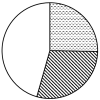
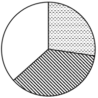

# 2025年江苏省公务员录用考试《行测》题（C类）（网友回忆版）

> 资料分析 · 20 题 · 江苏 2025

## 材料 1

        新中国成立75年来，从“造不了”到“造得出”再到“造得好”，中国制造实现跨越式增长。我国工业增加值从1952年的120亿元增加到2023年的39.9万亿元，500种主要工业产品中四成以上产品产量位居全球第一。

        1978年我国工业增加值为1621亿元，1992年突破1.0万亿元，2007年达10.7万亿元，2012年达20.9万亿元；2013-2023年工业增加值年均增长5.7%。2023年，我国原煤产量47.1亿吨，比1949年增长146倍；粗钢产量10.2亿吨，增长6449倍；水泥产量20.2亿吨，增长3064倍；平板玻璃产量9.7亿重量箱，增长897倍；化肥产量5714万吨，增长9522倍。2023年，我国汽车产量3011.3万辆，比上年增长9.3%，其中新能源汽车产量944.3万辆，增长30.3%；手机、微型计算机、彩色电视机、工业机器人产量分别为15.7亿台、3.3亿台、1.9亿台、43.0万套，均位居全球首位。

        2023年，我国工业增加值占GDP比重为31.7%，制造业增加值占GDP比重为26.2%。规模以上装备制造业增加值比上年增长6.8%，占规模以上工业增加值比重为33.6%，比2012年提高5.4个百分点；规模以上高技术制造业增加值增长2.7%，占规模以上工业增加值比重为15.7%，比2012年提高6.3个百分点。

### 第 1 题　qid 13319324 · 增长

2023年我国制造业增加值为：

- **A**. 27.4万亿元
- **B**. 30.1万亿元
- **C**. 33.0万亿元　✅
- **D**. 36.7万亿元

**答案**：C

**官方解析**

根据题干“2023年我国制造业增加值为”，结合材料时间为2023年，且材料只给出制造业增加值占GDP的比重，可判定本题为现期比重问题。定位文字材料第一段可知：我国工业增加值从1952年的120亿元增加到2023年的39.9万亿元；定位文字材料第三段可知：2023年，我国工业增加值占GDP比重为31.7%，制造业增加值占GDP比重为26.2%。根据公式：整体，则2023年我国GDP万亿元，故2023年我国制造业增加值万亿元。与C项最接近。

故正确答案为C。

---

### 第 2 题　qid 13319327 · 比重

2012年，我国规模以上装备制造业增加值占规模以上工业增加值的比重，与规模以上高技术制造业增加值占规模以上工业增加值的比重相差：

- **A**. 14.8个百分点
- **B**. 18.8个百分点　✅
- **C**. 19.2个百分点
- **D**. 19.8个百分点

**答案**：B

**官方解析**

根据题干“2012年······占······的比重，与······占······的比重相差”，结合材料时间为2023年，可判定本题为基期比重问题。定位文字材料第三段可知：2023年，我国规模以上装备制造业增加值比上年增长6.8%，占规模以上工业增加值比重为33.6%，比2012年提高5.4个百分点；规模以上高技术制造业增加值增长2.7%，占规模以上工业增加值比重为15.7%，比2012年提高6.3个百分点。则2012年，我国规模以上装备制造业增加值占规模以上工业增加值的比重为33.6%-5.4%=28.2%，规模以上高技术制造业增加值占规模以上工业增加值的比重为15.7%-6.3%=9.4%。故2012年二者比重相差28.2%-9.4%=18.8%，即18.8个百分点。
故正确答案为B。

---

### 第 3 题　qid 13319328 · 综合

2022年我国非新能源汽车产量为：

- **A**. 1854.2万辆
- **B**. 1891.1万辆
- **C**. 2030.4万辆　✅
- **D**. 2067.0万辆

**答案**：C

**官方解析**

根据题干“2022年我国非新能源汽车产量为”，结合材料给出2023年我国汽车产量和新能源汽车产量，可判定本题为基期和差问题。定位文字材料第二段可得：2023年，我国汽车产量3011.3万辆，比上年增长9.3%，其中新能源汽车产量944.3万辆，增长30.3%。根据公式：基期量，则题干所求万辆，与C项最接近。

故正确答案为C。

---

### 第 4 题　qid 13319329 · 增长

下列时间段中，我国工业增加值年均增量最大的是：

- **A**. 1979-1992年
- **B**. 1979-2007年
- **C**. 1979-2012年
- **D**. 1979-2023年　✅

**答案**：D

**官方解析**

根据题干“下列时间段中······年均增量最大的是”，可判定本题为年均增长量问题。定位文字材料第一、二段可得：我国工业增加值从1952年的120亿元增加到2023年的39.9万亿元；1978年我国工业增加值为1621亿元，1992年突破1.0万亿元，2007年达10.7万亿元，2012年达20.9万亿元。根据公式：年均增长量，可得选项各时间段我国工业增加值年均增长量分别为：1979-1992年年均增长量亿元；1979-2007年年均增长量亿元；1979-2012年年均增长量亿元；1979-2023年年均增长量亿元。比较可知，1979-2023年我国工业增加值年均增量最大。

故正确答案为D。

---

### 第 5 题　qid 13319330 · 综合

下列选项中，能够从上述资料推出的是：

- **A**. 1949年我国平板玻璃产量不足110万重量箱　✅
- **B**. 2018-2023年，我国工业增加值年均增长5.7%
- **C**. 2023年我国有近200种主要工业产品的产量位居全球第一
- **D**. 以1949年为基期，2023年我国工业产品产量增长最快的是水泥

**答案**：A

**官方解析**

A项：定位文字材料第二段可得，2023年，我国平板玻璃产量9.7亿重量箱，比1949年增长897倍。根据公式：基期量，可得1949年我国平板玻璃产量万&lt;110万重量箱，正确；

B项：定位文字材料第二段可得，2013-2023年我国工业增加值年均增长5.7%，未给出与2018年相关的数据，故无法推出2018-2023年我国工业增加值年均增长率，错误；

C项：定位文字材料第一段可得，我国工业增加值从1952年的120亿元增加到2023年的39.9万亿元，500种主要工业产品中四成以上产品产量位居全球第一。则2023年我国主要工业产品产量位居全球第一的种类多于500×40%=200种，错误；

D项：定位文字材料第二段可得，2023年，我国水泥产量20.2亿吨，比1949年增长3064倍；化肥产量5714万吨，比1949年增长9522倍。9522&gt;3064，故以1949年为基期，2023年我国化肥产量增长速度快于水泥，错误。

故正确答案为A。

---

## 材料 2

        2023年，M市接待过夜游客10190万人次，比上年增长88.1%。其中，核心片区接待过夜游客8326万人次，增长99.9%；东北片区接待过夜游客1125万人次，增长38.2%；东南片区接待过夜游客739万人次，增长70.1%。旅游及相关产业增加值占全市地区生产总值的比重为4.0%，比上年提高0.3个百分点。

### 第 6 题　qid 11226433 · 增长

2023年M市东南片区接待的过夜游客比上年多：

- **A**. 221万人次
- **B**. 305万人次　✅
- **C**. 434万人次
- **D**. 519万人次

**答案**：B

**官方解析**

根据“2023年······比上年多”，结合选项带单位，可判定本题为增长量计算问题。定位文字材料可得：2023年，M市东南片区接待过夜游客739万人次，增长70.1%。根据公式：增长量=，则所求万人次，与B项最接近。

故正确答案为B。

---

### 第 7 题　qid 11226435 · 增长

2023年M市东北片区接待过夜游客人次增长对全市接待过夜游客增长的贡献率为：

- **A**. 

　✅
- **B**. 

- **C**. 

- **D**. 

**答案**：A

**官方解析**

根据“2023年······对······增长的贡献率为”，可判定本题为现期比重问题。定位文字材料可得：2023年，M市接待过夜游客10190万人次，比上年增长88.1%。东北片区接待过夜游客1125万人次，增长38.2%。 根据公式：增长量，增长贡献率，则所求。

故正确答案为A。

---

### 第 8 题　qid 11226436 · 综合

2023年M市地区生产总值为：

- **A**. 14223亿元
- **B**. 15088亿元
- **C**. 24140亿元
- **D**. 30175亿元　✅

**答案**：D

**官方解析**

根据题干“2023年······总值为”，结合材料中给出了2023年M市旅游及相关产业增加值和其占全市地区生产总值的比重，可判定本题为现期比重问题。定位文字材料可得：2023年M市旅游及相关产业增加值占全市地区生产总值的比重为4.0%；定位统计表可得：2023年M市旅游及相关产业增加值为1207亿元。根据公式：整体，则所求亿元。

故正确答案为D。

---

### 第 9 题　qid 11226437 · 比重

2023年M市核心片区接待过夜游客人次占全市接待过夜游客人次的比重比上年提高的幅度：

- **A**. 超过8.2个百分点
- **B**. 介于7.3~8.2个百分点之间
- **C**. 介于4.5~7.3个百分点之间　✅
- **D**. 不足4.5个百分点

**答案**：C

**官方解析**

根据“2023年······占······比重比上年提高······”，可判定本题为两期比重问题。定位文字材料可得：2023年，M市接待过夜游客10190万人次（B），比上年增长88.1%（b）。其中，核心片区接待过夜游客8326万人次（A），增长99.9%（a）。根据公式：两期比重差，可得所求，即提高的幅度约为4.8个百分点，在C项范围内。

故正确答案为C。

---

### 第 10 题　qid 11226438 · 综合

下列选项中，不能从上述资料推出的是：

- **A**. 2022年M市旅游社国内旅游组织游客200多万人次
- **B**. 2023年M市A级景区接待的游客中有60%以上的游客在该市过夜　✅
- **C**. 2023年M市旅游及相关产业增加值增速快于该市地区生产总值的增速
- **D**. 2023年M市东北和东南片区接待过夜游客人次之和的增速不超过54.2%

**答案**：B

**官方解析**

A项：定位表格材料可得，2023年，M市旅游社国内旅游组织游客830万人次，比上年增长312.6%。根据公式：基期量，则所求万人次，正确；

B项：定位表格材料可得2023年M市A级景区接待游客人次。但材料并未给出A级景区接待过夜游客数量，无法推出其过夜游客占比，错误；

C项：定位文字材料可得，2023年，M市旅游及相关产业增加值占全市地区生产总值的比重比上年提高0.3个百分点。根据两期比重逆运用结论：当比重上升时，部分增长率&gt;整体增长率，则2023年M市旅游及相关产业增加值增速快于该市地区生产总值的增速，正确；

D项：定位文字材料可得，2023年，M市东北片区接待过夜游客1125万人次，增长38.2%；东南片区接待过夜游客739万人次，增长70.1%。根据混合增长率口诀“混合后居中，偏向基期较大的（一般用现期量代替基期量）”，2023年M市东北片区接待过夜游客人次（1125万人次）&gt;东南片区接待过夜游客人次（739万人次），则，正确。

本题为选非题，故正确答案为B。

---

## 材料 3

        2024年1-8月，我国国有及国有控股企业（以下简称国有企业）营业收入53.8万亿元，同比增长1.4%；利润总额2.9万亿元，下降2.1%；应缴税费3.9万亿元，增长0.7%。8月末，国有企业资产负债率64.9%，同比上升0.1个百分点。

### 第 11 题　qid 11226440 · 综合

2015-2023年，我国国有企业年末资产负债率的中位数是：

- **A**. 63.9%
- **B**. 64.0%
- **C**. 64.6%　✅
- **D**. 64.7%

**答案**：C

**官方解析**

定位表格材料可得：2015-2023年，我国国有企业年末资产负债率从大到小排序为：66.3%、66.1%、65.7%、64.7%、64.6%、64.4%、64.0%、63.9%、63.7%，共9个数据，则所求中位数为64.6%（第五位）。
故正确答案为C。

---

### 第 12 题　qid 11226442 · 增长

2016-2023年，我国国有企业营业收入、利润总额、应缴税费均增长的年份有：

- **A**. 2个
- **B**. 3个　✅
- **C**. 4个
- **D**. 5个

**答案**：B

**官方解析**

定位表格材料可知2015-2023年我国国有企业的营业收入、利润总额、应缴税费。观察发现，2016-2023年，我国国有企业营业收入每年均增长；利润总额增长的年份有2017年、2018年、2019年、2021年、2023年；应缴税费增长的年份有2017年、2018年、2021年、2022年。因此，2016-2023年，我国国有企业营业收入、利润总额、应缴税费均增长的年份有2017年、2018年、2021年，共3个。
故正确答案为B。

---

### 第 13 题　qid 11226443 · 综合

2016-2023年，我国国有企业营业收入利润率最高的年份是：

- **A**. 2017年
- **B**. 2018年
- **C**. 2019年
- **D**. 2021年　✅

**答案**：D

**官方解析**

据题干“2016-2023年······营业收入利润率最高的年份是”，结合营业收入利润率，可判定本题为现期比重问题。定位表格材料可得2015-2023年我国国有企业的营业收入和利润总额。则2017年、2018年、2019年、2021年我国国有企业营业收入利润率依次为：、、、，比较可知，2021年我国国有企业营业收入利润率最高。

故正确答案为D。

---

### 第 14 题　qid 11226447 · 增长

若2016-2023年我国国有企业营业收入、利润总额和应缴税费年均增速分别用、、表示，则下列关系正确的是：

- **A**. 

　✅
- **B**. 

- **C**. 

- **D**. 

**答案**：A

**官方解析**

根据题干“······年均增速······”，可判定本题为年均增长率问题。定位统计表可得2015年、2023年我国国有企业营业收入、利润总额和应缴税费。根据年均增长率公式：（n为年份差），当年份差相同时，直接比较即可。则2016-2023年我国国有企业营业收入、利润总额和应缴税费的分别为：营业收入，；利润总额，；应缴税费，。则年均增速的排序为应缴税费（）&lt;营业收入（）&lt;利润总额（）。

故正确答案为A。

---

### 第 15 题　qid 11226449 · 综合

下列选项中，能够根据上述资料算出的是：

- **A**. 2015年我国国有企业应缴税费增量
- **B**. 2024年8月末我国国有企业资产总额
- **C**. 2022年1-8月我国国有企业营业收入
- **D**. 2023年末与当年8月末我国国有企业资产负债率之差　✅

**答案**：D

**官方解析**

A项：定位表格材料可得，2015年我国国有企业应缴税费为3.9万亿元。材料中无其他数据，无法推出2015年我国国有企业应缴税费增量，错误；
B项：定位文字材料可得，2024年8月末，国有企业资产负债率64.9%。材料中无其他数据，无法推出2024年8月末我国国有企业资产总额，错误；
C项：定位文字材料可得，2024年1-8月，我国国有及国有控股企业（以下简称国有企业）营业收入53.8万亿元，同比增长1.4%。材料中无其他数据，无法推出2022年1-8月我国国有企业营业收入，错误；
D项：定位文字材料可得，2024年8月末，国有企业资产负债率64.9%，同比上升0.1个百分点；定位表格材料可得，2023年末我国国有企业资产负债率为64.6%。则2023年8月末我国国有企业资产负债率为64.9%-0.1%=64.8%，题干所求资产负债率之差=64.8%-64.6%=0.2%，即0.2个百分点，可以推出，正确。
故正确答案为D。

---

## 材料 4

        2023年我国机电产品进出口总额29025亿美元，比上年增长0.1%，占货物进出口总额的比重为49.0%。其中，出口19750亿美元，增长2.6%，占货物出口总额的比重为58.5%；进口9275亿美元，下降5.5%，占货物进口总额的比重为36.3%。

### 第 16 题　qid 13319349 · 综合

2023年我国货物进出口总额是：

- **A**. 5.3万亿美元
- **B**. 5.8万亿美元
- **C**. 5.9万亿美元　✅
- **D**. 6.0万亿美元

**答案**：C

**官方解析**

根据“2023年······总额是”，结合材料给出了2023年我国机电产品进出口总额及其占货物进出口总额的比重，可判定本题为现期比重问题。定位文字材料可得：2023年我国机电产品进出口总额29025亿美元，占货物进出口总额的比重为49.0%。根据公式：整体，则所求万亿美元。

故正确答案为C。

---

### 第 17 题　qid 13319351 · 增长

2023年我国柴油机出口数量比上年多：

- **A**. 5.02万台
- **B**. 5.35万台　✅
- **C**. 5.89万台
- **D**. 6.19万台

**答案**：B

**官方解析**

根据题干“2023年······数量比上年多”，结合选项带单位，可判定本题为增长量计算问题。定位统计表可得：2023年我国柴油机出口数量为58.9万台，同比增长10.0%。 根据公式：增长量，则所求万台。

故正确答案为B。

---

### 第 18 题　qid 13319352 · 比重

对于2023年我国柴油机、汽油机和其他内燃机出口额占内燃机出口总额比重的大小关系，下列图示正确的是：

- **A**. 

　✅
- **B**. 

- **C**. 

- **D**. 

**答案**：A

**官方解析**

根据题干“对于2023年······占······比重······”，结合材料时间为2023年，可判定本题为现期比重问题。定位统计表可得：2023年，我国内燃机出口总额为52.2亿美元，柴油机、汽油机和其他内燃机出口额分别为13.2亿美元、15.2亿美元、23.8亿美元。比较可知，其他内燃机出口额明显最大，排除B、C两项；根据公式：比重，则其他内燃机出口额占比，排除D项。

故正确答案为A。

---

### 第 19 题　qid 13319353 · 增长

2023年我国柴油机、汽油机的下列进出口指标值比上年高的是：

- **A**. 柴油机出口平均价格、汽油机进口平均价格
- **B**. 柴油机进口平均价格、汽油机出口平均价格
- **C**. 汽油机出口平均价格、汽油机进口平均价格
- **D**. 柴油机出口平均价格、柴油机进口平均价格　✅

**答案**：D

**官方解析**

根据题干“2023年······下列进出口指标值比上年高的是”，结合选项为“平均价格”，可判定本题为两期平均数比较问题。定位统计表可得：2023年，我国柴油机出口数量和出口金额同比增速分别为10.0%（）、18.9%（），进口数量和进口金额同比增速分别为7.3%（）、41.7%（）；汽油机出口数量和出口金额同比增速分别为6.3%（）、3.4%（），进口数量和进口金额同比增速分别为-28.2%（）、-28.5%（）。根据平均价格，结合两期平均数比较结论“分子增长率（a）&gt;分母增长率（b），平均数上升”，则满足题干要求的有柴油机出口平均价格（18.9%&gt;10.0%）、柴油机进口平均价格（41.7%&gt;7.3%）。

故正确答案为D。

---

### 第 20 题　qid 13319355 · 综合

下列选项中，不能从上述资料推出的是：

- **A**. 2023年我国内燃机零部件的进、出口差额比上年有所扩大
- **B**. 2023年我国柴油机进口平均价格比出口平均价格高10倍多　✅
- **C**. 2023年我国内燃机产品进口额占机电产品进口额的比重比上年有所提高
- **D**. 2023年我国发电机组和内燃机零部件出口额之和的增长率一定高于5.9%

**答案**：B

**官方解析**

A项，定位统计表可知，2023年我国内燃机零部件的进口额为37.5亿美元，同比增长-7.5%；出口额为118.3亿美元，同比增长6.7%。

方法一：可知2023年我国内燃机零部件的进、出口差额为（118.3-37.5）亿美元，根据公式：基期量，则2022年我国内燃机零部件的进、出口差额为亿美元，由于，，则亿美元&lt;（118.3-37.5）亿美元，即2023年我国内燃机零部件的进、出口差额比上年有所扩大，正确；

方法二：由于出口额-进口额=进、出口差额，则出口额=进口额+进、出口差额。根据混合增长率口诀：混合后居中，可知，即2023年我国内燃机零部件的进、出口差额同比增长率大于6.7%，一定比上年有所扩大，正确；

B项，定位统计表可知，2023年我国柴油机进口数量为5.7万台，进口额为13.4亿美元；出口数量为58.9万台，出口额为13.2亿美元。根据公式：平均价格，可知2023年我国柴油机进口平均价格为万美元/台；出口平均价格为万美元/台。根据公式：高几倍=多几倍=是几倍-1，可知所求为倍，即2023年我国柴油机进口平均价格比出口平均价格高9倍多，错误；

C项，定位文字材料可知，2023年我国机电产品进口额同比下降5.5%（b）；定位统计表可知，2023年我国内燃机产品进口额同比增长-1.4%（a）。根据两期比重比较结论：部分增长率a＞整体增长率b时，比重上升。由于-1.4%＞-5.5%，则2023年我国内燃机产品进口额占机电产品进口额的比重比上年有所提高，正确；

D项，定位统计表可知，2023年我国发电机组出口额为52.9亿美元，同比增长5.1%；内燃机零部件出口额为118.3亿美元，同比增长6.7%。根据混合增长率口诀：混合后居中，偏向基期量大的（一般用现期量代替），可知，即，则2023年我国发电机组和内燃机零部件出口额之和的增长率一定高于5.9%，正确。

本题为选非题，故正确答案为B。

---
