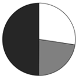
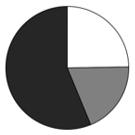
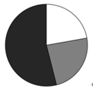

# 2025年河南省公务员录用考试《行测》题（网友回忆版）

> 资料分析 · 15 题 · 河南 2025

## 材料 1

### 第 1 题　qid 13504272 · 增长

2017-2023年间，数字经济核心产业全球发明专利授权量同比增速不到5%的年份有几个？

- **A**. 0
- **B**. 1　✅
- **C**. 2
- **D**. 3

**答案**：B

**官方解析**

根据题干“2017-2023年······同比增速不到5%的年份有几个”，可判定本题为一般增长率问题。定位统计图可得2016-2023年每年数字经济核心产业全球发明专利授权量。根据公式：增长率，则2017-2023年，每年数字经济核心产业全球发明专利授权量的同比增速分别为：

2017年：，不符合；

2018年：，符合；

2019年：，不符合；

2020年：，不符合；

2021年：，不符合；

2022年：，不符合；

2023年：，不符合。

综上，2017-2023年间，数字经济核心产业全球发明专利授权量同比增速不到5%的年份有2018年，共1个。

故正确答案为B。

---

### 第 2 题　qid 13504274 · 比重

2023年数字产品制造业全球发明专利授权量占该年全球发明专利授权量的比重约为：

- **A**. 51.2%
- **B**. 44.4%
- **C**. 31.6%
- **D**. 22.7%　✅

**答案**：D

**官方解析**

根据题干“2023年······占该年······的比重约为”，结合材料时间为2023年，可判定本题为现期比重问题。定位统计图可知：2023年数字经济核心产业全球发明专利授权量为88.79万件，占全球发明专利授权总量比重为44.4%；定位统计表可知：2023年数字产品制造业全球发明专利授权量为454221件。根据公式：比重，可得题干所求比重为，与D项最接近。

故正确答案为D。

---

### 第 3 题　qid 13504276 · 增长

如保持2023年同比增速不变，则2024年数字产品制造业全球发明专利授权量约是数字要素驱动业全球发明专利授权量的多少倍?

- **A**. 1.2
- **B**. 1.5　✅
- **C**. 1.9
- **D**. 2.4

**答案**：B

**官方解析**

根据题干“如保持2023年同比增速不变，则2024年······是······的多少倍”，结合材料时间为2023年，可判定本题为现期倍数问题。定位统计表可得：2023年数字产品制造业全球发明专利授权量为454221件，同比增速为5.6%；数字要素驱动业全球发明专利授权量为258489件，同比增速为21.5%。根据公式：现期量=基期量×（1+增长率），则题干所求倍，与B项最接近。

故正确答案为B。

---

### 第 4 题　qid 13504407 · 综合

2022年，数字要素驱动业全球发明专利授权量约比数字技术应用业全球发明专利授权量多多少万件？

- **A**. 21.7
- **B**. 19.5
- **C**. 8.4
- **D**. 6.1　✅

**答案**：D

**官方解析**

根据题干“2022年······比······多多少万件”，结合材料时间为2023年，可判定本题为基期和差问题。定位表格材料可得：2023年数字要素驱动业全球发明专利授权量为258489件，同比增长21.5%；数字技术应用业全球发明专利授权量为174852件，同比增长15.1%。根据公式：基期量，则所求为万件，与D项最接近。

故正确答案为D。

---

### 第 5 题　qid 13504277 · 增长

以下折线图反映了哪一时间段内，数字经济核心产业全球发明专利授权量同比增速的变化趋势？

- **A**. 2016-2018年
- **B**. 2017-2019年　✅
- **C**. 2018-2020年
- **D**. 2020-2022年

**答案**：B

**官方解析**

根据题干“······同比增速的变化趋势”，可判定本题为一般增长率问题。定位统计图可知2016-2022年数字经济核心产业全球发明专利授权量。由于材料未给出2015年相关数据，故2016年数字经济核心产业全球发明专利授权量同比增速无法计算，排除A项。根据公式：，则2017-2022年数字经济核心产业全球发明专利授权量同比增速分别为：

2017年：；

2018年：；

2019年：；

2020年：；

2021年：；

2022年：。

观察发现，折线图先下降再上升，且第3个点高于第1个点，只有2017-2019年满足该变化趋势。

故正确答案为B。

---

## 材料 2

        2024年1-6月，T市出口自行车占同期全国自行车出口比重为33.6%，位居全国首位。其中，民营企业出口414.9万辆，同比增加27.8%；国有企业出口351.8万辆，同比增加6.9%；其他企业出口11.6万辆。对东盟、日本分别出口213.4万辆、176.6万辆，同比分别增加4.9%、5.3%；对美国出口115.3万辆，同比增加10.1%。

### 第 6 题　qid 13504302 · 综合

2024年1-6月，我国自行车出口量在以下哪个范围内？

- **A**. 不到0.18亿辆
- **B**. 0.18-0.20亿辆
- **C**. 0.20-0.22亿辆
- **D**. 0.22亿辆以上　✅

**答案**：D

**官方解析**

根据题干“2024年1-6月，我国自行车出口量在以下哪个范围内”，结合材料给出2024年1-6月T市自行车出口相关数据及占同期全国自行车出口比重，可判定本题为现期比重问题。定位文字材料可得：2024年1-6月，T市出口自行车占同期全国自行车出口比重为33.6%。定位统计表可得，2024年1-6月，T市自行车出口量778.3万辆。根据公式：整体，则2024年1-6月我国自行车出口量万辆亿辆，在D项范围内。

故正确答案为D。

---

### 第 7 题　qid 13504303 · 综合

2024年1-6月T市国有企业自行车出口增量约占同期T市自行车出口增量的：

- **A**. 58%
- **B**. 46%
- **C**. 32%
- **D**. 24%　✅

**答案**：D

**官方解析**

根据题干“2024年1-6月······占······”，结合材料时间为2024年1-6月，可判定本题为现期比重问题。定位文字材料可得：2024年1-6月，T市国有企业自行车出口351.8万辆，同比增加6.9%。定位统计表可得：2024年1-6月，T市自行车出口778.3万辆，同比增长14.0%。根据公式：增长量，比重，可得2024年1-6月T市国有企业自行车出口增量为万辆；T市自行车出口增量为万辆。则所求为，与D项最接近。

故正确答案为D。

---

### 第 8 题　qid 13504410 · 增长

2024年1~6月T市民营企业自行车出口量占同期T市自行车出口总量比上年同期约：

- **A**. 提升了5.8个百分点　✅
- **B**. 下降了5.8个百分点
- **C**. 提升了9.6个百分点
- **D**. 下降了9.6个百分点

**答案**：A

**官方解析**

根据题干“2024年1~6月······占······总量比上年同期约”，结合选项为提升了/下降了+百分点，可判定本题为两期比重问题。定位文字材料可得：2024年1-6月，T市民营企业自行车出口量为414.9万辆（A），同比增加27.8%（a）。定位表格材料可得：2024年1-6月，T市自行车出口总量为778.3万辆（B），同比增长14.0%（b）。根据公式：两期比重差，则所求比重差为，即提升了约5.74个百分点，与A项最接近。

故正确答案为A。

---

### 第 9 题　qid 13504304 · 比重

以下饼图中，最能准确反映2024年1-6月T市对东盟（白色）、日本（灰色）和其他国家（黑色）出口量比例关系的是：

- **A**. 

　✅
- **B**. 

- **C**. 

- **D**. 

**答案**：A

**官方解析**

根据题干“以下饼图中，最能准确反映2024年1-6月······比例关系的是”，结合材料时间为2024年1-6月，可判定本题为现期比重问题。定位文字材料可得：2024年1-6月，T市对东盟、日本分别出口自行车213.4万辆、176.6万辆。则对东盟出口量（213.4万辆）&gt;对日本出口量（176.6万辆），排除C、D两项。定位统计表可得：2024年1-6月，T市自行车出口量为778.3万辆。可得T市对东盟和日本出口量之和所占的比重为，排除B项，A项当选。

故正确答案为A。

---

### 第 10 题　qid 13504305 · 增长

2024年1-6月，T市自行车出口均价同比下降的月份有几个？

- **A**. 3
- **B**. 4
- **C**. 5　✅
- **D**. 6

**答案**：C

**官方解析**

根据题干“2024年1-6月······出口均价同比下降的月份有几个”，结合公式：出口均价，可判定本题为两期平均数比较问题。定位统计表可得2024年1-6月T市自行车出口金额、出口数量及同比增长率。根据两期平均数比较结论，当分子增长率（a）&lt;分母增长率（b）时，平均数下降。观察表格，满足a&lt;b的有：1月（24.9%&lt;34.7%），3月（-5.5%&lt;-0.4%），4月（3.1%&lt;9.6%），5月（-5.0%&lt;9.8%），6月（2.9%&lt;9.5%），共5个月份。

故正确答案为C。

---

## 材料 3

### 第 11 题　qid 13504292 · 增长

2015-2023年，全球新增光伏装机规模同比增速超过20%的年份有几个？

- **A**. 4
- **B**. 5
- **C**. 6　✅
- **D**. 7

**答案**：C

**官方解析**

根据题干“2015-2023年······同比增速······”，可判定本题为一般增长率问题。定位统计表可知2014-2023年全球新增光伏装机规模。根据公式：一般增长率，则2015-2023年全球新增光伏装机规模的同比增速分别为：

2015年，；

2016年，；

2017年，；

2018年，；

2019年，；

2020年，；

2021年，；

2022年，；

2023年，。

综上，同比增速超过20%的年份有2015年、2016年、2017年、2021年、2022年、2023年，共6个。

故正确答案为C。

---

### 第 12 题　qid 13504293 · 比重

2023年，中国新增光伏装机规模占全球的比重比2019年增加了：

- **A**. 不到15个百分点
- **B**. 15-20个百分点之间
- **C**. 20-25个百分点之间
- **D**. 25个百分点以上　✅

**答案**：D

**官方解析**

根据题干“2023年······占······的比重比2019年增加了”，可判定本题为两期比重问题。定位统计表可得：2019年、2023年中国新增光伏装机规模分别为30.1GW、216.9GW，全球新增光伏装机规模分别为115.0GW、408.7GW。根据公式：比重，则所求为，即增加了25个百分点以上，在D项范围内。

故正确答案为D。

---

### 第 13 题　qid 13504296 · 比重

2014-2023年间东南亚新增光伏装机规模最高的一年，当年其新增光伏装机规模占全球的比重比欧洲低：

- **A**. 不到7个百分点　✅
- **B**. 7-11个百分点之间
- **C**. 11-15个百分点之间
- **D**. 15个百分点以上

**答案**：A

**官方解析**

根据题干“2014-2023年间······占······的比重比······低”，结合材料时间为2014-2023年，可判定本题为现期比重问题。定位统计表可知2014-2023年间东南亚新增光伏装机规模，进而可得2014-2023年间，2020年东南亚新增光伏装机规模最高（15.0GW）。定位统计表可知：2020年，全球新增光伏装机规模为137.0GW，欧洲为22.5GW。根据公式：比重，则所求为，即约低5个百分点，则2020年东南亚新增光伏装机规模占全球的比重比欧洲低不到7个百分点。

故正确答案为A。

---

### 第 14 题　qid 13504295 · 增长

以下国家和地区中，2014-2023年新增光伏装机规模平均增速（以2014年为基准）最快的是：

- **A**. 欧洲
- **B**. 美国
- **C**. 拉美
- **D**. 中东及北非　✅

**答案**：D

**官方解析**

根据题干“······2014-2023年······平均增速（以2014年为基准）最快的是”，可判定本题为年均增长率问题。定位统计表可得：2014年欧洲、美国、拉美、中东及北非新增光伏装机规模分别为7.2GW、6.7GW、0.5GW、0.3GW；2023年欧洲、美国、拉美、中东及北非新增光伏装机规模分别为61.2GW、31.1GW、25.4GW、18.2GW。根据年均增长率公式：，年份差n相同，比较年均增速只需比较的大小。欧洲：；美国：；拉美：；中东及北非：，比较可得2014-2023年新增光伏装机规模平均增速最快的是中东及北非。

故正确答案为D。

---

### 第 15 题　qid 13504514 · 增长

以下柱状图反映了哪一时间段内，中国新增光伏装机规模同比增量的变化趋势（横轴位置代表增量为0）？

- **A**. 2015-2018年
- **B**. 2017-2020年
- **C**. 2018-2021年
- **D**. 2019-2022年　✅

**答案**：D

**官方解析**

根据题干“······同比增量的变化趋势······”，可判定本题为增长量比较问题。定位统计表可得2014-2022年中国新增光伏装机规模。根据公式：增长量=现期量-基期量，可得选项中各指标同比增量如下：
A项，2015年，15.1-10.6=4.5GW，同比增量＞0，而柱状图（横轴位置代表增量为0）中第一年的同比增量＜0，不符合柱状图变化趋势，排除；
B项，2017年，53.1-34.5=18.6GW，同比增量＞0，而柱状图（横轴位置代表增量为0）中第一年的同比增量＜0，不符合柱状图变化趋势，排除；
C项，2018年，44.3-53.1=-8.8 GW；2019年，30.1-44.3=-14.2GW，同比增量＜0，而柱状图（横轴位置代表增量为0）中第二年的同比增量＞0，不符合柱状图变化趋势，排除；
D项,2019年，30.1-44.3=-14.2GW；2020年，48.2-30.1=18.1GW；2021年，54.9-48.2=6.7GW；2022年，87.4-54.9=32.5GW。符合柱状图变化趋势，当选。
故正确答案为D。

---
