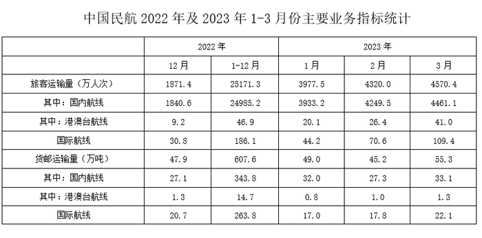
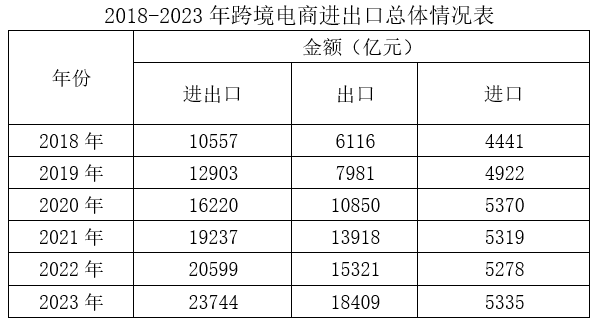
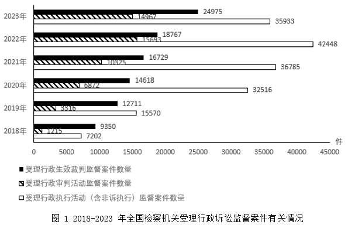
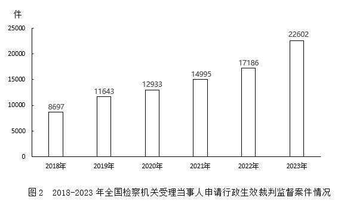

# 2025年浙江省公务员录用考试《行测》题（C类）（网友回忆版）

> 资料分析 · 15 题 · 浙江 2025

## 材料 1

        2023年一季度，我国民航、公路、铁路、水路旅客运输量分别为1.29亿人次、9.79亿人次、7.53亿人次和0.51亿人次，同比分别增长68.9%，1.0%，66.0%和93.3%。

### 第 1 题　qid 10297369 · 增长

将我国民航、公路、铁路和水路四种运输方式按2023年一季度旅客运输量同比增量从高到低排序，正确的是：

- **A**. 铁路、民航、水路、公路　✅
- **B**. 民航、公路、铁路、水路
- **C**. 公路、水路、民航、铁路
- **D**. 水路、铁路、公路、民航

**答案**：A

**官方解析**

根据题干“······2023年一季度旅客运输量同比增量从高到低排序······”，可判定本题为增长量比较问题。定位文字材料可得：2023年一季度，我国民航、公路、铁路、水路旅客运输量分别为1.29亿人次、9.79亿人次、7.53亿人次和0.51亿人次，同比分别增长68.9%，1.0%，66.0%和93.3%。根据公式：增长量，则四种运输方式2023年一季度旅客运输量同比增量分别为：民航：亿人次；公路：亿人次；铁路：亿人次；水路：亿人次，比较可知，同比增量从高到低排序正确的是铁路、民航、水路、公路。

故正确答案为A。

---

### 第 2 题　qid 10297324 · 综合

2023年3月，我国民航旅客运输量约是上年月均水平的多少倍？

- **A**. 1.4
- **B**. 1.8
- **C**. 2.2　✅
- **D**. 2.6

**答案**：C

**官方解析**

根据题干“2023年3月······约是上年月均水平的多少倍”，可判定本题为现期倍数问题。定位表格材料可得：2023年3月和2022年1-12月，我国民航旅客运输量分别为4570.4万人次、25171.3万人次。则所求倍数倍。

故正确答案为C。

---

### 第 3 题　qid 10297361 · 增长

在①国内航线、②港澳台航线和③国际航线中，2023年3月旅客运输量环比增速快于上月的有几个？

- **A**. 0
- **B**. 1　✅
- **C**. 2
- **D**. 3

**答案**：B

**官方解析**

根据“2023年3月······环比增速······”，可判定本题为一般增长率问题。定位统计表可知2023年1-3月①国内航线、②港澳台航线和③国际航线的旅客运输量。代入公式：增长率，则2023年3月①国内航线、②港澳台航线和③国际航线的旅客运输量的环比增长率分别为：

①国内航线：；

②港澳台航线：；

③国际航线：。

2023年2月①国内航线、②港澳台航线和③国际航线的旅客运输量的环比增长率分别为：

①国内航线：；

②港澳台航线：；

③国际航线：。

比较可知，5%＜8%、、55%＜60%，仅②港澳台航线2023年3月旅客运输量环比增速快于上月，故所求答案为1个。

故正确答案为B。

---

### 第 4 题　qid 10297331 · 比重

2023年1月，国内航线货邮运输量占我国民航货邮运输量的比重比上月：

- **A**. 低不到5个百分点
- **B**. 低5个百分点以上
- **C**. 高不到5个百分点
- **D**. 高5个百分点以上　✅

**答案**：D

**官方解析**

根据题干“2023年1月······占······的比重比上月”，可判定本题为两期比重问题。定位表格材料可得：2023年1月和2022年12月的国内航线货邮运输量分别为32.0万吨和27.1万吨，2023年1月和2022年12月的民航货邮运输量分别为49.0万吨和47.9万吨。根据公式：比重，则2023年1月，国内航线货邮运输量占我国民航货邮运输量的比重与2022年12月的差为，即约高8.7个百分点，在D项范围内。

故正确答案为D。

---

### 第 5 题　qid 10297339 · 综合

以下柱状图中，最能准确反映2023年1-3月我国民航港澳台航线货邮运输量环比增量变化趋势的是（横轴位置代表增量为0）：

- **A**. 

- **B**. 

　✅
- **C**. 

- **D**. 

**答案**：B

**官方解析**

根据题干“······环比增量变化趋势的是······”，可判定本题为增长量比较问题。定位表格材料可得：2022年12月我国民航港澳台航线货邮运输量为1.3万吨，2023年1-3月分别为0.8万吨、1.0万吨、1.3万吨。根据公式：增长量=现期量-基期量，则2023年1月环比增量=0.8-1.3=-0.5万吨、2023年2月环比增量=1.0-0.8=0.2万吨、2023年3月环比增量=1.3-1.0=0.3万吨。可知2023年1-3月我国民航港澳台航线货邮运输量环比增量逐渐上升，且只有2023年1月环比增量为负数，排除A、C两项；结合数值大小，，只有B项符合趋势。

故正确答案为B。

---

## 材料 2

        2023年，我国跨境电商进出口2.37万亿元人民币，比2022年（下同）增长15.3%，占同期我国货物贸易进出口总值的5.7%，比重提升0.8个百分点。其中，出口约1.84万亿元，增长20.2%，占同期我国出口总值的7.7%，进口约5335.2亿元，增长1.1%，占同期我国进口总值的3%。

        从出口目的地看，美国（37.4%）、英国（8.7%）、德国（4.7%）、俄罗斯（4.6%）、法国（3.7%），合计占出口总额近6成；泰国（2.5%）、越南（2.4%）、马来西亚（2.4%）、澳大利亚（2.1%）等新兴市场活跃。美国（15.6%）、日本（13.5%）、澳大利亚（11.2%）、法国（7.9%）、韩国（7.2%）、新西兰（7%）、德国（6.4%）、意大利（3.6%）、英国（3.4%）、荷兰（3.3%）是主要进口来源地。

### 第 6 题　qid 10297328 · 综合

2023年，我国货物贸易顺差在：

- **A**. 3万亿元以内
- **B**. 3-5万亿元
- **C**. 5-7万亿元　✅
- **D**. 7万亿元以上

**答案**：C

**官方解析**

根据题干“2023年，我国货物贸易顺差在”，结合材料“2023年······出口······占同期我国出口总值的······，进口······占同期我国进口总值的······”，可判定本题为现期比重问题。定位文字材料第一段可得：（2023年）出口约1.84万亿元，占同期我国出口总值的7.7%，进口约5335.2亿元，占同期我国进口总值的3%。根据公式：整体，顺差=出口额-进口额，则所求，在C项范围内。

故正确答案为C。

---

### 第 7 题　qid 10297330 · 比重

2023年，跨境电商进出口贸易中，我国与美国的进出口总额占比在以下哪个范围？

- **A**. 20%-25%
- **B**. 25%-30%
- **C**. 30%-35%　✅
- **D**. 35%-40%

**答案**：C

**官方解析**

根据题干“2023年······占比在以下哪个范围”，结合材料时间为2023年，可判定本题为现期比重问题。定位文字材料第一、二段可得：2023年，我国跨境电商进出口2.37万亿元人民币。其中，出口约1.84万亿元，进口约5335.2亿元。从出口目的地看，美国（37.4%）······合计占出口总额近6成；美国（15.6%）······是主要进口来源地。根据公式：部分=比重×整体，比重，则所求比重，在C项范围内。

故正确答案为C。

---

### 第 8 题　qid 10297321 · 增长

在以下年份中，我国跨境电商进出口额增速最快的是：

- **A**. 2019年
- **B**. 2020年　✅
- **C**. 2021年
- **D**. 2023年

**答案**：B

**官方解析**

根据题干“······进出口额增速最快······”，可判定本题为一般增长率问题。定位表格材料可知2018-2023年各年份我国跨境电商进出口额。根据公式：，可得：

2019年同比增长率；

2020年同比增长率；

2021年同比增长率；

2023年同比增长率。

综上，我国跨境电商进出口额增速最快的是2020年。

故正确答案为B。

---

### 第 9 题　qid 10297332 · 综合

2023年，在跨境电商进出口贸易中，我国与下列哪个国家出现贸易逆差？

- **A**. 德国
- **B**. 法国
- **C**. 英国
- **D**. 澳大利亚　✅

**答案**：D

**官方解析**

根据题干“出现贸易逆差”，且材料中给出2023年我国跨境电商出口额、进口额及我国跨境电商对德国、法国、英国、澳大利亚出口额、进口额的占比，可判定本题为现期比重问题。定位表格可得：2023年我国跨境电商出口金额为18409亿元，进口金额为5335亿元，定位文字材料第二段可得：我国跨境电商对德国、法国、英国、澳大利亚出口额占比分别为4.7%、3.7%、8.7%、2.1%，进口额占比分别为6.4%、7.9%、3.4%、11.2%。根据公式：部分=比重×占比，贸易逆差=进口额-出口额，可得2023年我国跨境电商与下列国家贸易状况为：

德国：，为贸易顺差；

法国：，为贸易顺差；

英国：，为贸易顺差；

澳大利亚：，为贸易逆差。

故正确答案为D。

---

### 第 10 题　qid 10297333 · 综合

根据以上资料，不能推出的是：

- **A**. 2019-2023年，我国跨境电商进口额同比增速逐年下降　✅
- **B**. 2018-2023年，我国跨境电商出口与进口额的差距逐年扩大
- **C**. 2018-2023年间，我国跨境电商出口额年均增长超过2400亿元
- **D**. 2022年，我国跨境电商进出口贸易在货物贸易进出口总值中占比低于5%

**答案**：A

**官方解析**

A项：定位表格材料可得，2021-2023年，我国跨境电商进口额分别为5319亿元、5278亿元、5335亿元，根据公式：，可得2022年我国跨境电商进口额同比增速，2023年我国跨境电商进口额同比增速，故2019-2023年我国跨境电商进口额同比增速并非逐年下降，错误；

B项：定位表格材料可得，2018-2023年，我国跨境电商出口额与进口额，则出口额与进口额的差距为：

2018年：6116-4441=1675亿元；

2019年：7981-4922=3059亿元；

2020年：10850-5370=5480亿元；

2021年：13918-5319=8599亿元；

2022年：15321-5278=10043亿元；

2023年：18409-5335=13074亿元，差距逐年扩大，正确；

C项：定位表格材料可得，2018年、2023年我国跨境电商出口额分别为6116亿元、18409亿元，根据公式：年均增长量，可得2018-2023年，我国跨境电商出口额年均增长量亿元，正确；

D项：定位文字材料第一段可得，“2023年，我国跨境电商进出口2.37万亿元人民币······占同期我国货物贸易进出口总值的5.7%，比重提升0.8个百分点。”则2022年，我国跨境电商进出口贸易在货物贸易进出口总值中占比=5.7%-0.8%=4.9%&lt;5%，正确。

本题为选非题，故正确答案为A。

---

## 材料 3

        2023年，全国检察机关共受理行政诉讼监督案件79209件。

### 第 11 题　qid 10297255 · 比重

2023年，全国检察机关受理行政诉讼监督案件中，行政生效裁判监督案件、行政审判活动监督案件、行政执行活动（含非诉执行）监督案件数量之和占比在以下哪个范围内？

- **A**. 不到90%
- **B**. 90%-92%
- **C**. 92%-94%
- **D**. 94%以上　✅

**答案**：D

**官方解析**

根据题干“2023年······占比······”，结合材料给出2023年的相关数据，可判定本题为现期比重问题。定位文字材料可得：2023年全国检察机关共受理行政诉讼监督案件79209件；定位图1可得：2023年全国检察机关受理行政诉讼监督案件中，行政生效裁判监督案件、行政审判活动监督案件、行政执行活动（含非诉执行）监督案件数量分别为24975件、14967件、35933件。根据公式：比重，可得题干所求，在D项范围内。

故正确答案为D。

---

### 第 12 题　qid 10297256 · 综合

2018-2023年，全国检察机关受理图1中三类案件数量之和超过7万件的年份有几个？

- **A**. 1
- **B**. 2　✅
- **C**. 3
- **D**. 4

**答案**：B

**官方解析**

定位统计图1可知2018-2023年全国检察机关受理三类案件的数量，则2018年-2023年全国检察机关受理三类案件数量之和分别为：

2018年：件&lt;7万件；

2019年：&lt;7万件；

2020年：件&lt;7万件；

2021年：件&lt;7万件；

2022年：件&gt;7万件；

2023年：件&gt;7万件。

综上所述，三类案件数量之和超过7万件的年份有2022年、2023年，共2年。

故正确答案为B。

---

### 第 13 题　qid 10297257 · 综合

2018-2023年全国检察机关受理行政生效裁判监督案件数量最多的年份，当年受理行政执行活动（含非诉执行）监督案件数量在这6年中从多到少排名：

- **A**. 第一
- **B**. 第二
- **C**. 第三　✅
- **D**. 第四

**答案**：C

**官方解析**

定位图1可知：2018-2023年全国检察机关受理行政生效裁判监督案件数量分别为9350件、12711件、14618件、16729件、18767件、24975件，其中2023年（24975件）最多。定位图1可知：2018-2023年全国检察机关受理行政执行活动（含非诉执行）监督案件数量分别为7202件、15570件、32516件、36785件、42448件、35933件，其中2023年受理行政执行活动（含非诉执行）监督案件数量（35933件）在这6年中从多到少排名第三。
故正确答案为C。

---

### 第 14 题　qid 10297258 · 综合

2018-2023年间，全国检察机关受理当事人申请行政生效裁判监督案件数量年均增量约为多少件？

- **A**. 2500
- **B**. 2600
- **C**. 2700
- **D**. 2800　✅

**答案**：D

**官方解析**

根据题干“······年均增量约为多少件”，可判定本题为年均增长量问题。定位图形材料2可得：2018年和2023年全国检察机关受理当事人申请行政生效裁判监督案件数量分别为8697件和22602件。故2018-2023年间，全国检察机关受理当事人申请行政生效裁判监督案件数量年均增量件。

故正确答案为D。

---

### 第 15 题　qid 10297259 · 比重

2023年，全国检察机关受理行政生效裁判监督案件中，非当事人申请案件数量占比较2018年：

- **A**. 高1个百分点以上　✅
- **B**. 高不到1个百分点
- **C**. 低不到1个百分点
- **D**. 低1个百分点以上

**答案**：A

**官方解析**

根据题干“2023年······占比较2018年”，结合选项为“高/低+百分点”，可判定本题为两期比重问题。定位图1和图2可得，2023年行政生效裁判监督案件数量为24975件，当事人申请案件为22602件，2018年行政生效裁判监督案件数量为9350件，当事人申请案件为8697件。则2023年非当事人申请案件数量为24975-22602=2373件，2018年非当事人申请案件数量为9350-8697=653件。根据公式：两期比重差=现期比重-基期比重，可列式，即高1个百分点以上。

故正确答案为A。

---
