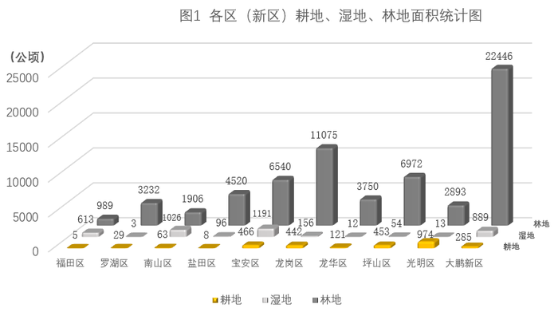
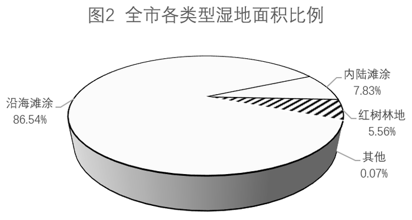
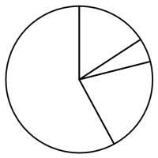
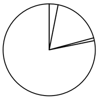
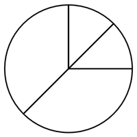
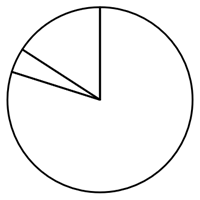
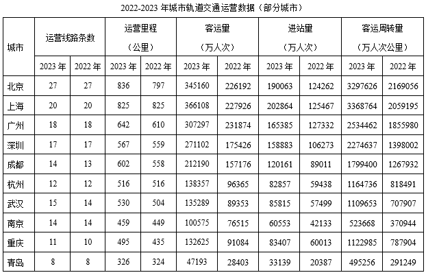

# 2025年深圳市考公务员录用考试《行测》试题（网友回忆版）

> 资料分析 · 15 题 · 深圳市考 2025

## 材料 1

        2023年，全国新增发电装机容量3.7亿千瓦，同比多投产1.7亿千瓦。其中，新增并网太阳能发电装机容量2.2亿千瓦，同比多投产1.3亿千瓦，占新增发电装机总容量的比重达到58.5%。截至2023年底，全国全口径发电装机容量29.2亿千瓦，其中，非化石能源发电装机容量15.7亿千瓦，占总装机容量比重在2023年首次突破50%，达到53.9%。分类型看，水电4.2亿千瓦，其中抽水蓄能5094万千瓦；核电5691万千瓦；并网风电4.4亿千瓦，其中，陆上风电4.0亿千瓦、海上风电3729万千瓦；并网太阳能发电6.1亿千瓦。全国并网风电和太阳能发电合计装机规模从2022年底的7.6亿千瓦，连续突破8亿千瓦、9亿千瓦、10亿千瓦大关，2023年底达到10.5亿千瓦，同比增长38.6%，火电13.9亿千瓦，其中，煤电11.6亿千瓦，同比增长3.4%，占总发电装机容量的比重为39.9%，首次降至40%以下。2023年，全国6000千瓦及以上电厂发电设备利用小时3592小时，同比降低101小时。分类型看，水电3133小时，同比降低285小时，其中，常规水电3423小时，同比降低278小时；抽水蓄能1175小时，同比降低6小时。火电4466小时，同比提高76小时；其中，煤电4685小时，同比提高92小时。核电7670小时，同比提高54小时。并网风电2225小时，同比提高7小时。并网太阳能发电1286小时，同比降低54小时。2023年，全国各电力交易中心累计组织完成市场交易电量5.67万亿千瓦时，同比增长7.9%，占全社会用电量比重为61.4%，同比提高0.6个百分点。其中，全国电力市场中长期电力直接交易电量合计为44288.9亿千瓦时，同比增长7%。

### 第 1 题　qid 13432269 · 增长

根据上文推算，2023年全国非化石能源发电装机容量同比新增超过（    ）亿千瓦。

- **A**. 2.95　✅
- **B**. 3.05
- **C**. 3.25
- **D**. 3.55

**答案**：A

**官方解析**

根据题干“根据上文推算，2023年······同比新增超过······亿千瓦”，可判定本题为增长量计算问题。定位文字材料可得：2023年，全国新增发电装机容量3.7亿千瓦；截至2023年底，全国全口径发电装机容量29.2亿千瓦，其中，非化石能源发电装机容量15.7亿千瓦，占总装机容量比重在2023年首次突破50%，达到53.9%。可推出2022年全国非化石能源发电装机容量占总装机容量比重没有突破50%，即最多为50%，根据公式：基期量=现期量-增长量，则2022年全国全口径发电装机容量为29.2-3.7=25.5亿千瓦，根据公式：部分=整体×比重，则2022年全国非化石能源发电装机容量最多为25.5×50%=12.75亿千瓦。根据公式：增长量=现期量-基期量，则2023年全国非化石能源发电装机容量同比增长量最少为15.7-12.75=2.95亿千瓦，即同比新增超过2.95亿千瓦。
故正确答案为A。

---

### 第 2 题　qid 13432338 · 比重

2022年，全国并网风电和太阳能发电合计装机容量占总装机容量的比重为（    ）。

- **A**. 23.1%
- **B**. 29.7%　✅
- **C**. 36.0%
- **D**. 42.4%

**答案**：B

**官方解析**

根据题干“2022年······占······比重为”，结合材料时间为2023年，可判定本题为基期比重问题。定位文字材料可得：2023年，全国新增发电装机容量3.7亿千瓦······截至2023年底，全国全口径发电装机容量29.2亿千瓦······全国并网风电和太阳能发电合计装机规模2022年底为7.6亿千瓦。根据公式：比重、基期量=现期量-增长量，可得所求，与B项最接近。

故正确答案为B。

---

### 第 3 题　qid 13432341 · 增长

2023年，下列全国6000千瓦及以上电厂发电设备类型，其利用小时数同比降幅最大的是（    ）。

- **A**. 水电　✅
- **B**. 常规水电
- **C**. 抽水蓄能
- **D**. 并网太阳能发电

**答案**：A

**官方解析**

根据题干“2023年······同比降幅最大的是”，可判定本题为一般增长率问题。定位文字材料可得：2023年，全国6000千瓦及以上电厂发电设备各类型利用小时数分别为水电3133小时，同比降低285小时；常规水电3423小时，同比降低278小时；抽水蓄能1175小时，同比降低6小时；并网太阳能发电1286小时，同比降低54小时。根据公式：，则2023年，全国6000千瓦及以上电厂发电设备各类型利用小时数同比降幅分别为：

水电，；

常规水电，；

抽水蓄能，；

并网太阳能发电，。

比较可知，水电利用小时数同比降幅最大。

故正确答案为A。

---

### 第 4 题　qid 13432344 · 增长

2023年，全社会用电量同比（    ）。

- **A**. 减少1万亿千瓦时以上
- **B**. 减少不到1万亿千瓦时
- **C**. 增长不到1万亿千瓦时　✅
- **D**. 增长1万亿千瓦时以上

**答案**：C

**官方解析**

根据题干“2023年······同比”，结合选项为减少/增长+具体单位，可判定本题为增长量计算问题。定位文字材料可知：2023年，全国各电力交易中心累计组织完成市场交易电量5.67万亿千瓦时，同比增长7.9%，占全社会用电量比重为61.4%，同比提高0.6个百分点。根据公式：基期量，可得2022年全国各电力交易中心累计组织完成市场交易电量万亿千瓦时。根据公式：整体，可得2023年全社会用电量万亿千瓦时，2022年全社会用电量万亿千瓦时。根据公式：增长量=现期量-基期量，可得2023年全社会用电量同比增长量=9.23-8.63=0.6万亿千瓦时，即增长不到1万亿千瓦时。

故正确答案为C。

---

### 第 5 题　qid 13432351 · 综合

根据材料，下列说法不正确的是（    ）。

- **A**. 2022年，新增并网太阳能发电装机容量对新增发电装机总容量的贡献率超过40%
- **B**. 2023年，抽水蓄能装机容量占水电装机容量的比重超过12.5%　✅
- **C**. 2023年，全国6000千瓦及以上电厂发电设备中火电设备利用小时数同比增长不足2%
- **D**. 2023年，全国电力市场中长期电力直接交易电量占市场交易电量的比重较上年比有所下降

**答案**：B

**官方解析**

A项：定位文字材料可得，2023年，全国新增发电装机容量3.7亿千瓦，同比多投产1.7亿千瓦。其中，新增并网太阳能发电装机容量2.2亿千瓦，同比多投产1.3亿千瓦。根据公式：基期量=现期量-增长量、贡献率，则所求，正确；

B项：定位文字材料可得，（2023年）水电（装机容量）4.2亿千瓦，其中抽水蓄能5094万千瓦。根据公式：比重，则所求，错误；

C项：定位文字材料可得，2023年，全国6000千瓦及以上电厂发电设备利用小时······分类型看，火电4466小时，同比提高76小时。根据公式：增长率，则所求，正确；

D项：定位文字材料可得，2023年，全国各电力交易中心累计组织完成市场交易电量同比增长7.9%（b）。其中，全国电力市场中长期电力直接交易电量同比增长7%（a）。根据两期比重比较结论：当部分增长率（a）＜整体增长率（b）时，比重下降。7%（a）＜7.9%（b），故比重较上年比有所下降，正确。

本题为选非题，故正确答案为B。

---

## 材料 2

### 第 6 题　qid 13432270 · 综合

材料各区（新区）中，湿地面积和耕地面积相差最大的是（    ），相差最小的是（    ）。

- **A**. 光明区、罗湖区
- **B**. 光明区、盐田区
- **C**. 南山区、罗湖区　✅
- **D**. 南山区、盐田区

**答案**：C

**官方解析**

定位图1可知各区（新区）湿地面积和耕地面积。则光明区湿地面积和耕地面积相差974-13=961公顷，南山区湿地面积和耕地面积相差1026-63=963公顷，南山区湿地面积和耕地面积相差更大，排除A、B两项；罗湖区湿地面积和耕地面积相差29-3=26公顷，盐田区湿地面积和耕地面积相差96-8=88公顷，罗湖区湿地面积和耕地面积相差更小，排除D项，C项当选。
故正确答案为C。

---

### 第 7 题　qid 13432290 · 综合

深圳市湿地面积与耕地面积之比接近于（    ）。

- **A**. 8：5
- **B**. 8：7
- **C**. 10：5
- **D**. 10：7　✅

**答案**：D

**官方解析**

根据题干“深圳市······与······之比接近于”，可判定本题为比值计算问题。定位图1可得深圳市各区（新区）湿地面积与耕地面积。深圳市湿地面积为613+3+1026+96+1191+156+12+54+13+889=4053公顷，耕地面积为5+29+63+8+466+442+121+453+974+285=2846公顷，深圳市湿地面积与耕地面积之比，与D项最接近。

故正确答案为D。

---

### 第 8 题　qid 13432334 · 比重

若福田红树林自然保护区核心区（红树林地）面积为122公顷，则其占全市红树林地面积的比重范围为（    ）。

- **A**. <45%
- **B**. 45%-50%
- **C**. 50%-55%　✅
- **D**. >55%

**答案**：C

**官方解析**

根据题干“······占······的比重范围为”，可判定本题为现期比重问题。定位统计图1可得深圳市各区（新区）湿地面积。则深圳市湿地面积为613+3+1026+96+1191+156+12+54+13+889=4053公顷；定位统计图2可得，全市各类型湿地面积中红树林地占比为5.56%。根据公式：比重，可得所求为，在C项范围内。

故正确答案为C。

---

### 第 9 题　qid 13432350 · 比重

若大鹏新区陆域面积为287平方公里，则以下饼图中，最能准确反映该区耕地、湿地、林地及其他类型土地面积占比结构的是：

- **A**. 

- **B**. 

　✅
- **C**. 

- **D**. 

**答案**：B

**官方解析**

根据题干“······最能准确反映······占比结构的是”，可判定本题为现期比重问题。定位图1可知：大鹏新区耕地、湿地、林地面积分别为285公顷、889公顷、22446公顷。由于1平方公里=100公顷，则大鹏新区陆域面积为287×100=28700公顷，其他类型土地面积为28700-285-889-22446=5080公顷。根据饼图中需要包含4个区域的面积，排除D项；根据公式：比重，则大鹏新区林地面积占其陆域面积的比重为，即所占比重超过，排除A、C两项。

故正确答案为B。

---

### 第 10 题　qid 13432359 · 综合

根据材料，下列说法正确的是（    ）。

- **A**. 坪山区的耕地、湿地和林地面积在全市同类型土地面积中均位列前三
- **B**. 南山区、宝安区和大鹏新区的湿地面积之和占全市湿地面积的75%以上　✅
- **C**. 各区（新区）林地面积的中位数大于平均数
- **D**. 深圳市沿海滩涂面积比内陆滩涂面积大12倍

**答案**：B

**官方解析**

A项，定位图一可知各区（新区）耕地、湿地、林地面积。湿地面积前三名从大到小依次为宝安区（1191公顷）、南山区（1026公顷）、大鹏新区（889公顷），则湿地面积在全市同类型土地面积中位列第三的为大鹏新区，并非坪山区，错误；

B项，定位图一可得，南山区、宝安区、大鹏新区的湿地面积分别为1026公顷、1191公顷、889公顷。根据本篇材料第2题可知，全市湿地面积为4053公顷。根据公式：比重，可知南山区、宝安区和大鹏新区的湿地面积之和占全市湿地面积的比重为，正确；

C项，定位图一可得，福田区、罗湖区、南山区、盐田区、宝安区、龙岗区、龙华区、坪山区、光明区、大鹏新区的林地面积分别为989公顷、3232公顷、1906公顷、4520公顷、6540公顷、11075公顷、3750公顷、6972公顷、2893公顷、22446公顷。十个区的数据按从小到大排序，位列第五和第六的分别为3750公顷、4520公顷，则中位数为公顷，平均数为公顷，故各区（新区）林地面积的中位数小于平均数，错误；

D项，定位图二可得，深圳市沿海滩涂面积比例为86.54%，内陆滩涂面积比例为7.83%。根据公式：部分=整体×比重、多几倍=是几倍-1，可知所求倍，错误。

故正确答案为B。

---

## 材料 3

### 第 11 题　qid 13432271 · 综合

客运强度（每单位运营里程的客运量）是衡量城市轨道交通（以下简称“城轨交通”）拥挤程度的重要指标。2022年，下列城市中，城轨交通客运强度最大的是（    ）。

- **A**. 北京
- **B**. 上海
- **C**. 广州　✅
- **D**. 深圳

**答案**：C

**官方解析**

根据题干“客运强度（每单位运营里程的客运量）······2022年······城轨交通客运强度最大的是”，结合材料时间为2022年，可判定本题为现期平均数问题。定位统计图可得2022年选项中各城市轨道交通运营里程和客运量。根据公式：客运强度，可得2022年选项中各城市城轨交通客运强度分别为：

北京：万人次/公里；

上海：万人次/公里；

广州：万人次/公里；

深圳：万人次/公里。

比较可得，2022年广州城轨交通客运强度最大。

故正确答案为C。

---

### 第 12 题　qid 13432354 · 增长

2023年，上表10个城市中，城市轨道交通客运周转量同比增长超过50%的有（    ）个。

- **A**. 6
- **B**. 5　✅
- **C**. 4
- **D**. 3

**答案**：B

**官方解析**

根据题干“2023年······同比增长超过50%······”，可判定本题为一般增长率问题。定位统计表可知2022年和2023年10个城市轨道交通客运周转量。根据公式：增长率，则2023年上表10个城市轨道交通客运周转量的同比增速分别为：

北京，；

上海，；

广州，；

深圳，；

成都，；

杭州，；

武汉，；

南京，；

重庆，；

青岛，。

综上，同比增长超过50%的城市有北京、上海、深圳、武汉、青岛，共5个。

故正确答案为B。

---

### 第 13 题　qid 13432356 · 增长

客运量是进站量与换乘量之和，2023年，深圳城轨交通换乘量同比增长约：

- **A**. 55%
- **B**. 62%　✅
- **C**. 71%
- **D**. 77%

**答案**：B

**官方解析**

根据题干“······2023年······同比增长约”，结合选项为百分数，可判定本题为一般增长率问题。定位统计表可得：2023年和2022年深圳城轨交通客运量分别为271102万人次、175426万人次，进站量分别为158883万人次、106273万人次。根据“客运量是进站量与换乘量之和”，可知换乘量=客运量-进站量，则2023年深圳城轨交通换乘量万人次，2022年换乘量万人次。根据公式：，则2023年深圳城轨交通换乘量同比增长率。

故正确答案为B。

---

### 第 14 题　qid 13432357 · 平均数

按各城市2023年平均每条城轨交通线路运营里程从大到小排序，下列选项正确的是（    ）。

- **A**. 重庆>成都>上海>青岛　✅
- **B**. 北京>成都>青岛>上海
- **C**. 成都>上海>杭州>青岛
- **D**. 青岛>上海>杭州>重庆

**答案**：A

**官方解析**

根据题干“按各城市2023年平均······从大到小排序······”，结合材料时间为2023年，可判定本题为现期平均数问题。定位统计表可知2023年各城市的城市轨道交通运营线路条数及运营里程。根据公式：平均每条城轨交通线路运营里程，则选项中各城市的平均运营里程分别为：

A项：重庆：；成都：；上海：；青岛：。从大到小排序为：重庆&gt;成都&gt;上海&gt;青岛，正确。

正确答案有且仅有一个，无需验证剩余选项。

故正确答案为A。

---

### 第 15 题　qid 13432362 · 增长

根据上表，下列说法正确的有（    ）个。
①2023年，上表10个城市中，城轨交通运营线路条数同比增加的有3个
②2023年，上表10个城市中，城轨交通运营里程同比增长最多的是重庆
③2023年，深圳城轨交通日均客运量同比增加超250万人次
④若2023年全国城轨交通客运周转量为2418亿人公里，则“北上广深”四城客运周转量之和在全国占比过半

- **A**. 1
- **B**. 2
- **C**. 3　✅
- **D**. 4

**答案**：C

**官方解析**

①：定位统计表可得2022年和2023年10个城市轨道交通运营线路条数。观察可得2023年城轨交通运营线路条数大于2022年的城市有：成都（14条&gt;13条），武汉（15条&gt;14条），重庆（11条&gt;10条）。综上可知，2023年10个城市中，城轨交通运营线路条数同比增加的有3个，正确；

②：定位统计表可得2022年和2023年10个城市轨道交通运营里程。根据公式：增长量=现期量-基期量，则10个城市轨道交通运营里程同比增长量为：重庆， 495-435=60公里；成都，602-558=44公里；北京，836-797=39公里；广州，642-610=32公里。观察可知，剩余城市轨道交通运营里程同比增量明显小于60公里。则2023年10个城市中，城轨交通运营里程同比增长最多的是重庆（60公里），正确；

③：定位统计表可得：2022年和2023年深圳市城轨交通客运量分别为175426万人次和271102万人次。根据公式：日均客运量，可得所求为万人次&gt;250万人次，正确；

④：定位统计表可得：2023年北京、上海、广州、深圳城市轨道交通客运周转量分别为：3297626万人次公里、3368764万人次公里、2534462万人次公里、2274637万人次公里。根据公式：比重，可得所求为，占比未过半，错误。

综上，①②③均正确，共3个。

故正确答案为C。

---
