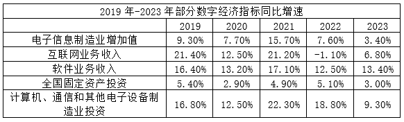
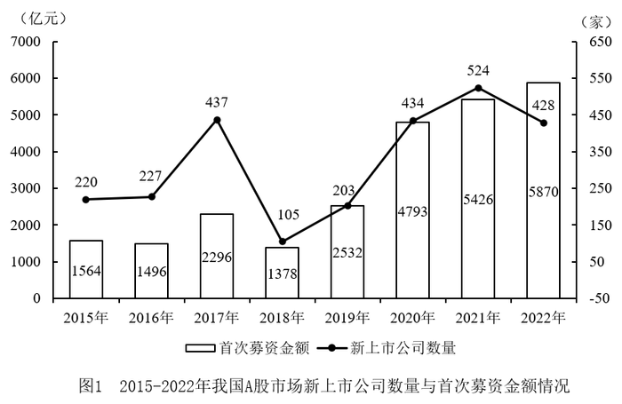
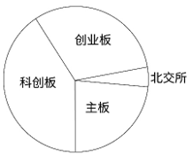

# 2025年湖北省公务员录用考试《行测》题（网友回忆版）

> 资料分析 · 20 题 · 湖北 2025

## 材料 1

        2023年，我国数字经济规模持续扩大。数字经济核心产业增加值超过12万亿元，约占GDP的10%。电子信息制造业增加值同比增长3.4%；电信业务收入1.68万亿元；互联网业务收入1.75万亿元；软件业务收入12.33万亿元。以云计算、大数据、物联网等为代表的新兴业务中，云计算、大数据业务收入同比增长37.5%，物联网业务收入同比增长20.3%。高技术制造业、高技术服务业投资分别同比增长9.9%、11.4%。高技术制造业中，计算机、通信和其他电子设备制造业投资同比增长9.3%。

### 第 1 题　qid 13504448 · 综合

2022年我国软件业务收入在以下哪个范围：

- **A**. 10.7-10.9万亿元　✅
- **B**. 10.9-11.1万亿元
- **C**. 11.1-11.3万亿元
- **D**. 11.3-11.5万亿元

**答案**：A

**官方解析**

根据题干“2022年······在以下哪个范围”，结合材料时间为2023年，可判定本题为基期计算问题。定位文字材料可得：2023年，我国软件业务收入12.33万亿元；定位统计表可得：2023年我国软件业务收入同比增速为13.40%。根据公式：基期量，则2022年我国软件业务收入万亿元，在A项范围内。

故正确答案为A。

---

### 第 2 题　qid 13504449 · 增长

2019-2023年，互联网业务收入同比增速高于电子信息制造业增加值同比增速的年份有：

- **A**. 1个
- **B**. 2个
- **C**. 3个
- **D**. 4个　✅

**答案**：D

**官方解析**

定位表格材料可得：2019-2023年，互联网业务收入同比增速分别为21.40%、12.50%、21.20%、-1.10%、6.80%；2019-2023年，电子信息制造业增加值同比增速分别为9.30%、7.70%、15.70%、7.60%、3.40%。则2019-2023年，互联网业务收入同比增速高于电子信息制造增加值同比增速的年份有2019年、2020年、2021年、2023年，共4个年份。
故正确答案为D。

---

### 第 3 题　qid 12881906 · 综合

2023年，新兴业务收入与电信业务收入的比值，较2019年上升了约：

- **A**. 11个百分点
- **B**. 10.7个百分点　✅
- **C**. 10.3个百分点
- **D**. 9.8个百分点

**答案**：B

**官方解析**

根据题干“2023年······与······的比值，较2019年上升了约”，可判定本题为比值计算问题。定位统计图可得：2019年，新兴业务收入、电信业务收入分别为0.1374万亿元、1.31万亿元；2023年分别为0.3564万亿元、1.68万亿元。可知2023年，新兴业务收入与电信业务收入的比值为，2019年，新兴业务收入与电信业务收入的比值为。则所求为21.2%-10.5%=10.7%，即上升了约10.7个百分点。

故正确答案为B。

---

### 第 4 题　qid 13504450 · 增长

按照2023年的同比增速，2025年互联网业务收入预计在以下哪个范围：

- **A**. 1.6-1.8万亿元
- **B**. 1.8-2.0万亿元　✅
- **C**. 2.0-2.2万亿元
- **D**. 超过2.2万亿元

**答案**：B

**官方解析**

根据题干“按照2023年的同比增速，2025年······在以下哪个范围”，可判定本题为现期计算问题。定位文字材料可得：2023年互联网业务收入1.75万亿元；定位表格材料可得：2023年我国互联网业务收入同比增速为6.80%。根据公式：现期量，可得2025年互联网业务收入，略小于1.9999，在B项范围内。

故正确答案为B。

---

### 第 5 题　qid 13504452 · 综合

能够从上述资料中推出的是：

- **A**. 2023年，高技术制造业投资低于高技术服务业投资
- **B**. 2021-2023年新兴业务收入与电信业务收入的比值逐年上升　✅
- **C**. 2023年，电信业务收入与互联网业务收入之和高于软件业务收入
- **D**. 2023年计算机、通信和其他电子设备制造业投资较2020年翻了一番

**答案**：B

**官方解析**

A项：定位文字材料可得：2023年，高技术制造业、高技术服务业投资分别同比增长9.9%、11.4%，但无投资额具体数值，无法推出，错误；

B项：定位柱状图可得：2021-2023年新兴业务收入分别为0.2372万亿元、0.3060万亿元、0.3564万亿元；电信业务收入分别为1.47万亿元、1.58万亿元、1.68万亿元。则2021-2023年新兴业务收入与电信业务收入的比值分别为：2021年，；2022年，；2023年，。故2021-2023年新兴业务收入与电信业务收入的比值逐年上升，正确；

C项：定位文字材料可得：2023年，电信业务收入1.68万亿元；互联网业务收入1.75万亿元；软件业务收入12.33万亿元。电信业务收入与互联网业务收入之和（1.68+1.75=3.43万亿元）&lt;软件业务收入（12.33万亿元），并非高于，错误；

D项：定位表格材料可得：2021-2023年计算机、通信和其他电子设备制造业投资同比增速分别为22.30%、18.80%、9.30%。根据公式：现期量=基期量×（1+增长率），有2023年投资额=2020年投资额×（1+22.30%）（1+18.80%）（1+9.30%），则，即不到2倍，并非翻一番，错误。

故正确答案为B。

---

## 材料 2

### 第 6 题　qid 13504461 · 平均数

2015-2022年期间，我国A股市场新上市公司平均每家首次募资金额最大的年份是：

- **A**. 2018年
- **B**. 2019年
- **C**. 2021年
- **D**. 2022年　✅

**答案**：D

**官方解析**

根据题干“2015-2022年期间······平均每家······”，结合材料时间为2015-2022年，可判定本题为现期平均数问题。定位统计图可得2015-2022年我国A股市场新上市公司数量与首次募资金额情况。根据新上市公司平均每家首次募资金额，可得下列年份我国A股市场新上市公司平均每家首次募资金额分别为：

2018年，亿元/家；

2019年，亿元/家；

2021年，亿元/家；

2022年，亿元/家。

比较可得，2022年我国A股市场新上市公司平均每家首次募资金额最大。

故正确答案为D。

---

### 第 7 题　qid 13504462 · 增长

2016-2022年期间，我国A股市场新上市公司的首次募资金额同比增长超过15%的年份有：

- **A**. 3个　✅
- **B**. 4个
- **C**. 5个
- **D**. 6个

**答案**：A

**官方解析**

根据题干“2016-2022年期间······同比增长超过15%的年份有”，可判定本题为一般增长率问题。定位统计图可知2015-2022年我国A股市场新上市公司的首次募资金额。根据公式：一般增长率，则2016-2022年期间，我国A股市场新上市公司的首次募资金额同比增长率分别为：

2016年，，不符合；

2017年，，符合；

2018年，，不符合；

2019年，，符合；

2020年，，符合；

2021年，，不符合；

2022年，，不符合。

因此，同比增长率超过15%的年份有2017年、2019年、2020年，共3个。

故正确答案为A。

---

### 第 8 题　qid 12881912 · 增长

2023年上半年，北交所新上市公司平均募资金额同比增量在以下哪个范围？

- **A**. 超过0.7亿元
- **B**. 0.5~0.7亿元
- **C**. 0.3~0.5亿元　✅
- **D**. 低于0.3亿元

**答案**：C

**官方解析**

根据题干“2023年上半年······平均募资金额同比增量······”，可判定本题为平均数的增长量问题。定位统计表可得，2023年上半年北交所新上市公司42家，募资金额81亿元；2022年上半年新上市公司19家，募资金额29亿元。根据公式：平均募资金额，则所求亿元，在C项范围内。

故正确答案为C。

---

### 第 9 题　qid 13504464 · 比重

下列饼状图可以描述表1中2023年上半年各板块新上市公司数量占比情况的是：

- **A**. 

- **B**. 

- **C**. 

- **D**. 

　✅

**答案**：D

**官方解析**

根据题干“······2023年上半年······占比情况的是”，结合表格材料时间为2023年上半年，可判定本题为现期比重问题。定位表1可得，2023年上半年我国A股市场新上市公司中主板38家、科创板41家、创业板52家、北交所42家。其中，科创板新上市公司数量与北交所非常接近，而A、B、C三项中科创板新上市公司数量均明显大于北交所的2倍，排除；只有D项符合，当选。
故正确答案为D。

---

### 第 10 题　qid 13504466 · 综合

能够从上述资料中推出的是：

- **A**. 2022年下半年，我国A股市场新上市公司首次募资总金额高于2022年上半年
- **B**. 2022年下半年，我国A股市场新上市公司平均每家首次募资金额约为10.7亿元　✅
- **C**. 2016-2022年期间，我国A股市场新上市公司数量增长率最大的年份出现在2019年
- **D**. 2023年上半年，我国A股市场新上市公司数量与首次募资金额都小于2022年上半年

**答案**：B

**官方解析**

A项：定位统计图可知，2022年我国A股市场新上市公司首次募资金额为5870亿元；定位统计表可知2022年上半年我国A股市场主板、科创板、创业板、北交所新上市公司首次募资金额。2022年上半年我国A股市场新上市公司首次募资总金额为亿元，则2022年下半年我国A股市场新上市公司首次募资总金额为5870-3120=2750亿元，则2022年下半年低于2022年上半年，错误；

B项：定位统计图可知，2022年我国A股市场新上市公司数量为428家；定位统计表可知2022年上半年我国A股市场主板、科创板、创业板、北交所新上市公司数量；根据本题A项可知，2022年下半年我国A股市场新上市公司首次募资总金额为2750亿元。2022年上半年我国A股市场新上市公司总数量为30+54+68+19=171家。故题干所求亿元，正确；

C项：定位统计图可知2015-2022年我国A股市场新上市公司数量。根据公式：增长率，可得2019年我国A股市场新上市公司数量同比增长率、2020年同比增长率，2019年同比增长率小于2020年， 2019年同比增长率并非最大，错误；

D项：定位统计表可知2023年上半年我国A股市场主板、科创板、创业板、北交所新上市公司数量。根据本题B项可知，2022年上半年我国A股市场新上市公司总数量为171家。2023年上半年我国A股市场新上市公司总数量为38+41+52+42=173家，则2023年上半年大于2022年上半年，错误。

故正确答案为B。

---

## 材料 3

        2023年，我国制浆造纸及纸制品全行业完成纸浆、纸及纸板和纸制品产量合计29139万吨，同比增长2.63%。其中纸及纸板产量12965万吨，与2022年的12425万吨相比同比增长4.35%，增速比2022年扩大了1.71个百分点。

        2023年，全国纸及纸板消费量13165万吨，同比增长6.14%，增速比2022年扩大了8.08个百分点；人均年消费量93.37千克，同比增长6.30%。

        2023年，全国2567家造纸及纸板生产企业部分经济指标如下：营业收入8019亿元；成品存货440亿元，同比下降7.65%；利润总额269亿元，同比增长3.01%；资产11316亿元，同比增长2.11%；资产负债率58.05%；负债总额6569亿元，同比增长2.82%。

        2023年，我国东部地区11个省（区、市）纸及纸板产量为8843万吨，占全国纸及纸板产量比例为68.2%，同比增长5.44%；中部地区8个省占比为19.2%，同比增长2.51%；西部地区12个省（区、市）占比为12.6%，同比增长1.43%。我国有18个省（区、市）纸及纸板产量超过100万吨，产量合计12597万吨，占全国纸及纸板总产量的97.16%。

### 第 11 题　qid 13504434 · 综合

2021年全国纸及纸板产量约为：

- **A**. 11715万吨
- **B**. 12105万吨　✅
- **C**. 12762万吨
- **D**. 13227万吨

**答案**：B

**官方解析**

根据题干“2021年全国纸及纸板产量约为”，结合材料给出2023年、2022年相关数据，可判定本题为基期计算问题。定位文字材料第一段可知：2023年纸及纸板产量12965万吨，与2022年的12425万吨相比同比增长4.35%，增速比2022年扩大了1.71个百分点。则2022年全国纸及纸板产量同比增速为4.35%-1.71%=2.64%。根据公式：基期量，则2021年全国纸及纸板产量为万吨，与B项最接近。

故正确答案为B。

---

### 第 12 题　qid 13504435 · 增长

2022年全国纸及纸板消费量同比增速与产量同比增速相比约：

- **A**. 低4.58个百分点　✅
- **B**. 低0.5个百分点
- **C**. 高5.37个百分点
- **D**. 高1.79个百分点

**答案**：A

**官方解析**

定位文字材料第一段可得：2023年，全国纸及纸板产量12965万吨，与2022年的12425万吨相比同比增长4.35%，增速比2022年扩大了1.71个百分点；定位文字材料第二段可得：2023年，全国纸及纸板消费量13165万吨，同比增长6.14%，增速比2022年扩大了8.08个百分点。可得2022年全国纸及纸板消费量同比增速为6.14%-8.08%=-1.94%，产量同比增速为4.35%-1.71%=2.64%，则消费量同比增速与产量同比增速的差为-1.94%-2.64%=-4.58%，因此，2022年全国纸及纸板消费量同比增速与产量同比增速相比低4.58个百分点。
故正确答案为A。

---

### 第 13 题　qid 12882058 · 增长

2023年，造纸及纸板生产企业部分经济指标同比增速按从高到低排列，正确的是（    ）。

- **A**. 成品存货、利润总额、资产、负债总额
- **B**. 成品存货、利润总额、负债总额、资产
- **C**. 利润总额、负债总额、资产、成品存货　✅
- **D**. 利润总额、资产、负债总额、成品存货

**答案**：C

**官方解析**

定位文字材料第三段可得：2023年，全国2567家造纸及纸板生产企业部分经济指标如下：成品存货同比下降7.65%；利润总额同比增长3.01%；资产同比增长2.11%；负债总额同比增长2.82%。则2023年这4个经济指标同比增速按从高到低排列为：利润总额（3.10%）、负债总额（2.82%）、资产（2.11%）、成品存货（-7.65%）。
故正确答案为C。

---

### 第 14 题　qid 13504440 · 综合

2023年我国东部地区纸及纸板产量与中部地区相比约多：

- **A**. 4倍以上
- **B**. 3-4倍
- **C**. 2-3倍　✅
- **D**. 1-2倍

**答案**：C

**官方解析**

根据题干“2023年······与······相比约多”，结合选项为倍数，且材料时间为2023年，可判定本题为现期倍数问题。

方法一：定位文字材料第一段可得：2023年，我国······其中纸及纸板产量12965万吨；定位文字材料第四段可得：2023年，我国东部地区11个省（区、市）纸及纸板产量为8843万吨，中部地区8个省占比为19.2%。根据公式：部分=整体×比重，则题干所求倍数倍，在C项范围内。

方法二：定位文字材料第一段可得：2023年，我国······其中纸及纸板产量12965万吨；定位文字材料第四段可得：2023年，我国东部地区11个省（区、市）纸及纸板产量占全国纸及纸板产量比例为68.2%；中部地区8个省占比为19.2%。根据公式：部分=整体×比重，则题干所求倍数倍，在C项范围内。

故正确答案为C。

---

### 第 15 题　qid 13504441 · 综合

能够从上述资料中推出的是：

- **A**. 2023年全国纸浆的产量超过10000万吨
- **B**. 2022年全国纸及纸板人均年消费量超过90千克
- **C**. 2023年纸及纸板产量超过100万吨的18个省（区、市）都不属于西部地区
- **D**. 2023年全国2567家造纸及纸板生产企业的营业收入不超过利润总额的30倍　✅

**答案**：D

**官方解析**

A项：定位文字材料第一段可得：2023年，我国纸浆、纸及纸板和纸制品产量合计29139万吨，纸及纸板产量12965万吨。材料并未给出2023年全国纸浆或纸制品产量的相关数据，无法直接或间接计算2023年全国纸浆的产量，错误；

B项：定位文字材料第二段可得：2023年，全国纸及纸板人均年消费量93.37千克，同比增长6.30%。根据公式：基期量，则2022年全国纸及纸板人均年消费量千克，即人均年消费量低于90千克，错误；

C项：定位文字材料第四段可得：2023年，我国西部地区12个省（区、市）占比为12.6%，我国有18个省（区、市）纸及纸板产量超过100万吨，产量合计12597万吨，占全国纸及纸板总产量的97.16%。97.16%+12.6%=109.76%&gt;100%，即纸及纸板产量超过100万吨的省（区、市）与我国西部地区12个省（区、市）之和超过整体，说明二者之间必然有交集，则2023年纸及纸板产量超过100万吨的18个省（区、市）一定有属于西部地区的，错误；

D项：定位文字材料第三段可得：2023年，全国2567家造纸及纸板生产企业的营业收入8019亿元，利润总额269亿元。则所求倍数倍，即不超过利润总额的30倍，正确。

故正确答案为D。

---

## 材料 4

        2023年全国著作权（包括作品著作权、计算机软件著作权、著作权质权）登记总量达8923901件，同比增长40.46%，增速比上年同期增加39个百分点。根据各省、自治区、直辖市版权局和中国版权保护中心作品登记信息统计，2023年全国共完成作品著作权登记6428277件，同比增长42.30%，登记量前五位的分别是：北京市1101072件，同比增加53802件；山东省873826件，同比增加619459件；福建省710648件，同比增加424814件；中国版权保护中心493070件，同比增加1476件；上海市412660件，同比增加30660件。从作品类型来看，登记量最多的是美术作品3296437件，第二是摄影作品2501968件，第三是文字作品329128件，前三类作品类型登记量占作品著作权登记总量的95.32%，该比例比上年同期增加4.86个百分点。

        2023年全国共完成著作权质权登记411件，同比增长17.43%，涉及主债务金额995817.4万元，同比增长82.82%；涉及担保金额985783.88万元，同比增长80.85%。其中计算机软件著作权质权登记361件，涉及主债务金额917149.06万元，涉及担保金额907399.56万元；作品（除计算机软件之外）著作权质权登记50件，同比下降26.47%，涉及主债务金额78668.34万元，同比下降55.13%，涉及担保金额78384.32万元，同比下降55.46%。

### 第 16 题　qid 13504439 · 综合

2021年全国著作权登记总量约为：

- **A**. 626万件　✅
- **B**. 656万件
- **C**. 685万件
- **D**. 728万件

**答案**：A

**官方解析**

根据题干“2021年全国著作权登记总量约为”，结合材料时间为2023年，可判定本题为间隔基期问题。定位文字材料第一段可得：2023年全国著作权（包括作品著作权、计算机软件著作权、著作权质权）登记总量达8923901件，同比增长40.46%（），增速比上年同期增加39个百分点。则2022年全国著作权登记总量的同比增速为40.46%-39%=1.46%（）。根据公式：，则2023年全国著作权登记总量比2021年增长了（）。根据公式：间隔基期量，则所求为万件，与A项最接近。

故正确答案为A。

---

### 第 17 题　qid 13504442 · 综合

2022年北京市作品著作权登记量约占同年全国作品著作权登记总量的：

- **A**. 10%
- **B**. 13%
- **C**. 18%
- **D**. 23%　✅

**答案**：D

**官方解析**

根据题干“2022年······占······的”，结合材料时间为2023年，可判定本题为基期比重问题。定位文字材料第一段可得：2023年全国共完成作品著作权登记6428277件，同比增长42.30%；北京市1101072件，同比增加53802件。根据公式：基期量，可得2022年全国共完成作品著作权登记量为件；根据公式：基期量=现期量-增长量，可得2022年北京市作品著作权登记量为1101072-53802=1047270件；根据公式：比重，可得所求为。

故正确答案为D。

---

### 第 18 题　qid 13504443 · 综合

2022年美术作品、摄影作品、文字作品的著作权登记量共约：

- **A**. 369万件
- **B**. 389万件
- **C**. 409万件　✅
- **D**. 429万件

**答案**：C

**官方解析**

根据题干“2022年美术作品、摄影作品、文字作品的著作权登记量共约”，结合材料时间为2023年，可判定本题为基期计算问题。定位文字材料第一段可得：2023年全国共完成作品著作权登记6428277件，同比增长42.30%；美术作品、摄影作品、文字作品的著作权登记量占作品著作权登记总量的95.32%，该比例比上年同期增加4.86个百分点。根据公式：基期量，则2022年全国共完成作品著作权登记量万件；2022年美术作品、摄影作品、文字作品的著作权登记量占作品著作权登记总量的比重为。根据公式：部分=整体×比重，则题干所求为万件，与C项最接近。

故正确答案为C。

---

### 第 19 题　qid 12881909 · 增长

以下折线图中，最能准确反映2023年各省、自治区、直辖市版权局和中国版权保护中心作品著作权登记量前五位的同比增长率情况的是（按登记量从大到小排列）：

- **A**. 

- **B**. 

　✅
- **C**. 

- **D**. 

**答案**：B

**官方解析**

根据题干“······同比增长率情况的是······”，可判定本题为一般增长率问题。定位文字材料第一段可知，根据各省、自治区、直辖市版权局和中国版权保护中心作品登记信息统计，2023年登记量前五位的分别是：北京市1101072件，同比增加53802件；山东省873826件，同比增加619459件；福建省710648件，同比增加424814件；中国版权保护中心493070件，同比增加1476件；上海市412660件，同比增加30660件。根据公式：，则2023年各省、自治区、直辖市版权局和中国版权保护中心作品著作权登记量前五位的同比增长率分别为：

北京市，；

山东省，；

福建省，；

中国版权保护中心，；

上海市，。

观察数据可知，山东省登记量同比增长率最大，则第2个点最高，排除D项；上海市登记量同比增长率与北京市接近，且前者略高于后者，则第5个点略高于第1个点，仅B项满足。

故正确答案为B。

---

### 第 20 题　qid 13504445 · 综合

不能从上述资料中推出的是：

- **A**. 2023年全国共完成计算机软件著作权登记2495213件
- **B**. 2023年全国作品著作权登记总量同比增量超过200万件　✅
- **C**. 2023年计算机软件著作权质权登记在著作权质权登记中比重同比上升
- **D**. 2023年平均每件作品（除计算机软件之外）著作权质权登记涉及主债务金额同比下降

**答案**：B

**官方解析**

A项：定位文字材料第一段可得：2023年全国著作权（包括作品著作权、计算机软件著作权、著作权质权）登记总量达8923901件，全国共完成作品著作权登记6428277件；定位文字材料第二段可得：2023年全国共完成著作权质权登记411件。故2023年全国共完成计算机软件著作权登记8923901-6428277-411=2495213件，正确；

B项：定位文字材料第一段可得：2023年全国作品著作权登记6428277件，同比增长42.30%。根据公式：增长量，则2023年全国作品著作权登记总量同比增量万件，错误；

C项：定位文字材料第二段可得：2023年全国共完成著作权质权登记411件，同比增长17.43%（b）；其中计算机软件著作权质权登记361件；作品（除计算机软件之外）著作权质权登记50件，同比下降26.47%。由于全国共完成著作权质权登记件数=计算机软件著作权质权登记件数+作品（除计算机软件之外）著作权质权登记件数，根据混合增长率口诀：混合居中，则计算机软件著作权质权登记增长率（a）&gt;全国共完成著作权质权登记增长率17.43%（b）&gt;作品（除计算机软件之外）著作权质权登记增长率-26.7%。根据两期比重比较口诀：当部分的增长率（a）&gt;整体的增长率（b）时，比重上升，故2023年计算机软件著作权质权登记在著作权质权登记中比重同比上升，正确；

D项：定位文字材料第二段可得，2023年作品（除计算机软件之外）著作权质权登记50件，同比下降26.47%（b），涉及主债务金额78668.34万元，同比下降55.13%（a）。根据两期平均数比较结论：当分子的增长率（a）&lt;分母的增长率（b）时，平均数下降。涉及主债务金额的同比增速（-55.13%）&lt;登记件数的同比增速（-26.47%），故2023年平均每件作品（除计算机软件之外）著作权质权登记涉及主债务金额同比下降，正确。

本题为选非题，故正确答案为B。

---
