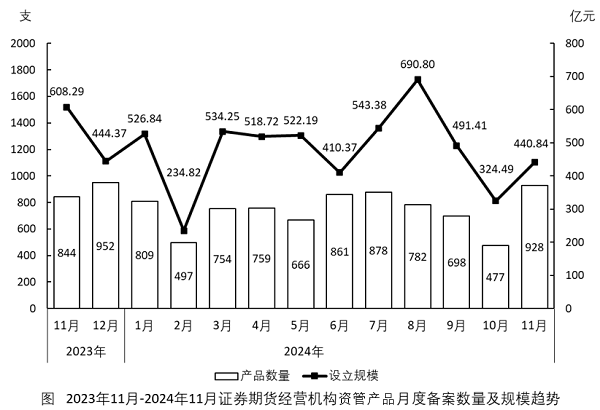
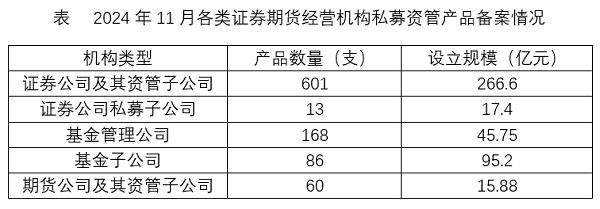
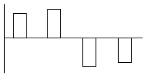
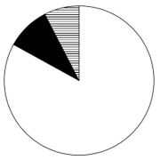
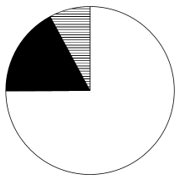
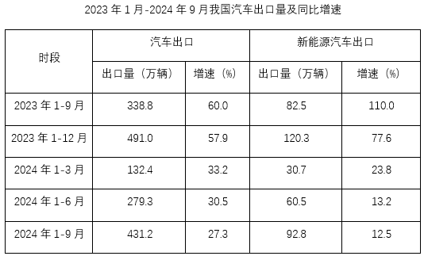
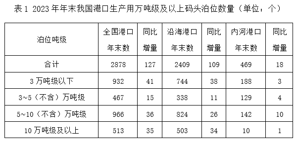
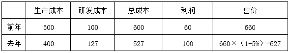

# 2025年湖北省选调生招录考试综合知识和行政职业能力测验试卷（网友回忆版）

> 资料分析 · 21 题 · 湖北 2025

## 材料 1

        2024年11月证券期货经营机构共计销售产品928支。

### 第 1 题　qid 15419184 · 综合

以下柱状图反映了2024年哪一时间段内，证券期货经营机构各类私募资管产品哪一指标的环比增量变化趋势（横轴位置代表增量为0）？

- **A**. 2-5月产品数量
- **B**. 3-6月设立规模
- **C**. 6-9月产品数量
- **D**. 7-10月设立规模　✅

**答案**：D

**官方解析**

根据题干“······环比增量变化趋势······”，可判定本题为增长量比较问题。定位统计图可得2024年1月-2024年10月证券期货经营机构私募资管产品数量和设立规模。根据公式：增长量=现期量-基期量，可得选项中各指标环比增长量如下：
A项，2-5月产品数量：2月，497-809=-312支，环比增长量&lt;0，而柱状图（横轴位置代表增量为0）中2024年2月产品数量的环比增长量&gt;0，不符合柱状图变化趋势，排除；
B项，3-6月设立规模：3月，534.25-234.82=299.43亿元；4月，518.72-534.25=-15.53亿元，环比增长量&lt;0，而柱状图（横轴位置代表增量为0）中2024年4月设立规模的环比增长量&gt;0，不符合柱状图变化趋势，排除；
C项，6-9月产品数量：6月，861-666=195支；7月，878-861=17支。2024年6月产品数量的环比增长量&gt;2024年7月产品数量的环比增长量，不符合柱状图变化趋势，排除；
D项，7-10月设立规模：7月，543.38-410.37=133.01亿元；8月，690.80-543.38=147.42亿元；9月，491.41-690.80=-199.39亿元；10月，324.49-491.41=-166.92亿元。符合柱状图变化趋势，当选。
故正确答案为D。

---

### 第 2 题　qid 15419185 · 综合

2024年上半年，证券期货经营机构共备案私募资管产品：

- **A**. 不到4400支　✅
- **B**. 4400-4500支之间
- **C**. 4500-4600支之间
- **D**. 超过4600支

**答案**：A

**官方解析**

定位统计图可得2024年1月-2024年6月，证券期货经营机构备案私募资管产品数量。则2024年上半年，证券期货经营机构共备案私募资管产品数量为支，在A项范围内。

故正确答案为A。

---

### 第 3 题　qid 15419186 · 平均数

2024年11月，证券期货经营机构备案私募资管产品平均每支设立规模约比上年同期：

- **A**. 少27%
- **B**. 少35%　✅
- **C**. 多27%
- **D**. 多35%

**答案**：B

**官方解析**

根据题干“2024年11月······平均每支设立规模约比上年同期”，结合选项为“多/少+百分数”，可判定本题为平均数的增长率问题。定位统计图可得：2024年11月，证券期货经营机构备案私募资管产品设立规模为440.84亿元，产品数量为928支；2023年11月，证券期货经营机构备案私募资管产品设立规模为608.29亿元，产品数量为844支。

方法一：根据公式：平均每支设立规模，可得：2024年11月证券期货经营机构备案私募资管产品平均每支设立规模，2023年11月证券期货经营机构备案私募资管产品平均每支设立规模。根据公式：增长率，则所求为，与B项最接近。

方法二：根据公式：增长率，可得：2024年11月证券期货经营机构备案私募资管产品设立规模的增长率（a），2024年11月证券期货经营机构备案私募资管产品数量的增长率（b）。根据公式：平均数的增长率，则所求为，与B项最接近。

故正确答案为B。

---

### 第 4 题　qid 15419187 · 平均数

以2024年11月私募资管产品平均每支设立规模计算，将①证券公司及其资管子公司、②证券公司私募子公司、③基金管理公司，按从大到小顺序排列，正确的是：

- **A**. ①②③
- **B**. ②③①
- **C**. ③①②
- **D**. ②①③　✅

**答案**：D

**官方解析**

根据题干“以2024年11月······平均每支设立规模······按从大到小顺序排列，正确的是”，结合材料时间为2024年11月，可判定本题为现期平均数问题。定位统计表可得2024年11月①证券公司及其资管子公司、②证券公司私募子公司、③基金管理公司私募资管产品的设立规模和产品数量。根据公式：平均每支设立规模，可得2024年11月①证券公司及其资管子公司私募资管产品平均每支设立规模亿元，②证券公司私募子公司私募资管产品平均每支设立规模亿元，③基金管理公司私募资管产品平均每支设立规模亿元。比较可知，按从大到小顺序排列正确的是②①③。

故正确答案为D。

---

### 第 5 题　qid 15419188 · 比重

以下饼图中，最能准确反映2024年11月各类证券期货经营机构私募资管产品中，证券公司及其资管子公司（白色）、证券公司私募子公司、基金管理公司（黑色）和其他公司（横线）产品数量占比关系的是：

- **A**. 

　✅
- **B**. 

- **C**. 

- **D**. 

**答案**：A

**官方解析**

根据题干“以下饼图中，最能准确反映2024年11月······占比关系的是”，结合材料时间为2024年11月，可判定本题为现期比重问题。定位统计表可知，2024年11月证券公司及其资管子公司、证券公司私募子公司、基金管理公司、基金子公司、期货公司及其资管子公司产品数量分别为601支、13支、168支、86支、60支。则证券公司及其资管子公司（白色）产品数量为601支；证券公司私募子公司、基金管理公司（黑色）产品数量为13+168=181支；其他公司（横线）产品数量为86+60=146支。，即白色区域是黑色区域的3倍多，，即黑色区域是横线区域的1倍多，只有A项符合。

故正确答案为A。

---

## 材料 2

        2023年，全国6大类茶叶产量、产值、内销量、内销额相关数据如下：2023年，全国绿茶产量193.4万吨，同比增长8.0万吨；红茶49.1万吨，同比增长0.9万吨；黑茶45.8万吨，同比增长3.2万吨；乌龙茶33.3万吨，同比增长2.15万吨；白茶10.0万吨，同比增长0.56万吨；黄茶2.3万吨，同比增长1.0万吨。

        2023年，全国绿茶产值2060.6亿元，同比增长2.4亿元；红茶519.7亿元，同比增长10.3亿元；黑茶310.4亿元，同比增长41.8亿元；乌龙茶288.5亿元，同比增长33.7亿元；白茶87.0亿元，同比增长9.0亿元；黄茶30.5亿元，同比增长18.7亿元。

        2023年，全国茶叶内销总量240.4万吨，同比增长0.7万吨。其中绿茶内销量128.9万吨，同比减少1.6%；红茶37.9万吨，同比减少0.7%：黑茶37.8万吨，同比增长3.7%；乌龙茶25.6万吨，同比增长3.2%；白茶8.3万吨，同比增长1.6%；黄茶1.9万吨。

        2023年，全国茶叶内销总额3346.7亿元，同比减少48.5亿元，其中绿茶内销额1978.3亿元，同比减少6.3%；红茶560.9亿元，同比减少0.6%；黑茶358.6亿元，同比增长11.6%；乌龙茶311.0亿元，同比增长9.3%；白茶107.5亿元，同比增长6.9%；黄茶30.4亿元。

### 第 6 题　qid 15419179 · 增长

2023年，全国6大类茶叶总产量同比约增长了：

- **A**. 3%
- **B**. 5%　✅
- **C**. 7%
- **D**. 9%

**答案**：B

**官方解析**

根据题干“2023年······同比约增长了”，结合选项为百分数，可判定本题为一般增长率问题。定位文字材料第一段可知2023年全国6大类茶叶产量及其同比增长量。则2023年全国6大类茶叶总产量=193.4+49.1+45.8+33.3+10.0+2.3=333.9万吨，2023年全国6大类茶叶总产量同比增长量=8.0+0.9+3.2+2.15+0.56+1.0=15.81万吨。根据公式：增长率，则题干所求，与B项最接近。

故正确答案为B。

---

### 第 7 题　qid 15419180 · 增长

2023年，全国6大类茶叶中，平均每吨产值同比上升的有几类？

- **A**. 2
- **B**. 3
- **C**. 4
- **D**. 5　✅

**答案**：D

**官方解析**

根据题干“2023年······平均每吨产值同比上升······”，可判定本题为两期平均数比较问题。定位文字材料第一段可知2023年全国6大类茶叶产量及其同比增长量；定位文字材料第二段可知2023年全国6大类茶叶产值及其同比增长量。根据公式：，结合两期平均数比较的方法：当分子增长率（a）&gt;分母增长率（b）时，平均数上升，反之下降。根据公式：，则各类茶叶产值同比增长率（a）与产量的同比增长率（b）如下：

绿茶，，，，下降；

红茶，，，，上升；

黑茶，，，，上升；

乌龙茶，，，，上升；

白茶，，，，上升；

黄茶，，，上升。

综上，红茶、黑茶、乌龙茶、白茶、黄茶这5类茶叶平均每吨产值同比上升。

故正确答案为D。

---

### 第 8 题　qid 15419181 · 比重

2023年，全国绿茶内销量占产量的比重比上年约：

- **A**. 上升了不到2个百分点
- **B**. 上升了2个百分点以上
- **C**. 下降了不到2个百分点
- **D**. 下降了2个百分点以上　✅

**答案**：D

**官方解析**

根据题干“2023年······占······的比重比上年约”，结合选项为“上升/下降+百分点”，可判定本题为两期比重问题。定位文字材料第一、三段可知：2023年，全国绿茶产量193.4万吨（B），同比增长8.0万吨；绿茶内销量128.9万吨（A），同比减少1.6%（a）。根据公式：增长率，则2023年全国绿茶产量同比增长率（b）。根据公式：两期比重差，则题干所求，即下降了2个百分点以上。

故正确答案为D。

---

### 第 9 题　qid 15419182 · 增长

2023年，全国黑茶内销额同比增量约是白茶的多少倍？

- **A**. 3.0
- **B**. 4.2
- **C**. 5.4　✅
- **D**. 6.6

**答案**：C

**官方解析**

根据题干“2023年······是······多少倍”，结合材料时间为2023年，可判定本题为现期倍数问题。定位文字材料第四段可知：2023年，全国黑茶内销额358.6亿元，同比增长11.6%；白茶107.5亿元，同比增长6.9%。根据公式：增长量，则2023年，全国黑茶内销额同比增量为亿元，白茶内销额同比增量为亿元。故题干所求倍数为倍，与C项最接近。

故正确答案为C。

---

### 第 10 题　qid 15419183 · 综合

以下各项能够从上述资料中推出的是：

- **A**. 2023年，全国茶叶总产值超过3400亿元
- **B**. 2023年，全国红茶内销量占产量的比重高于黑茶
- **C**. 2023年，全国乌龙茶内销额同比增长了30亿元以上
- **D**. 2023年，全国黄茶平均每吨产值是黑茶的1.5倍以上　✅

**答案**：D

**官方解析**

A项：定位文字材料第二段可得：2023年，全国绿茶产值2060.6亿元；红茶519.7亿元，黑茶310.4亿元，乌龙茶288.5亿元，白茶87.0亿元，黄茶30.5亿元。则2023年，全国茶叶总产值亿元&lt;3400亿元，错误；

B项：定位文字材料第一段可得：2023年，全国红茶产量49.1万吨，黑茶产量45.8万吨；定位文字材料第三段可得：2023年，全国红茶内销量37.9万吨，黑茶内销量37.8万吨。根据公式：比重，则2023年，全国红茶内销量占产量的比重，黑茶内销量占产量的比重，即2023年全国红茶内销量占产量的比重低于黑茶，错误；

C项：定位文字材料第四段可得：2023年，全国乌龙茶内销额311.0亿元，同比增长9.3%。根据公式：增长量，则2023年全国乌龙茶内销额同比增长亿元，即同比增长不到30亿元，错误；

D项：定位文字材料第一段可得：2023年，全国黑茶产量45.8万吨，黄茶产量2.3万吨；定位文字材料第二段可得：2023年，全国黑茶产值310.4亿元，黄茶30.5亿元。根据公式：平均每吨产值，则2023年全国黄茶平均每吨产值是黑茶的倍，超过1.5倍，正确。

故正确答案为D。

---

## 材料 3

        2023年，我国汽车产销量分别为3016.1万辆和3009.4万辆，同比分别增长11.6%和12%，创历史新高，连续15年保持全球第一，汽车出口量首次跃全球第一。

        2022年，我国汽车产销量分别为2702.1万辆和2686.4万辆，其中新能源汽车产销分别为705.8万辆和688.7万辆，同比分别增长96.9%和93.4%，汽车出口311.1万辆，同比增长54.4%，新能源汽车出口67.9万辆，同比增长1.2倍。

        2021年，我国汽车产销量分别为2608.2万辆和2627.5万辆，产销同比分别增长3.4%和3.8%，结束了连续三年的下降趋势。其中新能源汽车销售352.1万辆，同比增长1.6倍，连续7年位居全球第一。汽车出口201.5万辆，同比增长1倍，新能源汽车出口32万辆，同比增长3倍。

### 第 11 题　qid 15419189 · 综合

2020-2023年，我国汽车产销率（销量与产量之比）大于100%的年份有几个？

- **A**. 1个
- **B**. 2个　✅
- **C**. 3个
- **D**. 4个

**答案**：B

**官方解析**

根据题干“2020-2023年······产销率······”，结合材料给出2021-2023年我国汽车产销量以及2021年产销量的同比增速，可判定本题为基期比重问题。产销率（销量与产量之比）大于100%，，即产量&lt;销量。定位文字材料第一、二、三段可得：2023年，我国汽车产销量分别为3016.1万辆和3009.4万辆；2022年，我国汽车产销量分别为2702.1万辆和2686.4万辆；2021年，我国汽车产销量分别为2608.2万辆和2627.5万辆，产销同比分别增长3.4%和3.8%。在2021-2023年中，2021年满足产量&lt;销量。根据公式：基期量，则2020年我国汽车产量万辆；2020年我国汽车销量万辆，满足产量&lt;销量。故2020-2023年，我国汽车产销率大于100%的有2020年和2021年，共2个年份。

故正确答案为B。

---

### 第 12 题　qid 15419190 · 增长

2021-2023年，我国汽车销量年均增长约多少万辆？

- **A**. 191　✅
- **B**. 179
- **C**. 167
- **D**. 127

**答案**：A

**官方解析**

根据题干“2021-2023年······年均增长约多少万辆”，可判定本题为年均增长量问题。定位文字材料第一段可得：2023年，我国汽车销量为3009.4万辆；定位文字材料第三段可得：2021年，我国汽车销量为2627.5万辆。根据公式：年均增长量，则题干所求为万辆，与A项最接近。

故正确答案为A。

---

### 第 13 题　qid 15419191 · 比重

2020年，我国汽车出口量中，新能源汽车出口量的占比约为：

- **A**. 6.8%
- **B**. 7.9%　✅
- **C**. 8.4%
- **D**. 10.3%

**答案**：B

**官方解析**

根据题干“2020年······中······的占比约为”，结合材料时间为2021年，可判定本题为基期比重问题。定位文字材料第三段可得：2021年，我国汽车出口201.5万辆（B），同比增长1倍（b），新能源汽车出口32万辆（A），同比增长3倍（a）。根据公式：基期比重，则所求比重为。

故正确答案为B。

---

### 第 14 题　qid 15419192 · 增长

2024年，我国新能源汽车出口量若要实现同比增长10%的目标，则第四季度出口量环比须增长约多少万辆？

- **A**. 8.84
- **B**. 8.31
- **C**. 7.23　✅
- **D**. 7.01

**答案**：C

**官方解析**

根据题干“2024年······则第四季度出口量环比须增长约多少万辆”，定位表格材料可得：2023年1-12月我国新能源汽车出口量为120.3万辆；2024年1-6月出口量为60.5万辆；2024年1-9月出口量为92.8万辆。结合题干“2024年，我国新能源汽车出口量若要实现同比增长10%的目标”，根据公式：现期量=基期量×（1+增长率），2024年我国新能源汽车出口量将达到120.3×（1+10%）=132.33万辆，则2024年第四季度出口量=2024年出口量-2024年1-9月出口量=132.33-92.8=39.53万辆。2024年第三季度我国新能源汽车出口量=2024年1-9月出口量-2024年1-6月出口量=92.8-60.5=32.3万辆。根据公式：增长量=现期量-基期量，则2024年第四季度出口量环比增量=2024年第四季度出口量-2024年第三季度出口量=39.53-32.3=7.23万辆。
故正确答案为C。

---

### 第 15 题　qid 15419193 · 增长

下列选项中，可由资料推出的是：
①2021-2023年，我国汽车年均产量达2775万辆
②2021年，我国新能源汽车销量中，出口量占比不足一成
③假设2024年我国汽车产销量同比增长率维持2023年水平，则双双突破3370万辆

- **A**. ②③
- **B**. ①③
- **C**. ①②　✅
- **D**. ①②③

**答案**：C

**官方解析**

①：定位文字材料第一至三段可知，2021-2023年，我国汽车产量分别为2608.2万辆、2702.1万辆、3016.1万辆。根据公式：平均数，则2021-2023年，我国汽车年均产量万辆，即汽车年均产量达2775万辆，正确；

②：定位文字材料第三段可知，2021年，我国新能源汽车销售352.1万辆，新能源汽车出口32万辆。根据公式：比重，则2021年，我国新能源汽车销量中出口量占比，即出口量占比不足一成，正确；

③：定位文字材料第一段可知，2023年，我国汽车产销量分别为3016.1万辆和3009.4万辆，同比分别增长11.6%和12%。根据公式：现期量=基期量×（1+增长率），则2024年我国汽车产量=3016.1×（1+11.6%）=（3000+10+6.1）×1.116&lt;3348+12+7=3367万辆&lt;3370万辆，即产量低于3370万辆，不满足产销量双双突破3370万辆，错误。

综上可知，只有①②可以推出。

故正确答案为C。

---

## 材料 4

        2023年年末，我国港口生产用码头泊位22023个，比上年末增加700个。其中，内河港口生产用码头泊位16433个、增加551个，沿海港口生产用码头泊位5590个、增加149个。

### 第 16 题　qid 15419198 · 比重

2022年年末，我国港口生产用万吨级及以上码头泊位中，专业化泊位占比接近：

- **A**. 65%
- **B**. 61%
- **C**. 58%
- **D**. 53%　✅

**答案**：D

**官方解析**

根据题干“2022年年末······中······占比接近”，结合材料时间为2023年年末，可判定本题为基期比重问题。定位表1可得：2023年年末我国港口生产用万吨级及以上码头泊位数量为2878个，同比增量为127个；定位表2可得：2023年年末我国港口生产用万吨级及以上码头泊位中专业化泊位数量为1544个，同比增量为76个。根据公式：基期量=现期量-增长量、比重，则题干所求为。

故正确答案为D。

---

### 第 17 题　qid 15419200 · 增长

2023年年末，我国下列各类港口生产用万吨级及以上码头泊位，同比增速最快的是：

- **A**. 3万吨级以下泊位
- **B**. 3-5（不含）万吨级泊位
- **C**. 5-10（不含）万吨级泊位
- **D**. 10万吨级及以上泊位　✅

**答案**：D

**官方解析**

根据题干“······同比增速最快的是”，可判定本题为一般增长率问题。定位表1可得2023年年末我国港口生产用万吨级及以上码头中，各类吨级泊位数量及其同比增量。根据公式：增长率，各选项代入数据可得：

A项，；

B项，；

C项，；

D项，。

比较可知，D项同比增速最快。

故正确答案为D。

---

### 第 18 题　qid 15419201 · 平均数

2022年年末，我国沿海港口生产用码头泊位，平均约每多少个之中就有一个是10万吨级及以上泊位？

- **A**. 12　✅
- **B**. 14
- **C**. 15
- **D**. 17

**答案**：A

**官方解析**

根据题干“2022年年末······平均约每······”，结合材料时间为2023年年末，可判定本题为基期平均数问题。定位文字材料可得：2023年年末，我国沿海港口生产用码头泊位5590个，同比增加149个；定位统计表1可得：2023年年末，我国沿海港口生产用码头泊位中10万吨级及以上泊位为503个，同比增加34个。根据公式：平均数、基期量=现期量-增长量，可得所求为个。

故正确答案为A。

---

### 第 19 题　qid 15419202 · 增长

若2024年各类泊位同比增速不变，则2024年年末我国港口生产用万吨级及以上码头通用件杂货泊位约多少个？

- **A**. 455
- **B**. 460　✅
- **C**. 465
- **D**. 470

**答案**：B

**官方解析**

根据题干“若2024年······同比增速不变，则2024年年末······约多少个”，可判定本题为现期计算问题。定位表2可得：2023年年末我国港口生产用万吨级及以上码头通用件杂货泊位为447个，同比增量为13个。根据公式：增长率、现期量=基期量×（1+增长率），可得所求为个，与B项最接近。

故正确答案为B。

---

### 第 20 题　qid 15419205 · 增长

下列选项中，可由资料推出的是：
①2023年年末，我国港口生产用万吨级及以上码头泊位中，“多用途泊位”增量比“其他泊位”增量多2倍
②2022年年末，我国沿海港口生产用万吨级及以上码头泊位中，3万吨级以下泊位与5~10（不含）万吨级泊位数量差值在100以内
③2023年年末，我国港口生产用万吨级及以上码头泊位中，客货泊位同比负增长

- **A**. ①②③
- **B**. ①③
- **C**. ②③　✅
- **D**. ①②

**答案**：C

**官方解析**

①定位统计表2可得：2023年年末我国港口生产用万吨级及以上码头泊位中，多用途泊位同比增长8个，其他泊位同比增长4个。根据公式：多几倍=倍数-1，则“多用途泊位”增量比“其他泊位”增量多倍，并非多2倍，错误；

②定位统计表1可得：2023年年末我国沿海港口生产用万吨级及以上码头泊位中，3万吨级以下泊位744个，同比增长38个；5~10（不含）万吨级泊位824个，同比增长26个。根据公式：基期量=现期量-增长量，则2022年年末二者相差（824-26）-（744-38）=92个，差值在100以内，正确；

③定位统计表2可得：2023年年末我国港口生产用万吨级及以上码头泊位中，客货泊位3个，同比增长-1个，即同比负增长，正确。

综上，可由资料推出的是②③。

故正确答案为C。

---

### 第 21 题　qid 11542802 · 增长

某新能源汽车电池制造厂的成本包含生产成本和研发成本，已知前年的生产成本是研发成本的5倍，因矿产资源价格下降，去年生产成本同比降低20%，但研发成本同比增长27%。去年电池销售单价同比降低5%。若前年每个电池的利润率（利润率）为10%，那么前年每个电池的利润是去年的多少倍？

- **A**. 0.2
- **B**. 0.4
- **C**. 0.6　✅
- **D**. 0.8

**答案**：C

**官方解析**

赋值前年单个电池的研发成本为100，根据题意可列表如下，数据均为单个电池数据。

则前年每个电池的利润是去年的倍。

故正确答案为C。

注：前年和去年电池销量默认相同，否则无法计算。

---
