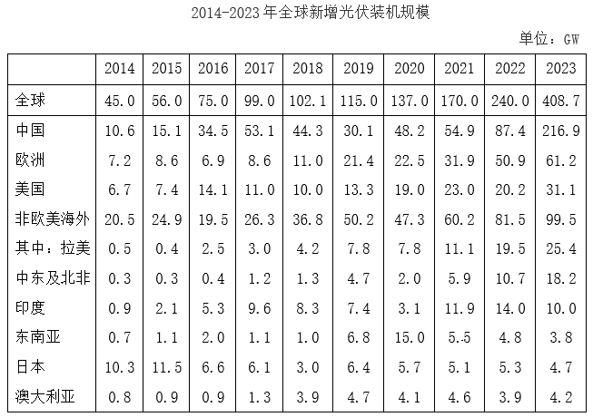
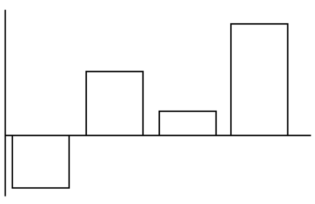

# 2025年甘肃公务员录用考试《行测》题（网友回忆版）

> 资料分析 · 15 题 · 甘肃 2025

## 材料 1

### 第 1 题　qid 13504270 · 综合

2023年全球发明专利授权量约为多少万件？

- **A**. 200　✅
- **B**. 184
- **C**. 39
- **D**. 20

**答案**：A

**官方解析**

根据题干“2023年全球发明专利······多少万件”，结合材料给出2023年数字经济核心产业全球发明专利授权量及占全球发明专利授权总量比重，可判定本题为现期比重问题。定位统计图可得：2023年数字经济核心产业全球发明专利授权量为88.79万件，占全球发明专利授权总量比重为44.4%。 根据公式：整体，可得所求万件。

故正确答案为A。

---

### 第 2 题　qid 13504272 · 增长

2017-2023年间，数字经济核心产业全球发明专利授权量同比增速不到5%的年份有几个？

- **A**. 0
- **B**. 1　✅
- **C**. 2
- **D**. 3

**答案**：B

**官方解析**

根据题干“2017-2023年······同比增速不到5%的年份有几个”，可判定本题为一般增长率问题。定位统计图可得2016-2023年每年数字经济核心产业全球发明专利授权量。根据公式：增长率，则2017-2023年，每年数字经济核心产业全球发明专利授权量的同比增速分别为：

2017年：，不符合；

2018年：，符合；

2019年：，不符合；

2020年：，不符合；

2021年：，不符合；

2022年：，不符合；

2023年：，不符合。

综上，2017-2023年间，数字经济核心产业全球发明专利授权量同比增速不到5%的年份有2018年，共1个。

故正确答案为B。

---

### 第 3 题　qid 13504274 · 比重

2023年数字产品制造业全球发明专利授权量占该年全球发明专利授权量的比重约为：

- **A**. 51.2%
- **B**. 44.4%
- **C**. 31.6%
- **D**. 22.7%　✅

**答案**：D

**官方解析**

根据题干“2023年······占该年······的比重约为”，结合材料时间为2023年，可判定本题为现期比重问题。定位统计图可知：2023年数字经济核心产业全球发明专利授权量为88.79万件，占全球发明专利授权总量比重为44.4%；定位统计表可知：2023年数字产品制造业全球发明专利授权量为454221件。根据公式：比重，可得题干所求比重为，与D项最接近。

故正确答案为D。

---

### 第 4 题　qid 13504407 · 综合

2022年，数字要素驱动业全球发明专利授权量约比数字技术应用业全球发明专利授权量多多少万件？

- **A**. 21.7
- **B**. 19.5
- **C**. 8.4
- **D**. 6.1　✅

**答案**：D

**官方解析**

根据题干“2022年······比······多多少万件”，结合材料时间为2023年，可判定本题为基期和差问题。定位表格材料可得：2023年数字要素驱动业全球发明专利授权量为258489件，同比增长21.5%；数字技术应用业全球发明专利授权量为174852件，同比增长15.1%。根据公式：基期量，则所求为万件，与D项最接近。

故正确答案为D。

---

### 第 5 题　qid 13504277 · 增长

以下折线图反映了哪一时间段内，数字经济核心产业全球发明专利授权量同比增速的变化趋势？

- **A**. 2016-2018年
- **B**. 2017-2019年　✅
- **C**. 2018-2020年
- **D**. 2020-2022年

**答案**：B

**官方解析**

根据题干“······同比增速的变化趋势”，可判定本题为一般增长率问题。定位统计图可知2016-2022年数字经济核心产业全球发明专利授权量。由于材料未给出2015年相关数据，故2016年数字经济核心产业全球发明专利授权量同比增速无法计算，排除A项。根据公式：，则2017-2022年数字经济核心产业全球发明专利授权量同比增速分别为：

2017年：；

2018年：；

2019年：；

2020年：；

2021年：；

2022年：。

观察发现，折线图先下降再上升，且第3个点高于第1个点，只有2017-2019年满足该变化趋势。

故正确答案为B。

---

## 材料 2

        截至2023年底，全国现有海水淡化工程156个，同比增加了6个。其中，万吨级及以上海水淡化工程55个，工程规模2300723吨/日，千吨及以上万吨级以下海水淡化工程51个，工程规模208266吨/日，千吨级以下海水淡化工程50个，全国海水淡化工程分布点10个省级行政区。

### 第 6 题　qid 13504524 · 增长

2020-2023年间，全国年底海水淡化工程规模同比增速最快的年份是：

- **A**. 2020年
- **B**. 2021年
- **C**. 2022年　✅
- **D**. 2023年

**答案**：C

**官方解析**

根据题干“······同比增速最快的年份是”，可判定本题为一般增长率问题。定位统计图可知2019-2023年每年全国年底海水淡化工程规模。根据公式：增长率，可得2020-2023年间，全国年底海水淡化工程规模同比增速依次为：

2020年；

2021年；

2022年；

2023年。

比较可得，2022年同比增速最快。

故正确答案为C。

---

### 第 7 题　qid 13504525 · 平均数

2022年底，我国平均每个海水淡化工程规模约在以下哪个范围内？

- **A**. 不到1.5万吨/日
- **B**. 1.5-1.6万吨/日之间　✅
- **C**. 1.6-1.7万吨/日之间
- **D**. 超过1.7万吨/日

**答案**：B

**官方解析**

根据题干“2022年底······平均每个·····”，结合材料时间为2023年，可判定本题为基期平均数问题。定位文字材料可得，2023年底全国现有海水淡化工程156个，同比增加了6个；定位统计图可得，2022年底全国海水淡化工程规模为2357048吨/日。则所求平均数吨/日=1.57万吨/日，在B项范围内。

故正确答案为B。

---

### 第 8 题　qid 12882043 · 平均数

2023年底，我国平均每个千吨级以下海水淡化工程规模约为多少吨/日？

- **A**. 279　✅
- **B**. 285
- **C**. 296
- **D**. 324

**答案**：A

**官方解析**

根据题干“2023年底······平均每个······”，结合材料时间为2023年底，可判定本题为现期平均数问题。定位文字材料可得：截至2023年底，全国万吨级及以上海水淡化工程规模为2300723吨每日，千吨及以上万吨级以下海水淡化工程规模为208266吨/日，千吨级以下海水淡化工程50个；定位统计图可得：2023年底全国海水淡化工程规模为2522956吨/日。2023年底，千吨级以下海水淡化工程规模=全国海水淡化工程规模-万吨级及以上海水淡化工程规模-千吨及以上万吨级以下海水淡化工程规模=2522956-2300723-208266=13967吨/日，则所求平均数吨/日。

故正确答案为A。

---

### 第 9 题　qid 13504526 · 比重

以下饼图中，最能准确反应2023年底浙江（黑色），山东（灰色）和其他省级行政区（白色）海水淡化工程规模占全国比重的是：

- **A**. 

- **B**. 

- **C**. 

- **D**. 

　✅

**答案**：D

**官方解析**

根据题干“以下饼图中，最能准确反应2023年底······占全国比重的是”，结合材料时间为2023年底，可判定本题为现期比重问题。定位统计图可得：2023年底全国海水淡化工程规模2522956吨/日；定位统计表可得：2023年底浙江、山东海水淡化工程规模分别为801473吨/日、713209吨/日，则，即黑色区域约是灰色区域的1.1倍，排除A、B两项。根据公式：比重，则2023年浙江、山东海水淡化工程规模之和占全国比重，即黑色区域和灰色区域占比之和超过，排除C项。

故正确答案为D。

---

### 第 10 题　qid 13504528 · 增长

以下柱状图中，最能准确反映2020~2023年间，全国年底海水淡化工程规模同比增量变化趋势的是（横轴位置代表增量为0）：

- **A**. 

　✅
- **B**. 

- **C**. 

- **D**. 

**答案**：A

**官方解析**

根据题干“······最能准确反映······同比增量变化趋势的是”，可判定本题为增长量比较问题。定位统计图可知2019-2023年每年全国年底海水淡化工程规模。根据公式：增长量=现期量-基期量，可得2020-2023年间，全国年底海水淡化工程规模同比增量依次为：

2020年吨/日；

2021年吨/日；

2022年吨/日；

2023年吨/日。

比较可知，2020年同比增量最小，排除C、D两项；2022年同比增量最大，排除B项。只有A项符合。

故正确答案为A。

---

## 材料 3

### 第 11 题　qid 13504293 · 比重

2023年，中国新增光伏装机规模占全球的比重比2019年增加了：

- **A**. 不到15个百分点
- **B**. 15-20个百分点之间
- **C**. 20-25个百分点之间
- **D**. 25个百分点以上　✅

**答案**：D

**官方解析**

根据题干“2023年······占······的比重比2019年增加了”，可判定本题为两期比重问题。定位统计表可得：2019年、2023年中国新增光伏装机规模分别为30.1GW、216.9GW，全球新增光伏装机规模分别为115.0GW、408.7GW。根据公式：比重，则所求为，即增加了25个百分点以上，在D项范围内。

故正确答案为D。

---

### 第 12 题　qid 13504295 · 增长

以下国家和地区中，2014-2023年新增光伏装机规模平均增速（以2014年为基准）最快的是：

- **A**. 欧洲
- **B**. 美国
- **C**. 拉美
- **D**. 中东及北非　✅

**答案**：D

**官方解析**

根据题干“······2014-2023年······平均增速（以2014年为基准）最快的是”，可判定本题为年均增长率问题。定位统计表可得：2014年欧洲、美国、拉美、中东及北非新增光伏装机规模分别为7.2GW、6.7GW、0.5GW、0.3GW；2023年欧洲、美国、拉美、中东及北非新增光伏装机规模分别为61.2GW、31.1GW、25.4GW、18.2GW。根据年均增长率公式：，年份差n相同，比较年均增速只需比较的大小。欧洲：；美国：；拉美：；中东及北非：，比较可得2014-2023年新增光伏装机规模平均增速最快的是中东及北非。

故正确答案为D。

---

### 第 13 题　qid 13504296 · 比重

2014-2023年间东南亚新增光伏装机规模最高的一年，当年其新增光伏装机规模占全球的比重比欧洲低：

- **A**. 不到7个百分点　✅
- **B**. 7-11个百分点之间
- **C**. 11-15个百分点之间
- **D**. 15个百分点以上

**答案**：A

**官方解析**

根据题干“2014-2023年间······占······的比重比······低”，结合材料时间为2014-2023年，可判定本题为现期比重问题。定位统计表可知2014-2023年间东南亚新增光伏装机规模，进而可得2014-2023年间，2020年东南亚新增光伏装机规模最高（15.0GW）。定位统计表可知：2020年，全球新增光伏装机规模为137.0GW，欧洲为22.5GW。根据公式：比重，则所求为，即约低5个百分点，则2020年东南亚新增光伏装机规模占全球的比重比欧洲低不到7个百分点。

故正确答案为A。

---

### 第 14 题　qid 13504297 · 增长

如持续保持2023年同比增量不变，则2021-2025年间中国新增光伏装机总规模将在以下哪个范围内？

- **A**. 不到1100GW
- **B**. 1100-1150GW
- **C**. 1150-1200GW　✅
- **D**. 超过1200GW

**答案**：C

**官方解析**

根据题干“如持续保持2023年同比增量不变，则2021-2025年间······将在以下哪个范围内”，结合材料时间为2014-2023年，可判定本题为现期计算问题。定位表格材料可得：2021-2023年，中国新增光伏装机规模分别为54.9GW、87.4GW、216.9GW。如持续保持2023年同比增量不变，根据公式：增长量=现期量-基期量，则2023年中国新增光伏装机规模同比增量=216.9-87.4=129.5GW。根据公式：现期量=基期量+增长量，则2024年中国新增光伏装机规模=216.9+129.5=346.4GW，2025年新增光伏装机规模=346.4+129.5=475.9GW，2021-2025年间中国新增光伏装机总规模GW，在C项范围内。

故正确答案为C。

---

### 第 15 题　qid 13504514 · 增长

以下柱状图反映了哪一时间段内，中国新增光伏装机规模同比增量的变化趋势（横轴位置代表增量为0）？

- **A**. 2015-2018年
- **B**. 2017-2020年
- **C**. 2018-2021年
- **D**. 2019-2022年　✅

**答案**：D

**官方解析**

根据题干“······同比增量的变化趋势······”，可判定本题为增长量比较问题。定位统计表可得2014-2022年中国新增光伏装机规模。根据公式：增长量=现期量-基期量，可得选项中各指标同比增量如下：
A项，2015年，15.1-10.6=4.5GW，同比增量＞0，而柱状图（横轴位置代表增量为0）中第一年的同比增量＜0，不符合柱状图变化趋势，排除；
B项，2017年，53.1-34.5=18.6GW，同比增量＞0，而柱状图（横轴位置代表增量为0）中第一年的同比增量＜0，不符合柱状图变化趋势，排除；
C项，2018年，44.3-53.1=-8.8 GW；2019年，30.1-44.3=-14.2GW，同比增量＜0，而柱状图（横轴位置代表增量为0）中第二年的同比增量＞0，不符合柱状图变化趋势，排除；
D项,2019年，30.1-44.3=-14.2GW；2020年，48.2-30.1=18.1GW；2021年，54.9-48.2=6.7GW；2022年，87.4-54.9=32.5GW。符合柱状图变化趋势，当选。
故正确答案为D。

---
