# 2025年辽宁省公务员录用考试《行测》题（网友回忆版）

> 资料分析 · 20 题 · 辽宁 2025

## 材料 1

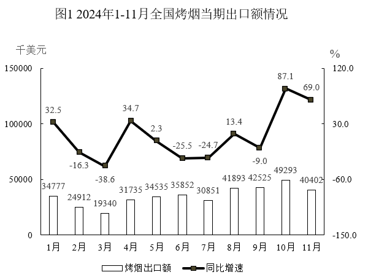

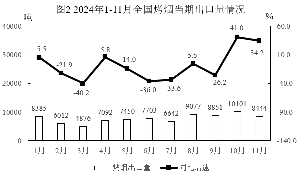

### 第 1 题　qid 13504643 · 综合

2023年6月全国烤烟当期出口额大约是：

- **A**. 不到40百万美元
- **B**. 40～50百万美元　✅
- **C**. 50～60百万美元
- **D**. 超过60百万美元

**答案**：B

**官方解析**

根据题干“2023年6月······出口额大约是”，结合材料时间涉及2024年6月，可判定本题为基期计算问题。定位统计图1可得：2024年6月，全国烤烟当期出口额为35852千美元，同比增长-25.5%。根据公式：基期量，则2023年6月全国烤烟当期出口额百万美元，在B项范围内。

故正确答案为B。

---

### 第 2 题　qid 13504644 · 综合

2024年7月全国烤烟当期出口量比2023年7月：

- **A**. 增加不到3500吨
- **B**. 增加超过3500吨
- **C**. 减少不到3500吨　✅
- **D**. 减少超过3500吨

**答案**：C

**官方解析**

根据题干“2024年7月······比2023年7月”，结合选项为增加/减少+单位，可判定本题为增长量计算问题。定位图2可得：2024年7月全国烤烟当期出口量为6642吨，同比增长-33.6%。根据公式：增长量，则题干所求为吨，即约减少3321吨，故减少不到3500吨。

故正确答案为C。

---

### 第 3 题　qid 13504645 · 增长

2024年11月全国烤烟当期出口均价（出口均价）的同比增速大约是：

- **A**. 不到20%
- **B**. 20%~30%　✅
- **C**. 30%~40%
- **D**. 超过40%

**答案**：B

**官方解析**

根据题干“2024年11月······出口均价······的同比增速大约是”，结合题干所给公式：出口均价，可判定本题为平均数的增长率问题。定位图1可得，2024年11月全国烤烟当期出口额同比增速为69.0%（a）；定位图2可得，2024年11月全国烤烟当期出口量同比增速为34.2%（b）。根据公式：平均数的增长率，则所求，在B项范围内。

故正确答案为B。

---

### 第 4 题　qid 13504646 · 综合

2024年第一季度全国烤烟出口均价大约是：

- **A**. 不到4千美元/吨
- **B**. 4~4.5千美元/吨　✅
- **C**. 4.5~5千美元/吨
- **D**. 超过5千美元/吨

**答案**：B

**官方解析**

根据题干“2024年第一季度······出口均价大约是”，结合材料给出2024年相关数据，可判定本题为现期平均数问题。定位统计图1可得：2024年1-3月全国烤烟出口额分别为34777千美元、24912千美元、19340千美元；定位统计图2可得：2024年1-3月全国烤烟出口量分别为8385吨、6012吨、4876吨。则题干所求为千美元/吨，在B项范围内。

故正确答案为B。

---

### 第 5 题　qid 13504647 · 增长

以下折线图中，能够代表2024年第三季度各月全国烤烟出口额的环比增速变化的是：

- **A**. 

- **B**. 

- **C**. 

　✅
- **D**. 

**答案**：C

**官方解析**

根据题干“······环比增速变化的是”，可判定本题为一般增长率问题。定位统计图1可得：2024年6-9月全国烤烟出口额分别为35852千美元、30851千美元、41893千美元、42525千美元。根据公式：增长率，可得2024年第三季度各月全国烤烟出口额的环比增速分别为：7月；8月；9月。说明2024年第三季度中7月全国烤烟出口额的环比增速最小，即图中第一个点应为最低点，只有C项符合。

故正确答案为C。

---

## 材料 2

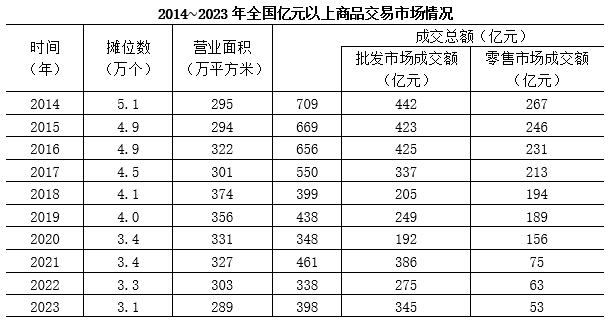

### 第 6 题　qid 13504648 · 增长

2023年全国亿元以上商品交易市场成交总额同比增速较2019年：

- **A**. 提高不到10个百分点　✅
- **B**. 提高超过10个百分点
- **C**. 降低不到10个百分点
- **D**. 降低超过10个百分点

**答案**：A

**官方解析**

根据题干“2023年······同比增速较2019年”，结合选项为“提高/降低+百分点”，可判定本题为一般增长率问题。定位统计表可得： 2018年、2019年、2022年、2023年全国亿元以上商品交易市场成交总额分别为399亿元、438亿元、338亿元、398亿元。根据公式：增长率，可得2019年全国亿元以上商品交易市场成交总额的同比增长率为，2023年的同比增长率为，18%-10%=8%，即2023年全国亿元以上商品交易市场成交总额同比增速较2019年提高了8个百分点，在A项范围内。

故正确答案为A。

---

### 第 7 题　qid 13504649 · 比重

2014～2023年全国亿元以上商品交易市场中批发市场成交额所占比重低于60%的有：

- **A**. 1年
- **B**. 2年
- **C**. 3年　✅
- **D**. 4年

**答案**：C

**官方解析**

根据题干“2014~2023年······所占比重低于60%的有”，结合材料时间为2014~2023年，可判定本题为现期比重问题。定位统计表可得2014~2023年全国亿元以上商品交易市场成交额及批发市场成交额。根据公式：比重，则2014~2023年全国亿元以上商品交易市场中批发市场成交额所占比重分别为：

2014年：，不符合；

2015年：，不符合；

2016年：，不符合；

2017年：，不符合；

2018年：，符合；

2019年：，符合；

2020年：，符合；

2021年：，不符合；

2022年：，不符合；

2023年：，不符合。

综上，2014~2023年全国亿元以上商品交易市场中批发市场成交额所占比重低于60%的年份有2018年，2019年，2020年，共3年。

故正确答案为C。

---

### 第 8 题　qid 13504650 · 平均数

2017-2020年全国亿元以上商品交易市场每个摊位平均成交额由高到低排序正确的是：

- **A**. 2017年、2019年、2018年、2020年
- **B**. 2017年、2020年、2019年、2018年
- **C**. 2018年、2020年、2019年、2017年
- **D**. 2017年、2019年、2020年、2018年　✅

**答案**：D

**官方解析**

根据题干“2017-2020年······每个摊位平均成交额由高到低排序正确的是”，可判定本题为现期平均数问题。定位统计表可得：2017-2020年，全国亿元以上商品交易市场摊位数和成交总额。根据公式：平均数，则2017-2020年全国亿元以上商品交易市场每个摊位平均成交额分别为：

2017年：万元/个；

2018年：万元/个；

2019年：万元/个；

2020年：万元/个。

综上，每个摊位平均成交额由高到低排序为2017年，2019年，2020年，2018年。

故正确答案为D。

---

### 第 9 题　qid 13504651 · 增长

2023年全国亿元以上商品交易市场单位面积成交额同比增量大约是：

- **A**. 不到2000元/平方米
- **B**. 2000～3000元/平方米　✅
- **C**. 3000～4000元/平方米
- **D**. 超过4000元/平方米

**答案**：B

**官方解析**

根据题干“2023年······单位面积成交额同比增量······”，可判定本题为平均数的增长量问题。定位统计表可得：2022年全国亿元以上商品交易市场营业面积303万平方米，成交总额338亿元；2023年全国亿元以上商品交易市场营业面积289万平方米，成交总额398亿元。根据公式：单位面积成交额，则所求增量1.38万元/平方米-1.12万元/平方米=0.26万元/平方米=2600元/平方米，在B项范围内。

故正确答案为B。 

---

### 第 10 题　qid 13504652 · 增长

以下信息能够从上述资料中推出的有：
①2015-2023年全国亿元以上商品交易市场中零售市场成交额同比减少最多的年份，其批发市场成交额同比增加超过50亿元
②2014-2023年全国亿元以上商品交易市场每个摊位平均成交额只有1年低于100万元
③2021-2023年全国亿元以上商品交易市场单位面积成交额同比增速最快的是2021年

- **A**. 0项
- **B**. 1项
- **C**. 2项
- **D**. 3项　✅

**答案**：D

**官方解析**

①：定位表格材料可知2014-2023年全国亿元以上商品交易市场批发及零售市场成交额。根据公式：增长量=现期量-基期量，则2015-2023年全国亿元以上商品交易市场零售市场成交额同比增长量分别为：2015年，246-267=-21亿元；2016年，231-246=-15亿元；2017年，213-231=-18亿元；2018年，194-213=-19亿元；2019年，189-194=-5亿元；2020年，156-189=-33亿元；2021年，75-156=-81亿元；2022年，63-75=-12亿元；2023年，53-63=-10亿元，观察可知零售市场成交额同比减少最多的年份为2021年，则2021年批发市场成交额同比增加386-192=194&gt;50亿元，正确；

②：定位表格材料可知2014-2023年全国亿元以上商品交易市场成交总额及摊位数。根据公式：每个摊位平均成交额，则2014-2023年全国亿元以上商品交易市场每个摊位平均成交额分别为：2014年，万元；2015年，万元；2016年，万元；2017年，万元；2018年，万元；2019年，万元；2020年，万元；2021年，万元；2022年，万元；2023年，万元，观察可知每个摊位平均成交额低于100万元的只有2018年，正确；

③：定位表格材料可知2020-2023年全国亿元以上商品交易市场成交总额及营业面积。根据公式：单位面积成交额，则2020-2023年全国亿元以上商品交易市场单位面积成交额分别为：2020年，万元/平方米；2021年，万元/平方米；2022年，万元/平方米；2023年，万元/平方米。根据公式：，则2021-2023年全国亿元以上商品交易市场单位面积成交额同比增速分别为：2021年，；2022年，；2023年，，比较可知同比增速最快的是2021年，正确。

综上，①②③均能推出。

故正确答案为D。

---

## 材料 3

        2024年7月，规模以上工业发电量8831亿千瓦时，同比增长2.5％，增速比6月加快0.2个百分点；规模以上工业日均发电量284.9亿千瓦时。

        2024年1~7月，规模以上工业发电量53239亿千瓦时，同比增长4.8％。分品种看，2024年7月，规模以上工业火电发电量同比下降4.9％，规模以上工业水电发电量同比增长36.2％，规模以上工业核电发电量同比增长4.3％，规模以上工业风电发电量同比增长0.9％，规模以上工业太阳能发电量同比增长16.4％。

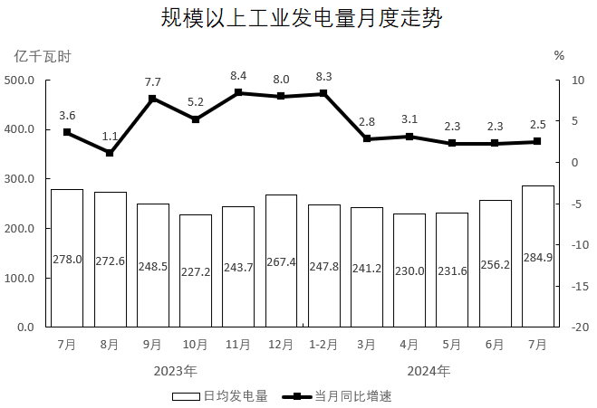

### 第 11 题　qid 13504653 · 综合

2023年上半年规模以上工业发电量约为：

- **A**. 3.9万亿千瓦时
- **B**. 4.2万亿千瓦时　✅
- **C**. 4.5万亿千瓦时
- **D**. 5.1万亿千瓦时

**答案**：B

**官方解析**

根据题干“2023年上半年······约为”，结合材料时间为2024年1-7月和7月，可判定本题为基期和差问题。定位文字资料第一段可得：2024年7月，规模以上工业发电量8831亿千瓦时，同比增长2.5%；定位文字资料第二段可得：2024年1-7月，规模以上工业发电量53239亿千瓦时，同比增长4.8%。根据公式：基期量，则题干所求亿千瓦时=4.213万亿千瓦时，与B项最接近。

故正确答案为B。

---

### 第 12 题　qid 13504654 · 比重

2024年7月，规模以上工业五种发电形式的发电量分别占规模以上工业总发电量的比重较2023年7月下降的品种共有：

- **A**. 1种
- **B**. 2种　✅
- **C**. 3种
- **D**. 4种

**答案**：B

**官方解析**

根据题干“2024年7月······占······的比重较2023年7月下降的品种共有”，可判定本题为两期比重问题。定位文字材料第一段可得：2024年7月，规模以上工业发电量同比增长2.5％（b）；定位文字材料第二段可得2024年7月规模以上工业五种发电形式的发电量同比增速，分别为：火电-4.9%（），水电36.2%（），核电4.3%（），风电0.9%（），太阳能16.4%（）。根据两期比重比较的结论：当部分增长率（a）&lt;整体增长率（b）时，比重下降。则满足a&lt;b的有：火电-4.9%（），风电0.9%（），共有2种。

故正确答案为B。

---

### 第 13 题　qid 13504655 · 综合

2023年第三季度，规模以上工业发电量约为：

- **A**. 不到2.3万亿千瓦时
- **B**. 2.3~2.4万亿千瓦时
- **C**. 2.4~2.5万亿千瓦时　✅
- **D**. 2.5万亿千瓦时以上

**答案**：C

**官方解析**

根据题干“2023年第三季度······约为”，结合材料给出2023年7-9月各月规模以上工业日均发电量，可判定本题为现期平均数问题。定位统计图可得：2023年7-9月规模以上工业日均发电量分别为278.0亿千瓦时、272.6亿千瓦时、248.5亿千瓦时。根据公式：总数=平均数×天数，则2023年第三季度规模以上工业发电量亿千瓦时万亿千瓦时，在C项范围内。

故正确答案为C。

---

### 第 14 题　qid 13504656 · 综合

2023年第二季度，规模以上工业日均发电量由大到小排序正确的是：

- **A**. 4月、5月、6月
- **B**. 5月、6月、4月
- **C**. 6月、4月、5月
- **D**. 6月、5月、4月　✅

**答案**：D

**官方解析**

根据题干“2023年第二季度······发电量由大到小排序正确的是”，结合材料给出2024年4-6月相关数据，可判定本题为基期比较问题。定位统计图可知2024年4-6月规模以上工业日均发电量及其同比增速。根据公式：基期量，则2023年4-6月，规模以上工业日均发电量分别为：4月，亿千瓦时；5月，亿千瓦时；6月，亿千瓦时。

在三个分数中，4月对应分数的分子最小，分母最大，则4月对应分数值最小，可排除A、C两项；其余两个分数分母相同，分子大的分数值大，则6月分数值最大，5月分数值次大。因此，2023年第二季度，规模以上工业日均发电量由大到小排序为：6月、5月、4月。

故正确答案为D。

---

### 第 15 题　qid 13504657 · 增长

以下折线图中，能正确反映2022年第四季度各月日均发电量的环比增长率变化的是：

- **A**. 
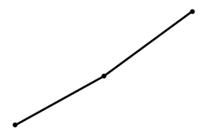
　✅
- **B**. 
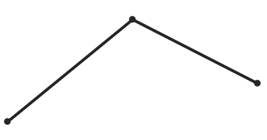

- **C**. 

- **D**. 
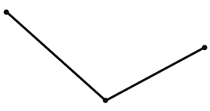

**答案**：A

**官方解析**

方法一：根据题干“······能正确反映2022年第四季度各月日均发电量的环比增长率变化的是”，可判定本题为一般增长率比较问题。定位统计图可得2023年9-12月日均发电量及其同比增速。根据公式：基期量，可得2022年9-12月各月日均发电量分别为：9月，亿千瓦时；10月，亿千瓦时；11月，亿千瓦时；12月，亿千瓦时。根据公式：增长率，可得2022年第四季度各月日均发电量的环比增长率分别为：10月，；11月，；12月，，比较可知，12月最大，10月最小，只有A项符合。

方法二：根据增长率比较技巧：若大，则增长率大。题目所需比较的2022年第四季度各月日均发电量的环比增长率，故只需比较即可。结合材料时间为2023年，可判定本题为基期倍数问题。定位统计图可得2023年9-12月日均发电量及其同比增速。根据公式：基期倍数，可得2022年第四季度各月环比倍数分别为：

10月，；

11月，；

12月，。

比较可知12月&gt;10月，排除C、D两项；12月&gt;11月，排除B项。

故正确答案为A。

---

## 材料 4

        2023年末，全国群众文化机构的实际使用房屋建筑面积5631.6万平方米，同比增长7.8%，全国平均每万人群众文化设施建筑面积399.5平方米，同比增长6.5%。

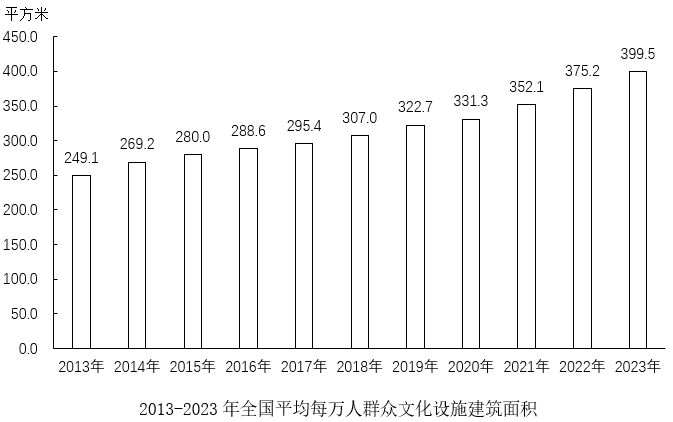

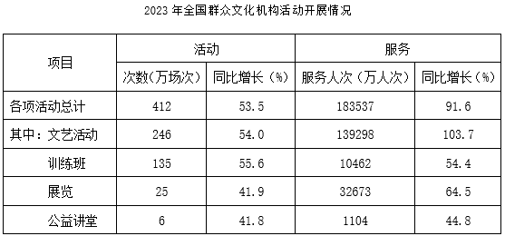

### 第 16 题　qid 13504658 · 综合

2022年末，全国群众文化机构实际使用房屋建筑面积约为：

- **A**. 不到5100万平方米
- **B**. 5100~5200万平方米
- **C**. 5200~5300万平方米　✅
- **D**. 5300万平方米以上

**答案**：C

**官方解析**

根据题干“2022年末······面积约为”，结合材料时间为2023年末，可判定本题为基期计算问题。定位文字材料可得：2023年末，全国群众文化机构的实际使用房屋建筑面积5631.6万平方米，同比增长7.8%。根据公式：基期量，可得所求万平方米。

故正确答案为C。

---

### 第 17 题　qid 13504659 · 比重

2023年，展览活动的服务人次占各项活动总服务人次的比重较2022年：

- **A**. 增加不到5个百分点
- **B**. 增加至少5个百分点
- **C**. 下降不到5个百分点　✅
- **D**. 下降至少5个百分点

**答案**：C

**官方解析**

根据题干“2023年······占······的比重较2022年”，结合选项为增加/下降+百分点，可判定本题为两期比重问题。定位表格资料可知，2023年全国各项活动的总计服务人次为183537万人次（B），同比增长91.6%（b）；展览活动的服务人次为32673万人次（A），同比增长64.5%（a）。根据两期比重差公式：，则所求比重差，约下降3个百分点，即下降不到5个百分点。

故正确答案为C。

---

### 第 18 题　qid 13504660 · 增长

2014~2023年，全国平均每万人群众文化设施建筑面积的同比增量超过20平方米的年份有：

- **A**. 3年
- **B**. 4年　✅
- **C**. 5年
- **D**. 6年

**答案**：B

**官方解析**

根据“2014~2023年······同比增量超过20平方米······”，可判定本题为增长量计算问题。定位统计图可得：2013-2023年全国平均每万人群众文化设施建筑面积。根据公式：增长量=现期量-基期量，可得2014-2023年，全国平均每万人群众文化设施建筑面积同比增量分别为：
2014年同比增量=269.2-249.1=20.1平方米；
2015年同比增量=280.0-269.2=10.8平方米；
2016年同比增量=288.6-280.0=8.6平方米；
2017年同比增量=295.4-288.6=6.8平方米；
2018年同比增量=307.0-295.4=11.6平方米；
2019年同比增量=322.7-307.0=15.7平方米；
2020年同比增量=331.3-322.7=8.6平方米；
2021年同比增量=352.1-331.3=20.8平方米；
2022年同比增量=375.2-352.1=23.1平方米；
2023年同比增量=399.5-375.2=24.3平方米。
则2014~2023年，全国平均每万人群众文化设施建筑面积的同比增量超过20平方米的年份有2014年、2021年、2022年和2023年，共4个年份。
故正确答案为B。

---

### 第 19 题　qid 13504661 · 平均数

2022年文艺活动平均每场次活动服务的人次约为：

- **A**. 不到400人次
- **B**. 400～450人次　✅
- **C**. 450～500人次
- **D**. 500人次以上

**答案**：B

**官方解析**

根据题干“2022年······平均每场次活动服务的人次约为”，结合材料时间为2023年，可判定本题为基期平均数问题。定位统计表可知，2023年全国文艺活动为246万场次（B），同比增长54.0%（b）；服务人次为139298万人次（A），同比增长103.7%（a）。根据公式：基期平均数，则2022年文艺活动平均每场次活动服务的人次为人次，在B项范围内。

故正确答案为B。

---

### 第 20 题　qid 13504662 · 增长

以下折线图中，能准确反映2019~2021年全国平均每万人群众文化设施建筑面积同比增长率变化趋势的是：

- **A**. 
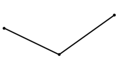
　✅
- **B**. 
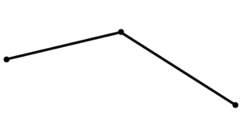

- **C**. 

- **D**. 
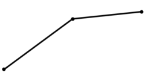

**答案**：A

**官方解析**

根据题干“······能准确反映2019~2021年······同比增长率变化趋势的是”，可判定本题为一般增长率问题。定位统计图可知：2018~2021年全国平均每万人群众文化设施建筑面积分别为307.0平方米、322.7平方米、331.3平方米、352.1平方米。根据公式：增长率，可得2019~2021年全国平均每万人群众文化设施建筑面积同比增长率分别为：

2019年，；

2020年，；

2021年，。

比较可知，2021年同比增长率最大、2020年同比增长率最小，只有A项符合。

故正确答案为A。

---
