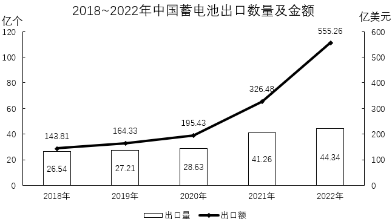
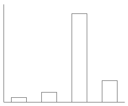
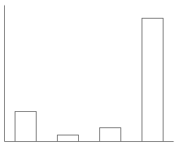
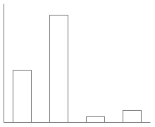
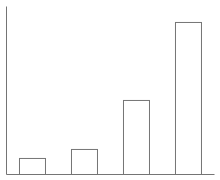
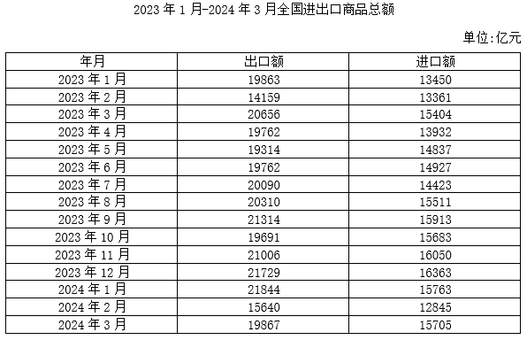
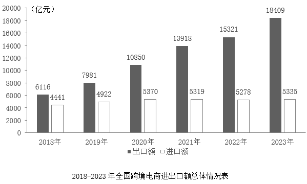
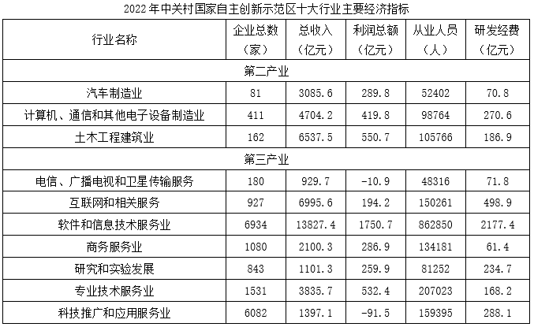

# 2025年重庆市定向选调优秀大学生到基层工作考试《行测》题

> 资料分析 · 15 题 · 选调 2025

## 材料 1

        2023年1~5月，中国蓄电池出口量16.81亿个，同比下降9.4%；出口金额283.77亿美元，同比增长58.2%。

### 第 1 题　qid 14096257 · 综合

2022年1~5月，中国蓄电池出口量在以下哪个范围内？

- **A**. 不到16亿个
- **B**. 16亿个~17亿个之间
- **C**. 17亿个~18亿个之间
- **D**. 超过18亿个　✅

**答案**：D

**官方解析**

根据题干“2022年1~5月，中国蓄电池出口量在以下哪个范围内”，结合材料时间为2023年1~5月，可判定本题为基期计算问题。定位文字材料可知：2023年1~5月，中国蓄电池出口量16.81亿个，同比下降9.4%。根据公式：基期量，则2022年1~5月中国蓄电池出口量为亿个，即超过18亿个。

故正确答案为D。

---

### 第 2 题　qid 14096260 · 综合

2022年6~12月，中国蓄电池月均出口额约为多少亿美元？

- **A**. 21
- **B**. 35
- **C**. 54　✅
- **D**. 79

**答案**：C

**官方解析**

根据题干“2022年6~12月······月均出口额约为多少亿美元”，结合材料已知2022年、2023年1~5月出口额相关数据，可判定本题为现期平均数问题。定位文字材料可知：2023年1~5月，中国蓄电池出口金额283.77亿美元，同比增长58.2%；定位统计图可知：2022年中国蓄电池出口金额555.26亿美元。根据公式：基期量，则2022年1~5月中国蓄电池出口金额为亿美元。根据公式：月均出口额，则2022年6~12月中国蓄电池月均出口额亿美元。

故正确答案为C。

---

### 第 3 题　qid 14096261 · 增长

以下柱状图中，最能准确反映2019~2022年间中国蓄电池出口数量同比增量变化趋势的是（横轴位置代表增量为0）：

- **A**. 

　✅
- **B**. 

- **C**. 

- **D**. 

**答案**：A

**官方解析**

根据题干“······最能准确反映2019~2022年间······同比增量变化趋势······”，可判定本题为增长量比较问题。定位统计图可知：2018~2022年中国蓄电池出口量分别为26.54亿个、27.21亿个、28.63亿个、41.26亿个、44.34亿个。根据公式：增长量=现期量-基期量，可得2019~2022年中国蓄电池出口数量的同比增量分别为：
2019年，27.21-26.54=0.67亿个；
2020年，28.63-27.21=1.42亿个；
2021年，41.26-28.63=12.63亿个；
2022年，44.34-41.26=3.08亿个。
综上可知，2021年中国蓄电池出口数量的同比增量最大，可排除B、C、D三项，只有A项满足。
故正确答案为A。

---

### 第 4 题　qid 14096263 · 增长

2019~2022年，中国蓄电池出口数量和金额同比增长率均超过20%的年份有几个？

- **A**. 0
- **B**. 1　✅
- **C**. 2
- **D**. 3

**答案**：B

**官方解析**

根据题干“2019~2022年······同比增长率均超过20%的年份有几个”，可判定本题为一般增长率问题。定位统计图可得2018~2022年中国蓄电池出口数量和金额。根据公式：增长率，则2019~2022年，中国蓄电池出口数量和金额同比增长率分别为：

2019年出口数量：，不满足；

2020年出口数量：，不满足；

2021年出口数量：；出口金额：，满足；

2022年出口数量：，不满足。

综上，2019~2022年，中国蓄电池出口数量和金额同比增长率均超过20%的年份只有1个（2021年）。

故正确答案为B。

---

### 第 5 题　qid 14096264 · 综合

不能从上述资料中推出的是：

- **A**. 2019~2022年，中国蓄电池出口数量同比增速最快的年份是2021年
- **B**. 2023年1~5月，中国蓄电池平均出口单价比去年上涨了不到50%　✅
- **C**. 2019~2022年，中国蓄电池出口金额同比增量逐年递增
- **D**. 2022年，中国蓄电池平均出口单价高于2018年水平

**答案**：B

**官方解析**

A项：定位统计图可得：2018~2022年中国蓄电池出口数量分别为26.54亿个、27.21亿个、28.63亿个、41.26亿个、44.34亿个。根据公式：增长率，则2019~2022年，中国蓄电池出口数量同比增速分别为：2019年，；2020年，；2021年，；2022年，。故2019~2022年，中国蓄电池出口数量同比增速最快的年份是2021年，正确；

B项：定位文字材料可得：2023年1~5月，中国蓄电池出口量同比下降9.4%（b），出口金额同比增长58.2%（a）。根据公式：平均数的增长率，则2023年1~5月，中国蓄电池平均出口单价比去年上涨，错误；

C项：定位统计图可得：2018~2022年中国蓄电池出口金额分别为143.81亿美元、164.33亿美元、195.43亿美元、326.48亿美元、555.26亿美元。根据公式：增长量=现期量-基期量，则2019~2022年，中国蓄电池出口金额同比增量分别为：2019年，164.33-143.81=20.52亿美元；2020年，195.43-164.33=31.1亿美元；2021年，326.48-195.43=131.05亿美元；2022年，555.26-326.48=228.78亿美元。故2019~2022年，中国蓄电池出口金额同比增量逐年递增，正确；

D项：定位统计图可得：2018年中国蓄电池出口数量为26.54亿个，出口金额为143.81亿美元；2022年中国蓄电池出口数量为44.34亿个，出口金额为555.26亿美元。根据公式：平均出口单价，则2018年中国蓄电池平均出口单价美元/个，2022年中国蓄电池平均出口单价美元/个，故2022年中国蓄电池平均出口单价高于2018年水平，正确。

本题为选非题，故正确答案为B。

---

## 材料 2

### 第 6 题　qid 14096272 · 综合

2024年第一季度，全国进出口商品贸易顺差约为多少万亿元？

- **A**. 1.1
- **B**. 1.3　✅
- **C**. 1.5
- **D**. 1.7

**答案**：B

**官方解析**

定位统计表可得：2024年1-3月，全国出口商品总额分别为21844亿元、15640亿元、19867亿元；进口商品总额分别为15763亿元、12845亿元、15705亿元。根据公式：进出口商品贸易顺差=出口商品总额-进口商品总额，则题干所求为亿元=1.3万亿元。

故正确答案为B。

---

### 第 7 题　qid 14096273 · 综合

2023年，全国跨境电商进口额约占进口商品总额的（    ）。

- **A**. 3%　✅
- **B**. 5%
- **C**. 8%
- **D**. 10%

**答案**：A

**官方解析**

根据题干“2023年······占······”，结合材料给出2023年相关数据，可判定本题为现期比重问题。定位统计表可得2023年1-12月全国进口商品总额；定位统计图可得，2023年，全国跨境电商进口额为5335亿元。则2023年全国进口商品总额为13450+13361+15404+13932+14837+14927+14423+15511+15913+15683+16050+1636313000+13000+15000+14000+15000+15000+14000+16000+16000+16000+16000+16000=179000亿元。根据公式：比重，则题干所求为。

故正确答案为A。

---

### 第 8 题　qid 14096274 · 增长

2020-2023年，全国跨境电商进出口总额同比增长不超过10%的年份是：

- **A**. 2020
- **B**. 2021
- **C**. 2022　✅
- **D**. 2023

**答案**：C

**官方解析**

根据题干“2020-2023年······同比增长不超过10%······”，可判定本题为一般增长率问题。定位统计图可得2019-2023年全国跨境电商进口额及出口额，则2019-2023年全国跨境电商进出口总额分别为：2019年，7981+4922=12903亿元；2020年，10850+5370=16220亿元；2021年，13918+5319=19237亿元；2022年，15321+5278=20599亿元；2023年，18409+5335=23744亿元。根据公式：增长率，则2020-2023年，全国跨境电商进出口总额同比增长率分别为：

2020年，；

2021年，；

2022年，；

2023年，。

综上，同比增长不超过10%的年份是2022年。

故正确答案为C。

---

### 第 9 题　qid 14096275 · 增长

2023年2月-2024年3月，全国进口商品总额和出口商品总额均环比增长的月份有几个？

- **A**. 4
- **B**. 5
- **C**. 6
- **D**. 7　✅

**答案**：D

**官方解析**

定位统计表可得2023年1月-2024年3月全国进口商品总额和出口商品总额。环比增长，即现期量&gt;基期量，则2023年2月-2024年3月，全国进口商品总额实现环比增长的月份有2023年3月、2023年5月、2023年6月、2023年8月、2023年9月、2023年11月、2023年12月、2024年3月；全国出口商品总额实现环比增长的月份有2023年3月、2023年6月、2023年7月、2023年8月、2023年9月、2023年11月、2023年12月、2024年1月、2024年3月。因此，2023年2月-2024年3月，全国进口商品总额和出口商品总额均实现环比增长的月份有2023年3月、2023年6月、2023年8月、2023年9月、2023年11月、2023年12月、2024年3月，共7个。
故正确答案为D。

---

### 第 10 题　qid 14096276 · 综合

将2023年①第一季度、②第二季度、③第三季度、④第四季度全国进出口商品贸易顺差由高到低排序，正确的是（    ）。

- **A**. ②④③①
- **B**. ②③④①
- **C**. ③④②①
- **D**. ③②④①　✅

**答案**：D

**官方解析**

定位统计表可得2023年1-12月全国商品进口额、出口额，则2023年第一季度出口总额为19863+14159+2065619900+14200+20700=54800亿元，2023年第一季度进口总额为13450+13361+1540413500+13400+15400=42300亿元；2023年第二季度出口总额为19762+19314+1976219800+19300+19800=58900亿元，2023年第二季度进口总额为13932+14837+1492713900+14800+14900=43600亿元；2023年第三季度出口总额为20090+20310+2131420100+20300+21300=61700亿元，2023年第三季度进口总额为14423+15511+1591314400+15500+15900=45800亿元；2023年第四季度出口总额为19691+21006+2172919700+21000+21700=62400亿元，2023年第四季度进口总额为15683+16050+1636315700+16100+16400=48200亿元。根据公式：贸易顺差=出口额-进口额，则2023年第一季度贸易顺差为54800-42300=12500亿元；2023年第二季度贸易顺差为58900-43600=15300亿元；2023年第三季度贸易顺差为61700-45800=15900亿元；2023年第四季度贸易顺差为62400-48200=14200亿元。

综上，全国进出口商品贸易顺差由高到低排序为2023年第三季度（③）、2023年第二季度（②）、2023年第四季度（④）、2023年第一季度（①）。

故正确答案为D。

---

## 材料 3

### 第 11 题　qid 14096285 · 综合

2022年，中关村国家自主创新示范区十大行业总计有企业约多少万家？

- **A**. 1.4
- **B**. 1.6
- **C**. 1.8　✅
- **D**. 2.0

**答案**：C

**官方解析**

定位统计表可得2022年中关村国家自主创新示范区十大行业各个行业的企业总数。则十大行业企业总数万家，与C项最接近。

故正确答案为C。

---

### 第 12 题　qid 14096296 · 综合

2022年，中关村国家自主创新示范区十大行业中，第三产业从业人员约是第二产业的多少倍？

- **A**. 不到6倍
- **B**. 6倍～7倍之间　✅
- **C**. 7倍～8倍之间
- **D**. 8倍以上

**答案**：B

**官方解析**

根据题干“2022年······是······的多少倍”，结合材料时间为2022年，可判定本题为现期倍数问题。定位统计表可得2022年中关村国家自主创新示范区十大行业中第二产业、第三产业各个行业的从业人员数。则题干所求倍数为，在B项范围内。

故正确答案为B。

---

### 第 13 题　qid 14096297 · 综合

以下所列行业中，2022年研发经费与总收入比值最高的是（    ）。

- **A**. 汽车制造业
- **B**. 土木工程建筑业
- **C**. 互联网和相关服务　✅
- **D**. 商务服务业

**答案**：C

**官方解析**

根据题干“······2022年研发经费与总收入比值最高的是”，可判定本题为比值比较问题。定位统计表可知2022年汽车制造业、土木工程建筑业、互联网和相关服务以及商务服务业的研发经费与总收入。则各选项的比值分别为：

A项，汽车制造业：；

B项，土木工程建筑业：；

C项，互联网和相关服务：；

D项，商务服务业：。

比较发现，比值最高的是互联网和相关服务。

故正确答案为C。

---

### 第 14 题　qid 14096298 · 综合

中关村国家自主创新示范区十大行业中的第三产业行业中，2022年利润率（）超过20%的有几个？

- **A**. 1　✅
- **B**. 2
- **C**. 3
- **D**. 4

**答案**：A

**官方解析**

根据题干“······2022年利润率（）超过20%的有几个”，结合材料时间为2022年，可判定本题为现期比重问题。定位统计表可知2022年中关村国家自主创新示范区十大行业中的第三产业各行业的利润总额和总收入。则各行业的利润率分别为：

电信、广播电视和卫星传输服务：；

互联网和相关服务：；

软件和信息技术服务业：；

商务服务业：；

研究和实验发展：；

专业技术服务业：；

科技推广和应用服务业：。

比较可知，2022年利润率超过20%的行业有研究和实验发展，共1个。

故正确答案为A。

---

### 第 15 题　qid 14096300 · 比重

以下饼图反映了2022年，中关村国家自主创新示范区十大行业的三个第二产业行业中，哪一指标的占比关系？

- **A**. 总收入
- **B**. 利润总额
- **C**. 从业人员
- **D**. 研发经费　✅

**答案**：D

**官方解析**

根据题干“以下饼图反映了2022年······哪一指标的占比关系”，结合材料时间为2022年，可判定本题为现期比重问题。定位统计表可知2022年中关村国家自主创新示范区十大行业的三个第二产业行业的总收入、利润总额、从业人员和研发经费。观察饼状图发现，第二块扇形图（白色扇形）占比最大，即某个指标中，计算机、通信和其他电子设备制造业在三个第二产业行业中最大，仅研发经费（270.6亿元）符合。
故正确答案为D。

---
