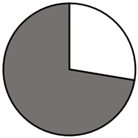
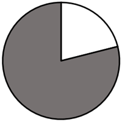
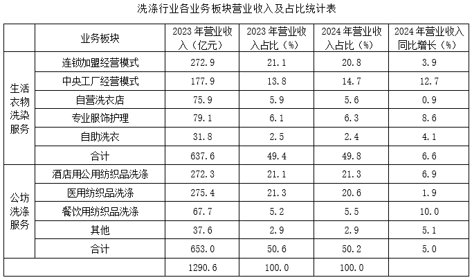
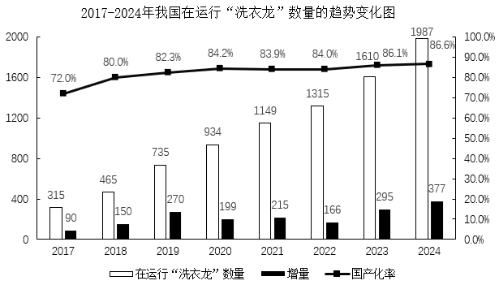
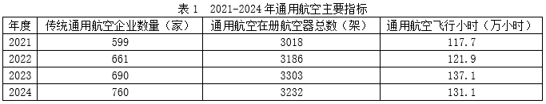
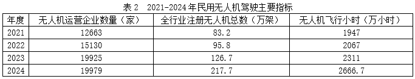
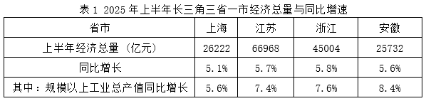
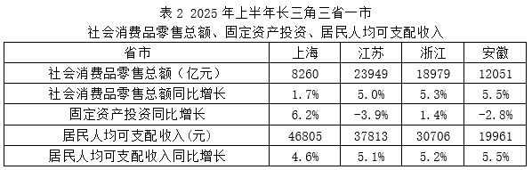
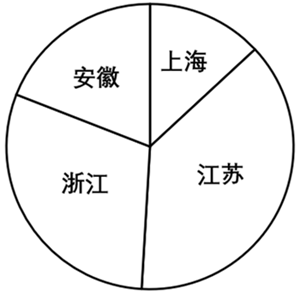

# 2026年上海市公务员录用考试《行测》题（网友回忆版）

> 资料分析 · 20 题 · 上海 2026

## 材料 1

        上海博物馆“金字塔之巅：古埃及文明大展”持续13个月，汇集788件古埃及不同时期的珍贵文物；在该展340多个开放日当中，接待观众277.8万人次，其中，近七成来自外省市。展期最后一周推出“7×24小时”观展，深夜场每场提供3000个名额，其中8月16日24小时开放中，接待观众23149人次。展览总营收超7.6亿元，其中门票收入超3.2亿元，文创店商品及周边衍生产品收入超4.4亿元。有关分析报告显示，该展拉动城市消费比例达1：48，即每1元展览营收带动48元综合消费。

### 第 1 题　qid 19452623 · 综合

上海“金字塔之巅：古埃及文明大展”的月均观展人次约为        万人次。

- **A**. 21　✅
- **B**. 22
- **C**. 23
- **D**. 24

**答案**：A

**官方解析**

根据题干“······月均······”，可判定本题为现期平均数问题。定位文字材料可得：上海博物馆“金字塔之巅：古埃及文明大展”持续13个月，接待观众277.8万人次。根据公式：平均数，则所求月均观展人次为万人次，与A项最接近。

故正确答案为A。

---

### 第 2 题　qid 19452624 · 比重

下列图形中，        图的阴影部分能反映该展的文创活动及周边衍生产品收入在总营收中的占比。

- **A**. 

- **B**. 

- **C**. 

　✅
- **D**. 

**答案**：C

**官方解析**

根据题干“······阴影部分能反映······的占比”，可判定本题为现期比重问题。定位文字材料可得：展览总营收超7.6亿元，其中门票收入超3.2亿元，文创店商品及周边衍生产品收入超4.4亿元。根据公式：比重，则该展的文创活动及周边衍生产品收入在总营收中的占比，接近60%，则阴影部分所占比例应约为饼图的一半（50%）+一半的（10%），观察图像，仅C项符合要求。

故正确答案为C。

---

### 第 3 题　qid 19452625 · 平均数

假设该展某日开放时间为8小时，接待观众1万人次，则该日平均每小时人流量与8月16日相比        。

- **A**. 低25%以上
- **B**. 高25%以上　✅
- **C**. 高25%以下
- **D**. 与8月16日基本相等

**答案**：B

**官方解析**

根据题干“······该日平均每······与8月16日相比”，结合选项为“高/低+百分数”，可判定本题为平均数的增长率问题。定位文字材料可得：8月16日24小时开放中，接待观众23149人次。根据公式：平均每小时人流量，则题干假设当日平均每小时人流量为人次，8月16日平均每小时人流量为人次。根据公式：增长率，则题干所求为，即该日平均每小时人流量与8月16日相比高25%以上。

故正确答案为B。

---

### 第 4 题　qid 19452626 · 综合

根据所给资料，该展览带动的城市综合消费额可能为        亿元。

- **A**. 330
- **B**. 340
- **C**. 360
- **D**. 380　✅

**答案**：D

**官方解析**

根据题干“······城市综合消费额可能为        亿元”，结合材料给出该展拉动城市消费比例达1：48，可判定本题为比值计算问题。定位文字材料可得：展览总营收超7.6亿元，该展拉动城市消费比例达1：48，即每1元展览营收带动48元综合消费。则该展览带动的城市综合消费额超过7.6×48=364.8亿元，仅D项符合。
故正确答案为D。
备注：题干所求为“······城市综合消费额可能为······”，“可能”的取值应考虑符合取值范围。因此虽然C项与计算结果更接近，但满足超过364.8亿元的只有D项，因此本题答案应为D项。

---

### 第 5 题　qid 19452627 · 综合

根据所给资料，以下说法不正确的是        。

- **A**. 该展的门票收入约占总营收的42%
- **B**. 来自外省市的观展人次超过200万人次　✅
- **C**. 该展的开放日平均每天接待观众超过7500人次
- **D**. 该展在展期的最后一周深夜场观展人数超过12000人次

**答案**：B

**官方解析**

A项：定位文字材料可得：展览总营收超7.6亿元，其中门票收入超3.2亿元。根据公式：比重，则该展的门票收入占总营收的比重，正确；

B项：定位文字材料可得：接待观众277.8万人次，其中，近七成来自外省市。根据公式：部分=整体×比重，则来自外省市的观展人次为万人次&lt;200万人次，错误；

C项：定位文字材料可得：在该展340多个开放日当中，接待观众277.8万人次。根据公式：平均数，则该展的开放日平均每天接待观众人次&gt;7500人次，正确；

D项：定位文字材料可得：展期最后一周推出“7×24小时”观展，深夜场每场提供3000个名额。则该展在展期的最后一周深夜场观展人数为3000×7=21000人次&gt;12000人次，正确。

本题为选非题，故正确答案为B。

备注：材料未明确深夜场每场3000个名额均已报满，因此D项对观展人数的计算不甚严谨。但B项数值与所给范围明显不符，两者相较B项表述错误更严重，因此本题答案倾向于B项。

---

## 材料 2

        随着服务消费需求的快速增长，我国洗涤行业延续发展态势。综合调研行业企业的经营情况，2023年我国生活衣物洗染服务的年营业收入达到637.6亿元，同比增长10.0%，占全行业年营业收入的49.4%；公纺洗涤服务的年营业收入达到653.0亿元，同比增长30.7%，占全行业年营业收入的50.6%。

        洗涤设备以隧道式连续洗衣机组（俗称“洗衣龙”）为代表，近8年我国在运行“洗衣龙”数量的趋势变化如图所示。

### 第 6 题　qid 19452635 · 综合

2024年公纺洗涤服务的年营业收入约为        亿元。

- **A**. 643
- **B**. 648
- **C**. 680
- **D**. 686　✅

**答案**：D

**官方解析**

根据题干“2024年······营业收入约为······”，结合材料时间为2024年，可判定本题为现期计算问题。定位统计表可得：2023年公纺洗涤服务的年营业收入为653.0亿元，2024年营业收入同比增长5.0%，根据公式：现期量=基期量×（1+r），则2024年公纺洗涤服务的年营业收入为亿元。

故正确答案为D。

---

### 第 7 题　qid 19452636 · 比重

根据资料，生活衣物洗染服务和公纺洗涤服务这两大领域，其2022年的年营业收入在全行业年营业收入中占比较大的是______。

- **A**. 生活衣物洗染服务　✅
- **B**. 公纺洗涤服务
- **C**. 两类服务占比一样大
- **D**. 条件不足，无法判断

**答案**：A

**官方解析**

根据题干“······2022年······占比较大的是”，结合材料时间2023年，可判定本题为基期比重问题。根据公式：比重，当整体相同时，可用部分量代替比重进行比较，故本题本质为基期比较问题。定位文字材料可得：2023年我国生活衣物洗染服务的年营业收入达到637.6亿元，同比增长10.0%；公纺洗涤服务的年营业收入达到653.0亿元，同比增长30.7%。根据公式：基期量，可得2022年生活衣物洗染服务的年营业收入为亿元；公纺洗涤服务的年营业收入为亿元。则占比较大的是生活衣物洗染服务。

故正确答案为A。

---

### 第 8 题　qid 19452637 · 增长

2017-2024年，我国在运行“洗衣龙”数量增长率最大的年份是        。

- **A**. 2018
- **B**. 2019　✅
- **C**. 2023
- **D**. 2024

**答案**：B

**官方解析**

根据题干“2017-2024年······增长率最大的年份是”，可判定本题为一般增长率问题。定位统计图可得2017-2024年我国在运行“洗衣龙”数量及其同比增量。根据公式：增长率，可得选项各年份我国在运行“洗衣龙”数量同比增长率分别为：

A项，2018年；

B项，2019年；

C项，2023年；

D项，2024年。

比较可知，2019年同比增长率最大。

故正确答案为B。

---

### 第 9 题　qid 19452638 · 综合

根据资料，以下说法正确的是        。

- **A**. 洗涤行业9个业务板块中，2024年营业收入同比增长最快的是餐饮用纺织品洗涤
- **B**. 与2023年相比，洗涤行业9个业务板块中2024年营业收入占比下降的有5个
- **C**. 从2018年到2024年“洗衣龙”国产化率逐年增加
- **D**. 从2018年到2024年“洗衣龙”国产化率提升最大的年份是2018年　✅

**答案**：D

**官方解析**

A项：定位统计表可得，洗涤行业9个业务板块中，2024年营业收入同比增长最快的是中央工厂经营模式（12.7%），错误；
B项：定位统计表可得2023-2024年洗涤行业9个业务板块营业收入占比。观察可得，与2023年相比，洗涤行业9个业务板块中2024年营业收入占比下降的有连锁加盟经营模式（20.8%&lt;21.1%）、自营洗衣店（5.6%&lt;5.9%）、自助洗衣（2.4%&lt;2.5%）、医用纺织品洗涤（20.6%&lt;21.3%），共4个，错误；
C项：定位统计图可得，2021年我国在运行“洗衣龙”国产化率（83.9%）低于2020年（84.2%），并非逐年增加，错误；
D项：定位统计图可得2017-2024年我国在运行“洗衣龙”国产化率。根据公式：增长量=现期量-基期量，则2018-2024年我国在运行“洗衣龙”国产化率同比增量分别为：2018年，80.0%-72.0%=8%；2019年，82.3%-80.0%&lt;8%；2020年，84.2%-82.3%&lt;8%；2021年，83.9%-84.2%&lt;0；2022年，84.0%-83.9%&lt;8%；2023年，86.1%-84.0%&lt;8%；2024年，86.6%-86.1%&lt;8%。故从2018年到2024年“洗衣龙”国产化率提升最大的年份是2018年，正确。
故正确答案为D。

---

### 第 10 题　qid 19452639 · 综合

为研究在运行“洗衣龙”数量随时间的拟合方程，其中t=1表示2017年，t=2表示2018年，t=3表示2019年······，表示第t年在运行“洗衣龙”数量的预测值。要预测2025年在运行“洗衣龙”数量较上一年实际值的增量约为<u>        </u>。

- **A**. 117　✅
- **B**. 231
- **C**. 2104
- **D**. 2335

**答案**：A

**官方解析**

根据题干“······预测2025年······较上一年实际值的增量约为”，可判定本题为增长量计算问题。定位统计图可得：2024年，我国在运行“洗衣龙”数量为1987台。根据题干方程：，t=1表示2017年，则2025年t表示数字=2025-2017+1=9，代入公式预测2025年在运行“洗衣龙”数量台，较上一年实际值的增量=2104-1987=117台。

故正确答案为A。

---

## 材料 3

        低空经济依托低空空域，以通用航空和民用无人驾驶航空为主体，涵盖载人飞行、货运配送和专业作业等活动。产业链包括研发制造、运营服务、空域管理和基础设施等环节。近年来，在政策推动和应用需求增长的作用下，我国低空经济呈现快速发展态势。

### 第 11 题　qid 19452629 · 增长

2021-2024年期间，下列各项指标中，年均增长速度最快的是        。

- **A**. 传统通用航空企业数量
- **B**. 通用航空在册航空器总数
- **C**. 无人机运营企业数量
- **D**. 全行业注册无人机总数　✅

**答案**：D

**官方解析**

根据题干“2021-2024年期间······年均增长速度最快的是”，可判定本题为年均增长率问题。定位表1和表2可知选项各指标2021年和2024年数据。根据年均增长率公式：，当年份差n相同时，直接比较即可。传统通用航空企业数量：；通用航空在册航空器总数：；无人机运营企业数量：；全行业注册无人机总数：。比较可知，2021-2024年期间，选项各指标年均增长速度最快的是全行业注册无人机总数。

故正确答案为D。

---

### 第 12 题　qid 19452631 · 综合

在2021-2024年期间，通用航空在册航空器总数的变化趋势与全行业注册无人机总数的变化趋势相比，以下判断正确的是        。

- **A**. 两者都在逐年上升
- **B**. 通用航空先增后降，无人机持续上升　✅
- **C**. 通用航空持续下降，无人机先增后降
- **D**. 通用航空先降后增，无人机持续上升

**答案**：B

**官方解析**

定位表1和表2可得：2021-2024年通用航空在册航空器总数分别为3018架、3186架、3303架、3232架；2021-2024年全行业注册无人机总数分别为83.2万架、95.8万架、126.7万架、217.7万架。前者变化趋势为先增后降，后者变化趋势为持续上升。
故正确答案为B。

---

### 第 13 题　qid 19452632 · 综合

2024年，无人机累计飞行小时约占低空经济（包括通用航空和民用无人机驾驶航空）飞行小时总量的        。

- **A**. 80%
- **B**. 90%
- **C**. 95%　✅
- **D**. 98%

**答案**：C

**官方解析**

根据题干“2024年······约占······总量的”，结合材料时间为2024年，可判定本题为现期比重问题。定位表1和表2可得：2024年通用航空飞行小时为131.1万小时；2024年无人机飞行小时为2666.7万小时。根据公式：比重，则所求，与C项最接近。

故正确答案为C。

---

### 第 14 题　qid 19452633 · 平均数

根据资料，2021-2024年每架无人机平均累计飞行小时呈下降趋势，下列        年度下降幅度最大。

- **A**. 2022
- **B**. 2023
- **C**. 2024　✅
- **D**. 每年的下降幅度相同

**答案**：C

**官方解析**

根据题干“······下列······年度下降幅度最大”，可判定本题为一般增长率问题。定位表2可知2021-2024年全行业注册无人机总数和无人机飞行小时。根据公式：平均每架无人机飞行小时，则2021-2024年平均每架无人机飞行小时分别为：

2021年，小时；

2022年，小时；

2023年，小时；

2024年，小时。

根据公式：增长率，则2022-2024年平均每架无人机飞行小时同比增速分别为：

2022年，；

2023年，；

2024年，。

综上，2024年下降幅度最大。

故正确答案为C。

---

### 第 15 题　qid 19452634 · 增长

如果2025年注册无人机总数较2024年的增加量约为2021-2024年平均年增长量的两倍，则预计2025年注册无人机总数最接近        万。

- **A**. 300
- **B**. 310　✅
- **C**. 320
- **D**. 330

**答案**：B

**官方解析**

根据题干“如果······则预计2025年注册无人机总数最接近······”，结合材料时间为2021-2024年，可判定本题为现期计算问题。定位表2可得：2021年和2024年注册无人机总数分别为83.2万架、217.7万架。根据公式：年均增长量，则2021-2024年注册无人机总数年均增长量万架。根据公式：现期量=基期量+增长量，则所求=217.7+45×2=307.7万架，与B项最接近。

故正确答案为B。

---

## 材料 4

        2025年7月22日，上海市统计局发布上半年上海国民经济运行数据，至此，长三角三省一市已全部公布上半年经济运行情况。

        上半年，上海的三大先导产业制造业产值同比增长9.1%，增速快于全市规模以上工业总产值3.5个百分点。其中，人工智能制造业增长12.3%，集成电路制造业增长11.7%，生物医药制造业增长4.4%。上半年，工业战略性新兴产业制造业总产值同比增长6.7%。其中，新一代信息技术产业增长13.9%，新能源产业增长12.5%，高端装备产业增长10.7%。上半年，智能手机产量同比增长1.3倍，微型计算机设备、电子元件、笔记本计算机、工业机器人和半导体存储盘产量分别增长14.7%、13.4%、13.1%、11.9%和8.9%。江苏上半年装备制造业增加值同比增长10.2%，对全部规模以上工业增长的贡献率为73.5%，比一季度提升2.2个百分点；其中，计算机、通信和其他电子设备制造业增长14.3%，汽车制造业增长11.1%，铁路、船舶、航空航天和其他运输设备制造业增长15.0%。浙江上半年的工业机器人、锂离子电池、笔记本计算机、新能源汽车等产品产量分别增长85.7%、65.2%、47.3%、43.3%。上半年安徽的主要工业产品中，新能源汽车产量增长17.3%，集成电路增长9.9%，工业机器人增长93.3%。

### 第 16 题　qid 19452642 · 增长

2025年上半年，长三角三省一市工业机器人产量同比增速最快的是______。

- **A**. 上海
- **B**. 浙江
- **C**. 安徽
- **D**. 条件不足，无法判断　✅

**答案**：D

**官方解析**

定位文字材料第二段可知：2025年上半年长三角三省一市中，上海工业机器人产量同比增长11.9%，浙江工业机器人产量增长85.7%，安徽工业机器人产量增长93.3%，但未给出江苏工业机器人产量同比增速，故条件不足，无法判断。
故正确答案为D。

---

### 第 17 题　qid 19452643 · 增长

可以用“社会消费品零售总额”占“经济总量”的百分比来近似表示经济增长对内部最终消费的依赖程度。2025年上半年，长三角省市中，经济增长对内部最终消费的依赖程度最高的省市是        。

- **A**. 上海市
- **B**. 江苏省
- **C**. 浙江省
- **D**. 安徽省　✅

**答案**：D

**官方解析**

根据题干“······占······的百分比来近似表示经济增长对内部最终消费的依赖程度。2025年上半年······经济增长对内部最终消费的依赖程度最高的省市是······”，结合材料时间为2025年上半年，可判定本题为现期比重问题。定位表1可得：2025年上半年上海市、江苏省、浙江省、安徽省的经济总量分别为26222亿元、66968亿元、45004亿元、25732亿元；定位表2可得：2025年上半年上海市、江苏省、浙江省、安徽省的社会消费品零售总额分别为8260亿元、23949亿元、18979亿元、12051亿元。根据题干“可以用‘社会消费品零售总额’占‘经济总量’的百分比来近似表示经济增长对内部最终消费的依赖程度”，则越高，说明经济增长对内部最终消费的依赖程度越高。则2025年上半年，上海市、江苏省、浙江省、安徽省的分别为：，，，。2025年上半年，安徽省的最高，故2025年上半年，长三角省市中，安徽省经济增长对内部最终消费的依赖程度最高。

故正确答案为D。

---

### 第 18 题　qid 19452644 · 综合

根据材料所给数据，图形图示的是<u>        </u>。

- **A**. 长三角三省一市2025年上半年经济总量
- **B**. 长三角三省一市2025年上半年规模以上工业总产值同比增长率
- **C**. 长三角三省一市2025年上半年社会消费品零售总额　✅
- **D**. 长三角三省一市2025年上半年居民人均可支配收入

**答案**：C

**官方解析**

定位表1和表2可知2025年上半年长三角三省一市的相关经济数据，各选项依次代入验证如下：
A项：2025年上半年上海、江苏、浙江、安徽的经济总量分别为26222亿元、66968亿元、45004亿元、25732亿元，可知安徽的经济总量最小，而饼图中上海最小，错误；
B项：2025年上半年上海、江苏、浙江、安徽的规模以上工业总产值同比增长率分别为5.6%、7.4%、7.6%、8.4%，可知安徽的同比增长率最大，而饼图中江苏最大，错误；
C项：2025年上半年上海、江苏、浙江、安徽的社会消费品零售总额分别为8260亿元、23949亿元、18979亿元、12051亿元，与饼图完全符合，正确；
D项：2025年上半年上海、江苏、浙江、安徽的居民人均可支配收入分别为46805元、37813元、30706元、19961元，可知上海的居民人均可支配收入最大，而饼图中上海最小，错误。
故正确答案为C。

---

### 第 19 题　qid 19452645 · 比重

2025年上半年，江苏省“装备制造业”规模在全部规模以上工业中的占比为        。

- **A**. 40%
- **B**. 50%　✅
- **C**. 60%
- **D**. 70%

**答案**：B

**官方解析**

根据题干“2025年上半年······占比为”，结合材料给出2025年上半年相关数据，可判定本题为现期比重问题。定位统计表1可得：2025年上半年江苏省规模以上工业总产值同比增长7.4%；定位文字材料第二段可得：2025年上半年江苏装备制造业增加值同比增长10.2%，对全部规模以上工业增长的贡献率为73.5%。设2025年上半年江苏省装备制造业增加值为A亿元，规模以上工业总产值为B亿元，根据公式：增长量，增长贡献率，代入数据可得：，则所求比重，与B项最接近。

故正确答案为B。

---

### 第 20 题　qid 19452646 · 比重

根据材料所给数据，在上海的三大先导产业制造业中，2025年上半年产值占比最大的是        。

- **A**. 人工智能制造业
- **B**. 集成电路制造业
- **C**. 生物医药制造业
- **D**. 条件不足，无法判断　✅

**答案**：D

**官方解析**

根据题干“······2025年上半年产值占比······”，结合材料所给时间为2025年上半年，可判定本题为现期比重问题。定位文字材料第二段可知上海人工智能制造业、集成电路制造业、生物医药制造业产值的同比增长率，但并未给出具体产值，故无法求出上海的三大先导产业制造业中，各产业制造业2025年上半年产值的占比，即条件不足，无法判断。
故正确答案为D。

---
