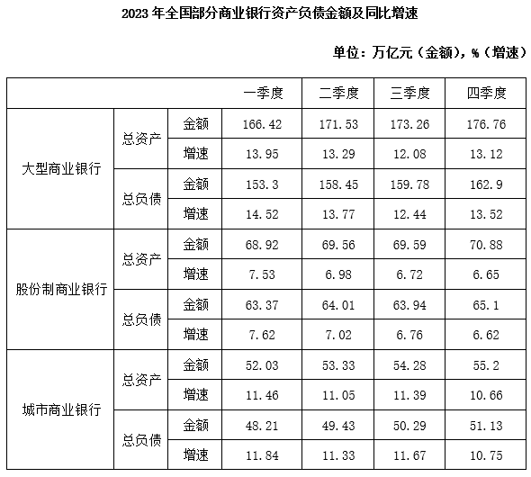
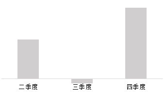
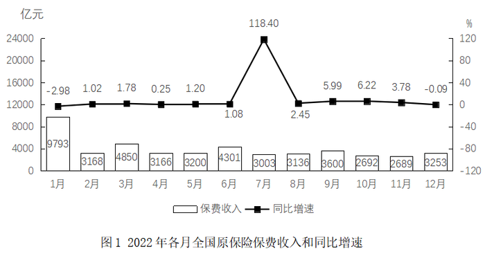
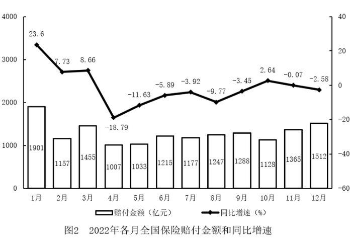

# 2026年四川省考/选调公务员录用考试《行测》试题（网友回忆版）

> 资料分析 · 15 题 · 四川 2026

## 材料 1

### 第 1 题　qid 18643845 · 增长

2023年四个季度中，三类商业银行总负债同比增速均快于同期总资产同比增速的季度有几个？

- **A**. 1
- **B**. 2
- **C**. 3　✅
- **D**. 4

**答案**：C

**官方解析**

根据题干可知，需要逐一对比每个季度三类商业银行的总负债同比增速和总资产同比增速，定位统计表可知：
一季度：大型商业银行总负债同比增速14.52%&gt;总资产同比增速13.95%；股份制商业银行总负债同比增速7.62%&gt;总资产同比增速7.53%；城市商业银行总负债同比增速11.84%&gt;总资产同比增速11.46%，三类商业银行均满足，一季度符合题意；
二季度：大型商业银行总负债同比增速13.77%&gt;总资产同比增速13.29%；股份制商业银行总负债同比增速7.02%&gt;总资产同比增速6.98%；城市商业银行总负债同比增速11.33%&gt;总资产同比增速11.05%，三类商业银行均满足，二季度符合题意；
三季度：大型商业银行总负债同比增速12.44%&gt;总资产同比增速12.08%；股份制商业银行总负债同比增速6.76%&gt;总资产同比增速6.72%；城市商业银行总负债同比增速11.67%&gt;总资产同比增速11.39%，三类商业银行均满足，三季度符合题意；
四季度：大型商业银行总负债同比增速13.52%&gt;总资产同比增速13.12%；股份制商业银行总负债同比增速6.62%&lt;总资产同比增速6.65%，股份制商业银行不满足，四季度不符合题意。
综上，2023年四个季度中，三类商业银行总负债同比增速均快于同期总资产同比增速的季度有3个。
故正确答案为C。

---

### 第 2 题　qid 18643846 · 综合

2023年四季度与二季度相比，大型商业银行总资产增量是股份制商业银行的多少倍？

- **A**. 2
- **B**. 4　✅
- **C**. 6
- **D**. 8

**答案**：B

**官方解析**

根据题干“2023年······是······的多少倍”，结合材料时间为2023年，可判定本题为现期倍数问题。定位统计表可知大型商业银行总资产四季度、二季度分别为176.76万亿元、171.53万亿元；股份制商业银行总资产四季度、二季度分别为70.88万亿元、69.56万亿元。根据公式：增长量=现期量-基期量，则大型商业银行总资产增长量=176.76-171.53=5.23万亿元，股份制商业银行总资产增长量=70.88-69.56=1.32万亿元，所求倍数倍。

故正确答案为B。

---

### 第 3 题　qid 18643847 · 综合

已知资产负债率，则2023年第一季度，城市商业银行比股份制商业银行资产负债率：

- **A**. 高不到5个百分点　✅
- **B**. 高5个百分点以上
- **C**. 低不到5个百分点
- **D**. 低5个百分点以上

**答案**：A

**官方解析**

根据题干“······2023年第一季度······资产负债率（）”，结合材料时间为2023年，可判定本题为现期比重问题。定位表格材料可得：2023年一季度，城市商业银行总负债、总资产分别为48.21万亿元、52.03万亿元，股份制商业银行总负债、总资产分别为63.37万亿元、68.92万亿元。根据公式：资产负债率，则2023年一季度城市商业银行资产负债率，股份制商业银行资产负债率，故题干所求=93%-92%=1%&lt;5%，即高不到5个百分点。

故正确答案为A。

---

### 第 4 题　qid 18643848 · 综合

2023年一季度，大型商业银行总负债比上季度约：

- **A**. 增长了3%
- **B**. 增长了7%　✅
- **C**. 减少了3%
- **D**. 减少了7%

**答案**：B

**官方解析**

根据题干“2023年一季度······比上季度约”，结合选项为增长/减少+百分数，可判定本题为一般增长率问题。定位表格材料可知：2023年一季度大型商业银行总负债为153.3万亿元，四季度大型商业银行总负债金额及同比增速分别为162.9万亿元和13.52%。根据公式：基期量，可得2022年四季度大型商业银行总负债为万亿元。根据公式：增长率，则所求，即增长了7.4%，与B项最接近。

故正确答案为B。

---

### 第 5 题　qid 18643849 · 综合

以下柱状图反映了2023年后三季度全国商业银行哪项指标环比增量的变化趋势（横轴位置表示增量为0）？

- **A**. 大型商业银行总资产
- **B**. 大型商业银行总负债
- **C**. 股份制商业银行总负债　✅
- **D**. 城市商业银行总资产

**答案**：C

**官方解析**

根据题干“······环比增量的变化趋势······”，可判定本题为增长量比较问题。定位表格材料可得2023年全国每个季度不同商业银行资产负债的数据。根据公式：增长量=现期量-基期量，可得：
A项：二季度：171.53-166.42=5.11万亿元；三季度：173.26-171.53&gt;0。与柱状图趋势不同，排除；
B项：二季度：158.45-153.3=5.15万亿元；三季度：159.78-158.45&gt;0。与柱状图趋势不同，排除；
C项：二季度：64.01-63.37=0.64万亿元；三季度：63.94-64.01=-0.07万亿元；四季度：65.1-63.94=1.16万亿元。与柱状图趋势相同，当选；
D项：二季度：53.33-52.03=1.3万亿元；三季度：54.28-53.33&gt;0。与柱状图趋势不同，排除。
故正确答案为C。

---

## 材料 2

### 第 6 题　qid 18643851 · 综合

2022年，全国原保险保费收入和全国保险赔付金额均高于上年同期水平的月份有几个?

- **A**. 2
- **B**. 3　✅
- **C**. 4
- **D**. 5

**答案**：B

**官方解析**

定位图1可得：2022年全国原保险保费收入同比增长率大于0的月份有2月、3月、4月、5月、6月、7月、8月、9月、10月、11月；定位图2可得：2022年全国保险赔付金额同比增长率大于0的月份有1月、2月、3月、10月。综上可知，2022年全国原保险保费收入和全国保险赔付金额均高于上年同期水平的有2月、3月、10月，共3个月份。
故正确答案为B。

---

### 第 7 题　qid 18643852 · 综合

2022年，全国原保险保费当年累计收入第一次超过3万亿元是哪个月的？

- **A**. 7月　✅
- **B**. 8月
- **C**. 9月
- **D**. 10月

**答案**：A

**官方解析**

定位图1可得：2022年1-10月各月全国原保险保费收入分别为9793亿元、3168亿元、4850亿元、3166亿元、3200亿元、4301亿元、3003亿元、3136亿元、3600亿元、2692亿元。则：

1-7月全国原保险保费累计收入为9793+3168+4850+3166+3200+4301+3003

9800+3200+4900+3200+3200+4300+3000

=31600亿元＞3万亿元。

因此，2022年全国原保险保费当年累计收入第一次超过3万亿元是7月。

故正确答案为A。

---

### 第 8 题　qid 18643854 · 综合

将2022年四个季度按全国保险赔付金额从高到低排序，正确的是：

- **A**. 第一季度>第四季度>第二季度>第三季度
- **B**. 第四季度>第一季度>第三季度>第二季度
- **C**. 第一季度>第四季度>第三季度>第二季度　✅
- **D**. 第四季度>第一季度>第二季度>第三季度

**答案**：C

**官方解析**

定位图2可得2022年1-12月全国保险赔付金额分别为：1901亿元、1157亿元、1455亿元、1007亿元、1033亿元、1215亿元、1177亿元、1247亿元、1288亿元、1128亿元、1365亿元、1512亿元。则2024年第一季度的全国保险赔付金额为：1901+1157+1455=4513亿元；第二季度为：1007+1033+1215=3255亿元；第三季度为：1177+1247+1288=3712亿元；第四季度为：1128+1365+1512=4005亿元。故2022年四个季度按全国保险赔付金额从高到低排序为：第一季度&gt;第四季度&gt;第三季度&gt;第二季度。
故正确答案为C。

---

### 第 9 题　qid 18643855 · 增长

2022年下半年全国保险赔付金额与全国原保险保费收入比值最高的月份，当月保费收入同比约增加了多少亿元？

- **A**. 98　✅
- **B**. 158
- **C**. 209
- **D**. 1628

**答案**：A

**官方解析**

根据题干“······同比约增加了多少亿元”，可判定本题为增长量计算问题。定位图1、2可得，2022年各月全国原保险保费收入、保险赔付金额。则2022年下半年全国保险赔付金额与全国原保险保费收入比值各月分别为：7月，；8月，；9月，；10月，；11月，；12月，，比较可得比值最高的月份是11月。定位图1可得11月全国原保险保费收入为2689亿元，同比增速为3.78%。根据公式：增长量，可得题干所求为亿元，只有A项符合。

故正确答案为A。

---

### 第 10 题　qid 18643857 · 综合

下列柱状图反映了2022年哪一段时间内，全国保险赔付金额环比增量的变化关系（横轴位置表示增量为0）？

- **A**. 3月-6月
- **B**. 6月-9月
- **C**. 8月-11月
- **D**. 9月-12月　✅

**答案**：D

**官方解析**

根据题干“······环比增量的变化关系”，可判定本题为增长量比较问题。定位图2可得2022年1月-12月各月全国的保险赔付金额。根据题干柱状图可得，第二个月份的环比增长量为负数，其余均为正数，结合材料数据，9月为正增长，排除C项；

其余选项中各月份环比增长量分别为：

A项：3月，1455-1157=298；4月，1007-1455=-448；5月，1033-1007=26，3月环比增量＞5月环比增量，不符合柱状图变化趋势，排除；

B项：6月，1215-1033=182；7月，1177-1215=-38，，不符合柱状图变化趋势，排除；

D项：9月，1288-1247=41；10月，1128-1288=-160；11月，1365-1128=237；12月，1512-1365=147，符合柱状图变化趋势，当选。

故正确答案为D。

---

## 材料 3

        2024年一季度，全国规模以上文化及相关产业企业（以下简称“文化企业”）实现营业收入31057亿元，比上年同期增长8.5%；实现利润总额2116亿元；营业收入利润率（）为6.81%，同比下降0.17个百分点。其中，文化新业态特征较为明显的16个行业小类实现营业收入12633亿元。增速快于全部规模以上文化企业3.4个百分点。

        分产业类型看，文化制造业实现营业收入9240亿元，比上年同期增长5.4%；文化批发和零售业5485亿元，增长6.8%；文化服务业16331亿元，增长10.9%。

        分领域看，文化核心领域实现营业收入20921亿元，比上年同期增长10.3%；文化相关领域实现营业收入10136亿元。

        分行业类别看，新闻信息服务实现营业收入4101亿元，比上年同期增长11.1%；内容创作生产7054亿元，增长12.0%；创意设计服务5219亿元，增长10.4%；文化传播渠道4026亿元，增长6.8%：文化投资运营145亿元，增长10.4%；文化娱乐休闲服务375亿元，增长10.5%；文化辅助生产和中介服务3583亿元，增长7.3%；文化装备生产1378亿元，增长6.0%；文化消费终端生产5175亿元，增长2.7%。

       分区域看，东部地区实现营业收入24759亿元，比上年同期增长9.2%；中部地区3491亿元，增长6.5%；西部地区2524亿元，增长4.9%；东北地区282亿元，增长5.0%。

### 第 11 题　qid 18643860 · 增长

2024年第一季度，东部地区规模以上文化企业实现营业收入同比增量约占全国规模以上文化企业营业收入同比增量的：

- **A**. 86%　✅
- **B**. 79%
- **C**. 73%
- **D**. 68%

**答案**：A

**官方解析**

根据题干“2024年······约占······”，可判定本题为现期比重问题。定位文字材料第一段可得：2024年一季度，全国规模以上文化企业实现营业收入31057亿元，比上年同期增长8.5%。定位文字材料第五段可得：东部地区实现营业收入24759亿元，比上年同期增长9.2%。根据公式：增长量，则2024年一季度，全国规模以上文化企业营业收入同比增量为亿元，东部地区规模以上文化企业实现营业收入同比增量为亿元。则有。

故正确答案为A。

---

### 第 12 题　qid 18643861 · 比重

2024年一季度，新闻信息服务业实现营业收入占全国规模以上文化企业实现营业收入的比重比上年同期：

- **A**. 下降了不到1个百分点
- **B**. 下降了1个百分点以上
- **C**. 上升了不到1个百分点　✅
- **D**. 上升了1个百分点以上

**答案**：C

**官方解析**

根据题干“2024年一季度，······占······比重比上年同期”，可判定本题为两期比重问题。定位文字材料第一段可得：2024年一季度全国规模以上文化企业实现营业收入31057亿元（B），比上年同期增长8.5%（b），定位文字材料第四段可得：新闻信息服务实现营业收入4101亿元（A），比上年同期增长11.1%(a)。根据两期比重比较结论：部分增长率（a）&gt;整体增长率（b），比重上升，则11.1%＞8.5%，故比重上升，排除A、B两项。根据两期比重公式：两期比重，可得所求两期比重，对应C项。

故正确答案为C。

---

### 第 13 题　qid 18643862 · 增长

将①创意设计服务业、②文化娱乐休闲服务业和③文化辅助生产和中介服务业按2024年一季度实现营业收入同比增量从高到低排序，正确的是：

- **A**. ①>②>③
- **B**. ①>③>②　✅
- **C**. ②>③>①
- **D**. ②>①>③

**答案**：B

**官方解析**

根据题干“将······按2024年一季度实现营业收入同比增量从高到低排序”，可判定本题为增长量比较问题。定位文字材料第四段可得：（2024年一季度）创意设计服务5219亿元，增长10.4%；文化娱乐休闲服务375亿元，增长10.5%；文化辅助生产和中介服务3583亿元，增长7.3%。根据公式：增长量，则所求同比增量分别为：

①创意设计服务业：亿元；

②文化娱乐休闲服务业：亿元；

③文化辅助生产和中介服务业：亿元。

则同比增量从高到低排序为①&gt;③&gt;②。

故正确答案为B。

---

### 第 14 题　qid 18643863 · 比重

下列饼图中，最能准确反映2024年一季度全国规模以上文化企业实现营业收入中，文化制造业（黑色）、文化批发和零售业（斜线）和文化服务业（白色）占比关系的是：

- **A**. 

- **B**. 

　✅
- **C**. 

- **D**. 

**答案**：B

**官方解析**

根据题干“······2024年一季度······占比关系的是”，结合材料时间为2024年一季度，可判定本题为现期比重问题。定位文字材料第二段可得：分产业类型看，文化制造业实现营业收入9240亿元，文化批发和零售业5485亿元，文化服务业16331亿元。9240+5485&lt;16331，即文化服务业（白色）占比，排除C、D。文化批发和零售业实现营业收入最少，故其占比最低，则斜线部分面积应为最小，排除A项。

故正确答案为B。

---

### 第 15 题　qid 18643864 · 增长

在①2023年一季度全国规模以上文化企业实现利润总额、②2023年一季度文化新业态特征较为明显的16个行业小类实现营业收入、③2024年一季度文化相关领域实现营业收入同比增速这3项指标中，能够从上述资料中推出的有几项？

- **A**. 0
- **B**. 1
- **C**. 2
- **D**. 3　✅

**答案**：D

**官方解析**

①：定位文字材料第一段可得：2024年一季度，全国规模以上文化企业实现营业收入31057亿元，比上年同期增长8.5%；实现利润总额2116亿元；营业收入利润率（实现利润总额/实现营业收入）为6.81%，同比下降0.17个百分点。根据公式：部分=整体×比重，基期量，则2023年一季度全国规模以上文化企业实现利润总额亿元，可以推出；

②：定位文字材料第一段可得：2024年一季度，全国规模以上文化企业实现营业收入31057亿元，比上年同期增长8.5%；其中文化新业态特征较为明显的16个行业小类实现营业收入12633亿元，增速快于全部规模以上文化企业3.4个百分点。根据公式：基期量，则2023年一季度文化新业态较为明显的16个行业小类实现营业收入亿元，可以推出；

③：定位文字材料第一段和第三段可得：2024年一季度，全国规模以上文化企业实现营业收入31057亿元，比上年同期增长8.5%；分领域看，文化核心领域实现营业收入20921亿元，比上年同期增长10.3%；文化相关领域实现营业收入10136亿元。若2024年一季度文化相关领域实现营业收入同比增速为r，根据混合增长率的结论：总体增长率居中但不正中，偏向基数大的，距离与量成反比，则，可以推出。

综上可知，①②③均可推出，共3项。

故正确答案为D。

---
