# 2026年国家公务员录用考试《行测》题（副省级网友回忆版）

> 资料分析 · 20 题 · 国考 2026

## 材料 1

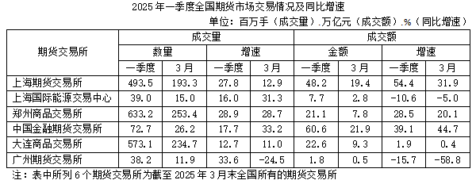

### 第 1 题　qid 19526442 · 综合

2025年一季度全国期货市场成交额约为多少万亿元？

- **A**. 153
- **B**. 162　✅
- **C**. 175
- **D**. 184

**答案**：B

**官方解析**

定位统计表可得：2025年一季度表中所列6个期货交易所市场成交额分别为48.2万亿元、7.7万亿元、21.1万亿元、60.6万亿元、22.6万亿元、1.8万亿元。则所求为万亿元，与B项最接近。

故正确答案为B。

---

### 第 2 题　qid 19526443 · 增长

2025年1~2月，上海期货交易所成交额同比增速在以下哪个范围内？

- **A**. 不到45%
- **B**. 超过85%
- **C**. 45%~65%之间
- **D**. 65%~85%之间　✅

**答案**：D

**官方解析**

根据题干“2025年1~2月······同比增速在以下哪个范围内”，结合选项是百分数，且材料给出2025年一季度与3月的相关数据，可判定本题为混合增长率问题。定位统计表可得：2025年一季度，上海期货交易所成交额为48.2万亿元、同比增速为54.4%；2025年3月，上海期货交易所成交额为19.4万亿元、同比增速为31.9%。根据混合增长率结论“混合后居中不正中”，可得，排除A项。2025年1~2月上海期货交易所成交额=48.2-19.4=28.8万亿元，根据混合增长率口诀：增速差与基期量成反比（一般用现期量代替基期量计算），可得，解得，在D项范围内。

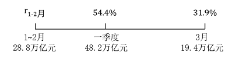

故正确答案为D。

---

### 第 3 题　qid 19526444 · 综合

全国2025年3月成交量超过一季度月均成交量的期货交易所有几个？

- **A**. 5　✅
- **B**. 4
- **C**. 3
- **D**. 2

**答案**：A

**官方解析**

根据题干“全国2025年3月······超过一季度月均······”，结合材料时间为2025年3月和一季度，可判定本题为现期平均数问题。定位表格材料可得2025年3月和一季度各期货交易所成交量。3月成交量超过一季度月均成交量，即3月，整理为3月×3&gt;一季度，即可满足条件。分别验证如下：

上海期货交易所，193.3×3&gt;190×3=570&gt;493.5百万手，满足；

上海国际能源交易中心，15.0×3=45&gt;39.0百万手，满足；

郑州商品交易所，253.4×3&gt;250×3=750&gt;633.2百万手，满足；

中国金融期货交易所，26.2×3&gt;25×3=75&gt;72.7百万手，满足；

大连商品交易所，234.7×3&gt;200×3=600&gt;573.1百万手，满足；

广州期货交易所，11.9×3&lt;12×3=36&lt;38.2百万手，不满足。

综上，2025年3月成交量超过一季度月均成交量的期货交易所有上海期货交易所、上海国际能源交易中心、郑州商品交易所、中国金融期货交易所、大连商品交易所，共5个。

故正确答案为A。

---

### 第 4 题　qid 19526445 · 综合

2024年一季度，郑州商品交易所成交量比大连商品交易所：

- **A**. 多不到0.5亿手
- **B**. 少不到0.5亿手　✅
- **C**. 多0.5亿手以上
- **D**. 少0.5亿手以上

**答案**：B

**官方解析**

根据题干“2024年一季度······比······”，结合材料时间为2025年一季度，且选项为“多/少+单位”，可判定本题为基期和差问题。定位统计表可得：2025年一季度，郑州商品交易所成交量为633.2百万手，同比增速为28.9%；大连商品交易所成交量为573.1百万手，同比增速为12.7%。根据公式：基期量，则题目所求百万手=-0.34亿手，即少0.34亿手，在B项范围内。

故正确答案为B。

---

### 第 5 题　qid 19526446 · 增长

全国期货交易所中，2025年3月平均每手成交额同比增幅和同比降幅最大的分别是：

- **A**. 中国金融期货交易所，广州期货交易所
- **B**. 中国金融期货交易所，上海国际能源交易中心
- **C**. 上海期货交易所，广州期货交易所　✅
- **D**. 上海期货交易所，上海国际能源交易中心

**答案**：C

**官方解析**

根据题干“2025年3月平均······同比增幅和同比降幅最大的分别是”，可判定本题为平均数的增长率问题。定位统计表可知2025年3月全国各期货交易所的成交数量同比增速（b）及成交金额同比增速（a），根据公式：平均数的增长率，计算比较选项各期货交易所相关增幅与降幅即可。

中国金融期货交易所同比增幅：；上海期货交易所同比增幅：，后者较前者分子大分母小，增幅更大，排除A、B两项；

广州期货交易所同比降幅：；上海国际能源交易中心同比降幅：，前者降幅大于后者，可排除D项。

故正确答案为C。

---

## 材料 2

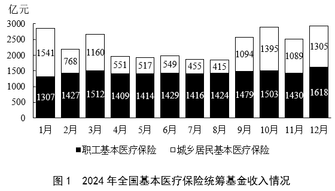

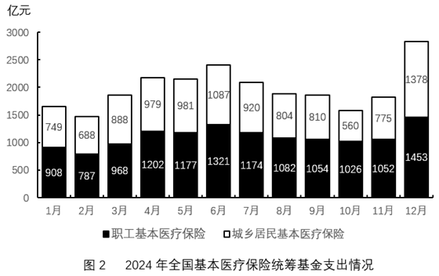

### 第 6 题　qid 19526448 · 综合

2024年，全国基本医疗保险统筹基金支出金额超过收入金额的月份有几个？

- **A**. 4
- **B**. 5　✅
- **C**. 6
- **D**. 7

**答案**：B

**官方解析**

根据题干“2024年，全国基本医疗保险······支出金额超过收入金额的月份有几个”，结合材料全国基本医疗保险=职工基本医疗保险+城乡居民基本医疗保险，定位统计图1和图2可知2024年各月职工基本医疗保险和城乡居民基本医疗保险情况。故各月基金支出和基金收入情况如下：

1月：全国基金支出亿元；全国基金收入亿元。基金支出＜基金收入，不符合；

2月：全国基金支出亿元；全国基金收入亿元。基金支出＜基金收入，不符合；

3月：全国基金支出亿元；全国基金收入亿元。基金支出＜基金收入，不符合；

4月：全国基金支出亿元；全国基金收入亿元。基金支出＞基金收入，符合；

5月：全国基金支出亿元；全国基金收入亿元。基金支出＞基金收入，符合；

6月：全国基金支出亿元；全国基金收入亿元。基金支出＞基金收入，符合；

7月：全国基金支出亿元；全国基金收入亿元。基金支出＞基金收入，符合；

8月：全国基金支出=804+1082=1886亿元；全国基金收入=415+1424=1839亿元。基金支出＞基金收入，符合；

9月：全国基金支出亿元；全国基金收入亿元。基金支出＜基金收入，不符合；

10月：全国基金支出亿元；全国基金收入亿元。基金支出＜基金收入，不符合；

11月：全国基金支出亿元；全国基金收入亿元。基金支出＜基金收入，不符合；

12月：全国基金支出亿元；全国基金收入亿元。基金支出＜基金收入，不符合。

综上，2024年全国基本医疗保险统筹基金支出金额超过收入金额的月份有4月、5月、6月、7月、8月，共5个。

故正确答案为B。

---

### 第 7 题　qid 19526449 · 综合

2024年，全国基本医疗保险统筹基金累计收入第一次超过1.5万亿元是在几月？

- **A**. 5月
- **B**. 6月
- **C**. 7月　✅
- **D**. 8月

**答案**：C

**官方解析**

定位图1可知2024年全国基本医疗保险统筹基金每月收入情况。则2024年1-5月累计收入为亿元；1-6月累计收入约为亿元；1-7月累计收入约为亿元万亿元，第一次超过1.5万亿元。

故正确答案为C。

---

### 第 8 题　qid 19526450 · 综合

2024年，全国城乡居民基本医疗保险统筹基金收入最高的季度是：

- **A**. 一季度
- **B**. 二季度
- **C**. 三季度
- **D**. 四季度　✅

**答案**：D

**官方解析**

定位统计图1可得2024年各月全国城乡居民基本医疗保险统筹基金收入，则2024年各季度全国城乡居民基本医疗保险统筹基金收入分别为：

一季度，亿元；

二季度，亿元；

三季度，亿元；

四季度，亿元。

综上，2024年全国城乡居民基本医疗保险统筹基金收入最高的季度是四季度。

故正确答案为D。

---

### 第 9 题　qid 19526451 · 比重

2024年，职工基本医疗保险统筹基金支出占全国基本医疗保险统筹基金支出比重最大的月份，当月职工基本医疗保险支出比上月：

- **A**. 增加了5%以上
- **B**. 减少了5%以上
- **C**. 增加了不到5%
- **D**. 减少了不到5%　✅

**答案**：D

**官方解析**

根据题干“2024年······比上月”，结合选项为增加/减少+百分数，可判定本题为一般增长率问题。定位统计图2可知2024年1-12月全国职工及城乡居民基本医疗保险统筹基金支出。根据公式：比重，及全国基本医疗保险统筹基金支出=职工基本医疗保险统筹基金支出+城乡居民基本医疗保险统筹基金支出。代入数据可知各月职工基本医疗保险统筹基金支出占全国基本医疗保险统筹基金支出比重分别为：1月，；2月，；3月，；4月，；5月，；6月，；7月，；8月，，9月，；10月，；11月，；12月，。比较可知，比重最大的月份为10月。根据公式：增长率，则10月职工基本医疗保险支出环比增长率为，即比上月减少了不到5%。

故正确答案为D。

---

### 第 10 题　qid 19526452 · 综合

以下柱状图反映了2024年9～12月，全国基本医疗保险统筹基金哪一指标的环比增量变化情况（横轴位置表示增量为0）？

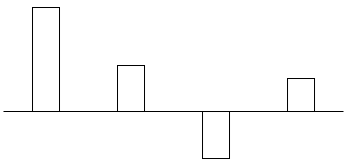

- **A**. 职工基本医疗保险统筹基金收入
- **B**. 职工基本医疗保险统筹基金支出
- **C**. 城乡居民基本医疗保险统筹基金收入　✅
- **D**. 城乡居民基本医疗保险统筹基金支出

**答案**：C

**官方解析**

根据题干“······环比增量变化情况······”，可判定本题为增长量比较问题。定位统计图可得2024年8-12月全国基本医疗保险统筹基金的收支情况。根据公式：增长量=现期量-基期量，可得选项中各指标环比增量如下：
A项，职工基本医疗保险统筹基金收入2024年9月环比增量=1479-1424=55亿元，10月环比增量=1503-1479=24亿元，11月环比增量=1430-1503=-73亿元，由于|11月环比增量|&gt;|9月环比增量|，而柱状图（横轴位置代表增量为0）中第三个月柱体长度&lt;第一个月柱体长度，不符合柱状图变化趋势，排除；
B项，职工基本医疗保险统筹基金支出2024年9月环比增量=1054-1082&lt;0，而柱状图中第一个月的环比增量&gt;0，不符合柱状图变化趋势，排除；
C项，城乡居民基本医疗保险统筹基金收入2024年9月环比增量=1094-415=679亿元，10月环比增量=1395-1094=301亿元，11月环比增量=1089-1395=-306亿元，12月环比增量=1305-1089=216亿元，符合柱状图变化趋势，当选；
D项，城乡居民基本医疗保险统筹基金支出2024年9月环比增量=810-804=6亿元，10月环比增量=560-810=-250亿元，而柱状图中第二个月的环比增量&gt;0，不符合柱状图变化趋势，排除。
故正确答案为C。

---

## 材料 3

        绿证是对可再生能源绿色电力颁发的具有独特标识代码的电子证书，1个绿证单位对应1000千瓦时可再生能源电量。2024年全国核发绿证47.34亿个，其中可交易绿证31.58亿个。截至2024年12月底全国累计核发绿证49.55亿个，其中可交易绿证33.79亿个。

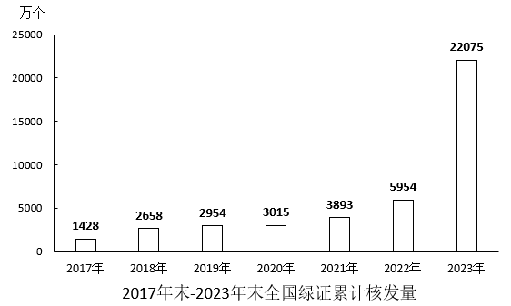

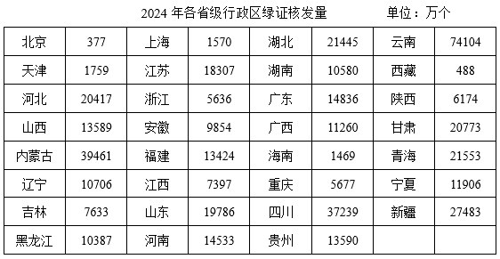

        2024年，全国集中式项目核发绿证46.77亿个。按项目类型划分，风电19.07亿个，常规水电15.78亿个，太阳能发电8.03亿个，生物质发电3.81亿个，风光一体化项目755万个，地热能发电52万个，海洋能发电1.1万个。2024年全国分布式项目核发绿证5695万个，同比增长27.8倍。其中，分散式风电核发绿证3364万个，分布式光伏核发绿证2331万个。

### 第 11 题　qid 19526365 · 综合

2024年，全国核发的不可交易绿证对应约多少万亿千瓦时可再生能源电量？

- **A**. 1.6　✅
- **B**. 3.2
- **C**. 7.9
- **D**. 15.8

**答案**：A

**官方解析**

定位文字材料第一段可得：2024年全国核发绿证47.34亿个，其中可交易绿证31.58亿个。故2024年全国核发的不可交易绿证47.34-31.58=15.76亿个，结合文字材料第一段中的“1个绿证单位对应1000千瓦时可再生能源电量”，则题干所求为万亿千瓦时，与A项最接近。

故正确答案为A。

---

### 第 12 题　qid 19526367 · 综合

2023年，全国核发绿证数量约是2022年的多少倍？

- **A**. 3.7
- **B**. 5.1
- **C**. 6.3
- **D**. 7.8　✅

**答案**：D

**官方解析**

根据题干“2023年······约是2022年的多少倍”，结合材料给出2022年、2023年全国绿证累计核发量，可判定本题为现期倍数问题。定位统计图可得，2021-2023年末全国绿证累计核发量分别为3893万个、5954万个、22075万个。则2023年全国核发绿证数量=22075-5954=16121万个，2022年全国核发绿证数量=5954-3893=2061万个。则所求倍数倍，与D项最接近。

故正确答案为D。

---

### 第 13 题　qid 19526369 · 综合

2024年绿证核发量最多的5个省级行政区，绿证核发量约占全国总量的：

- **A**. 38%
- **B**. 42%　✅
- **C**. 46%
- **D**. 50%

**答案**：B

**官方解析**

根据题干“2024年······约占全国总量的”，结合材料时间为2024年，可判定本题为现期比重问题。定位文字材料第一段可得：2024年全国核发绿证47.34亿个；定位统计表可得：2024年绿证核发量最多的5个省级行政区是云南（74104万个）、内蒙古（39461万个）、四川（37239万个）、新疆（27483万个）、青海（21553万个）。根据公式：比重，可得题干所求为。

故正确答案为B。

---

### 第 14 题　qid 19526371 · 比重

2024年，全国集中式风电项目核发绿证数量占当年集中式项目核发绿证数量的比重比太阳能发电项目的占比高约多少个百分点？

- **A**. 16
- **B**. 20
- **C**. 24　✅
- **D**. 28

**答案**：C

**官方解析**

根据题干“2024年，······占······的比重比······的占比高约多少个百分点”，结合材料时间为2024年，可判定本题为现期比重问题。定位文字材料第二段可得：2024年，全国集中式项目核发绿证46.77亿个。按项目类型划分，风电19.07亿个、太阳能发电8.03亿个。根据公式：比重，则题干所求为，即高约23个百分点，与C项最接近。

故正确答案为C。

---

### 第 15 题　qid 19526375 · 综合

能够从上述资料中推出的是：

- **A**. 2019年，全国绿证核发量多于2018年
- **B**. 截至2023年底，全国累计核发绿证中，可交易绿证的占比不到1%
- **C**. 2024年，全国常规水电核发绿证不到集中式项目核发绿证总数量的三分之一
- **D**. 2024年，湖北、湖南核发绿证之和占全国比重比广东、广西之和高1个百分点以上　✅

**答案**：D

**官方解析**

A项：定位统计图可知，2017年末-2019年末全国绿证累计核发量分别为1428万个、2658万个、2954万个。则2019年全国绿证核发量为2954-2658=296万个，2018年全国绿证核发量为2658-1428=1230万个，2019年全国绿证核发量少于2018年，错误；

B项：定位文字材料第一段可知，2024年全国核发绿证47.34亿个，其中可交易绿证31.58亿个。截至2024年12月底全国累计核发绿证49.55亿个，其中可交易绿证33.79亿个。则截至2023年底，全国累计核发绿证49.55-47.34=2.21亿个，可交易绿证33.79-31.58=2.21亿个。根据公式：比重，则截至2023年底全国累计核发绿证中，可交易绿证的占比为，错误；

C项：定位文字材料第二段可知，2024年，全国集中式项目核发绿证46.77亿个，常规水电15.78亿个。根据公式：比重，则2024年全国常规水电核发绿证数量占集中式项目核发绿证总数量的比重为，即超过三分之一，错误；

D项：定位文字材料第一段可知，2024年全国核发绿证47.34亿个；定位统计表可知，2024年湖北、湖南、广东、广西分别核发绿证21445万个、10580万个、14836万个、11260万个。根据公式：比重，则2024年湖北、湖南核发绿证之和占全国比重比广东、广西之和高，即高1个百分点以上，正确。

故正确答案为D。

---

## 材料 4

        2024年，我国对联合国定义的45个最不发达国家（以下简称最不发达国家）进出口14230.2亿元人民币，占同期我国外贸进出口总值的3.2%。其中出口8664.6亿元，同比（下同）增长4.3%；进口5565.5亿元，增长12.8%。

        2024年，我国对最不发达国家出口机电产品3942.2亿元，增长13.5%。其中出口船舶690.8亿元，增长65.9%，主要出口至全球第一大船旗国利比里亚。出口金额654.3亿元，增长67%；出口工程机械、火车分别为165.3亿元、91.6亿元，分别增长28.9%、39.5%；出口劳动密集型产品2481亿元，增长3.7%，其中纺织品1623.5亿元，增长15.3%。

        2024年，我国自最不发达国家进口铜材、原油、金属矿砂分别为1469.6亿元、1364.2亿元、1221亿元。最不发达国家成为我国钢材、铝矿、锡矿、钨矿、钛矿第一大进口来源地，分别占我国同类商品进口总值的38.2%，73.1%，65.4%，57.7%，58.1%。

        2024年12月1日起，我国给予所有已建交的最不发达国家100%税目产品零关税待遇。12月，我国自最不发达国家进口512.7亿元，增长18.1%，其中自刚果民主共和国、几内亚、老挝、赞比亚分别进口156.3亿元，54.7亿元，35.6亿元，33.9亿元，分别增长84.6%，40.3%，25.7%、127.27%。

### 第 16 题　qid 19526363 · 综合

2024年，我国外贸进出口总值在以下哪个范围内？

- **A**. 不到44万亿元
- **B**. 44万亿元~45万亿元之间　✅
- **C**. 45万亿元~46万亿元之间
- **D**. 超过46万亿元

**答案**：B

**官方解析**

根据题干“2024年······外贸进出口总值······”，结合材料给出2024年我国对联合国定义的45个最不发达国家进出口总值及其占同期我国外贸进出口总值的比重，可判定本题为现期比重问题。定位文字材料第一段可得：2024年，我国对联合国定义的45个最不发达国家进出口14230.2亿元人民币，占同期我国外贸进出口总值的3.2%。根据公式：整体，可得所求万亿元，在B项范围内。

故正确答案为B。

---

### 第 17 题　qid 19526366 · 增长

2024年，我国对最不发达国家进出口总值同比增速约为：

- **A**. 9.5%
- **B**. 8.5%
- **C**. 7.5%　✅
- **D**. 10.5%

**答案**：C

**官方解析**

根据题干“2024年······同比增速约为”，结合材料给出2024年我国对最不发达国家进口、出口总值及同比增速，且进口总值+出口总值=进出口总值，可判定本题为混合增长率问题。定位文字材料第一段可得：2024年，我国对最不发达国家出口8664.6亿元，同比（下同）增长4.3%；进口5565.5亿元，增长12.8%。根据混合增长率口诀“混合居中不正中，偏向基期量大的一方（一般用现期量代替基期量）”可知，，排除A、D两项。根据线段法“距离与量成反比（一般用现期量代替基期量）”可知，，解得，与C项最接近。

故正确答案为C。

---

### 第 18 题　qid 19526368 · 比重

下列饼状图，最能准确反映2024年我国自最不发达国家进口值中，铜材（黑色），原油（横线），金属矿砂（白色）和其他（竖线）进口值占比关系的是：

- **A**. 
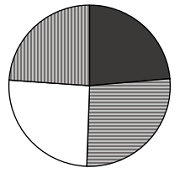

- **B**. 
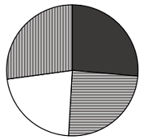
　✅
- **C**. 
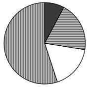

- **D**. 
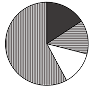

**答案**：B

**官方解析**

根据题干“下列饼状图，最能准确反映2024年······占比关系的是”，结合材料时间为2024年，可判定本题为现期比重问题。定位文字材料第一段可得：2024年，我国······进口5565.5亿元；定位文字材料第三段可得：2024年，我国自最不发达国家进口铜材、原油、金属矿砂分别为1469.6亿元、1364.2亿元、1221亿元。观察发现，铜材进口值&gt;原油进口值，排除A、C项。根据公式：比重，则2024年铜材进口值占进口值的比重，排除D项。 

故正确答案为B。 

---

### 第 19 题　qid 19526370 · 综合

2023年1~11月，我国对最不发达国家月均进口值约为多少亿元？

- **A**. 395
- **B**. 409　✅
- **C**. 468
- **D**. 502

**答案**：B

**官方解析**

根据题干“2023年1~11月······月均进口值约为多少亿元”，结合材料时间为2024年，可判定本题为基期平均数问题。定位文字材料第一段可得：2024年，我国对最不发达国家进口5565.5亿元，增长12.8%；定位文字材料第四段可得：2024年12月，我国自最不发达国家进口512.7亿元，增长18.1%。根据公式：基期量，可得2023年1-11月我国对最不发达国家进口值为亿元，则2023年1~11月我国对最不发达国家月均进口值为亿元，与B项最接近。

故正确答案为B。

---

### 第 20 题　qid 19526374 · 综合

关于2024年我国进出口情况，能根据上述资料推出的是：

- **A**. 铜材进口总值不到3000亿元
- **B**. 我国对最不发达国家火车出口值同比增量高于对其工程机械出口值同比增量
- **C**. 劳动密集型产品出口值占我国最不发达国家出口总值的比重高于上年水平
- **D**. 12月自刚果民主共和国、几内亚、老挝、赞比亚的进口总值超过当月我国自最不发达国家进口总值的一半　✅

**答案**：D

**官方解析**

A项：定位文字材料第三段可得：2024年，我国自最不发达国家进口铜材1469.6亿元。但材料未给出我国进口铜材的具体值，无法计算，错误；

B项：定位文字材料第二段可得：2024年，我国对最不发达国家出口工程机械、火车分别为165.3亿元、91.6亿元，分别增长28.9%、39.5%。根据公式：增长量，可得2024年我国对最不发达国家出口工程机械同比增量亿元，对最不发达国家出口火车同比增量亿元，则2024年我国对最不发达国家火车出口值同比增量（26亿元）低于对其工程机械出口值同比增量（37亿元），错误；

C项：定位文字材料第一段可得：2024年，我国对最不发达国家出口总值为8664.6亿元，同比增长4.3%（b）；定位文字材料第二段可得：2024年，我国对最不发达国家出口劳动密集型产品2481亿元，增长3.7%（a）。根据两期比重结论：a&gt;b，比重上升。由于a（3.7%）&lt;b（4.3%），故比重低于上年水平，错误；

D项：定位文字材料最后一段可得：2024年12月，我国自最不发达国家进口512.7亿元，其中自刚果民主共和国、几内亚、老挝、赞比亚分别进口156.3亿元，54.7亿元，35.6亿元，33.9亿元。根据公式：比重，可得所求，即占比超过一半，正确。

故正确答案为D。

---
