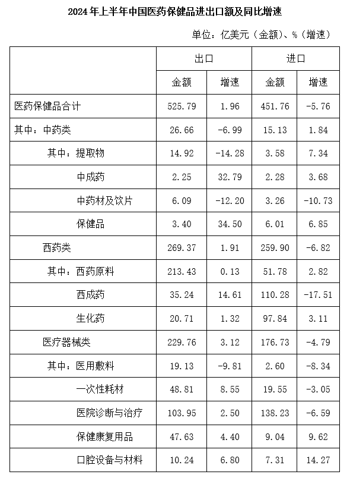
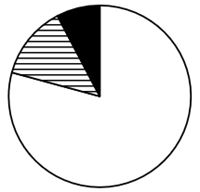
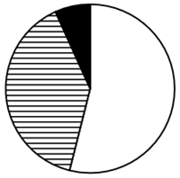
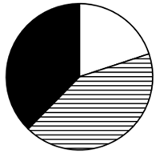
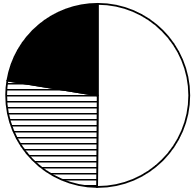
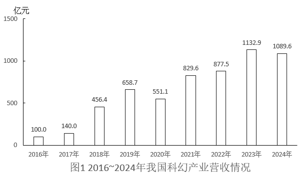
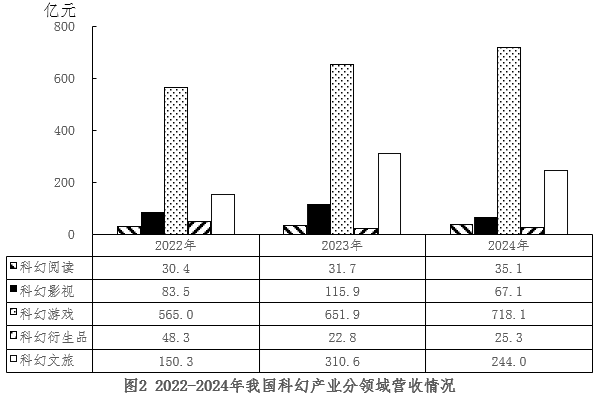
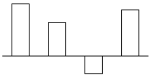

# 2026年国家公务员录用考试《行测》题（地市级网友回忆版）

> 资料分析 · 20 题 · 国考 2026

## 材料 1

### 第 1 题　qid 19526212 · 增长

2024年上半年，中国医药保健品进出口贸易顺差（出口额-进口额）比上年同期：

- **A**. 下降了20%以上
- **B**. 下降了不到20%
- **C**. 上升了20%以上　✅
- **D**. 上升了不到20%

**答案**：C

**官方解析**

根据题干“2024年上半年······顺差（出口额-进口额）比上年同期”，结合选项为百分数，且出口额=进口额+顺差，可判定本题为混合增长率问题。定位统计表可得：2024年上半年，中国医药保健品进、出口额分别为451.76亿美元、525.79亿美元，同比增长率分别为-5.76%、1.96%。根据混合增长率口诀“混合后居中但不正中”可得，进口额增长率（-5.76%）＜出口额增长率（1.96%）＜顺差增长率，排除A、B两项。

2024年上半年中国医药保健品进出口贸易顺差亿美元，根据线段法：距离与量成反比（一般用现期量代替基期量计算），可得：，解得：，在C项范围内。

故正确答案为C。

---

### 第 2 题　qid 19526213 · 比重

2024年上半年，中药提取物出口额占医药保健品出口总额的比重比上年同期：

- **A**. 上升了3个百分点以上
- **B**. 下降了3个百分点以上
- **C**. 上升了不到3个百分点
- **D**. 下降了不到3个百分点　✅

**答案**：D

**官方解析**

根据题干“2024年上半年······占······的比重比上年同期”，结合选项为上升了/下降了+百分点，可判定本题为两期比重问题。定位统计表可得：2024年上半年中国医药保健品出口总额为525.79亿美元（B），同比增长1.96%（b）；中药提取物出口额为14.92亿美元（A），同比增长-14.28%（a）。根据公式：两期比重差，则题干所求为，即约下降了0.53个百分点。在D项范围内。

故正确答案为D。

---

### 第 3 题　qid 19526214 · 增长

表中所列医药保健品12个小类中，2024年上半年进出口总额同比上升的有几类？

- **A**. 7　✅
- **B**. 6
- **C**. 5
- **D**. 4

**答案**：A

**官方解析**

根据题干“······2024年上半年······同比上升的有几类”，结合材料给出2024年上半年各小类医药保健品进口额、出口额及分别的同比增速，可判定本题为混合增长率问题。定位统计表可得2024年上半年，医药保健品12个小类进口额、出口额及分别的同比增速。根据混合增长率口诀“混合居中不正中，偏向基期较大的（一般用现期代替）”，观察可知中成药、保健品、西药原料、生化药、保健康复用品、口腔设备与材料这6类的进、出口额同比增速均大于0，则进出口总额同比增速也大于0，则同比上升，均满足；中药材及饮片、医用敷料进、出口额同比增速均小于0，则进出口总额同比增速也小于0，则同比下降，均不满足；其余类别进、出口额同比增速一正一负，其中提取物：现期量出口额14.92亿美元&gt;进口额3.58亿美元，则，即r&lt;0，则同比下降，不满足；西成药：现期量进口额110.28亿美元&gt;出口额35.24亿美元，则，即r&lt;0，则同比下降，不满足；一次性耗材：现期量出口额48.81亿美元&gt;进口额19.55亿美元，则，即r&gt;0，则同比上升，满足；医院诊断与治疗：现期量进口额138.23亿美元&gt;出口额103.95亿美元，则，即r&lt;0，则同比下降，不满足。

综上可知，2024年上半年进出口总额同比上升的有中成药、保健品、西药原料、生化药、一次性耗材、保健康复用品、口腔设备与材料，共7类。

故正确答案为A。

---

### 第 4 题　qid 19526215 · 增长

将2024年上半年①医用敷料②一次性耗材③保健康复用品④口腔设备与材料进口额同比增量从高到低排序正确的是：

- **A**. ③④①②
- **B**. ③④②①
- **C**. ④③①②　✅
- **D**. ④③②①

**答案**：C

**官方解析**

根据题干“······2024年上半年······同比增量从高到低排序······”，可判定本题为增长量比较问题。定位表格可得：2024年上半年，医用敷料、一次性耗材、保健康复用品、口腔设备与材料的进口额分别为2.60亿美元、19.55亿美元、9.04亿美元、7.31亿美元，同比增速分别为-8.34%、-3.05%、9.62%、14.27%。根据公式：增长量，则以上四类医疗器械进口额的同比增量分别为：①医用敷料：亿美元；②一次性耗材：亿美元；③保健康复用品：亿美元；④口腔设备与材料：亿美元。比较可知，同比增量从高到低排序正确的是：④③①②。

故正确答案为C。

---

### 第 5 题　qid 19526216 · 比重

以下饼图中，最能准确反映2024年上半年中国西药类进出口总额中，西药原料（白色）、西成药（横线）和生化药（黑色）占比关系的是：

- **A**. 

- **B**. 

- **C**. 

- **D**. 

　✅

**答案**：D

**官方解析**

根据题干“······最能准确反映2024年上半年······占比关系的是”，结合材料时间为2024年上半年，可判定本题为现期比重问题。定位统计表可知：2024年上半年，西药原料出口额为213.43亿美元、进口额为51.78亿美元；西成药出口额为35.24亿美元、进口额为110.28亿美元；生化药出口额为20.71亿美元、进口额为97.84亿美元。则2024年上半年，西药原料（白色）进出口额=213.43+51.78=265.21亿美元，西成药（横线）进出口额=35.24+110.28=145.52亿美元，生化药（黑色）进出口额=20.71+97.84=118.55亿美元。可知西药原料（白色）进出口额最大，排除C项；西药原料（白色）与西成药（横线）倍数关系为，排除A项；西成药（横线）与生化药（黑色）倍数关系为，排除B项。

故正确答案为D。

---

## 材料 2

        绿证是对可再生能源绿色电力颁发的具有独特标识代码的电子证书，1个绿证单位对应1000千瓦时可再生能源电量。2024年全国核发绿证47.34亿个，其中可交易绿证31.58亿个。截至2024年12月底全国累计核发绿证49.55亿个，其中可交易绿证33.79亿个。

        2024年，全国集中式项目核发绿证46.77亿个。按项目类型划分，风电19.07亿个，常规水电15.78亿个，太阳能发电8.03亿个，生物质发电3.81亿个，风光一体化项目755万个，地热能发电52万个，海洋能发电1.1万个。2024年全国分布式项目核发绿证5695万个，同比增长27.8倍。其中，分散式风电核发绿证3364万个，分布式光伏核发绿证2331万个。

### 第 6 题　qid 19526365 · 综合

2024年，全国核发的不可交易绿证对应约多少万亿千瓦时可再生能源电量？

- **A**. 1.6　✅
- **B**. 3.2
- **C**. 7.9
- **D**. 15.8

**答案**：A

**官方解析**

定位文字材料第一段可得：2024年全国核发绿证47.34亿个，其中可交易绿证31.58亿个。故2024年全国核发的不可交易绿证47.34-31.58=15.76亿个，结合文字材料第一段中的“1个绿证单位对应1000千瓦时可再生能源电量”，则题干所求为万亿千瓦时，与A项最接近。

故正确答案为A。

---

### 第 7 题　qid 19526367 · 综合

2023年，全国核发绿证数量约是2022年的多少倍？

- **A**. 3.7
- **B**. 5.1
- **C**. 6.3
- **D**. 7.8　✅

**答案**：D

**官方解析**

根据题干“2023年······约是2022年的多少倍”，结合材料给出2022年、2023年全国绿证累计核发量，可判定本题为现期倍数问题。定位统计图可得，2021-2023年末全国绿证累计核发量分别为3893万个、5954万个、22075万个。则2023年全国核发绿证数量=22075-5954=16121万个，2022年全国核发绿证数量=5954-3893=2061万个。则所求倍数倍，与D项最接近。

故正确答案为D。

---

### 第 8 题　qid 19526369 · 综合

2024年绿证核发量最多的5个省级行政区，绿证核发量约占全国总量的：

- **A**. 38%
- **B**. 42%　✅
- **C**. 46%
- **D**. 50%

**答案**：B

**官方解析**

根据题干“2024年······约占全国总量的”，结合材料时间为2024年，可判定本题为现期比重问题。定位文字材料第一段可得：2024年全国核发绿证47.34亿个；定位统计表可得：2024年绿证核发量最多的5个省级行政区是云南（74104万个）、内蒙古（39461万个）、四川（37239万个）、新疆（27483万个）、青海（21553万个）。根据公式：比重，可得题干所求为。

故正确答案为B。

---

### 第 9 题　qid 19526371 · 比重

2024年，全国集中式风电项目核发绿证数量占当年集中式项目核发绿证数量的比重比太阳能发电项目的占比高约多少个百分点？

- **A**. 16
- **B**. 20
- **C**. 24　✅
- **D**. 28

**答案**：C

**官方解析**

根据题干“2024年，······占······的比重比······的占比高约多少个百分点”，结合材料时间为2024年，可判定本题为现期比重问题。定位文字材料第二段可得：2024年，全国集中式项目核发绿证46.77亿个。按项目类型划分，风电19.07亿个、太阳能发电8.03亿个。根据公式：比重，则题干所求为，即高约23个百分点，与C项最接近。

故正确答案为C。

---

### 第 10 题　qid 19526375 · 综合

能够从上述资料中推出的是：

- **A**. 2019年，全国绿证核发量多于2018年
- **B**. 截至2023年底，全国累计核发绿证中，可交易绿证的占比不到1%
- **C**. 2024年，全国常规水电核发绿证不到集中式项目核发绿证总数量的三分之一
- **D**. 2024年，湖北、湖南核发绿证之和占全国比重比广东、广西之和高1个百分点以上　✅

**答案**：D

**官方解析**

A项：定位统计图可知，2017年末-2019年末全国绿证累计核发量分别为1428万个、2658万个、2954万个。则2019年全国绿证核发量为2954-2658=296万个，2018年全国绿证核发量为2658-1428=1230万个，2019年全国绿证核发量少于2018年，错误；

B项：定位文字材料第一段可知，2024年全国核发绿证47.34亿个，其中可交易绿证31.58亿个。截至2024年12月底全国累计核发绿证49.55亿个，其中可交易绿证33.79亿个。则截至2023年底，全国累计核发绿证49.55-47.34=2.21亿个，可交易绿证33.79-31.58=2.21亿个。根据公式：比重，则截至2023年底全国累计核发绿证中，可交易绿证的占比为，错误；

C项：定位文字材料第二段可知，2024年，全国集中式项目核发绿证46.77亿个，常规水电15.78亿个。根据公式：比重，则2024年全国常规水电核发绿证数量占集中式项目核发绿证总数量的比重为，即超过三分之一，错误；

D项：定位文字材料第一段可知，2024年全国核发绿证47.34亿个；定位统计表可知，2024年湖北、湖南、广东、广西分别核发绿证21445万个、10580万个、14836万个、11260万个。根据公式：比重，则2024年湖北、湖南核发绿证之和占全国比重比广东、广西之和高，即高1个百分点以上，正确。

故正确答案为D。

---

## 材料 3

      科幻产业包括科幻阅读、科幻影视、科幻游戏、科幻衍生品、科幻文旅五大领域。2024年，我国科幻产业总营收1089.6亿元。

### 第 11 题　qid 19526222 · 综合

2021~2024年，我国科幻产业累计营收额约是2017~2020年的多少倍？

- **A**. 2.5
- **B**. 2.2　✅
- **C**. 1.9
- **D**. 1.6

**答案**：B

**官方解析**

根据题干“2021~2024年······约是2017~2020年的多少倍”，结合材料已给出2017~2024年的相关数据，可判定本题为现期倍数问题。定位统计图1可得2017~2024年我国科幻产业营收额，则所求倍数倍。

故正确答案为B。

---

### 第 12 题　qid 19526223 · 增长

如保持2024年同比增量不变，则2026-2030年，我国科幻游戏产业累计营收将在以下哪个范围内？

- **A**. 不到4500亿元
- **B**. 4500亿～4750亿元之间
- **C**. 超过5000亿元
- **D**. 4750亿～5000亿元之间　✅

**答案**：D

**官方解析**

根据题干“如保持2024年同比增量不变，则2026-2030年······将在以下哪个范围内”，结合材料时间为2022-2024年，可判定本题为现期计算问题。定位统计图2可得：2023年、2024年我国科幻游戏产业营收分别为：651.9亿元、718.1亿元。根据公式：增长量=现期量-基期量，则2024年我国科幻游戏产业营收同比增量=718.1-651.9=66.2亿元。根据公式：现期量=基期量+n×增长量（n为年份差），则2026年营收=718.1+66.2×2=850.5亿元。可知2026-2030年累计营收构成首项为850.5、公差为66.2、项数为5的等差数列，根据等差数列求和公式：（n为项数），则2026-2030年，我国科幻游戏产业累计营收亿元，在D项范围内。

故正确答案为D。

---

### 第 13 题　qid 19526224 · 增长

我国科幻产业五大领域中，2024年营收额同比增速快于2023年水平的有几个？

- **A**. 4
- **B**. 3
- **C**. 2　✅
- **D**. 1

**答案**：C

**官方解析**

根据题干“······2024年······同比增速快于2023年水平······”，可判定本题为一般增长率比较问题。定位统计图2可得：2024年我国科幻产业五大领域营收额分别为：35.1亿元、67.1亿元、718.1亿元、25.3亿元、244.0亿元；2023年我国科幻产业五大领域营收额分别为：31.7亿元、115.9亿元、651.9亿元、22.8亿元、310.6亿元；2022年我国科幻产业五大领域营收额分别为：30.4亿元、83.5亿元、565.0亿元、48.3亿元、150.3亿元，根据公式：增长率可得：

2024年我国科幻产业五大领域营收额的同比增速分别如下：

科幻阅读：；

科幻影视：；

科幻游戏：；

科幻衍生品：；

科幻文旅：。

2023年我国科幻产业五大领域营收额的同比增速分别如下：

科幻阅读：；

科幻影视：；

科幻游戏：；

科幻衍生品：；

科幻文旅：。

综上可知，我国科幻产业五大领域中，2024年营收额同比增速快于2023年水平的有科幻阅读、科幻衍生品两个领域。

故正确答案为C。

---

### 第 14 题　qid 19526225 · 比重

2022~2024年，科幻文旅营收额占科幻产业营收额的比重超过20%的年份仅包括：

- **A**. 2023和2024年　✅
- **B**. 2023年
- **C**. 2022和2024年
- **D**. 2022年

**答案**：A

**官方解析**

根据题干“2022~2024年······占······的比重超过20%的年份仅包括”，结合材料时间为2022~2024年，可判定本题为现期比重问题。定位图1可得：2022~2024年我国科幻产业营收额分别为877.5亿元、1132.9亿元、1089.6亿元；定位图2可得：2022~2024年我国科幻文旅营收额分别为150.3亿元、310.6亿元、244.0亿元。根据公式：比重，则2022~2024年，科幻文旅营收额占科幻产业营收额的比重分别为：

2022年：；

2023年：；

2024年：。

综上所述，2022~2024年，科幻文旅营收额占科幻产业营收额的比重超过20%的年份仅包括2023和2024年。

故正确答案为A。

---

### 第 15 题　qid 19526226 · 增长

以下柱状图反映了哪一时间段内，我国科幻产业营收额同比增量的变化情况（横轴位置表示增量为0）？

- **A**. 2021~2024年
- **B**. 2020~2023年
- **C**. 2019~2022年
- **D**. 2018~2021年　✅

**答案**：D

**官方解析**

根据题干“······我国科幻产业营收额同比增量的变化情况······”，可判定本题为增长量比较问题。定位图1可知2017~2024年我国科幻产业各年度营收额，根据公式：增长量=现期量-基期量，则选项中各年份增长量分别为：
A项：2021年，829.6-551.1=278.5亿元；2022年，877.5-829.6=47.9亿元；2023年，1132.9-877.5=255.4亿元，题干图中第三年增长量为负，排除。
B项：2020年，551.1-658.7=-107.6亿元，题干图中第一年增长量为正，排除。
C项：2019年，658.7-456.4=202.3亿元；2020年，551.1-658.7=-107.6亿元，题干图中第二年增长量为正，排除。
D项：2018年，456.4-140.0=316.4亿元；2019年，658.7-456.4=202.3亿元；2020年，551.1-658.7=-107.6亿元；2021年，829.6-551.1=278.5亿元，符合题干图形的变化情况，当选。
故正确答案为D。

---

## 材料 4

        2024年，我国对联合国定义的45个最不发达国家（以下简称最不发达国家）进出口14230.2亿元人民币，占同期我国外贸进出口总值的3.2%。其中出口8664.6亿元，同比（下同）增长4.3%；进口5565.5亿元，增长12.8%。

        2024年，我国对最不发达国家出口机电产品3942.2亿元，增长13.5%。其中出口船舶690.8亿元，增长65.9%，主要出口至全球第一大船旗国利比里亚。出口金额654.3亿元，增长67%；出口工程机械、火车分别为165.3亿元、91.6亿元，分别增长28.9%、39.5%；出口劳动密集型产品2481亿元，增长3.7%，其中纺织品1623.5亿元，增长15.3%。

        2024年，我国自最不发达国家进口铜材、原油、金属矿砂分别为1469.6亿元、1364.2亿元、1221亿元。最不发达国家成为我国钢材、铝矿、锡矿、钨矿、钛矿第一大进口来源地，分别占我国同类商品进口总值的38.2%，73.1%，65.4%，57.7%，58.1%。

        2024年12月1日起，我国给予所有已建交的最不发达国家100%税目产品零关税待遇。12月，我国自最不发达国家进口512.7亿元，增长18.1%，其中自刚果民主共和国、几内亚、老挝、赞比亚分别进口156.3亿元，54.7亿元，35.6亿元，33.9亿元，分别增长84.6%，40.3%，25.7%、127.27%。

### 第 16 题　qid 19526363 · 综合

2024年，我国外贸进出口总值在以下哪个范围内？

- **A**. 不到44万亿元
- **B**. 44万亿元~45万亿元之间　✅
- **C**. 45万亿元~46万亿元之间
- **D**. 超过46万亿元

**答案**：B

**官方解析**

根据题干“2024年······外贸进出口总值······”，结合材料给出2024年我国对联合国定义的45个最不发达国家进出口总值及其占同期我国外贸进出口总值的比重，可判定本题为现期比重问题。定位文字材料第一段可得：2024年，我国对联合国定义的45个最不发达国家进出口14230.2亿元人民币，占同期我国外贸进出口总值的3.2%。根据公式：整体，可得所求万亿元，在B项范围内。

故正确答案为B。

---

### 第 17 题　qid 19526366 · 增长

2024年，我国对最不发达国家进出口总值同比增速约为：

- **A**. 9.5%
- **B**. 8.5%
- **C**. 7.5%　✅
- **D**. 10.5%

**答案**：C

**官方解析**

根据题干“2024年······同比增速约为”，结合材料给出2024年我国对最不发达国家进口、出口总值及同比增速，且进口总值+出口总值=进出口总值，可判定本题为混合增长率问题。定位文字材料第一段可得：2024年，我国对最不发达国家出口8664.6亿元，同比（下同）增长4.3%；进口5565.5亿元，增长12.8%。根据混合增长率口诀“混合居中不正中，偏向基期量大的一方（一般用现期量代替基期量）”可知，，排除A、D两项。根据线段法“距离与量成反比（一般用现期量代替基期量）”可知，，解得，与C项最接近。

故正确答案为C。

---

### 第 18 题　qid 19526368 · 比重

下列饼状图，最能准确反映2024年我国自最不发达国家进口值中，铜材（黑色），原油（横线），金属矿砂（白色）和其他（竖线）进口值占比关系的是：

- **A**. 

- **B**. 

　✅
- **C**. 

- **D**. 

**答案**：B

**官方解析**

根据题干“下列饼状图，最能准确反映2024年······占比关系的是”，结合材料时间为2024年，可判定本题为现期比重问题。定位文字材料第一段可得：2024年，我国······进口5565.5亿元；定位文字材料第三段可得：2024年，我国自最不发达国家进口铜材、原油、金属矿砂分别为1469.6亿元、1364.2亿元、1221亿元。观察发现，铜材进口值&gt;原油进口值，排除A、C项。根据公式：比重，则2024年铜材进口值占进口值的比重，排除D项。 

故正确答案为B。 

---

### 第 19 题　qid 19526370 · 综合

2023年1~11月，我国对最不发达国家月均进口值约为多少亿元？

- **A**. 395
- **B**. 409　✅
- **C**. 468
- **D**. 502

**答案**：B

**官方解析**

根据题干“2023年1~11月······月均进口值约为多少亿元”，结合材料时间为2024年，可判定本题为基期平均数问题。定位文字材料第一段可得：2024年，我国对最不发达国家进口5565.5亿元，增长12.8%；定位文字材料第四段可得：2024年12月，我国自最不发达国家进口512.7亿元，增长18.1%。根据公式：基期量，可得2023年1-11月我国对最不发达国家进口值为亿元，则2023年1~11月我国对最不发达国家月均进口值为亿元，与B项最接近。

故正确答案为B。

---

### 第 20 题　qid 19526374 · 综合

关于2024年我国进出口情况，能根据上述资料推出的是：

- **A**. 铜材进口总值不到3000亿元
- **B**. 我国对最不发达国家火车出口值同比增量高于对其工程机械出口值同比增量
- **C**. 劳动密集型产品出口值占我国最不发达国家出口总值的比重高于上年水平
- **D**. 12月自刚果民主共和国、几内亚、老挝、赞比亚的进口总值超过当月我国自最不发达国家进口总值的一半　✅

**答案**：D

**官方解析**

A项：定位文字材料第三段可得：2024年，我国自最不发达国家进口铜材1469.6亿元。但材料未给出我国进口铜材的具体值，无法计算，错误；

B项：定位文字材料第二段可得：2024年，我国对最不发达国家出口工程机械、火车分别为165.3亿元、91.6亿元，分别增长28.9%、39.5%。根据公式：增长量，可得2024年我国对最不发达国家出口工程机械同比增量亿元，对最不发达国家出口火车同比增量亿元，则2024年我国对最不发达国家火车出口值同比增量（26亿元）低于对其工程机械出口值同比增量（37亿元），错误；

C项：定位文字材料第一段可得：2024年，我国对最不发达国家出口总值为8664.6亿元，同比增长4.3%（b）；定位文字材料第二段可得：2024年，我国对最不发达国家出口劳动密集型产品2481亿元，增长3.7%（a）。根据两期比重结论：a&gt;b，比重上升。由于a（3.7%）&lt;b（4.3%），故比重低于上年水平，错误；

D项：定位文字材料最后一段可得：2024年12月，我国自最不发达国家进口512.7亿元，其中自刚果民主共和国、几内亚、老挝、赞比亚分别进口156.3亿元，54.7亿元，35.6亿元，33.9亿元。根据公式：比重，可得所求，即占比超过一半，正确。

故正确答案为D。

---
