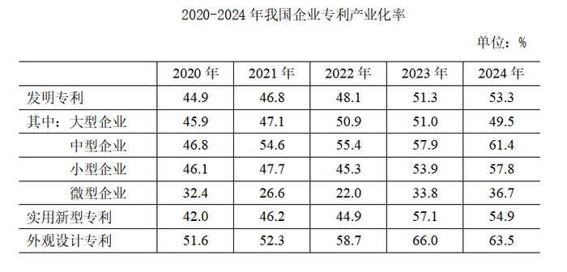
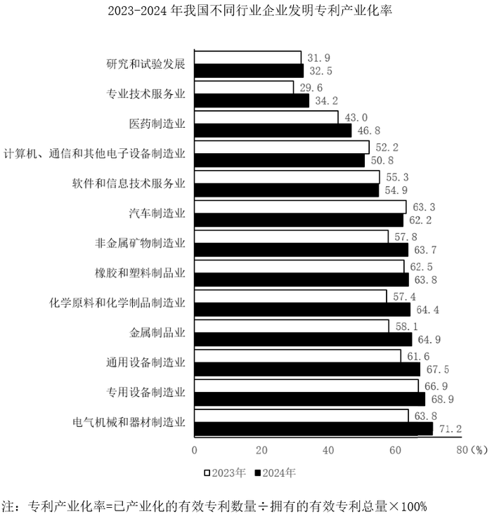
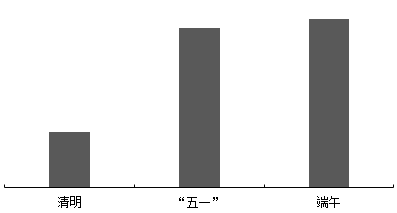

# 2026年国家公务员录用考试《行测》题（行政执法卷网友回忆版）

> 资料分析 · 20 题 · 国考 2026

## 材料 1

### 第 1 题　qid 19526212 · 增长

2024年上半年，中国医药保健品进出口贸易顺差（出口额-进口额）比上年同期：

- **A**. 下降了20%以上
- **B**. 下降了不到20%
- **C**. 上升了20%以上　✅
- **D**. 上升了不到20%

**答案**：C

**官方解析**

根据题干“2024年上半年······顺差（出口额-进口额）比上年同期”，结合选项为百分数，且出口额=进口额+顺差，可判定本题为混合增长率问题。定位统计表可得：2024年上半年，中国医药保健品进、出口额分别为451.76亿美元、525.79亿美元，同比增长率分别为-5.76%、1.96%。根据混合增长率口诀“混合后居中但不正中”可得，进口额增长率（-5.76%）＜出口额增长率（1.96%）＜顺差增长率，排除A、B两项。

2024年上半年中国医药保健品进出口贸易顺差亿美元，根据线段法：距离与量成反比（一般用现期量代替基期量计算），可得：，解得：，在C项范围内。

故正确答案为C。

---

### 第 2 题　qid 19526213 · 比重

2024年上半年，中药提取物出口额占医药保健品出口总额的比重比上年同期：

- **A**. 上升了3个百分点以上
- **B**. 下降了3个百分点以上
- **C**. 上升了不到3个百分点
- **D**. 下降了不到3个百分点　✅

**答案**：D

**官方解析**

根据题干“2024年上半年······占······的比重比上年同期”，结合选项为上升了/下降了+百分点，可判定本题为两期比重问题。定位统计表可得：2024年上半年中国医药保健品出口总额为525.79亿美元（B），同比增长1.96%（b）；中药提取物出口额为14.92亿美元（A），同比增长-14.28%（a）。根据公式：两期比重差，则题干所求为，即约下降了0.53个百分点。在D项范围内。

故正确答案为D。

---

### 第 3 题　qid 19526214 · 增长

表中所列医药保健品12个小类中，2024年上半年进出口总额同比上升的有几类？

- **A**. 7　✅
- **B**. 6
- **C**. 5
- **D**. 4

**答案**：A

**官方解析**

根据题干“······2024年上半年······同比上升的有几类”，结合材料给出2024年上半年各小类医药保健品进口额、出口额及分别的同比增速，可判定本题为混合增长率问题。定位统计表可得2024年上半年，医药保健品12个小类进口额、出口额及分别的同比增速。根据混合增长率口诀“混合居中不正中，偏向基期较大的（一般用现期代替）”，观察可知中成药、保健品、西药原料、生化药、保健康复用品、口腔设备与材料这6类的进、出口额同比增速均大于0，则进出口总额同比增速也大于0，则同比上升，均满足；中药材及饮片、医用敷料进、出口额同比增速均小于0，则进出口总额同比增速也小于0，则同比下降，均不满足；其余类别进、出口额同比增速一正一负，其中提取物：现期量出口额14.92亿美元&gt;进口额3.58亿美元，则，即r&lt;0，则同比下降，不满足；西成药：现期量进口额110.28亿美元&gt;出口额35.24亿美元，则，即r&lt;0，则同比下降，不满足；一次性耗材：现期量出口额48.81亿美元&gt;进口额19.55亿美元，则，即r&gt;0，则同比上升，满足；医院诊断与治疗：现期量进口额138.23亿美元&gt;出口额103.95亿美元，则，即r&lt;0，则同比下降，不满足。

综上可知，2024年上半年进出口总额同比上升的有中成药、保健品、西药原料、生化药、一次性耗材、保健康复用品、口腔设备与材料，共7类。

故正确答案为A。

---

### 第 4 题　qid 19526215 · 增长

将2024年上半年①医用敷料②一次性耗材③保健康复用品④口腔设备与材料进口额同比增量从高到低排序正确的是：

- **A**. ③④①②
- **B**. ③④②①
- **C**. ④③①②　✅
- **D**. ④③②①

**答案**：C

**官方解析**

根据题干“······2024年上半年······同比增量从高到低排序······”，可判定本题为增长量比较问题。定位表格可得：2024年上半年，医用敷料、一次性耗材、保健康复用品、口腔设备与材料的进口额分别为2.60亿美元、19.55亿美元、9.04亿美元、7.31亿美元，同比增速分别为-8.34%、-3.05%、9.62%、14.27%。根据公式：增长量，则以上四类医疗器械进口额的同比增量分别为：①医用敷料：亿美元；②一次性耗材：亿美元；③保健康复用品：亿美元；④口腔设备与材料：亿美元。比较可知，同比增量从高到低排序正确的是：④③①②。

故正确答案为C。

---

### 第 5 题　qid 19526216 · 比重

以下饼图中，最能准确反映2024年上半年中国西药类进出口总额中，西药原料（白色）、西成药（横线）和生化药（黑色）占比关系的是：

- **A**. 

- **B**. 

- **C**. 

- **D**. 

　✅

**答案**：D

**官方解析**

根据题干“······最能准确反映2024年上半年······占比关系的是”，结合材料时间为2024年上半年，可判定本题为现期比重问题。定位统计表可知：2024年上半年，西药原料出口额为213.43亿美元、进口额为51.78亿美元；西成药出口额为35.24亿美元、进口额为110.28亿美元；生化药出口额为20.71亿美元、进口额为97.84亿美元。则2024年上半年，西药原料（白色）进出口额=213.43+51.78=265.21亿美元，西成药（横线）进出口额=35.24+110.28=145.52亿美元，生化药（黑色）进出口额=20.71+97.84=118.55亿美元。可知西药原料（白色）进出口额最大，排除C项；西药原料（白色）与西成药（横线）倍数关系为，排除A项；西成药（横线）与生化药（黑色）倍数关系为，排除B项。

故正确答案为D。

---

## 材料 2

        2024年，我国企业发明专利产业化平均收益（平均每件已产业化的有效专利产生的收益）为869.5万元/件，较上年增长4.8％。其中，战略性新兴产业和未来产业领域的企业发明专利产业化平均收益分别为939.1万元/件和1132.7万元/件。分企业规模看，中型企业发明专利产业化平均收益最高，为991.9万元/件，其次为大型企业和小型企业，分别为953.9万元/件和752.4万元/件，微型企业相对最低，为260.1万元/件。

### 第 6 题　qid 19526217 · 平均数

2024年，我国企业发明专利产业化平均收益比上年增长约多少万元/件？

- **A**. 60
- **B**. 50
- **C**. 40　✅
- **D**. 30

**答案**：C

**官方解析**

根据题干“2024年······比上年增长约多少万元/件”，可判定本题为增长量计算问题。定位文字材料可得：2024年，我国企业发明专利产业化平均收益为869.5万元/件，较上年增长4.8%。根据公式：增长量，则所求万元/件，与C项最接近。

故正确答案为C。

---

### 第 7 题　qid 19526218 · 综合

将我国企业的发明专利、实用新型专利、外观设计专利按产业化率从高到低排序，则2020~2023年中次序与2024年次序一致的年份有几个？

- **A**. 0
- **B**. 1　✅
- **C**. 2
- **D**. 3

**答案**：B

**官方解析**

定位统计表可得2020-2024年，我国企业的发明专利、实用新型专利、外观设计专利产业化率。将我国企业的各类专利按产业化率从高到低排序分别为：
2020年，外观设计专利（51.6%）、发明专利（44.9%）、实用新型专利（42.0%）；
2021年，外观设计专利（52.3%）、发明专利（46.8%）、实用新型专利（46.2%）；
2022年，外观设计专利（58.7%）、发明专利（48.1%）、实用新型专利（44.9%）；
2023年，外观设计专利（66.0%）、实用新型专利（57.1%）、发明专利（51.3%）；
2024年，外观设计专利（63.5%）、实用新型专利（54.9%）、发明专利（53.3%）。
则2020~2023年中次序与2024年次序一致的年份是2023年，共1个。
故正确答案为B。

---

### 第 8 题　qid 19526219 · 平均数

2024年，我国大型企业平均每拥有1件有效发明专利产生的专利产业化收益约是我国中型企业的多少倍？

- **A**. 0.8　✅
- **B**. 1.0
- **C**. 1.3
- **D**. 1.6

**答案**：A

**官方解析**

根据题干“2024年······约是······的多少倍”，结合材料时间为2024年，可判定本题为现期倍数问题。定位文字材料可得：2024年，我国中型企业发明专利产业化平均收益（平均每件已产业化的有效专利产生的收益）为991.9万元/件，大型企业为953.9万元/件；定位统计表可得：2024年我国大型企业专利产业化率为49.5%，中型企业为61.4%。有效发明专利中包括已产业化专利和未产业化专利，则平均每拥有1件有效发明专利产生的专利产业化收益，则所求倍数，与A项最接近。

故正确答案为A。

---

### 第 9 题　qid 19526220 · 增长

资料所列13个行业中，2024年企业发明专利产业化率同比增量超过3个百分点的有几个？

- **A**. 5
- **B**. 6
- **C**. 7　✅
- **D**. 8

**答案**：C

**官方解析**

根据题干“2024年······同比增量超过······有几个”，可判定本题为增长量计算问题。定位统计图可知2023年及2024年我国不同行业企业发明专利产业化率。根据公式：增长量=现期量-基期量，本题所求企业发明专利产业化率的增长量，2024年企业发明专利产业化率相当于现期量，2023年企业发明专利产业化率相当于基期量，故2024年各行业企业发明专利产业化率的同比增量如下：
研究和试验发展：32.5%-31.9%=0.6个百分点，不符合；
专业技术服务业：34.2%-29.6%=4.6个百分点，符合；
医药制造业：46.8%-43.0%=3.8个百分点，符合；
计算机、通信和其他电子设备制造业：50.8%&lt;52.2%，即同比减少，不符合；
软件和信息技术服务业：54.9%&lt;55.3%，即同比减少，不符合；
汽车制造业：62.2%&lt;63.3%，即同比减少，不符合；
非金属矿物制造业：63.7%-57.8%=5.9个百分点，符合；
橡胶和塑料制品业：63.8%-62.5%=1.3个百分点，不符合；
化学原料和化学制品制造业：64.4%-57.4%=7.0个百分点，符合；
金属制品业：64.9%-58.1%=6.8个百分点，符合；
通用设备制造业：67.5%-61.6%=5.9个百分点，符合；
专用设备制造业：68.9%-66.9%=2.0个百分点，不符合；
电气机械和器材制造业：71.2%-63.8%=7.4个百分点，符合。
综上，资料所列13个行业中，2024年企业发明专利产业化率同比增量超过3个百分点的有7个。
故正确答案为C。

---

### 第 10 题　qid 19526221 · 平均数

在①2023年未来产业领域企业发明专利产业化平均收益、②2024年小微企业发明专利产业化总体平均收益、③2023年金属制品业大型企业发明专利产业化率3项指标中，能够从上述资料中推出的有几项？

- **A**. 3项
- **B**. 2项
- **C**. 1项
- **D**. 0项　✅

**答案**：D

**官方解析**

①定位文字材料可得：2024年，我国未来产业领域的企业发明专利产业化平均收益为1132.7万元/件。并未给出相较于2023年的增长率或增长量，故无法推出2023年未来产业领域企业发明专利产业化平均收益；
②定位文字材料可得：2024年，小型企业发明专利产业化平均收益为752.4万元/件，微型企业为260.1万元/件。并未给出小型企业和微型企业已产业化的有效专利数量，故无法推出2024年小微企业发明专利产业化总体平均收益；
③定位统计表可知2023年大型企业发明专利产业化率；定位柱状图可知2023年金属制品业企业发明专利产业化率。并未给出金属制品业大型企业发明专利产业化率的情况，故无法推出2023年金属制品业大型企业发明专利产业化率。
综上，3项均无法推出。
故正确答案为D。

---

## 材料 3

      科幻产业包括科幻阅读、科幻影视、科幻游戏、科幻衍生品、科幻文旅五大领域。2024年，我国科幻产业总营收1089.6亿元。

### 第 11 题　qid 19526222 · 综合

2021~2024年，我国科幻产业累计营收额约是2017~2020年的多少倍？

- **A**. 2.5
- **B**. 2.2　✅
- **C**. 1.9
- **D**. 1.6

**答案**：B

**官方解析**

根据题干“2021~2024年······约是2017~2020年的多少倍”，结合材料已给出2017~2024年的相关数据，可判定本题为现期倍数问题。定位统计图1可得2017~2024年我国科幻产业营收额，则所求倍数倍。

故正确答案为B。

---

### 第 12 题　qid 19526223 · 增长

如保持2024年同比增量不变，则2026-2030年，我国科幻游戏产业累计营收将在以下哪个范围内？

- **A**. 不到4500亿元
- **B**. 4500亿～4750亿元之间
- **C**. 超过5000亿元
- **D**. 4750亿～5000亿元之间　✅

**答案**：D

**官方解析**

根据题干“如保持2024年同比增量不变，则2026-2030年······将在以下哪个范围内”，结合材料时间为2022-2024年，可判定本题为现期计算问题。定位统计图2可得：2023年、2024年我国科幻游戏产业营收分别为：651.9亿元、718.1亿元。根据公式：增长量=现期量-基期量，则2024年我国科幻游戏产业营收同比增量=718.1-651.9=66.2亿元。根据公式：现期量=基期量+n×增长量（n为年份差），则2026年营收=718.1+66.2×2=850.5亿元。可知2026-2030年累计营收构成首项为850.5、公差为66.2、项数为5的等差数列，根据等差数列求和公式：（n为项数），则2026-2030年，我国科幻游戏产业累计营收亿元，在D项范围内。

故正确答案为D。

---

### 第 13 题　qid 19526224 · 增长

我国科幻产业五大领域中，2024年营收额同比增速快于2023年水平的有几个？

- **A**. 4
- **B**. 3
- **C**. 2　✅
- **D**. 1

**答案**：C

**官方解析**

根据题干“······2024年······同比增速快于2023年水平······”，可判定本题为一般增长率比较问题。定位统计图2可得：2024年我国科幻产业五大领域营收额分别为：35.1亿元、67.1亿元、718.1亿元、25.3亿元、244.0亿元；2023年我国科幻产业五大领域营收额分别为：31.7亿元、115.9亿元、651.9亿元、22.8亿元、310.6亿元；2022年我国科幻产业五大领域营收额分别为：30.4亿元、83.5亿元、565.0亿元、48.3亿元、150.3亿元，根据公式：增长率可得：

2024年我国科幻产业五大领域营收额的同比增速分别如下：

科幻阅读：；

科幻影视：；

科幻游戏：；

科幻衍生品：；

科幻文旅：。

2023年我国科幻产业五大领域营收额的同比增速分别如下：

科幻阅读：；

科幻影视：；

科幻游戏：；

科幻衍生品：；

科幻文旅：。

综上可知，我国科幻产业五大领域中，2024年营收额同比增速快于2023年水平的有科幻阅读、科幻衍生品两个领域。

故正确答案为C。

---

### 第 14 题　qid 19526225 · 比重

2022~2024年，科幻文旅营收额占科幻产业营收额的比重超过20%的年份仅包括：

- **A**. 2023和2024年　✅
- **B**. 2023年
- **C**. 2022和2024年
- **D**. 2022年

**答案**：A

**官方解析**

根据题干“2022~2024年······占······的比重超过20%的年份仅包括”，结合材料时间为2022~2024年，可判定本题为现期比重问题。定位图1可得：2022~2024年我国科幻产业营收额分别为877.5亿元、1132.9亿元、1089.6亿元；定位图2可得：2022~2024年我国科幻文旅营收额分别为150.3亿元、310.6亿元、244.0亿元。根据公式：比重，则2022~2024年，科幻文旅营收额占科幻产业营收额的比重分别为：

2022年：；

2023年：；

2024年：。

综上所述，2022~2024年，科幻文旅营收额占科幻产业营收额的比重超过20%的年份仅包括2023和2024年。

故正确答案为A。

---

### 第 15 题　qid 19526226 · 增长

以下柱状图反映了哪一时间段内，我国科幻产业营收额同比增量的变化情况（横轴位置表示增量为0）？

- **A**. 2021~2024年
- **B**. 2020~2023年
- **C**. 2019~2022年
- **D**. 2018~2021年　✅

**答案**：D

**官方解析**

根据题干“······我国科幻产业营收额同比增量的变化情况······”，可判定本题为增长量比较问题。定位图1可知2017~2024年我国科幻产业各年度营收额，根据公式：增长量=现期量-基期量，则选项中各年份增长量分别为：
A项：2021年，829.6-551.1=278.5亿元；2022年，877.5-829.6=47.9亿元；2023年，1132.9-877.5=255.4亿元，题干图中第三年增长量为负，排除。
B项：2020年，551.1-658.7=-107.6亿元，题干图中第一年增长量为正，排除。
C项：2019年，658.7-456.4=202.3亿元；2020年，551.1-658.7=-107.6亿元，题干图中第二年增长量为正，排除。
D项：2018年，456.4-140.0=316.4亿元；2019年，658.7-456.4=202.3亿元；2020年，551.1-658.7=-107.6亿元；2021年，829.6-551.1=278.5亿元，符合题干图形的变化情况，当选。
故正确答案为D。

---

## 材料 4

        2025年清明假期3天，Y省接待游客2110.5万人次，同比增长6.4%；实现旅游收入107.8亿元，同比增长8.7%。全省4A级及以上景区接待游客657.5万人次，同比增长7.4%；纳入监测的13家红色旅游经典景区接待游客54.7万人次，同比增长5.1%。

        2025年“五一”假期5天，Y省接待游客4608.2万人次，同比增长18.7%；实现旅游收入295亿元，同比增长20.3%。全省4A级及以上景区接待游客1629.9万人次，同比增长14.3%；纳入监测的13家红色旅游经典景区接待游客119.5万人次，同比增长12.0%。

        2025年端午假期3天，Y省接待游客2321.0万人次，同比增长20.6%；实现旅游收入114.4亿元，同比增长25.6%。全省4A级及以上景区接待游客726.1万人次，同比增长18.9%；纳入监测的13家红色旅游经典景区接待游客54.4万人次，同比增长17.5%。

### 第 16 题　qid 19526227 · 增长

2025年清明假期、“五一”假期和端午假期，Y省接待游客总人次数比上年增长了：

- **A**. 超过1400万人次
- **B**. 1100万~1400万人次之间　✅
- **C**. 800万~1100万人次之间
- **D**. 不到800万人次

**答案**：B

**官方解析**

根据题干“······接待游客总人次数比上年增长了”，结合选项带单位，可判定本题为增长量计算问题。定位文字材料第一、二、三段可得：2025年清明假期，Y省接待游客2110.5万人次，同比增长6.4%；“五一”假期，Y省接待游客4608.2万人次，同比增长18.7%；端午假期，Y省接待游客2321.0万人次，同比增长20.6%。根据公式：增长量，可得所求万人次，在B项范围内。

故正确答案为B。

---

### 第 17 题　qid 19526228 · 平均数

2025年“五一”假期，Y省平均每接待1人次游客产生的旅游收入比清明假期：

- **A**. 高10%以上　✅
- **B**. 高不到10%
- **C**. 低10%以上
- **D**. 低不到10%

**答案**：A

**官方解析**

根据题干“2025年······平均每接待1人次游客产生的旅游收入比清明假期”，结合选项为高/低+百分数，可判定本题为平均数的增长率问题。定位材料第一、二段可得：2025年清明假期3天，Y省接待游客2110.5万人次；实现旅游收入107.8亿元。2025年“五一”假期5天，Y省接待游客4608.2万人次；实现旅游收入295亿元。根据公式：平均每接待1人次游客产生的旅游收入，故“五一”假期平均每接待1人次游客产生的旅游收入为，清明假期平均每接待1人次游客产生的旅游收入为，则所求为，即约高25%，在A项范围内。

故正确答案为A。

---

### 第 18 题　qid 19526229 · 综合

将Y省2024年清明假期、“五一”假期和端午假期日均实现旅游收入从高到低排列，以下正确的是：

- **A**. “五一”、端午、清明
- **B**. 清明、“五一”、端午
- **C**. “五一”、清明、端午　✅
- **D**. 清明、端午、“五一”

**答案**：C

**官方解析**

根据题干“将Y省2024年······日均······”，结合材料时间为2025年，可判定本题为基期平均数问题。定位文字材料第一、二、三段可得：2025年清明假期3天······实现旅游收入107.8亿元，同比增长8.7%；2025年“五一”假期5天······实现旅游收入295亿元，同比增长20.3%；2025年端午假期3天······实现旅游收入114.4亿元，同比增长25.6%。根据公式：基期量，则2024年清明假期日均实现旅游收入为亿元/天，2024年“五一”假期日均实现旅游收入为亿元/天，2024年端午假期日均实现旅游收入为亿元/天。故Y省2024年日均实现旅游收入从高到低排列为“五一”假期、清明假期、端午假期。

故正确答案为C。

---

### 第 19 题　qid 19526230 · 平均数

2025年清明假期、“五一”假期和端午假期Y省接待的游客中，平均每万人次中有多少人次前往纳入监测的13家红色旅游经典景区旅游？

- **A**. 超过300人次
- **B**. 200~300人次之间　✅
- **C**. 100~200人次之间
- **D**. 不到100人次

**答案**：B

**官方解析**

根据题干“2025年······平均每万人次······”，结合材料时间为2025年，可判定本题为现期平均数问题。定位文字材料第一、二、三段可得2025年清明假期、“五一”假期、端午假期Y省接待游客人次数以及纳入监测的13家红色旅游经典景区接待游客人次数。则题干所求人次，在B项范围内。

故正确答案为B。

---

### 第 20 题　qid 19526231 · 综合

以下柱状图反映了2025年清明假期、“五一”假期和端午假期，Y省接待游客哪一指标的变化情况（横轴位置表示数值为0）？

- **A**. 纳入监测的13家红色旅游经典景区日均接待游客数同比增量　✅
- **B**. 纳入监测的13家红色旅游经典景区日均接待游客数量
- **C**. 4A级及以上景区日均接待游客数同比增量
- **D**. 4A级及以上景区日均接待游客数量

**答案**：A

**官方解析**

根据题干“以下柱状图反映了2025年······Y省接待游客哪一指标的变化情况······”，结合选项中涉及日均接待游客数，可判定本题为平均数问题。定位材料第一、二、三段可得2025年清明假期、“五一”假期和端午假期的天数、Y省接待游客各指标数据和同比增长率。根据公式：平均数，增长量，可得Y省接待游客各指标的数据情况如下：

A项，纳入监测的13家红色旅游经典景区日均接待游客数同比增量：清明假期，万人次；“五一”假期，万人次；端午假期，万人次，符合柱状图变化趋势，当选；

B项，纳入监测的13家红色旅游经典景区日均接待游客数量：清明假期，万人次；端午假期，万人次。清明假期日均接待游客数量与端午假期几乎相等，不符合柱状图变化趋势，排除；

C项，4A级及以上景区日均接待游客数同比增量：清明假期，万人次；“五一”假期，人次；端午假期，万人次。“五一”假期同比增量&gt;端午假期同比增量，不符合柱状图变化趋势，排除；

D项，4A级及以上景区日均接待游客数量：清明假期，万人次；“五一”假期，万人次；端午假期，万人次。“五一”假期日均接待游客数量&gt;端午假期日均接待游客数量，不符合柱状图变化趋势，排除。

故正确答案为A。

---
