# 2026年天津市公务员录用考试《行测》题（网友回忆版）

> 资料分析 · 20 题 · 天津 2026

## 材料 1

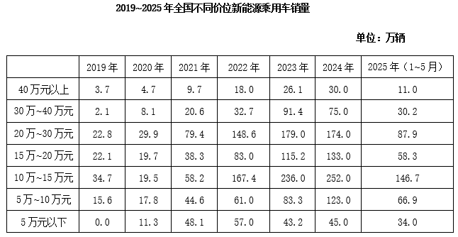

### 第 1 题　qid 18643712 · 综合

2025年1~5月，全国新能源乘用车月均销售多少万辆？

- **A**. 83
- **B**. 87　✅
- **C**. 91
- **D**. 95

**答案**：B

**官方解析**

根据题干“2025年1~5月······月均销售多少万辆”，可判定本题为现期平均数计算问题。定位表格材料可得：2025年1~5月不同价位新能源乘用车销量分别为：11.0、30.2、87.9、58.3、146.7、66.9、34.0万辆。故2025年1~5月，全国新能源乘用车月均销售为（11.0+30.2+87.9+58.3+146.7+66.9+34.0）÷5=435÷5=87万辆。
故正确答案为B。

---

### 第 2 题　qid 18643713 · 增长

与2020年相比，下列哪个价位的新能源乘用车2024年全国销量增速最慢？

- **A**. 10万元以下　✅
- **B**. 10万~20万元
- **C**. 20万~30万元
- **D**. 30万元以上

**答案**：A

**官方解析**

根据题干“与2020相比······2024年增速最慢”，可判定本题为一般增长率比较问题。定位表格可知2020年与2024年全国不同价位新能源乘用车销量。根据公式：增长率，可得不同价位新能源乘用车增速分别为：

10万元以下价位：；

10万~20万元价位：；

20万~30万元价位：；

30万元以上价位：。

则与2020年相比，10万元以下价位的新能源乘用车2024年全国销量增速最慢。

故正确答案为A。

---

### 第 3 题　qid 18643714 · 增长

如2025年各月同一价位的新能源乘用车销量为固定值，则2025年5万~10万元新能源乘用车销量将比上年增长：

- **A**. 不到20%
- **B**. 20%~40%之间　✅
- **C**. 40%~60%之间
- **D**. 60%以上

**答案**：B

**官方解析**

根据题干“······比上年增长”，结合选项为百分数，可判定本题为一般增长率问题。定位表格材料可知：2025年1~5月，5万~10万元新能源乘用车销量为66.9万辆，2024年全年5万~10万元新能源乘用车销量为123.0万辆。则2025年1~5月，5万~10万元新能源乘用车月均销量万辆，2025年全年5万~10万元新能源乘用车销量=66.9+13.4×（12-5）=160.7万辆。根据公式：增长率，可得2025年5万~10万元新能源乘用车销量将比上年增长，即增长20%~40%之间。

故正确答案为B。

---

### 第 4 题　qid 18643715 · 比重

以下饼图中，最能准确反映2023年全国新能源乘用车销量中，10万元以下（黑色）、10万~20万元（白色）、20万~30万元（横线）和30万元以上（竖线）价位车型占比关系的是：

- **A**. 

　✅
- **B**. 

- **C**. 

- **D**. 

**答案**：A

**官方解析**

根据题干“2023年······占比关系的是”，结合材料给出了2023年相关数据，可判定本题为现期比重问题。定位表格材料可得2023年全国不同价位新能源乘用车销量。

10万元以下销量（黑色）=5万~10万+5万元以下=83.3+43.2=126.5万辆；10万~20万元销量（白色）=15万~20万+10万~15万=115.2+236.0=351.2万辆；20万~30万元销量（横线）为179.0万辆；30万元以上销量（竖线）=40万元以上+30万~40万元=26.1+91.4=117.5万辆。观察选项与数据可得：

10万元以下销量（黑色）30万元以上销量（竖线），B、C两项不符合，排除；

10万~20万元销量（白色）351.2万辆&gt;10万元以下销量（黑色）126.5万辆×2，D项不符合，排除。

故正确答案为A。

---

### 第 5 题　qid 18643716 · 增长

以下折线图反映了2020~2023年全国哪一价位新能源乘用车销量同比增速的变化趋势？

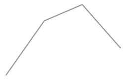

- **A**. 30万~40万元
- **B**. 20万~30万元
- **C**. 15万~20万元　✅
- **D**. 10万~15万元

**答案**：C

**官方解析**

根据题干“······同比增速的变化趋势”，可判定本题为一般增长率问题。定位表格材料可得2019~2023年全国不同价位新能源乘用车销量。根据公式：，可得：

A项：2020年：；2021年：。与折线图趋势不同，排除；

B项：2020年：；2021年：；2022年：。与折线图趋势不同，排除；

C项：2020年：；2021年：；2022年：；2023年：。与折线图趋势相同，当选；

D项：2020年：；2021年：；2022年：。与折线图趋势不同，排除。

故正确答案为C。

---

## 材料 2

        FIC创新药是指通过全新作用机制实现疾病治疗的突破性药物，具有全球首创性和高临床价值，代表医药研发的最高水平。

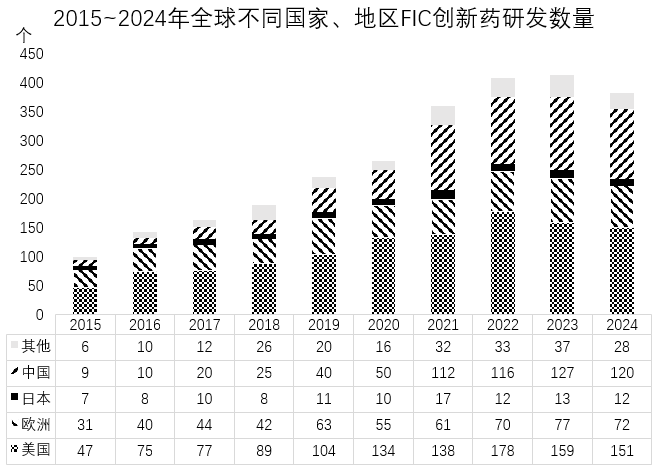

### 第 6 题　qid 18643763 · 综合

2024年全球FIC创新药研发数量约是2015年的多少倍？

- **A**. 3.0
- **B**. 3.4
- **C**. 3.8　✅
- **D**. 4.2

**答案**：C

**官方解析**

根据题干“2024年······约是······的多少倍”，可判定本题为现期倍数问题。定位统计图可得：2024年其他地区、中国、日本、欧洲和美国的FIC创新药研发数量分别为28个、120个、12个、72个、151个；2015年其他地区、中国、日本、欧洲和美国的FIC创新药研发数量分别为6个、9个、7个、31个、47个。则题干所求倍，与C项最接近。

故正确答案为C。

---

### 第 7 题　qid 18643764 · 增长

表中除“其他”的4个国家和地区中，2020~2024年FIC创新药研发数量相比前一个5年增速最快的是：

- **A**. 中国　✅
- **B**. 日本
- **C**. 欧洲
- **D**. 美国

**答案**：A

**官方解析**

根据题干“······增速最快”，可判定本题为一般增长率问题。定位统计图可得中国、日本、欧洲、美国各年FIC创新药研发数量。根据公式：增长率，则比较增长率大小，可以直接比较，现期量为2020-2024年FIC创新药研发数量之和，基期量为2015-2019年FIC创新药研发数量之和，选项各国列式如下： 

中国： ；

日本：；

欧洲：；

美国：。

比较可知，2020~2024年FIC创新药研发数量相比前一个5年增速最快的是中国。

故正确答案为A。

---

### 第 8 题　qid 18643765 · 综合

2022~2024年，中、美两国FIC创新药研发数量合计约占全球的：

- **A**. 65%
- **B**. 71%　✅
- **C**. 77%
- **D**. 83%

**答案**：B

**官方解析**

根据题干“2022~2024年······占······”，且材料给出2022~2024年相关数据，可判定本题为现期比重问题。定位统计图可得：2022~2024年中国FIC创新药研发数量分别为116个、127个、120个；美国FIC创新药研发数量分别为178个、159个、151个；其他国家FIC创新药研发数量分别为33个、37个、28个；日本FIC创新药研发数量分别为12个、13个、12个；欧洲FIC创新药研发数量分别为70个、77个、72个；则2022~2024年，中、美两国FIC创新药研发数量合计为116+127+120+178+159+151=851个；全球FIC创新药研发数量合计为851+33+37+28+12+13+12+70+77+72=1205个；故所求比重，与B项最接近。

故正确答案为B。

---

### 第 9 题　qid 18643766 · 综合

如从2015年开始计算，在哪一年末中国累计FIC创新药研发数量第一次超过日本的5倍？

- **A**. 2020年
- **B**. 2021年
- **C**. 2022年
- **D**. 2023年　✅

**答案**：D

**官方解析**

根据题干“如从2015年开始计算，在哪一年末中国累计······数量第一次超过······的5倍”，结合材料给出2015-2024年各年份数据，可判定本题为现期倍数问题。定位统计图，可知2015-2023年中国FIC创新药研发数量分别为9、10、20、25、40、50、112、116、127，日本FIC创新药研发数量分别为7、8、10、8、11、10、17、12、13。因此2015-2020年中国累计FIC创新药研发数量是日本的倍&lt;5倍，排除A项；

2015-2021年中国累计FIC创新药研发数量是日本的倍&lt;5倍，排除B项；

2015-2022年中国累计FIC创新药研发数量是日本的倍&lt;5倍，排除C项；

2015-2023年中国累计FIC创新药研发数量是日本的倍&gt;5倍，即在2023年末中国累计FIC创新药研发数量第一次超过日本的5倍。

故正确答案为D。

---

### 第 10 题　qid 18643768 · 增长

以下柱状图反映了哪一国家或地区2019~2022年FIC创新药研发数量同比增量的变化趋势（横轴位置代表增量为0）？

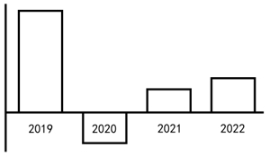

- **A**. 中国
- **B**. 日本
- **C**. 欧洲　✅
- **D**. 美国

**答案**：C

**官方解析**

根据题干“······同比增量的变化趋势······”，可判定本题为增长量比较问题。定位统计图可得2018-2022年各国家FIC创新药研发数量。根据柱状图可得，2020年的同比增长量为负数，其余均为正数；结合材料数据，2020年中国和美国FIC创新药研发数量为同比正增长，排除A、D两项；2022年日本FIC创新药研发数量为同比负增长，排除B项。
故正确答案为C。

---

## 材料 3

        2024年我国LNG进口量为7761万吨，同比增长8.1%。

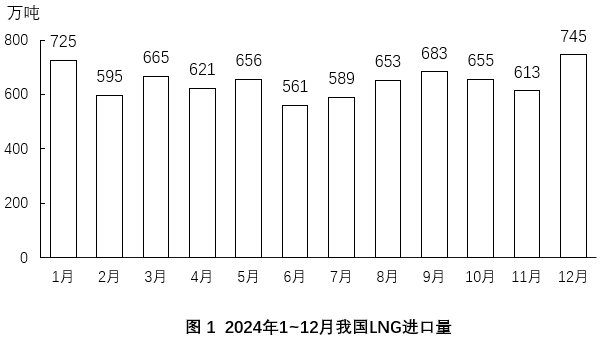

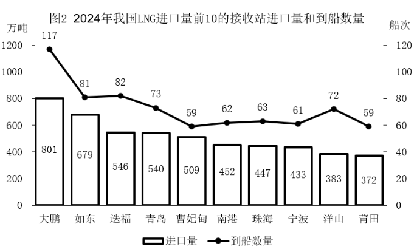

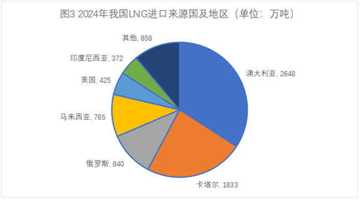

### 第 11 题　qid 18643734 · 综合

2024年，我国LNG进口量最高的2个季度从高到低依次是：

- **A**. 四季度，三季度
- **B**. 四季度，一季度　✅
- **C**. 三季度，四季度
- **D**. 三季度，一季度

**答案**：B

**官方解析**

定位图1可得2024年1~12月我国LNG进口量。则2024年一季度LNG进口量=725+595+665=1985万吨；2024年二季度LNG进口量=621+656+561=1838万吨；2024年三季度LNG进口量=589+653+683=1925万吨；2024年四季度LNG进口量=655+613+745=2013万吨。则2024年我国LNG进口量最高的2个季度从高到低依次是四季度和一季度。
故正确答案为B。

---

### 第 12 题　qid 18643736 · 综合

2024年我国LNG进口量前5的接收站，进口量约占当年全国进口总量的：

- **A**. 30%
- **B**. 35%
- **C**. 40%　✅
- **D**. 45%

**答案**：C

**官方解析**

根据题干“2024年······占······的”，结合材料时间为2024年，可判定本题为现期比重问题。定位文字材料可得：2024年我国LNG进口量为7761万吨，定位图2可得：2024年我国LNG进口量前5的接收站进口量分别为大鹏（801万吨），如东（679万吨），迭福（546万吨），青岛（540万吨），曹妃甸（509万吨）。根据公式：比重，2024年我国LNG进口量前5的接收站进口量占当年全国进口总量的比重，最接近C项。

故正确答案为C。

---

### 第 13 题　qid 18643737 · 平均数

2024年我国LNG进口量前10的接收站中，平均每船次LNG进口量超过8万吨的接收站有几个？

- **A**. 2　✅
- **B**. 3
- **C**. 4
- **D**. 5

**答案**：A

**官方解析**

根据题干“2024年······平均每船次······”，可判定本题为现期平均数问题。定位图2可知2024年我国LNG进口量前10的接收站进口量和到船数量，根据公式：平均每船的进口量，则2024年各接收站平均每船次LNG进口量为：大鹏：、如东：、迭福：、青岛：、曹妃甸：、南港：、珠海：、宁波：、洋山：、莆田：。满足平均数超过8万吨的只有如东、曹妃甸，共2个。

故正确答案为A。

---

### 第 14 题　qid 18643738 · 比重

2024年我国LNG进口量中，来自卡塔尔的进口量占比约比来自印度尼西亚的高多少个百分点？

- **A**. 13
- **B**. 16
- **C**. 19　✅
- **D**. 22

**答案**：C

**官方解析**

根据题干“2024年······占比······”，结合材料时间为2024年，可判定本题为现期比重问题。定位文字材料可得：2024年我国LNG进口量为7761万吨；定位图3可得：2024年我国LNG进口量中，来自卡塔尔的进口量为1833万吨，来自印度尼西亚的进口量为372万吨。根据公式：比重，可得所求，即2024年我国LNG进口量中，来自卡塔尔的进口量占比约比来自印度尼西亚的高18.7个百分点，与C项最接近。

故正确答案为C。

---

### 第 15 题　qid 18643739 · 综合

能够从上述资料中推出的是：

- **A**. 2024年，我国LNG累计进口量在9月第一次超过5000万吨
- **B**. 2024年下半年，我国LNG进口量环比增速超过10%的月份仅有1个
- **C**. 2024年，我国LNG进口量前5的接收站月均合计到港超过35船次
- **D**. 2024年，我国自澳大利亚LNG进口量不到自马来西亚进口量的3.5倍　✅

**答案**：D

**官方解析**

A项：定位图1可得2024年各月我国LNG进口量。2024年1~8月我国LNG累计进口量为725+595+665+621+656+561+589+653=5065万吨，则2024年我国LNG累计进口量第一次超过5000万吨是在8月，而非9月，错误；

B项：定位图1可得2024年下半年我国LNG进口量。则2024年下半年环比增速分别为：7月，；8月，；9月，；10月，；11月，；12月，，故环比增速超过10%的有8月、12月这2个月份，而非1个，错误；

C项：定位图2可得，2024年我国LNG进口量前5的接收站分别为大鹏（801万吨）、如东（679万吨）、迭福（546万吨）、青岛（540万吨）、曹妃甸（509万吨），对应的到船数量分别为117船次、81船次、82船次、73船次、59船次，则2024年，我国LNG进口量前5的接收站月均合计到港船次，错误；

D项：定位图3可得，我国自澳大利亚、马来西亚LNG进口量分别为2648万吨、785万吨。前者是后者的倍，不到3.5倍，正确。

故正确答案为D。

---

## 材料 4

        截至2024年底，城乡居民基本医疗保险参保94713.73万人，收入11180.91亿元，支出10661.49亿元。

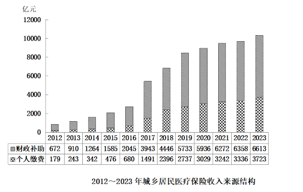

### 第 16 题　qid 18643743 · 平均数

如按期末参保人数计算，则2024年，城乡居民基本医疗保险人均收入比人均支出约高多少元？

- **A**. 55　✅
- **B**. 80
- **C**. 105
- **D**. 139

**答案**：A

**官方解析**

根据题干“······2024年······人均······高多少元”，结合材料时间为2024年，可判定本题为现期平均数问题。定位文字材料可知：截至2024年底，城乡居民基本医疗保险参保94713.73万人，收入11180.91亿元，支出10661.49亿元。根据公式：平均数，则题干所求为元，与A项最接近。

故正确答案为A。

---

### 第 17 题　qid 18643744 · 增长

2024年，城乡居民医疗保险收入比上年约增长了：

- **A**. 4%
- **B**. 8%　✅
- **C**. 12%
- **D**. 16%

**答案**：B

**官方解析**

根据题干“······比上年约增长了”，结合选项均为百分数，可判定本题为一般增长率计算问题。定位文字材料可得：截至2024年底，城乡居民基本医疗保险参保94713.73万人，收入11180.91亿元；定位表格材料可得：2023年城乡居民医疗保险财政补贴6613亿元，个人缴费3723亿元。2023年城乡居民医疗保险收入=财政补贴+个人缴费亿元，故2024年，城乡居民医疗保险收入同比增长率，与B项最接近。

故正确答案为B。

---

### 第 18 题　qid 18643746 · 综合

2019-2023年，城乡居民医疗保险收入中，财政补助累计收入在以下哪个范围内？

- **A**. 不到2.8万亿元
- **B**. 2.8万亿-3万亿元之间
- **C**. 3万亿-3.2万亿元之间　✅
- **D**. 3.2万亿元以上

**答案**：C

**官方解析**

定位统计图可知，2019-2023年城乡居民医疗保险收入中财政补助收入数据。则题干所求为：，在C项范围内。

故正确答案为C。

---

### 第 19 题　qid 18643747 · 增长

2013~2023年间，城乡居民医疗保险收入个人缴费收入同比增速超过20%的年份有几个？

- **A**. 5
- **B**. 6　✅
- **C**. 7
- **D**. 8

**答案**：B

**官方解析**

根据题干“2013~2023年间······同比增速超过20％的年份有几个”，可判定本题为一般增长率计算问题。定位统计图可得2012~2023年间，城乡居民医疗保险收入个人缴费收入。根据公式：增长率，则2013~2023年间，城乡居民医疗保险收入个人缴费收入同比增速分别为：

2013年：，满足；

2014年：，满足；

2015年：，满足；

2016年：，满足；

2017年：，满足；

2018年：，满足；

2019年：，不满足；

2020年：，不满足；

2021年：，不满足；

2022年：，不满足；

2023年：，不满足。

综上，2013~2023年间，城乡居民医疗保险收入个人缴费收入同比增速超过20%的年份有2013年、2014年、2015年、2016年、2017年和2018年，共6个。

故正确答案为B。

---

### 第 20 题　qid 18643750 · 比重

以下折线图中，最能准确反映2016~2019年间，财政补助收入占城乡居民医疗保险收入比重变化趋势的是：

- **A**. 
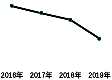

- **B**. 
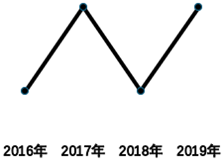

- **C**. 
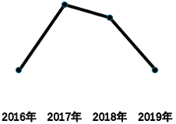

- **D**. 
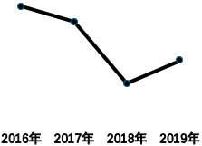
　✅

**答案**：D

**官方解析**

根据题干“······2016~2019年间······占······比重变化趋势······”，结合材料给出2016~2019年相关数据，可判定本题为现期比重问题。定位统计图可得2016~2019年每年的财政补助收入和个人缴费收入。根据公式：比重，结合城乡居民医疗保险收入=财政补助收入+个人缴费收入，故2016~2019年财政补助收入占城乡居民医疗保险收入的比重分别为：

2016年：；

2017年：；

2018年：；

2019年：。

观察可得，变化趋势为先下降后上升，只有D项符合。

故正确答案为D。

---
