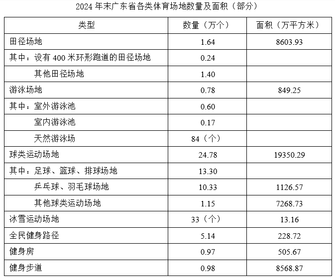
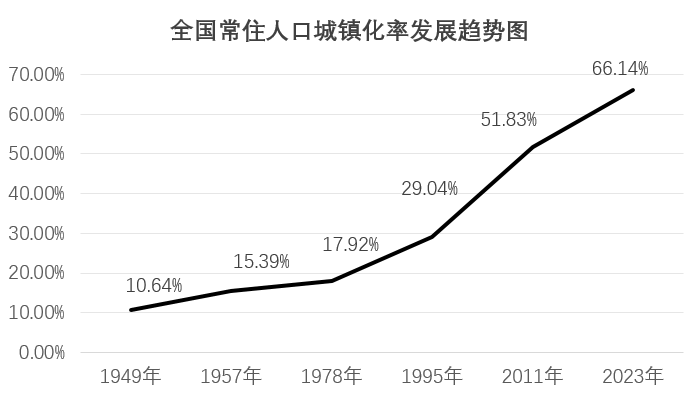

# 2026年广东省公务员录用考试《行测》题（网友回忆版）

> 资料分析 · 20 题 · 广东 2026

## 材料 1

        广东既是经济大省，也是人口大省、就业大省，数据显示，2024年广东净增74万人，新出生113.3万人；城镇新增就业超143万人，超额完成国家下达的110万人的年度就业任务，并且实现4386万异地务工人员稳定就业，是名副其实的就业超级“蓄水池”。

        今年以来，广东按照省委、省政府关于实施“百万英才汇南粤”行动计划的部署安排，围绕“粤聚英才、粤见未来”主题，广泛募集岗位、强化精准对接、提升优质服务、持续扩大声势。截至7月中旬，全省已吸纳超过100万应届高校毕业生留粤来粤就业创业，进一步夯实广东现代化产业体系的人才基座，充分彰显经济大省挑大梁的责任担当。

        “百万英才汇南粤”行动计划紧紧围绕广东现代化产业体系建设需要，聚焦20个战略性产业集群，突出新兴产业未来产业，充分发动知名科技企业拿出大量优质岗位，组织发动各类企事业单位动态募集120多万优质岗位，以具有竞争力的薪酬和岗位吸纳优秀高校毕业生，今年3至7月，累计组织2.1万家重点企业在“粤就业”小程序发布62.5万个岗位。其中，面向博士、硕士的8.6万个，面向本科生25.6万个，面向大专和各类技工学校学生28.3万个，年薪10万元以上岗位约26万个，年薪20万元以上岗位超6.5万个，年薪50万元以上甚至百万年薪的岗位超5000个。

        从留粤就业的省内应届高校毕业生情况看，今年1至7月，制造业吸纳毕业生约10万人，人数占比从2020年的14.72%提升到2025年的19.21%。其中，人工智能、机器人、半导体与集成电路、高端装备制造、新能源汽车、低空经济相关专业毕业生占四分之一，对发展新质生产力、建设现代化产业体系的人才支撑作用明显提升。

### 第 1 题　qid 12019685 · 综合

“百万英才汇南粤”行动计划围绕的主题是（    ）。

- **A**. “好岗配优才”
- **B**. “粤聚英才、粤见未来”　✅
- **C**. “魅力大湾区，活力新广东”
- **D**. “经济大省挑大梁，再造一个新广东”

**答案**：B

**官方解析**

定位文字材料第二段可得：今年以来，广东按照省委、省政府关于实施“百万英才汇南粤”行动计划的部署安排，围绕“粤聚英才、粤见未来”主题，对应B项。
故正确答案为B。

---

### 第 2 题　qid 12019686 · 综合

关于“百万英才汇南粤”行动计划，资料未提及（    ）。

- **A**. 紧紧围绕广东现代化产业体系建设需要
- **B**. 突出新兴产业未来产业
- **C**. 鼓励应届毕业生跨省就业创业　✅
- **D**. 充分发动知名科技企业拿出大量优质岗位

**答案**：C

**官方解析**

定位资料第三段可知，“百万英才汇南粤”行动计划紧紧围绕广东现代化产业体系建设需要，对应A项；聚焦20个战略性产业集群，突出新兴产业未来产业，对应B项；充分发动知名科技企业拿出大量优质岗位，组织发动各类企事业单位动态募集120多万优质岗位，对应D项。定位资料第二段，按照省委、省政府关于实施“百万英才汇南粤”行动计划的部署安排，截至7月中旬，全省已吸纳超过100万应届高校毕业生留粤来粤就业创业，未提及鼓励应届毕业生跨省就业创业情况。
本题为选非题，故正确答案为C。

---

### 第 3 题　qid 12019687 · 比重

2025年3至7月“粤就业”小程序发布的62.5万个岗位中，年薪10万元以上岗位占比（    ）。

- **A**. 在1成到2成之间
- **B**. 在2成到3成之间
- **C**. 在3成到4成之间
- **D**. 在4成到5成之间　✅

**答案**：D

**官方解析**

根据题干“2025年3至7月······占比······”，结合材料时间为2025年3至7月，可判定本题为现期比重问题。定位文字材料第三段可得：2025年3至7月，累计组织2.1万家重点企业在“粤就业”小程序发布62.5万个岗位，其中，年薪10万元以上岗位约26万个。根据公式：比重，则题目所求，在D项范围内。

故正确答案为D。 

---

### 第 4 题　qid 12019688 · 综合

2025年1至7月，留粤就业的人工智能、机器人、半导体与集成电路、高端装备制造、新能源汽车、低空经济相关专业省内应届高校毕业生约有（    ）万人。

- **A**. 2.5　✅
- **B**. 5
- **C**. 7.5
- **D**. 10

**答案**：A

**官方解析**

根据题干“2025年1至7月······省内应届高校毕业生约有······万人”，结合材料时间为2025年1至7月及材料给出题干相关专业省内应届高校毕业生占比，可判定本题为现期比重问题。定位文字材料第四段可得：从留粤就业的省内应届高校毕业生情况看，今年（2025年）1至7月，制造业吸纳毕业生约10万人······其中，人工智能、机器人、半导体与集成电路、高端装备制造、新能源汽车、低空经济相关专业毕业生占四分之一。根据公式：部分=整体×比重，则所求万。

故正确答案为A。

---

### 第 5 题　qid 12019690 · 综合

根据资料，以下说法可以判断属实的是（    ）。

- **A**. 2024年，广东新出生人口超百万　✅
- **B**. 2024年，广东省内应届高校毕业生中，本科生占比超40%
- **C**. 2025年上半年，广东超额完成国家下达的年度就业任务
- **D**. 2025年上半年，广东吸纳超百万应届高校毕业生留粤来粤就业创业

**答案**：A

**官方解析**

A项：定位文字材料第一段可得：数据显示，2024年广东新出生113.3万人，正确；
B项：材料中并未提及2024年广东省内应届高校毕业生和本科生相关信息，故无法判断，错误；
C项：定位文字材料第一段可得：2024年广东城镇新增就业超143万人，超额完成国家下达的110万人的年度就业任务，非2025年上半年，错误；
D项：定位文字材料第二段可得：截至（2025年）7月中旬，全省已吸纳超过100万应届高校毕业生留粤来粤就业创业，非2025年上半年，错误。
故正确答案为A。

---

## 材料 2

        标准物质与尺子、砝码一样，是测量中必不可少的参照工具。它是已提前获得准确测量结果、均匀稳定的样品，待测样品以其为标准，确保不同时间、人员、实验室的测量结果可比。标准物质研制生产机构在开展具体品种标准物质的生产供应前，须通过技术审评并取得定级证书，这些取得定级证书的标准物质，统称为“国家标准物质”。根据计量溯源性、准确度和用途等，国家标准物质目前分为两类，即一级标准物质和二级标准物质。

        国家标准物质数量快速增长的原因有四个方面：一是用途广泛、涉及经济、社会发展的各个领域；二是需求大幅增加，检测部门和行业主管部门日益重视测量结果的准确性；三是产业发展迅速，除了中国计量科学研究院等机构之外，越来越多的企业积极申报国家标准物质；四是政策支持，国家市场监管总局出台了一系列措施，比如将国家标准物质纳入国务院计量发展规划、发布建设和管理指导意见，并优化审评制度，提高审批效率。

        截至2025年上半年，市场监管总局累计批准建立国家标准物质18982项。2025年上半年，我国新批准建立国家标准物质524项，同比增长78.8%，涉及研制单位51家。从研制单位类型看，企业申报标准物质379项，同比增长86.7%；科研事业单位申报145项，同比增长61.1%。从地域分布看，华北地区新建标准物质234项，华东地区新建标准物质124项，东北地区新建标准物质62项，西北地区新建标准物质48项，华南地区新建标准物质32项，西南地区新建标准物质24项，华中地区未新建标准物质。

### 第 6 题　qid 12019695 · 综合

根据计量溯源性、准确度和用途等，国家标准物质目前分为（    ）类。

- **A**. 两　✅
- **B**. 三
- **C**. 四
- **D**. 五

**答案**：A

**官方解析**

定位文字材料第一段可知，根据计量溯源性、准确度和用途等，国家标准物质目前分为两类，即一级标准物质和二级标准物质。
故正确答案为A。

---

### 第 7 题　qid 12019696 · 增长

根据资料，国家标准物质数量快速增长的原因不包括（    ）。

- **A**. 用途广泛
- **B**. 需求大幅增加
- **C**. 产业链完整　✅
- **D**. 政策支持

**答案**：C

**官方解析**

定位文字材料第二段可得：国家标准物质数量快速增长的原因有四个方面：一是用途广泛······二是需求大幅增加······三是产业发展迅速······四是政策支持······。则国家标准物质数量快速增长的原因不包括产业链完整。
本题为选非题，故正确答案为C。

---

### 第 8 题　qid 12019697 · 综合

截至2024年末，市场监管总局累计批准建立国家标准物质（    ）项。

- **A**. 17934
- **B**. 18458　✅
- **C**. 18982
- **D**. 19506

**答案**：B

**官方解析**

定位文字材料第三段可得：截至2025年上半年，市场监管总局累计批准建立国家标准物质18982项。2025年上半年，我国新批准建立国家标准物质524项。根据2024年末累计批准数据+2025年上半年新批准数据=2025年上半年累计批准数据，则题干所求为18982-524=18458项。
故正确答案为B。

---

### 第 9 题　qid 12019699 · 综合

2024年上半年，我国新批准建立的国家标准物质中，企业申报的标准物质项目数约占（    ）。

- **A**. 40%
- **B**. 50%
- **C**. 60%
- **D**. 70%　✅

**答案**：D

**官方解析**

根据题干“2024年上半年······约占”，结合材料时间为2025年上半年，可判定本题为基期比重问题。定位文字材料第三段可得：2025年上半年我国新批准建立国家标准物质524项（B），同比增长78.8%（b）；企业申报标准物质379项（A），同比增长86.7%（a）。根据公式：基期比重，则所求比重为，与D项最接近。

故正确答案为D。

---

### 第 10 题　qid 12019700 · 综合

下列选项中，最有可能准确反映2025年上半年我国新建标准物质地域分布情况的是（    ）。

- **A**. 

　✅
- **B**. 

- **C**. 

- **D**. 

**答案**：A

**官方解析**

定位文字材料第三段可得：2025年上半年，我国新批准建立国家标准物质524项。从地域分布看，华北地区新建标准物质234项，华东地区新建标准物质124项，东北地区新建标准物质62项，西北地区新建标准物质48项，华南地区新建标准物质32项，西南地区新建标准物质24项，华中地区未新建标准物质。饼形图未给出图例时，应按材料数据顺序（从前往后或从上往下），从12点钟方向开始顺时针排布。
因华中地区未新建标准物质，可知饼状图只包括6个地区，排除C、D两项。对比A、B两项，最明显的区别为华南地区和西南地区的大小关系（即最后两部分），华南地区32项明显大于西南地区24项，排除B项。
故正确答案为A。

---

## 材料 3

        截至2024年末，广东省共有体育场地35.3万个，较上年增长3.58%；体育场地面积3.72亿平方米，较上年增长4.49%；人均体育场地面积2.91平方米（按常住人口计算），较上年增长3.93%。

### 第 11 题　qid 12019689 · 增长

2024年，广东省体育场地数量增加约（    ）万个。

- **A**. 0.1
- **B**. 1.2　✅
- **C**. 2.3
- **D**. 3.4

**答案**：B

**官方解析**

根据题干“2024年······增加约······万个”，可判定本题为增长量计算问题。定位文字材料可得：截至2024年末，广东省共有体育场地35.3万个，较上年增长3.58%。根据公式：增长量，则所求万个，与B项最接近。

故正确答案为B。

---

### 第 12 题　qid 12019691 · 比重

2024年末，广东省田径场地中，设有400米环形跑道的田径场地数量占比（    ）。

- **A**. 不到15%　✅
- **B**. 在15%-20%之间
- **C**. 在20%-25%之间
- **D**. 超过25%

**答案**：A

**官方解析**

根据题干“2024年末，······数量占比”，结合材料时间为2024年末，可判定本题为现期比重问题。定位表格材料可得：2024年末广东省田径场地总数量为1.64万个，设有400米环形跑道的田径场地数量为0.24万个。根据公式：比重，则题目所求，在A项范围内。

故正确答案为A。

---

### 第 13 题　qid 12019692 · 综合

2024年末，广东省足球、篮球、排球“三大球”场地面积约为（    ）亿平方米。

- **A**. 0.10
- **B**. 0.11
- **C**. 1.04
- **D**. 1.10　✅

**答案**：D

**官方解析**

定位表格材料可知“球类运动场地=足球、篮球、排球场地+乒乓球、羽毛球场地+其他球类运动场地”，且已知球类运动场地面积为19350.29万平方米；乒乓球、羽毛球场地面积为1126.57万平方米；其他球类运动场地面积为7268.73万平方米，则足球、篮球、排球场地面积亿平方米。

故正确答案为D。

---

### 第 14 题　qid 12019693 · 综合

2024年末，广东省下列运动场地单位面积排序正确的是：

- **A**. 冰雪运动场地>田径场地>游泳场地>健身房
- **B**. 田径场地>冰雪运动场地>健身房>游泳场地
- **C**. 田径场地>游泳场地>健身房>冰雪运动场地
- **D**. 田径场地>冰雪运动场地>游泳场地>健身房　✅

**答案**：D

**官方解析**

根据题干“2024年末······单位面积排序正确的是”，结合材料时间为2024年末，可判定本题为现期平均数问题。定位统计表可得：2024年末，广东省田径场地的数量为1.64万个，面积为8603.93万平方米；游泳场地的数量为0.78万个，面积为849.25万平方米；冰雪运动场地的数量为33个，面积为13.16万平方米；健身房的数量为0.97万个，面积为505.67万平方米。根据单位面积，则2024年末广东省下列运动场地单位面积分别为：

田径场地，平方米/个；

游泳场地，平方米/个；

冰雪运动场地，平方米/个；

健身房，平方米/个。

综上，运动场地单位面积排序正确的是田径场地&gt;冰雪运动场地&gt;游泳场地&gt;健身房。

故正确答案为D。

---

### 第 15 题　qid 12019694 · 综合

根据材料，以下说法不正确的是（    ）。

- **A**. 2023年末，广东省体育场地面积超过了3亿平方米
- **B**. 2024年末，广东省常住人口超过1亿
- **C**. 2024年末，广东省天然游泳场数量在游泳场地数量中的占比不到1%　✅
- **D**. 2024年末，广东省球类运动场地面积在全省体育场地面积中的占比超过50%

**答案**：C

**官方解析**

A项：定位文字材料可得：截至2024年末，广东省体育场地面积3.72亿平方米，较上年增长4.49%。根据公式：基期量，故所求为亿平方米，正确；

B项：定位文字材料可得：截至2024年末，广东省体育场地面积3.72亿平方米，人均体育场地面积2.91平方米（按常住人口计算）。根据人数，故所求为亿人，正确；

C项：定位统计表可得：2024年末，广东省游泳场地数量为0.78万个，其中，天然游泳场为84个。根据公式：比重，故所求为，即占比超过1%，错误；

D项：定位文字材料和统计表可得：截至2024年末，广东省体育场地面积3.72亿平方米；球类运动场地面积为19350.29万平方米。根据公式：比重，故所求为，正确。

本题为选非题，故正确答案为C。

---

## 材料 4

        新中国成立以来，我国的城镇化建设不断推进，城市规模不断扩大，综合实力显著增强，基础设施持续改善，城市更加宜业宜居。

        从城市数量看，1948年末，我国城市共有58个，新中国成立后，大批县城改设为城市。1949年末，全国城市共有129个，其中，地级以上城市68个，县级市61个，建制镇2000个左右。改革开放前，我国的城镇化经历了一段比较曲折的发展历程，小城市和小城镇发展缓慢。1978年末，全国城市共有193个，其中，地级以上城市101个，县级市92个，建制镇2173个。改革开放以来，城市数量快速增加。2023年末，城市个数达到694个，其中，地级以上城市297个，县级市397个，建制镇21421个。

        从城市人口规模看，1949年末，城市人口共3949万人，百万人口以上城市仅5个，九成的城市人口在50万以下。改革开放后，城市人口规模不断扩大，人口集聚效应更加明显。2023年末，我国地级以上城市常住人口达到67313万人，常住人口超过500万的城市有29个，超过1000万的城市有11个。

### 第 16 题　qid 12019702 · 增长

根据材料，下列时间段我国常住人口城镇化率增加最多的是：

- **A**. 1957—1978年
- **B**. 1978—1995年
- **C**. 1995—2011年　✅
- **D**. 2011—2023年

**答案**：C

**官方解析**

定位图形材料可知：1957年、1978年、1995年、2011年、2023年全国常住人口城镇化率分别为：15.39%、17.92%、29.04%、51.83%、66.14%。1957—1978年我国常住人口城镇化率增加17.92%-15.39%=2.53%；1978—1995年我国常住人口城镇化率增加29.04%-17.92%=11.12%；1995—2011年我国常住人口城镇化率增加51.83%-29.04%=22.79%；2011—2023年我国常住人口城镇化率增加66.14%-51.83%=14.31%。比较可知，我国常住人口城镇化率增加最多的是1995—2011年。
故正确答案为C。

---

### 第 17 题　qid 12019703 · 平均数

2023年末，我国地级以上城市的常住人口规模平均约为（    ）。

- **A**. 216.6万人
- **B**. 226.6万人　✅
- **C**. 236.6万人
- **D**. 246.6万人

**答案**：B

**官方解析**

根据题干“2023年末······常住人口规模平均约为······”，结合材料给出了2023年末的数据，可判定本题为现期平均数问题。定位文字材料二、三段可得：2023年末地级以上城市297个、我国地级以上城市常住人口67313万人。根据公式：平均数，则题目所求万人。

故正确答案为B。

---

### 第 18 题　qid 12019704 · 比重

与1949年末相比，2023年末我国城市中，地级以上城市数量占比（    ）。

- **A**. 减少了约10个百分点　✅
- **B**. 增加了约10个百分点
- **C**. 减少了约1个百分点
- **D**. 增加了约1个百分点

**答案**：A

**官方解析**

根据题干“与1949年末相比，2023年末······占比”，结合选项为增加了/减少了+百分点，可判定本题为两期比重问题。定位文字材料第二段可得：1949年末，全国城市共有129个，其中，地级以上城市68个；2023年末，城市个数达到694个，其中，地级以上城市297个。根据公式：比重，则题目所求，即减少了10个百分点。

故正确答案为A。

---

### 第 19 题　qid 12019705 · 增长

与1978年末相比，2023年末我国各类型城镇数量增幅排序正确的是（    ）。

- **A**. 地级以上城市>县级市>建制镇
- **B**. 建制镇>地级以上城市>县级市
- **C**. 地级以上城市>建制镇>县级市
- **D**. 建制镇>县级市>地级以上城市　✅

**答案**：D

**官方解析**

根据题干“与1978年末相比，2023年末······增幅排序正确的是”，可判定本题为一般增长率问题。定位文字材料第二段可得：1978年末，全国共有地级以上城市101个，县级市92个，建制镇2173个；2023年末，全国共有地级以上城市297个，县级市397个，建制镇21421个。根据公式：，因为全都需要减1，因此比较大小只需要比较即可。地级以上城市为；县级市为；建制镇为。因此各类型城镇数量增幅排序为：建制镇&gt;县级市&gt;地级以上城市。

故正确答案为D。

---

### 第 20 题　qid 12019706 · 综合

根据资料，以下说法错误的是（    ）。

- **A**. 1949年末，我国非城镇常住人口数量不超过4亿
- **B**. 1978年末，我国县级市的数量在全国城市中的占比不到一半
- **C**. 2023年末，我国有5%以上的城市达到常住人口超500万的规模　✅
- **D**. 2023年末，我国常住人口超1000万的地级以上的城市共容纳了超过15%的地级以上城市常住人口

**答案**：C

**官方解析**

A项，材料中只给出了1949年全国常住人口城镇化率，未给出1949年全国常住总人口或城镇常住人口相关数据，故无法计算非城镇常住人口数量，错误；

B项：定位文字材料第二段可得：1978年末，全国城市共有193个，县级市92个。根据公式：比重，则所求，即不到一半，正确；

C项：定位文字材料第二段和第三段可得：2023年末，城市个数达到694个，常住人口超过500万的城市有29个。根据公式：比重，则所求，即不到5%，错误； 

D项：定位文字材料第三段可得：2023年末，我国地级以上城市常住人口达到67313万人，超过1000万的城市有11个。根据公式：部分=整体×比重，则2023年末我国15%的地级以上城市常住人口为万人。而常住人口超过1000万的城市至少共容纳了1000万×11=11000万人，11000万人&gt;10097万人，正确。

本题为选非题，故正确答案为C。

备注：本题A项材料数据不全无法判断，但本题题干明确要求选择“说法错误”的，A项、C项对比，C项错误更明确，故粉笔认为本题正确答案为C。

---
