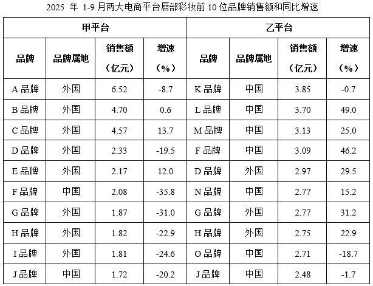
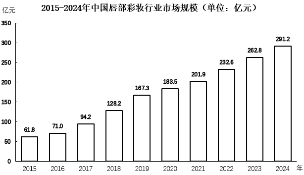

# 2026年河南省公务员录用考试《行测》题（网友回忆版）

> 资料分析 · 15 题 · 河南 2026

## 材料 1

        2025年1-9月，甲、乙平台唇部彩妆销售额分别为63.1亿元和75.3亿元。

### 第 1 题　qid 16070142 · 综合

2025年1-9月，表中在甲、乙两个平台总计销售额最高的中国唇部彩妆品牌是（    ）。

- **A**. A品牌
- **B**. F品牌　✅
- **C**. J品牌
- **D**. K品牌

**答案**：B

**官方解析**

定位统计表可知：A品牌属地为外国，不符合题干中 “中国品牌”的要求，排除A项。F品牌在甲、乙两个平台的销售额分别为2.08亿元、3.09亿元，则F品牌在两个平台的总计销售额为2.08+3.09=5.17亿元；J品牌在甲、乙两个平台的销售额分别为1.72亿元、2.48亿元，则J品牌在两个平台的总计销售额为1.72+2.48=4.2亿元；K品牌在乙平台的销售额为3.85亿元，由于5.17&gt;3.85，故表中在甲、乙两个平台总计销售额最高的中国唇部彩妆品牌是F品牌。
故正确答案为B。
备注：由于K品牌在甲平台的销售额未给，只能推出&lt;1.72亿元，则K品牌在两个平台总计销售额应&lt;1.72+3.85=5.57亿元，此时无法判断F品牌和K品牌总计销售额的大小关系，导致本题无唯一答案。结合题干“表中”的表述，推测不考虑表外数据，故本题选B。

---

### 第 2 题　qid 16070144 · 增长

2025年1-9月，K、L两个品牌在乙平台的总体销售额同比增长了约（    ）。

- **A**. 19%　✅
- **B**. 25%
- **C**. 31%
- **D**. 37%

**答案**：A

**官方解析**

根据题干“2025年1-9月······同比增长了约”，结合选项为百分数，且材料给出2025年1-9月K、L两个品牌在乙平台的销售额及其同比增速，可判定本题为混合增长率问题。定位统计表可得：2025年1-9月K、L两个品牌在乙平台的销售额分别为3.85亿元、3.70亿元，同比增速分别为-0.7%、49.0%。根据公式：基期量，可得2024年1-9月K、L两个品牌在乙平台的销售额分别为亿元、亿元。根据混合增长率口诀：“混合居中不正中，偏向基期量大的”可知，2025年1-9月K、L两个品牌在乙平台的总体销售额同比增速在-0.7%~49.0%之间；因，则混合后的同比增速更接近K品牌在乙平台销售额的同比增速，，则K、L两个品牌在乙平台的总体销售额同比增速在-0.7%~24.15%之间，对应A项。

故正确答案为A。

---

### 第 3 题　qid 16070145 · 增长

2016-2024年间，中国唇部彩妆行业市场规模同比增速超过20%的年份有几个？

- **A**. 1
- **B**. 2
- **C**. 3　✅
- **D**. 4

**答案**：C

**官方解析**

根据题干“2016-2024年间······同比增速超过20%的年份有几个”，可判定本题为一般增长率问题。定位统计图可得2015-2024年中国唇部彩妆行业市场规模。根据公式：增长率，可得2016-2024年中国唇部彩妆行业市场规模同比增速分别为：

2016年；

2017年；

2018年；

2019年；

2020年；

2021年；

2022年；

2023年；

2024年。

综上，同比增速超过20%的年份有2017年、2018年、2019年，共3个。

故正确答案为C。

计算提示：同比增速超过20%，即基期量+20%×基期量&lt;现期量。分析可知，2017年：71.0+71.0×20%&lt;94.2，满足；2018年：94.2+94.2×20%&lt;128.2，满足；2019年：128.2+128.2×20%&lt;167.3，满足。其余年份均不满足，故同比增速超过20%的年份有2017年、2018年、2019年，共3个。

---

### 第 4 题　qid 16070147 · 比重

品牌集中度指标CR5代表销售额前5位品牌的销售额占总销售额的比重。2025年1-9月，甲平台唇部彩妆的CR5指标比乙平台（    ）。

- **A**. 低不到5个百分点
- **B**. 低5个百分点以上
- **C**. 高不到5个百分点
- **D**. 高5个百分点以上　✅

**答案**：D

**官方解析**

根据题干“品牌集中度指标CR5代表······占······的比重。2025年1-9月······”，，结合材料时间为2025年1-9月，可判定本题为现期比重问题。定位文字材料可得：2025年1-9月，甲、乙两大电商平台唇部彩妆销售额分别为63.1亿元和75.3亿元；定位统计表可知2025年1-9月甲、乙两大电商平台唇部彩妆销售额前5位品牌的销售额。则甲平台唇部彩妆销售额前5位品牌的销售额之和=6.52+4.70+4.57+2.33+2.17=20.29亿元，乙平台唇部彩妆销售额前5位品牌的销售额之和=3.85+3.70+3.13+3.09+2.97=16.74亿元。根据公式：比重，则甲平台唇部彩妆的CR5指标-乙平台唇部彩妆的CR5指标，即高5个百分点以上。

故正确答案为D。

---

### 第 5 题　qid 16070148 · 综合

能够从上述资料中推出的是（    ）。

- **A**. 2015-2019年，中国唇部彩妆行业市场规模超过550亿元
- **B**. 2024年1-9月，F品牌在甲平台的销售额高于在乙平台的销售额　✅
- **C**. 2025年1-9月，B、C、D三个品牌在甲、乙平台的总销售额均同比正增长
- **D**. 2025年1-9月，乙平台销售额同比增长的唇部彩妆前10位品牌中，过半是外国品牌

**答案**：B

**官方解析**

A项：定位统计图可知2015-2019年各年份中国唇部彩妆行业市场规模。则2015-2019年，中国唇部彩妆行业市场规模=61.8+71+94.2+128.2+167.362+71+94+128+167=522亿元，未超过550亿元，错误；

B项：定位统计表可得，2025年1-9月F品牌在甲平台的销售额为2.08亿元，同比增长-35.8%；2025年1-9月F品牌在乙平台的销售额为3.09亿元，同比增长46.2%。根据公式：基期量，则2024年1-9月F品牌在甲平台的销售额亿元；F品牌在乙平台的销售额亿元，即2024年1-9月，F品牌在甲平台的销售额高于在乙平台的销售额，正确；

C项：定位统计表可知2025年1-9月B、C、D三个品牌在甲平台的销售额以及同比增速，D品牌在乙平台的销售额及同比增速。材料未给出B、C品牌在乙平台的销售额数据，故无法推出B、C、D三个品牌在甲、乙平台的总销售额均同比正增长，错误；

D项：定位统计表可知2025年1-9月，乙平台唇部彩妆前10位品牌的销售额同比增速。同比增长（r&gt;0）的品牌有L、M、F、D、N、G、H共7个，其中外国品牌有D、G、H共3个，根据公式：比重，则外国品牌的占比&lt;50%，即未过半，错误。

故正确答案为B。

---

## 材料 2

### 第 6 题　qid 16069828 · 比重

2025年，我国运动鞋类市场规模占鞋类市场规模的比重比运动服装占服装市场规模的比重高约多少个百分点？

- **A**. 37
- **B**. 41　✅
- **C**. 45
- **D**. 49

**答案**：B

**官方解析**

根据题干“2025年······比重高约多少个百分点”，可判定本题为现期比重问题。定位表格材料可得：2025年我国鞋类市场规模4787.7亿元，其中运动鞋类市场规模2393.7亿元；我国服装市场规模22049.5亿元，其中运动服装市场规模1982.8亿元。根据公式：比重，则题干所求，即高约41个百分点。

故正确答案为B。

---

### 第 7 题　qid 16070299 · 比重

在①功能、②户外和③时尚三类运动服装和运动鞋类中，其2024年市场规模占当年我国运动服装和运动鞋类总市场规模的比重，高于2020年水平的是（    ）。

- **A**. 仅①
- **B**. 仅③
- **C**. ①和②　✅
- **D**. ②和③

**答案**：C

**官方解析**

根据题干“在······中，其2024年市场规模占当年我国运动服装和运动鞋类总市场规模的比重，高于2020年水平的是”，结合材料时间为2020-2025年，可判定本题为两期比重问题。定位统计表可得2020年和2024年各年份我国运动服装市场规模、运动鞋类市场规模、功能、户外和时尚三类运动服装和运动鞋类市场规模。

方法一：2020年我国运动服装和运动鞋类总市场规模为亿元；2024年为亿元；根据公式：比重，可得2020年功能、户外和时尚三类运动服装和运动鞋类占我国运动服装和运动鞋类总市场规模的比重分别为：

①功能：；

②户外：；

③时尚：。

2024年分别为：

①功能：年，符合要求；

②户外：年，符合要求；

③时尚：年，不符合要求。

综上，①和②符合题干要求。

方法二：2020年我国运动服装和运动鞋类总市场规模为亿元；2024年为亿元；根据公式：增长率，可得2024年我国运动服装和运动鞋类总市场规模相较于2020年增速；2024年功能、户外和时尚三类运动服装和运动鞋类市场规模相较于2020年增速分别为：

①功能：；

②户外：；

③时尚：。

根据两期比重比较口诀“部分增长率（a）&gt;整体增长率（b），比重上升，反之，比重下降”，可得①和②符合题干要求。

故正确答案为C。

---

### 第 8 题　qid 16069831 · 增长

如保持2025年同比增量不变，我国运动服装市场规模将在哪一年首次超过运动鞋类市场规模？

- **A**. 2034年　✅
- **B**. 2035年
- **C**. 2036年
- **D**. 2037年

**答案**：A

**官方解析**

根据题干“如保持2025年同比增量不变······将在哪一年首次超过······”，可判定本题为现期计算问题。定位统计表可得：2024年我国运动服装市场规模为1831.1亿元，运动鞋类市场规模为2292.6亿元；2025年我国运动服装市场规模为1982.8亿元，运动鞋类市场规模为2393.7亿元。根据公式：增长量=现期量-基期量，可得2025年我国运动服装市场规模同比增量=1982.8-1831.1=151.7亿元，我国运动鞋类市场规模同比增量=2393.7-2292.6=101.1亿元。根据公式：现期量=基期量+增长量×n，可列式：1982.8+151.7×n&gt;2393.7+101.1×n，解得n&gt;8.1，则n取整最小为9，即如保持2025年同比增量不变，我国运动服装市场规模将在2025+9=2034年首次超过运动鞋类市场规模。
故正确答案为A。

---

### 第 9 题　qid 16069834 · 综合

不能从上述资料中推出的是：

- **A**. 2023~2025年，我国非运动服装市场规模不到6万亿元
- **B**. 2023~2025年，我国功能服装市场规模同比增速逐年加快　✅
- **C**. 2021~2025年，我国非运动鞋类市场规模比运动鞋类高不到1万亿元
- **D**. 2025年，我国功能鞋类市场规模同比增量占运动鞋类市场规模同比增量的一半以上

**答案**：B

**官方解析**

A项：定位统计表可得，2023~2025年各年份我国非运动服装市场规模分别为19946.3亿元、19867.1亿元、20066.7亿元。则2023~2025年，我国非运动服装市场规模为19946.3+19867.1+20066.7=59880.1亿元&lt;6万亿元，正确；

B项：定位统计表可得，2022~2025年各年份我国功能服装市场规模分别为495.9亿元、580.6亿元、612.5亿元、643.1亿元。根据公式：增长率，则2023年我国功能服装市场规模同比增速，2024年我国功能服装市场规模同比增速，2023年同比增速&gt;2024年同比增速，同比增速并非逐年加快，错误；

C项：定位统计表可得，2021~2025年各年份我国非运动鞋类和运动鞋类市场规模。则所求=2641.2+2286.9+2455.9+2414.3+2394.0-（2029.3+1947.5+2186.3+2292.6+2393.7）2600＋2300+2500+2400+2400-（2000+1900+2200+2300+2400）=12200-10800=1400亿元&lt;1万亿元，正确；

D项：定位统计表可得，2024年、2025年我国功能鞋类市场规模分别为915.2亿元、973.6亿元，运动鞋类市场规模分别为2292.6亿元、2393.7亿元。根据公式：增长量=现期量-基期量、比重，则所求，正确。

本题为选非题，故正确答案为B。

---

### 第 10 题　qid 16069832 · 增长

以下柱状图反映了2022~2025年间，哪一类商品市场规模同比增量的变化趋势（横轴位置代表增量为0）？

- **A**. 户外服装
- **B**. 时尚服装
- **C**. 功能鞋类　✅
- **D**. 时尚鞋类

**答案**：C

**官方解析**

根据题干“以下柱状图反映了2022~2025年间······同比增量的变化趋势（横轴位置代表增量为0）”，可判定本题为增长量比较问题。定位统计表可得2021~2025年我国户外服装、时尚服装、功能鞋类、时尚鞋类各年份市场规模。根据公式：增长量=现期量-基期量，结合柱形图变化趋势分析如下：
A项，户外服装，2022年同比增长量=260.7-221.9&gt;0，而柱状图中2022年同比增长量为负，不符合柱状图变化趋势，排除；
B项，时尚服装，2022年同比增长量=673.1−771.9=−98.8亿元，2023年同比增长量=753.4−673.1=80.3亿元，2022年同比增长量的绝对值（98.8亿元）&gt;2023年同比增长量的绝对值（80.3亿元），不符合柱状图变化趋势，排除；
C项，功能鞋类，2022年同比增长量=735.6−749.1=-13.5亿元，2023年同比增长量=857.0−735.6=121.4亿元，2024年同比增长量=915.2−857.0=58.2亿元，2025年同比增长量=973.6−915.2=58.4亿元，符合柱状图变化趋势，当选；
D项，时尚鞋类，2022年同比增长量=1094.3−1176.7=−82.4亿元，2023年同比增长量=1185.7−1094.3=91.4亿元，2023年同比增长量的绝对值（91.4亿元）是2022年同比增长量绝对值（82.4亿元）的1倍多，而柱状图中前者是后者的好几倍，不符合柱状图变化趋势，排除。
故正确答案为C。

---

## 材料 3

        2025年12月，我国新能源汽车产销量分别为171.8万辆和171万辆，同比分别增长12.3%和7.2%，环比分别下降8.6%和6.2%。其中，纯电动车销量110.8万辆，同比增长13.8%，环比下降5.3%；插电式混动销量59.9万辆，同比下降3.7%，环比下降8.1%。2025年新能源汽车产销量分别为1662.6万辆和1649万辆，同比分别增长29%和28.2%。其中，纯电动车销量1062.2万辆，同比增长37.6%；插电式混动销量586.1万辆，同比增长14%。2025年新能源汽车渗透率（新能源汽车销量占汽车销量比重）47.9%，同比上升7个百分点；12月新能源汽车渗透率52.3%，环比下降0.9个百分点。2025年新能源汽车出口261.5万辆，同比增长1倍；12月新能源汽车出口30万辆，同比增长1.2倍，环比下降0.1%。

        2025年12月，我国动力和储能电池产量201.7GWh（1GWh=100万千瓦时），环比增长14.4%，同比增长62.1%；销量199.3GWh，环比增长11.1%，同比增长57.5%。其中，动力电池销量143.8GWh，环比增长7.3%，同比增长49.2%。出口方面：12月我国动力和储能电池出口32.6GWh。其中，动力电池出口量19GWh，环比减少10.4%，同比增长47.1%，储能电池出口量13.6GWh，环比增长23.9%，同比增长52.2%。装车量方面：12月国内动力电池装车量（生产的新能源汽车上安装的所有动力电池的总能量）98.1GWh，环比增长4.9%，同比增长35.1%。

### 第 11 题　qid 16069869 · 综合

2025年11月，我国动力电池出口量约是储能电池出口量的多少倍？

- **A**. 1.3
- **B**. 1.6
- **C**. 1.9　✅
- **D**. 2.2

**答案**：C

**官方解析**

根据题干“2025年11月······约是······的多少倍”，结合材料时间为2025年12月，可判定本题为基期倍数问题。定位文字材料第二段可得：2025年12月，我国动力电池出口量19GWh（A），环比减少10.4%（a）；储能电池出口量13.6GWh（B），环比增长23.9%（b）。根据公式：基期倍数，则所求为，与C项最接近。

故正确答案为C。

---

### 第 12 题　qid 16069870 · 平均数

2025年12月国内平均每生产1辆新能源汽车安装的动力电池能量比上月：

- **A**. 低不到10千瓦时
- **B**. 低10千瓦时以上
- **C**. 高不到10千瓦时　✅
- **D**. 高10千瓦时以上

**答案**：C

**官方解析**

根据题干“2025年12月······平均每······比上月”，结合选项高/低+具体单位，可判定本题为平均数的增长量问题。定位文字材料第一段可得：2025年12月，我国新能源汽车产量为171.8万辆（B），环比下降8.6%（b）；定位文字材料第二段可得：2025年12月，国内动力电池装车量（生产的新能源汽车上安装的所有动力电池的总能量）98.1GWh（A），环比增长4.9%（a）。根据公式：平均数的增长量，可得所求为千瓦时/辆，即高不到10千瓦时/辆。

故正确答案为C。

---

### 第 13 题　qid 16070301 · 综合

2025年11月，我国动力和储能电池产量比销量（    ）。

- **A**. 高4%以上
- **B**. 低4%以上
- **C**. 高不到4%
- **D**. 低不到4%　✅

**答案**：D

**官方解析**

根据题干“2025年11月······比······”，结合选项为高/低+百分数，可判定本题为一般增长率问题。定位文字材料第二段可得：2025年12月，我国动力和储能电池产量201.7GWh，环比增长14.4%；销量199.3GWh，环比增长11.1%。根据公式：基期量、增长率，则题干所求，即低不到4%。

故正确答案为D。

---

### 第 14 题　qid 16069867 · 综合

2025年12月，我国除纯电动和插电式混动之外的新能源汽车销量占汽车总销量的：

- **A**. 不到0.1%　✅
- **B**. 0.1%~0.3%
- **C**. 0.3%~0.6%
- **D**. 0.6%以上

**答案**：A

**官方解析**

根据题干“2025年12月······占······”，结合材料时间为2025年12月，可判定本题为现期比重问题。定位文字材料第一段可知：2025年12月，我国新能源汽车销量为171万辆，纯电动车销量110.8万辆，插电式混动销量59.9万辆，新能源汽车渗透率（新能源汽车销量占汽车销量比重）52.3%。根据公式：比重，则题干所求为，在A项范围内。

故正确答案为A。

---

### 第 15 题　qid 16069871 · 增长

在上述资料信息中以下哪项可以推出？
①2024年12月新能源汽车出口量占汽车出口量比重
②2025年12月储能电池销量同比增长速度

- **A**. 仅①能从上述资料推出
- **B**. 仅②能从上述资料推出　✅
- **C**. 两者都能从上述资料推出
- **D**. 都不能

**答案**：B

**官方解析**

①定位文字材料第一段可得：2025年12月新能源汽车出口30万辆，同比增长1.2倍。材料并未给出汽车出口量相关数据，故无法计算2024年12月新能源汽车出口量占汽车出口量比重，则无法推出；

②定位文字材料第二段可得：2025年12月，我国动力和储能电池销量199.3GWh，同比增长57.5%。其中，动力电池销量143.8GWh，同比增长49.2%。则2025年12月我国储能电池销量为199.3-143.8=55.5GWh。设2025年12月储能电池销量同比增速为r，根据线段法：距离（增长率之差）与量（基期量）成反比，可列式：，则可以推出。

综上可知，仅②能从上述资料推出。

故正确答案为B。

---
