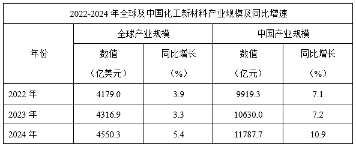
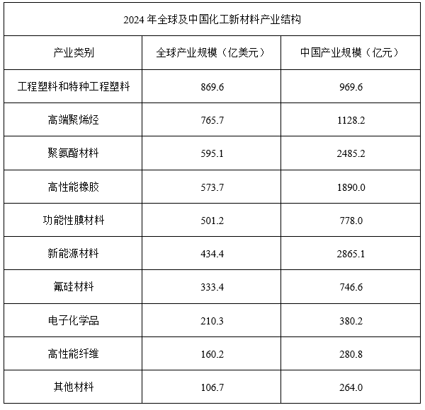
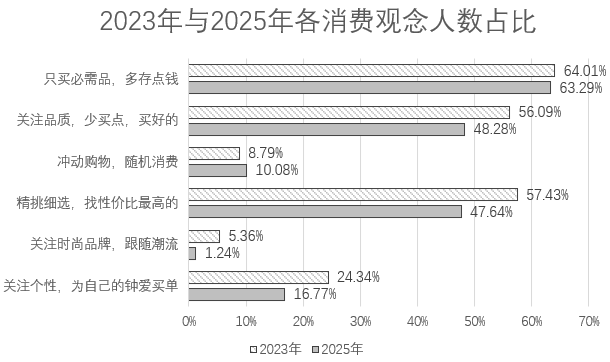

# 2026年浙江省公务员录用考试《行测》题（C类）（网友回忆版）

> 资料分析 · 15 题 · 浙江 2026

## 材料 1

        2024年，中国化工新材料产业规模达到1655.6亿美元，居全球第一位。其次是美国，化工新材料产业规模为1455.0亿美元。

### 第 1 题　qid 18643945 · 比重

2024年，中美两国化工新材料产业规模之和占全球比重约为：

- **A**. 52%
- **B**. 57%
- **C**. 63%
- **D**. 68%　✅

**答案**：D

**官方解析**

根据题干“2024年······占······比重约为”，结合材料时间为2024年，可判定本题为现期比重问题。定位文字材料和统计表1可得：2024年，中国化工新材料产业规模达到1655.6亿美元，居全球第一位。其次是美国，化工新材料产业规模为1455.0亿美元；2024年全球化工新材料产业规模为4550.3亿美元。根据公式：比重，故所求为，与D项最接近。

故正确答案为D。

---

### 第 2 题　qid 18643946 · 增长

2022年，中国化工新材料产业规模同比增加值在以下哪个范围内？

- **A**. 不到600亿元
- **B**. 600~700亿元　✅
- **C**. 700~800亿元
- **D**. 800亿元以上

**答案**：B

**官方解析**

根据题干“2022年······同比增加值······”，可判定本题为增长量计算问题。定位表1可得：2022年中国化工新材料产业规模为9919.3亿元，同比增长7.1%。根据公式：增长量，可得所求为亿元，在B项范围内。

故正确答案为B。

---

### 第 3 题　qid 18643947 · 比重

假如汇率没有变动，2022~2024年中国化工新材料产业规模占全球比重的变化趋势为：

- **A**. 先增后降
- **B**. 先降后增
- **C**. 逐年增加　✅
- **D**. 逐年下降

**答案**：C

**官方解析**

根据题干“······2022~2024年中国化工新材料产业规模占全球比重的变化趋势为”，可判定本题为两期比重问题。定位表1可得，2023年、2024年中国化工新材料产业规模同比增速分别为7.2%（）、10.9%（），2023年、2024年全球产业规模同比增速分别为3.3%（）、5.4%（）。根据两期比重比较结论：若部分增长率（a）&gt;整体增长率（b），则比重上升。2023年，7.2%（）&gt;3.3%（），比重增加；2024年，10.9%（）&gt;5.4%（），比重增加。则2022~2024年中国化工新材料产业规模占全球的比重逐年增加。

故正确答案为C。

---

### 第 4 题　qid 18643948 · 比重

根据资料推算汇率换算，化工新材料产业结构中，2024年中国产业规模占全球比重超过70%的有几类？

- **A**. 1　✅
- **B**. 2
- **C**. 3
- **D**. 4

**答案**：A

**官方解析**

根据题干“······2024年······比重超过70%的有几类”，结合材料时间为2024年，可判定本题为现期比重问题。定位文字材料可得：2024年，中国化工新材料产业规模达到1655.6亿美元；定位统计表1可得：2024年，中国化工新材料产业规模为11787.7亿元；定位统计表2可得2024年全球及中国化工新材料各产业类别产业规模。换算汇率，1美元元。根据公式：比重，可得2024年化工新材料各产业类别中，中国产业规模占全球比重分别为：

工程塑料和特种工程塑料，；

高端聚烯烃，；

聚氨酯材料，；

高性能橡胶，；

功能性膜材料，；

新能源材料，；

氟硅材料，；

电子化学品，；

高性能纤维，；

其他材料，。

比较可知，比重超过70%的只有新能源材料，共1类。

故正确答案为A。 

---

### 第 5 题　qid 18643949 · 综合

化工新材料产业结构中，2024年全球产业规模最高的三类的产业规模之和约是最低的三类的产业规模之和的多少倍？（不包括“其他材料”）

- **A**. 3.2　✅
- **B**. 4.7
- **C**. 5.3
- **D**. 6.1

**答案**：A

**官方解析**

根据题干“2024年······是······的多少倍”，结合材料时间为2024年，可判定本题为现期倍数问题。定位统计图2可得，2024年全球产业规模最高的三类产业分别为工程塑料和特种工程塑料869.6亿美元、高端聚烯烃765.7亿美元、聚氨酯材料595.1亿美元，全球产业规模最低的三类产业分别为高性能纤维160.2亿美元、电子化学品210.3亿美元、氟硅材料333.4亿美元，故所求倍。

故正确答案为A。

---

## 材料 2

        2025年8月，全国电梯采购规模25.11亿元，环比增长7.77%，同比增长43%。

        全国电梯采购规模突破千万元的有河北省、湖北省等22个省份，其中，河北省、湖北省和北京市位居全国电梯采购规模前三，采购规模依次为67006.13万元、33061.49万元和23594.98万元。

        8月，全国电梯更新改造采购规模56108.32万元，环比增长51.92%，同比增长347.55%。

        8月，全国电梯维保采购规模9650.81万元，环比下降40.06%，同比下降14.11%，主要分布于政府机关、医疗系统、教育系统、轨道交通等，其中，政府机关电梯维保占全国电梯维保采购市场40.85%。河北省、江苏省和浙江省电梯维保采购规模排名位列前三，分别为2227.91万元、1662.78万元和1376.29万元。

        8月，全国加装电梯采购规模9538.15万元，环比增长30.72%，同比下降18.63%，主要分布于政府机关、医疗系统、教育系统等，其中，政府机关加装电梯占全国加装电梯采购市场61.17%。四川省、北京市和广东省加装电梯采购规模排名前三，依次2484.57万元、2459.31万元和939.68万元。

### 第 6 题　qid 18643961 · 综合

2024年8月，全国电梯采购规模约为多少亿元？

- **A**. 17.6　✅
- **B**. 18.9
- **C**. 20.1
- **D**. 23.3

**答案**：A

**官方解析**

根据题干“2024年8月······约为多少亿元”，结合材料时间为2025年8月，可判定本题为基期计算问题。定位文字材料第一段可得：2025年8月，全国电梯采购规模25.11亿元，同比增长43%。根据公式：基期量，则2024年8月，全国电梯采购规模为亿元。

故正确答案为A。

---

### 第 7 题　qid 18643962 · 综合

2025年8月，全国电梯更新改造采购规模环比增量约是全国加装电梯采购规模环比增量的多少倍？

- **A**. 4.4
- **B**. 5.9
- **C**. 7.3
- **D**. 8.6　✅

**答案**：D

**官方解析**

根据题干“2025年8月······约是······的多少倍”，结合材料时间为2025年8月，可判定本题为现期倍数问题。定位材料第三段和第五段可得：2025年8月，全国电梯更新改造采购规模56108.32万元，环比增长51.92%。2025年8月，全国加装电梯采购规模9538.15万元，环比增长30.72%。根据公式：增长量，则2025年8月全国电梯更新改造采购规模环比增量为万元；全国加装电梯采购规模环比增量为万元，故所求倍数为倍，与D项最接近。 

故正确答案为D。

---

### 第 8 题　qid 18643963 · 综合

2025年7月，全国电梯维保采购规模约占全国电梯采购规模的：

- **A**. 4%
- **B**. 7%　✅
- **C**. 11%
- **D**. 22%

**答案**：B

**官方解析**

根据题干“2025年7月······占······”，结合材料时间为2025年8月，可判定本题为基期比重问题。定位文字材料第一段和第四段可得：2025年8月，全国电梯采购规模25.11亿元（B），环比增长7.77%（b）。2025年8月，全国电梯维保采购规模9650.81万元（A），环比下降40.06%（a）。根据公式：基期比重，则所求为。 

故正确答案为B。

---

### 第 9 题　qid 18643964 · 综合

2025年8月，我国政府机关加装电梯采购规模比其电梯维保采购规模多约多少万元？

- **A**. 1700
- **B**. 1900　✅
- **C**. 2000
- **D**. 1800

**答案**：B

**官方解析**

根据题干“2025年8月，我国政府机关加装电梯采购规模比其电梯维保采购规模多约多少万元”，结合材料给出2025年8月全国电梯维保和加装电梯采购规模，及其中政府机关电梯维保和加装电梯采购规模占比，可判定本题为现期比重问题。定位文字材料第四段可得：2025年8月全国电梯维保采购规模9650.81万元，其中，政府机关电梯维保占全国电梯维保采购市场40.85%；定位文字材料第五段可得：2025年8月全国加装电梯采购规模9538.15万元，其中，政府机关加装电梯占全国加装电梯采购市场61.17%。根据公式：部分=整体×比重，则所求万元，与B项最接近。

故正确答案为B。

---

### 第 10 题　qid 18643965 · 综合

能够从上述资料中推出的是：

- **A**. 2024年8月，全国加装电梯采购规模不到1亿元
- **B**. 2025年8月，浙江省电梯维保采购规模日均超过40万元　✅
- **C**. 2025年8月，广东省加装电梯采购规模超过其电梯维保采购规模
- **D**. 2025年8月，河北省、湖北省和北京市电梯采购规模总和占全国的50%以上

**答案**：B

**官方解析**

A项：定位文字材料第五段可得，2025年8月，全国加装电梯采购规模9538.15万元，同比下降18.63%。根据公式：基期量，则所求亿元，即超过1亿元，错误；

B项：定位文字材料第四段可得，2025年8月，浙江省电梯维保采购规模为1376.29万元。则所求万元，即超过40万元，正确；

C项：材料中未给出2025年8月广东省电梯维保采购规模的相关数据，无法判断，错误；

D项：定位文字材料第一、二段可得，2025年8月，全国电梯采购规模25.11亿元；其中，河北省、湖北省和北京市电梯采购规模依次为67006.13万元、33061.49万元和23594.98万元。根据公式：比重，则所求，即占比不到50%，错误。

故正确答案为B。

---

## 材料 3

        2025年初，某杂志社联合民生智库开展城乡居民消费调查，全面了解城乡居民收支与消费信心状况，深入分析居民消费意愿、能力、行为与场景。

        调查显示，城乡居民在2024年有48.07%的家庭收入持平，22.01%的家庭收入增加，其中6.09%的家庭收入明显增加；近三成被访者表示收入减少，其中11.23%的家庭明显减少。对于2025年的家庭收入，46.10%的居民预计将基本持平，19.04%的居民预期收入将增加，23.28%的居民对未来收入变化不确定，11.58%的居民预期收入将明显减少。

        调查发现，47.01%的城乡居民日常购物以线上渠道为主，37.52%的城乡居民线上、线下并重，只有15.48%的城乡居民明确表示以线下为主。

        不同群体的购物选择存在较大差异：一是代际断层，年轻群体成为线上消费主力，其中00后群体线上购物占比69.8%，比70后群体高了53.79个百分点；二是城乡分化，城镇居民的线上购物占比50.18%，高于农村居民11.66个百分点，务农群体选择线上购物的占比比农村居民还要低19.74个百分点；三是学历分化，高学历群体选择线上购物比例更高，硕士以上学历群体线上购物占比62.81%，远高于初中及以下学历群体的22.63%。

### 第 11 题　qid 18643956 · 综合

2025年初，选择“冲动购物，随机消费”的人数约是选择“关注时尚品牌，跟随潮流”的多少倍？

- **A**. 2
- **B**. 6
- **C**. 8　✅
- **D**. 10

**答案**：C

**官方解析**

根据题干“2025年······是······的多少倍”，结合材料时间为2025年，可判定本题为现期倍数问题。定位统计图可得：2025年，选择“冲动购物，随机消费”的人数占比为10.08%，选择“关注时尚品牌，跟随潮流”的人数占比为1.24%。根据公式：部分=整体×比重，则所求倍数倍。

故正确答案为C。

---

### 第 12 题　qid 18643957 · 比重

已知2023年初我国人口为14.12亿，2025年初我国人口为14.08亿。根据调查分析的比例推测，2025年初我国更倾向于“只买必需品，多存点钱”的人数比2023年初：

- **A**. 少不到0.1亿
- **B**. 少0.1亿以上　✅
- **C**. 多不到0.1亿
- **D**. 多0.1亿以上

**答案**：B

**官方解析**

根据题干“······2025年初······人数比2023年初”，结合题干给出2023年初与2025年初我国人口，统计图给出2023年与2025年各消费观念人数占比，可判定本题为现期比重问题。根据题干可得：2023年初我国人口为14.12亿，2025年初我国人口为14.08亿，定位统计图可得：2023年初我国更倾向于“只买必需品，多存点钱”的人数占比为64.01%，2025年占比为63.29%。根据公式：部分=整体×比重，则所求亿，即少0.1亿以上。

故正确答案为B。

---

### 第 13 题　qid 18643958 · 比重

将70后群体、务农群体、初中及以下学历群体线上购物占比从低到高顺序排列，正确的是：

- **A**. 初中及以下学历群体、务农群体、70后群体
- **B**. 初中及以下学历群体、70后群体、务农群体
- **C**. 务农群体、70后群体、初中及以下学历群体
- **D**. 70后群体、务农群体、初中及以下学历群体　✅

**答案**：D

**官方解析**

定位文字材料第四段可得：00后群体线上购物占比69.8%，比70后群体高了53.79个百分点······城镇居民的线上购物占比50.18%，高于农村居民11.66个百分点，务农群体选择线上购物的占比比农村居民还要低19.74个百分点······远高于初中及以下学历群体的22.63%。则70后群体线上购物占比为69.8%-53.79%=16.01%；务农群体线上购物占比为50.18%-11.66%-19.74%=18.78%。比较可知，占比从低到高顺序排列为：70后群体（16.01%）、务农群体（18.78%）、初中及以下学历群体（22.63%）。
故正确答案为D。

---

### 第 14 题　qid 18643959 · 综合

在参与调查的居民中，2024年家庭收入未减少且2025年预期收入将基本持平的家庭数量：

- **A**. 至少占16.18%　✅
- **B**. 至少占46.10%
- **C**. 至多占16.18%
- **D**. 至多占70.08%

**答案**：A

**官方解析**

根据题干“在参与调查的居民中，2024年家庭收入······且2025年预期收入······&quot;，结合选项为“占+百分数”，并且材料给出2024年家庭收入、2025年预期收入相关的占比数据，可判定本题为现期比重问题。定位文字材料第二段可得：城乡居民在2024年有48.07%的家庭收入持平，22.01%的家庭收入增加；2025年的家庭收入，46.10%的居民预计将基本持平。则2024年家庭收入未减少的居民占比为48.07%+22.01%=70.08%。根据两集合容斥原理公式：，则。若要使占比尽量少，则都不满足为0，，即2024年家庭收入未减少且2025年预期收入将基本持平的家庭数量至少占16.18%；若要使占比尽量多，则2025年预期收入将基本持平的居民应均属于2024年收入未减少的居民，则至多占46.10%。结合选项，只有A项满足。

故正确答案为A。

---

### 第 15 题　qid 18643960 · 综合

根据上述资料，下列说法不正确的是：

- **A**. 多数居民对2025年收入稳定有信心
- **B**. 目前，线上购物占主导地位，但线下购物仍不可替代
- **C**. 2024年，收入明显增加的家庭在收入增加的家庭中占比不足三成
- **D**. 比起2023年，2025年被访者的消费观念更趋理性，更注重品质和性价比　✅

**答案**：D

**官方解析**

A项：定位文字材料第二段可得，对于2025年的家庭收入，46.10%的居民预计将基本持平，19.04%的居民预期收入将增加。则2025年收入稳定及增加的居民占比为46.10%+19.04%&gt;50%，说明多数居民对2025年收入稳定有信心，正确；

B项：定位文字材料第三段可得，47.01%的城乡居民日常购物以线上渠道为主，37.52%的城乡居民线上、线下并重，只有15.48%的城乡居民明确表示以线下为主。则线上购物的居民占比为47.01%+37.52%&gt;50%，说明线上购物占主导地位。但也有15.48%的居民以线下为主，说明线下购物仍不可替代，正确；

C项：定位文字第二段可得，城乡居民在2024年有22.01%的家庭收入增加，其中6.09%的家庭收入明显增加。根据公式：比重，则所求，即不到三成，正确；

D项：定位统计图可得，2023年和2025年被访者消费观念中关注品质，少买点，买好的人数占比分别为56.09%、48.28%；精挑细选，找性价比最高的人数占比分别为57.43%、47.64%。比较可知，2023年被访者注重品质和性价比的人数占比均高于2025年，说明2023年被访者更注重品质和性价比，错误。

本题为选非题，故正确答案为D。

---
