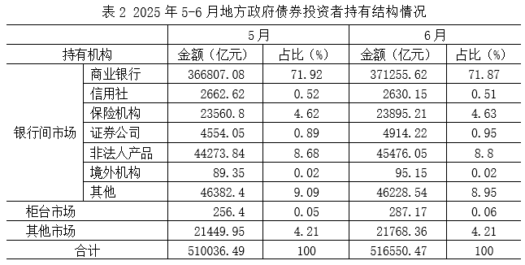
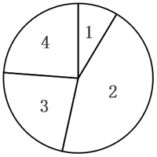
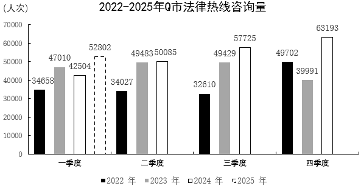

# 2026年湖南省公务员录用考试《行测》题（网友回忆版）

> 资料分析 · 20 题 · 湖南 2026

## 材料 1

### 第 1 题　qid 16070229 · 综合

2025年6月，地方政府债券投资者总持有额的环比增量约为：

- **A**. 5514亿元
- **B**. 6124亿元
- **C**. 6514亿元　✅
- **D**. 7124亿元

**答案**：C

**官方解析**

根据题干“2025年6月······的环比增量约为”，可判定本题为增长量计算问题。定位表2可得：2025年5月和6月地方政府债券投资者总持有额分别为510036.49亿元、516550.47亿元。根据公式：增长量=现期量-基期量，则2025年6月地方政府债券投资者总持有额的环比增量=516550.47-510036.49516550-510036=6514亿元。

故正确答案为C。

---

### 第 2 题　qid 16070230 · 比重

2025年1-4月，再融资债券发行额占地方政府债券累计发行额的比重在下列哪个范围内？

- **A**. 35%~45%
- **B**. 45%~55%
- **C**. 55%~65%　✅
- **D**. 65%~75%

**答案**：C

**官方解析**

根据题干“2025年1-4月······占······的比重在下列哪个范围内”，结合材料时间为2025年，可判定本题为现期比重问题。定位表1可得：2025年1-6月地方政府债券累计发行额为54901.55亿元，6月发行额为11753.22亿元，5月发行额为7794.43亿元；2025年1-6月再融资债券累计发行额为28774.85亿元，6月发行额为5472.33亿元，5月发行额为2875.93亿元。根据公式：比重，且2025年1-4月=2025年1-6月累计-6月-5月，可得所求为，在C项范围内。

故正确答案为C。

---

### 第 3 题　qid 16070232 · 增长

关于2025年6月各类地方政府债券发行额的环比增速，下列排序正确的是：

- **A**. 再融资专项债券>新增一般债券>再融资一般债券>新增专项债券　✅
- **B**. 新增一般债券>新增专项债券>再融资一般债券>再融资专项债券
- **C**. 再融资专项债券>再融资一般债券>新增一般债券>新增专项债券
- **D**. 再融资专项债券>新增一般债券>新增专项债券>再融资一般债券

**答案**：A

**官方解析**

根据题干“关于2025年6月······环比增速，下列排序正确的是”，可判定本题为一般增长率问题。定位表1可得2025年5月、6月地方新增一般债券、新增专项债券、再融资一般债券、再融资专项债券的发行额。根据公式：增长率，可得2025年6月各类地方政府债券发行额的环比增速分别如下：

新增一般债券：；

新增专项债券：；

再融资一般债券：；

再融资专项债券：。

综上，正确排序为再融资专项债券&gt;新增一般债券&gt;再融资一般债券&gt;新增专项债券。

故正确答案为A。

---

### 第 4 题　qid 16070234 · 增长

按照投资者持有总额的环比增速，若保持2025年6月投资者持有结构不变，那么2025年7月商业银行的地方政府债券持有额在下列哪个范围内？

- **A**. 375000~385000亿元　✅
- **B**. 385000~395000亿元
- **C**. 395000~405000亿元
- **D**. 405000~415000亿元

**答案**：A

**官方解析**

根据题干“按照······环比增速，若保持2025年6月投资者持有结构不变，那么2025年7月······持有额在下列哪个范围内”，可判定本题为现期计算问题。定位表2可得：2025年5月、6月地方政府债券投资者持有总额分别为510036.49亿元、516550.47亿元；6月商业银行的持有占比为71.87%。根据公式：增长率、现期量=基期量×（1+增长率），则2025年6月投资者持有总额的环比增速为，故2025年7月投资者持有总额将为亿元。根据公式：部分=整体×比重，则2025年7月商业银行的地方政府债券持有额为523266×71.87%＜523300×（70%+2%）=366310+10466=376776亿元，在A项范围内。

故正确答案为A。

---

### 第 5 题　qid 16070235 · 综合

下列选项和如下饼图相符的是：

- **A**. 2025年5月各发行场所发行额：1-中央结算公司、2-上海证券交易所、3-深圳证券交易所、4-北京证券交易所
- **B**. 2025年6月各发行场所发行额：1-中央结算公司、2-上海证券交易所、3-深圳证券交易所、4-北京证券交易所
- **C**. 2025年5月地方政府债券发行额：1-新增一般债券、2-新增专项债券、3-再融资一般债券、4-再融资专项债券
- **D**. 2025年6月地方政府债券发行额：1-新增一般债券、2-新增专项债券、3-再融资一般债券、4-再融资专项债券　✅

**答案**：D

**官方解析**

A项：定位表1可知：2025年5月地方政府中央结算公司债券发行额3236.39亿元&gt;上海证券交易所债券发行额2423.68亿元，与饼状图不符，错误；
B项：定位表1可知：2025年6月地方政府中央结算公司债券发行额6769.33亿元&gt;上海证券交易所债券发行额3188.62亿元，与饼状图不符，错误；
C项：定位表1可知：2025年5月地方政府再融资一般债券发行额2112.62亿元，远大于再融资专项债券发行额763.31亿元，与饼状图不符，错误；
D项：定位表1可知：2025年6月地方政府新增一般债券发行额1009.95亿元、新增专项债券发行额5270.94亿元、再融资一般债券发行额2674.63亿元、再融资专项债券发行额2797.70亿元，与饼状图完全符合，正确。
故正确答案为D。

---

## 材料 2

       2025年上半年，Q市12348公共法律服务热线有效接听解答咨询量（以下简称法律热线咨询量）为102428人次。按咨询事项分类统计，前十事项的咨询量合计占法律热线咨询量的85.85%，同比提升0.65个百分点。法律热线咨询量超过1万人次的共四项：咨询量最多的事项是民事诉讼程序，数量为20846人次，同比增长38.3%；其次为经济合同，数量为16819人次；第三名劳动合同与第四名劳动报酬相差无几，分别为10708人次、10682人次。

### 第 6 题　qid 16070270 · 综合

2025年第二季度Q市法律热线咨询量约为：

- **A**. 4.83万人次
- **B**. 4.96万人次　✅
- **C**. 5.12万人次
- **D**. 5.23万人次

**答案**：B

**官方解析**

定位文字材料可得，2025年上半年Q市法律热线咨询量为102428人次；定位统计图可得，2025年一季度Q市法律热线咨询量为52802人次。根据公式：第二季度数据=上半年数据-第一季度数据，则2025年第二季度Q市法律热线咨询量为102428-52802=49626人次万人次，对应B项。

故正确答案为B。

---

### 第 7 题　qid 16070274 · 增长

2025年第一季度Q市法律热线咨询量环比增长速度约为：

- **A**. 24.23%
- **B**. 19.50%
- **C**. -19.68%
- **D**. -16.44%　✅

**答案**：D

**官方解析**

根据题干“2025年第一季度······环比增长速度约为”，可判定本题为一般增长率问题。定位统计图可得：2024年第四季度、2025年第一季度Q市法律热线咨询量分别为63193人次、52802人次。根据公式：增长率，可得2025年第一季度Q市法律热线咨询量环比增长速度，与D项最接近。

故正确答案为D。

---

### 第 8 题　qid 16070277 · 综合

以下折线图中，最能准确反映2022-2025年间Q市法律热线咨询量第二季度环比增量变化趋势的是：

- **A**. 

　✅
- **B**. 

- **C**. 

- **D**. 

**答案**：A

**官方解析**

根据题干“······第二季度环比增量变化趋势的是”，可判定本题为增长量比较问题。定位统计图可知：2022年第一季度、第二季度Q市法律热线咨询量分别为34658人次、34027人次；2023年第一季度、第二季度Q市法律热线咨询量分别为47010人次、49483人次；2024年第一季度、第二季度Q市法律热线咨询量分别为42504人次、50085人次；2025年第一季度Q市法律热线咨询量为52802人次。定位文字材料可得：2025年上半年，Q市法律热线咨询量为102428人次。则2025年第二季度Q市法律热线咨询量为102428-52802=49626人次。（说明：2025年第二季度Q市法律热线咨询量本材料第一小题已计算过，本题求解时可直接用）。根据公式：增长量=现期量-基期量，可得2022-2025年Q市法律热线咨询量第二季度环比增量分别为：

2022年第二季度，人次；

2023年第二季度，人次；

2024年第二季度，人次；

2025年第二季度，人次。

综上可知，环比增量呈先上升后下降趋势，且2022年第二季度环比增量（-600人次）&gt;2025年第二季度环比增量（-3000人次），与A项变化趋势一致。

故正确答案为A。

速算提示：

观察数据可知，2022年、2025年第二季度环比增量均为负，2023年、2024年第二季度环比增量均为正，即折线图第一个点和第四个点应处于较低的两个位置，排除C、D两项；2022年第二季度，人次，2025年第二季度，人次，则第四个点应为最低点，排除B项。

---

### 第 9 题　qid 16070278 · 综合

2024年上半年Q市法律热线咨询量中前十事项的咨询量约为：

- **A**. 9.19万人次
- **B**. 8.27万人次
- **C**. 7.89万人次　✅
- **D**. 6.38万人次

**答案**：C

**官方解析**

根据题干“2024年上半年Q市法律热线咨询量中前十事项的咨询量约为”，结合材料时间为2025年上半年，且材料中给出2025年上半年Q市法律热线咨询量中前十事项咨询量的占比，可判定本题为基期比重问题。定位文字材料可得：2025年上半年，Q市按咨询事项分类统计，前十事项的咨询量合计占法律热线咨询量的85.85%，同比提升0.65个百分点；定位统计图可得：2024年Q市一和二季度法律热线咨询量分别为：42504人次、50085人次。则2024年上半年Q市法律热线咨询量中前十事项咨询量占比为85.85%-0.65%=85.2%；2024年上半年Q市法律热线咨询量为42504+50085=92589人次。根据公式：部分=整体×比重，故题干所求为万人次，与C项最接近。

故正确答案为C。

---

### 第 10 题　qid 17467526 · 增长

2024年上半年Q市法律热线咨询量同比增速约为：

- **A**. -4.6%
- **B**. -4.0%　✅
- **C**. -3.5%
- **D**. -3.1%

**答案**：B

**官方解析**

根据题干“2024年上半年······同比增速约为”，可判定本题为一般增长率问题。定位统计图可得：2023年第一、二季度Q市法律热线咨询量分别为47010人次、49483人次，2024年第一、二季度Q市法律热线咨询量分别为42504人次、50085人次。根据公式：，可得2024年上半年Q市法律热线咨询量同比增速，与B项最接近。

故正确答案为B。

---

## 材料 3

        截至2024年末，我国60岁及以上人口突破3亿，达到31031万人。养老服务相关企业约16万家，比2023年底增长24.36%。全国共有各类养老机构和设施40.6万个，养老床位合计799.3万张。其中，注册登记的养老机构4.0万个，比上年下降1.2%，床位507.7万张（护理型床位占比为65.7%），社区养老服务机构和设施36.6万个，床位291.5万张。

        2024年，中央预算内投资75.9亿元支持202个养老设施建设项目，其中11.4亿元用于支持27项公立医疗卫生机构医养结合项目。全国医疗卫生机构与养老服务机构签约合作超过8.5万对；医养结合机构超过8400家，床位总数超过210万张。

        其中，老年人口抚养比。

### 第 11 题　qid 16070309 · 比重

2024年末，我国60岁及以上人口中，65岁及以上的人口占比约为：

- **A**. 51%
- **B**. 61%
- **C**. 71%　✅
- **D**. 81%

**答案**：C

**官方解析**

根据题干“2024年末······中······占比约为”，结合材料给出2024年末相关数据，可判定本题为现期比重问题。定位文字材料第一段可得：截至2024年末，我国60岁及以上人口突破3亿，达到31031万人；定位统计表可得：2024年，我国65岁及以上人口为22023万人。根据公式：比重，可得题干所求。

故正确答案为C。

---

### 第 12 题　qid 16070311 · 增长

2019年，我国养老机构数量的增长速度约为65岁及以上老年人口增长速度的：

- **A**. 2.4倍
- **B**. 3.1倍
- **C**. 3.4倍　✅
- **D**. 4.2倍

**答案**：C

**官方解析**

根据题干“2019年······约为······的”，结合选项为多少倍，且材料时间给出2019年，可判定本题为现期倍数问题。定位统计表可得：2018年、2019年我国养老机构数量分别为16.8万个、20.4万个；2018年、2019年我国65岁及以上老年人口分别为16724万人、17767万人。根据公式：增长率，则2019年我国养老机构数量的同比增速；2019年我国65岁及以上老年人口的同比增速。则所求倍，与C项最接近。

故正确答案为C。

---

### 第 13 题　qid 16070312 · 综合

根据老年人口抚养比的计算公式，2022年我国0-14岁的人口数约为：

- **A**. 23968万人　✅
- **B**. 24522万人
- **C**. 34795万人
- **D**. 96592万人

**答案**：A

**官方解析**

根据题干“根据老年人口抚养比的计算公式，2022年······人口数约为”，可判定本题为比值计算问题。根据统计表可得：2022年末我国总人口为141175万人，65岁及以上人口为20978万人，老年人口抚养比为21.8%。根据公式：老年人口抚养比，则15-64岁人口数万人，2022年我国0-14岁的人口数=2022年末总人口数-（15-64岁人口数+65岁及以上人口数）=141175-（96229+20978）=141175-117207=23968万人。

故正确答案为A。

---

### 第 14 题　qid 16070313 · 综合

2018-2024年，变化趋势与以下折线图相符的指标是：

- **A**. 年末总人口数
- **B**. 15-64岁人口数
- **C**. 各类养老机构数
- **D**. 各类养老机构的平均床位数　✅

**答案**：D

**官方解析**

A项：定位统计表可得2018-2024年中国年末总人口数。其中2018年（140541万人）&lt;2019年（141008万人），即第1个点低于第2个点，不符合折线图的变化趋势，排除；

B项：定位统计表可得2018-2024年中国65岁及以上人口数和老年人口抚养比。根据公式：老年人口抚养比，可得：15-64岁人口数，则15-64岁人口数分别为：2018年，万人；2019年，万人&gt;2018年（万人），即第1个点低于第2个点，不符合折线图的变化趋势，排除；

C项：定位统计表可得2018-2024年中国各类养老机构数量。其中2018年（16.8万个）&lt;2019年（20.4万个），即第1个点低于第2个点，不符合折线图的变化趋势，排除；

D项：定位统计表可得2018-2024年中国各类养老机构数量以及各类养老机构床位数。根据公式：平均床位数，则各类养老机构的平均床位数分别为：2018年，张；2019年，张；2020年，张；2021年，张；2022年，张；2023年，张；2024年，张。符合折线图的变化趋势，当选。

故正确答案为D。

---

### 第 15 题　qid 17467565 · 综合

不能从上述资料中推出的是：

- **A**. 2024年底，医养结合机构的平均床位数高于注册登记养老机构的平均床位数
- **B**. 2021~2024年，我国各类养老机构的数量持续增长，但床位数并未同步增长
- **C**. 2024年，平均用于支持每项公立医疗卫生机构医养结合项目的中央预算内投资资金超过4000万元
- **D**. 2018~2024年，我国15~64岁人口数始终保持下降的趋势　✅

**答案**：D

**官方解析**

A项：定位文字材料第一段可得，2024年底，全国注册登记的养老机构4.0万个，床位507.7万张；定位文字材料第二段可得，医养结合机构超过8400家，床位总数超过210万张。则2024年底医养结合机构的平均床位数张，注册登记养老机构的平均床位数张，前者大于后者，正确；

B项：定位统计表可得，2021~2024年各年我国各类养老机构的数量分别为35.8万个、38.7万个、40.4万个、40.6万个，床位数分别为815.9万张、829.4万张、823万张、799.3万张。观察数据，2021~2024年我国各类养老机构的数量持续增长，但床位数并未同步增长，正确；

C项：定位文字材料第二段可得，2024年，中央预算内投资11.4亿元用于支持27项公立医疗卫生机构医养结合项目。则所求万元&gt;4000万元，正确；

D项：定位统计表可得，2018~2024年各年份我国65岁及以上人口数和老年人口抚养比。根据公式：老年人口抚养比，可得2018年我国15~64岁人口数万人，2019年我国15~64岁人口数万人，则2018年我国15~64岁人口数&lt;2019年，非始终保持下降的趋势，错误。

本题为选非题，故正确答案为D。

---

## 材料 4

        近年来，我国低空经济发展表现出巨大潜力，2023年底全国低空经济规模超5000亿元，2030年底有望达到2万亿元。截至2024年底，全国在册通用机场达475个，较2023年增加26个。截至2023年底，全国通用航空企业达689家，在册通用航空器数量3303架，通用航空完成飞行时长137.1万小时，同比增长12.4%。其中，载客类完成2.8万小时，同比增长55.1%，载人类完成14.5万小时，同比增长34.7%，其他类完成69.6万小时，同比增长8.3%；非经营性作业时长完成50.2万小时，同比增长11.2%。

        截至2024年底，全国无人机生产企业近700家，截至2023年底，全国获得通用航空经营许可证且使用民用无人机的通用航空企业19825家，同比净增4695家；全行业无人机拥有者注册用户92.9万个，其中，个人用户84.9万个，企业、事业、机关法人单位用户8万个；全行业注册无人机共126.7万架，同比增长32.2%；全行业有效无人机操控员执照共19.44万本，同比增长27.2%。2023年，全年无人机累计飞行2311万小时，同比增长11.8%。

### 第 16 题　qid 16070255 · 平均数

在2023年底的基础上，要确保2030年底全国低空经济规模达到2万亿元，那么从2024年开始，全国低空经济规模平均每年增量约为：

- **A**. 1468亿元
- **B**. 1643亿元
- **C**. 1875亿元
- **D**. 2143亿元　✅

**答案**：D

**官方解析**

根据题干“······那么从2024年开始，全国低空经济规模平均每年增量约为”，结合选项为具体值，可判定本题为年均增长量问题。定位文字材料第一段可得：近年来，我国低空经济发展表现出巨大潜力，2023年底全国低空经济规模超5000亿元，2030年底有望达到2万亿元。根据公式：年均增长量，则所求，对应D项。

故正确答案为D。

---

### 第 17 题　qid 17467569 · 增长

2024年，全国在册通用机场数量比2023年约增加了：

- **A**. 2%
- **B**. 4%
- **C**. 6%　✅
- **D**. 8%

**答案**：C

**官方解析**

根据题干“2024年······比2023年约增加了”，结合选项为百分数，可判定本题为一般增长率计算问题。定位文字材料第一段可知：截至2024年底，全国在册通用机场达475个，较2023年增加26个。根据公式：增长率，则所求增长率，与C项最接近。

故正确答案为C。

---

### 第 18 题　qid 16070256 · 综合

2023年我国通用航空完成飞行时长比2022年约多：

- **A**. 13万小时
- **B**. 15万小时　✅
- **C**. 17万小时
- **D**. 19万小时

**答案**：B

**官方解析**

根据题干“2023年······比2022年约多”，结合选项带单位，可判定本题为增长量计算问题。定位文字材料第一段可得：2023年我国通用航空完成飞行时长137.1万小时，同比增长12.4%。根据公式：增长量，则题目所求万小时。

故正确答案为B。

---

### 第 19 题　qid 16070257 · 综合

关于2022年底通用航空飞行时长，下列排序正确的是：

- **A**. 其他类>非经营性>载人类　✅
- **B**. 其他类>载客类>非经营性
- **C**. 非经营性>其他类>载人类
- **D**. 载人类>载客类>非经营性

**答案**：A

**官方解析**

根据题干“关于2022年底······下列排序正确的是”，结合材料时间为2023年底，可判定本题为基期比较问题。定位文字材料第一段可得：截至2023年底，载客类完成2.8万小时，同比增长55.1%，载人类完成14.5万小时，同比增长34.7%，其他类完成69.6万小时，同比增长8.3%；非经营性作业时长完成50.2万小时，同比增长11.2%。根据公式：基期量，则2022年底各类通用航空飞行时长情况如下：

载客类：万小时；

载人类：万小时；

其他类：万小时；

非经营类：万小时。

综上可知，2022年底各类通用航空飞行时长排序为：其他类&gt;非经营性&gt;载人类&gt;载客类。

故正确答案为A。

---

### 第 20 题　qid 16070259 · 综合

不能从上述资料中推出的是：

- **A**. 2022年，载客类通用航空完成飞行时长约1.8万小时
- **B**. 2023年，通用航空完成飞行时长小于无人机累计飞行时长
- **C**. 若保持2023年同比增速不变，那么2026年全行业有效无人机操控员执照将超过35万本
- **D**. 2023年，全国获得通用航空经营许可证且使用民用无人机的通用航空企业数量的同比增速不超过30%　✅

**答案**：D

**官方解析**

A项：定位文字材料第一段可得：截至2023年底，载客类通用航空完成飞行时长2.8万小时，同比增长55.1%。根据公式：基期量，则2022年载客类通用航空完成飞行时长万小时，正确；

B项：定位文字材料第一段可得：截至2023年底，通用航空完成飞行时长137.1万小时；定位文字材料第二段可得：2023年，全年无人机累计飞行2311万小时。比较可知，2023年通用航空完成飞行时长小于无人机累计飞行时长，正确；

C项：定位文字材料第二段可得：截至2023年底，全行业有效无人机操控员执照共19.44万本，同比增长27.2%。根据公式：现期量，则所求为万本&gt;35万本，正确；

D项：定位文字材料第二段可得：截至2023年底，全国获得通用航空经营许可证且使用民用无人机的通用航空企业19825家，同比净增4695家。根据公式：增长率，则所求为，错误。

本题为选非题，故正确答案为D。

---
