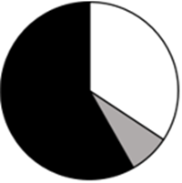
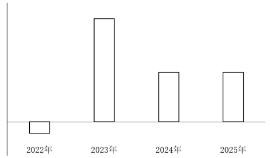

# 2026年福建省公务员录用考试《行测》题（网友回忆版）

> 资料分析 · 15 题 · 福建 2026

## 材料 1

        2009年，民营企业进出口3.45万亿元，占同期我国进出口总额的22.9%，比重首次超过国有企业。2019年，民营企业进出口13.49万亿元，占同期我国进出口总额的42.7%，首次成为第一大外贸经营主体并保持至今。2024年，民营企业进出口占同期我国进出口总额的55.5%。2025年前两个月，民营企业进出口3.69万亿元。

        2022年，我国有进出口实绩的民营企业数量迈上50万家台阶。2024年，我国有进出口实绩的民营企业数量达60.9万家，占我国有进出口实绩企业的87.1%。

        2024年，民营企业出口高新技术产品3.05万亿元，较2019年增长94.5%，占我国同类商品出口比重较2019年（下同）提升17.5个百分点至48.6%。手机、汽车（包括底盘）、蓄电池、电脑、船舶出口额较2019年分别增长123.8%、10.5倍、461.6%、83.9%、375%，占比分别提升30.1个、18.3个、19.4个、11.2个、20.3个百分点至59.7%、51.5%、69.4%、27.2%、38.6%。2025年前两个月，民营企业上述商品出口额同比分别增长11.8%、11%、20.3%、1.7%、25.2%。

        2024年，民营企业进口大宗商品1.91万亿元，较2019年增长107.8%。同期，国有企业、外商投资企业大宗商品进口额占我国大宗商品进口额比重分别较2019年下降8.6个、0.7个百分点至55.4%、9.3%。

        2025年前两个月，民营企业对传统市场（美国、欧盟、日本、我国香港地区、英国等）、东盟、拉美分别进出口1.26万亿元、6310.2亿元、3247.9亿元，同比分别增长4%、增长4.8%、下降1.3%。

### 第 1 题　qid 16069813 · 综合

2024年，我国有进出口实绩的企业约有多少万家？

- **A**. 57
- **B**. 70　✅
- **C**. 81
- **D**. 96

**答案**：B

**官方解析**

根据题干“2024年，我国有进出口实绩的企业约有多少万家”，结合材料给出了2024年有进出口实绩的民营企业数量及其占比，可判定本题为现期比重问题。定位文字材料第二段可得：2024年，我国有进出口实绩的民营企业数量达60.9万家，占我国有进出口实绩企业的87.1%。根据公式：整体，可得所求万家。

故正确答案为B。

---

### 第 2 题　qid 16069815 · 比重

将手机、蓄电池、船舶三类商品按2019年民营企业出口额占我国同类产品出口额比重从高到低排列，正确的是：

- **A**. 手机、船舶、蓄电池
- **B**. 蓄电池、船舶、手机
- **C**. 蓄电池、手机、船舶　✅
- **D**. 船舶、手机、蓄电池

**答案**：C

**官方解析**

根据题干“······按2019年······比重从高到低排列······”，结合材料时间为2024年，可判定本题为基期比重问题。定位文字材料第三段可得：2024年，手机、蓄电池、船舶出口额占比较2019年分别提升30.1个、19.4个、20.3个百分点至59.7%、69.4%、38.6%。则2019年这三类商品占比分别为：手机=59.7%-30.1%=29.6%、蓄电池=69.4%-19.4%=50%、船舶=38.6%-20.3%=18.3%。综上，2019年所占比重从高到低排列为蓄电池、手机、船舶。
故正确答案为C。

---

### 第 3 题　qid 16069817 · 综合

2019年，国有企业大宗商品进口额约是外商投资企业大宗商品进口额的多少倍？

- **A**. 5.2
- **B**. 5.8
- **C**. 6.4　✅
- **D**. 7.0

**答案**：C

**官方解析**

根据题干“2019年······是······的多少倍”，结合材料时间为2024年，可判定本题为基期倍数问题。定位文字材料第四段可得：2024年，国有企业、外商投资企业大宗商品进口额占我国大宗商品进口额比重分别较2019年下降8.6个、0.7个百分点至55.4%、9.3%。则2019年国有企业、外商投资企业大宗商品进口额占我国大宗商品进口额比重分别为55.4%+8.6%=64%、9.3%+0.7%=10%。则题干所求倍数。

故正确答案为C。

---

### 第 4 题　qid 16069865 · 比重

关于2025年前两个月民营企业进出口总额，以下饼图能准确反映传统市场（白色）、东盟（灰色）和其他地区（黑色）占比关系的是：

- **A**. 

　✅
- **B**. 

- **C**. 

- **D**. 

**答案**：A

**官方解析**

根据题干“······2025年前两个月······占比关系的是”，结合材料时间涉及2025年前两个月，可判定本题为现期比重问题。定位文字材料第一段可得：2025年前两个月，民营企业进出口3.69万亿元；定位文字材料第五段可得：2025年前两个月，民营企业对传统市场、东盟分别进出口1.26万亿元、6310.2亿元。根据公式：比重，

则民营企业进出口总额中，对传统市场和东盟所占比重之和为稍大于50%，排除C、D两项；民营企业对传统市场进出口额是对东盟进出口额的倍，排除B项。

故正确答案为A。

---

### 第 5 题　qid 16069885 · 综合

能够从上述资料中推出的是：

- **A**. 2024年3-12月民营企业进出口总额
- **B**. 2024年前两个月民营企业高新技术产品出口额
- **C**. 2024年前两个月民营企业手机、电脑进出口总额
- **D**. 2024年非民营企业高新技术产品出口额相较2019年增速　✅

**答案**：D

**官方解析**

A项：定位文字材料第一段可得：2024年民营企业进出口占同期我国进出口总额的55.5%，2025年前两个月民营企业进出口3.69万亿元。没有给出2024年3-12月民营企业进出口总额相关数据，无法推出，错误；

B项：定位文字材料第三段可得：2024年民营企业出口高新技术产品3.05万亿元。没有给出2024年前两个月民营企业高新技术产品出口额相关数据，无法推出，错误；

C项：定位文字材料第三段可得：2024年民营企业手机、电脑出口额较2019年的增速及比重变化，2025年前两个月民营企业手机、电脑出口额的同比增速。没有给出2024年前两个月民营企业手机、电脑进出口总额相关数据，无法推出，错误；

D项：定位文字材料第三段可得：2024年民营企业出口高新技术产品3.05万亿元，较2019年增长94.5%，占我国同类商品出口比重较2019年（下同）提升17.5个百分点至48.6%。则2024年非民营企业高新技术产品出口额=高新技术产品出口额-民营企业高新技术产品出口额万亿元，2019年非民营企业高新技术产品出口额万亿元。根据公式：增长率，2024年非民营企业高新技术产品出口额相较2019年的增速，可以推出，正确。

故正确答案为D。

---

## 材料 2

### 第 6 题　qid 16069826 · 平均数

2025年，我国服装整体市场规模比2020~2024年间的平均值高：

- **A**. 不到1000亿元
- **B**. 1000~1300亿元　✅
- **C**. 1300~1600亿元
- **D**. 1600亿元以上

**答案**：B

**官方解析**

根据题干“2025年······比2020~2024年间的平均值高”，可判定本题为现期平均数问题。定位统计表可得：2020~2025年我国服装整体市场规模分别为19600.7亿元、21938.2亿元、19950.5亿元、21619.5亿元、21698.2亿元、22049.5亿元。则所求亿元，在B项范围内。

故正确答案为B。

---

### 第 7 题　qid 16069828 · 比重

2025年，我国运动鞋类市场规模占鞋类市场规模的比重比运动服装占服装市场规模的比重高约多少个百分点？

- **A**. 37
- **B**. 41　✅
- **C**. 45
- **D**. 49

**答案**：B

**官方解析**

根据题干“2025年······比重高约多少个百分点”，可判定本题为现期比重问题。定位表格材料可得：2025年我国鞋类市场规模4787.7亿元，其中运动鞋类市场规模2393.7亿元；我国服装市场规模22049.5亿元，其中运动服装市场规模1982.8亿元。根据公式：比重，则题干所求，即高约41个百分点。

故正确答案为B。

---

### 第 8 题　qid 16069831 · 增长

如保持2025年同比增量不变，我国运动服装市场规模将在哪一年首次超过运动鞋类市场规模？

- **A**. 2034年　✅
- **B**. 2035年
- **C**. 2036年
- **D**. 2037年

**答案**：A

**官方解析**

根据题干“如保持2025年同比增量不变······将在哪一年首次超过······”，可判定本题为现期计算问题。定位统计表可得：2024年我国运动服装市场规模为1831.1亿元，运动鞋类市场规模为2292.6亿元；2025年我国运动服装市场规模为1982.8亿元，运动鞋类市场规模为2393.7亿元。根据公式：增长量=现期量-基期量，可得2025年我国运动服装市场规模同比增量=1982.8-1831.1=151.7亿元，我国运动鞋类市场规模同比增量=2393.7-2292.6=101.1亿元。根据公式：现期量=基期量+增长量×n，可列式：1982.8+151.7×n&gt;2393.7+101.1×n，解得n&gt;8.1，则n取整最小为9，即如保持2025年同比增量不变，我国运动服装市场规模将在2025+9=2034年首次超过运动鞋类市场规模。
故正确答案为A。

---

### 第 9 题　qid 16069832 · 增长

以下柱状图反映了2022~2025年间，哪一类商品市场规模同比增量的变化趋势（横轴位置代表增量为0）？

- **A**. 户外服装
- **B**. 时尚服装
- **C**. 功能鞋类　✅
- **D**. 时尚鞋类

**答案**：C

**官方解析**

根据题干“以下柱状图反映了2022~2025年间······同比增量的变化趋势（横轴位置代表增量为0）”，可判定本题为增长量比较问题。定位统计表可得2021~2025年我国户外服装、时尚服装、功能鞋类、时尚鞋类各年份市场规模。根据公式：增长量=现期量-基期量，结合柱形图变化趋势分析如下：
A项，户外服装，2022年同比增长量=260.7-221.9&gt;0，而柱状图中2022年同比增长量为负，不符合柱状图变化趋势，排除；
B项，时尚服装，2022年同比增长量=673.1−771.9=−98.8亿元，2023年同比增长量=753.4−673.1=80.3亿元，2022年同比增长量的绝对值（98.8亿元）&gt;2023年同比增长量的绝对值（80.3亿元），不符合柱状图变化趋势，排除；
C项，功能鞋类，2022年同比增长量=735.6−749.1=-13.5亿元，2023年同比增长量=857.0−735.6=121.4亿元，2024年同比增长量=915.2−857.0=58.2亿元，2025年同比增长量=973.6−915.2=58.4亿元，符合柱状图变化趋势，当选；
D项，时尚鞋类，2022年同比增长量=1094.3−1176.7=−82.4亿元，2023年同比增长量=1185.7−1094.3=91.4亿元，2023年同比增长量的绝对值（91.4亿元）是2022年同比增长量绝对值（82.4亿元）的1倍多，而柱状图中前者是后者的好几倍，不符合柱状图变化趋势，排除。
故正确答案为C。

---

### 第 10 题　qid 16069834 · 综合

不能从上述资料中推出的是：

- **A**. 2023~2025年，我国非运动服装市场规模不到6万亿元
- **B**. 2023~2025年，我国功能服装市场规模同比增速逐年加快　✅
- **C**. 2021~2025年，我国非运动鞋类市场规模比运动鞋类高不到1万亿元
- **D**. 2025年，我国功能鞋类市场规模同比增量占运动鞋类市场规模同比增量的一半以上

**答案**：B

**官方解析**

A项：定位统计表可得，2023~2025年各年份我国非运动服装市场规模分别为19946.3亿元、19867.1亿元、20066.7亿元。则2023~2025年，我国非运动服装市场规模为19946.3+19867.1+20066.7=59880.1亿元&lt;6万亿元，正确；

B项：定位统计表可得，2022~2025年各年份我国功能服装市场规模分别为495.9亿元、580.6亿元、612.5亿元、643.1亿元。根据公式：增长率，则2023年我国功能服装市场规模同比增速，2024年我国功能服装市场规模同比增速，2023年同比增速&gt;2024年同比增速，同比增速并非逐年加快，错误；

C项：定位统计表可得，2021~2025年各年份我国非运动鞋类和运动鞋类市场规模。则所求=2641.2+2286.9+2455.9+2414.3+2394.0-（2029.3+1947.5+2186.3+2292.6+2393.7）2600＋2300+2500+2400+2400-（2000+1900+2200+2300+2400）=12200-10800=1400亿元&lt;1万亿元，正确；

D项：定位统计表可得，2024年、2025年我国功能鞋类市场规模分别为915.2亿元、973.6亿元，运动鞋类市场规模分别为2292.6亿元、2393.7亿元。根据公式：增长量=现期量-基期量、比重，则所求，正确。

本题为选非题，故正确答案为B。

---

## 材料 3

        2025年12月，我国新能源汽车产销量分别为171.8万辆和171万辆，同比分别增长12.3%和7.2%，环比分别下降8.6%和6.2%。其中，纯电动车销量110.8万辆，同比增长13.8%，环比下降5.3%；插电式混动销量59.9万辆，同比下降3.7%，环比下降8.1%。2025年新能源汽车产销量分别为1662.6万辆和1649万辆，同比分别增长29%和28.2%。其中，纯电动车销量1062.2万辆，同比增长37.6%；插电式混动销量586.1万辆，同比增长14%。2025年新能源汽车渗透率（新能源汽车销量占汽车销量比重）47.9%，同比上升7个百分点；12月新能源汽车渗透率52.3%，环比下降0.9个百分点。2025年新能源汽车出口261.5万辆，同比增长1倍；12月新能源汽车出口30万辆，同比增长1.2倍，环比下降0.1%。

        2025年12月，我国动力和储能电池产量201.7GWh（1GWh=100万千瓦时），环比增长14.4%，同比增长62.1%；销量199.3GWh，环比增长11.1%，同比增长57.5%。其中，动力电池销量143.8GWh，环比增长7.3%，同比增长49.2%。出口方面：12月我国动力和储能电池出口32.6GWh。其中，动力电池出口量19GWh，环比减少10.4%，同比增长47.1%，储能电池出口量13.6GWh，环比增长23.9%，同比增长52.2%。装车量方面：12月国内动力电池装车量（生产的新能源汽车上安装的所有动力电池的总能量）98.1GWh，环比增长4.9%，同比增长35.1%。

### 第 11 题　qid 16069867 · 综合

2025年12月，我国除纯电动和插电式混动之外的新能源汽车销量占汽车总销量的：

- **A**. 不到0.1%　✅
- **B**. 0.1%~0.3%
- **C**. 0.3%~0.6%
- **D**. 0.6%以上

**答案**：A

**官方解析**

根据题干“2025年12月······占······”，结合材料时间为2025年12月，可判定本题为现期比重问题。定位文字材料第一段可知：2025年12月，我国新能源汽车销量为171万辆，纯电动车销量110.8万辆，插电式混动销量59.9万辆，新能源汽车渗透率（新能源汽车销量占汽车销量比重）52.3%。根据公式：比重，则题干所求为，在A项范围内。

故正确答案为A。

---

### 第 12 题　qid 16069868 · 综合

2024年12月，我国新能源汽车出口量比2024年月均出口量：

- **A**. 低不到1万辆
- **B**. 低1万辆以上
- **C**. 高不到1万辆
- **D**. 高1万辆以上　✅

**答案**：D

**官方解析**

根据题干“2024年12月······比2024年月均······”，结合材料时间为2025年，可判定本题为基期和差问题。定位文字材料第一段可知：2025年新能源汽车出口261.5万辆，同比增长1倍；12月新能源汽车出口30万辆，同比增长1.2倍。根据公式：基期量、平均数，可得2024年12月我国新能源汽车出口量万辆；2024年我国新能源汽车月均出口量万辆，则所求差值=13.6−10.9&gt;1万辆，即高1万辆以上。

故正确答案为D。

---

### 第 13 题　qid 16069869 · 综合

2025年11月，我国动力电池出口量约是储能电池出口量的多少倍？

- **A**. 1.3
- **B**. 1.6
- **C**. 1.9　✅
- **D**. 2.2

**答案**：C

**官方解析**

根据题干“2025年11月······约是······的多少倍”，结合材料时间为2025年12月，可判定本题为基期倍数问题。定位文字材料第二段可得：2025年12月，我国动力电池出口量19GWh（A），环比减少10.4%（a）；储能电池出口量13.6GWh（B），环比增长23.9%（b）。根据公式：基期倍数，则所求为，与C项最接近。

故正确答案为C。

---

### 第 14 题　qid 16069870 · 平均数

2025年12月国内平均每生产1辆新能源汽车安装的动力电池能量比上月：

- **A**. 低不到10千瓦时
- **B**. 低10千瓦时以上
- **C**. 高不到10千瓦时　✅
- **D**. 高10千瓦时以上

**答案**：C

**官方解析**

根据题干“2025年12月······平均每······比上月”，结合选项高/低+具体单位，可判定本题为平均数的增长量问题。定位文字材料第一段可得：2025年12月，我国新能源汽车产量为171.8万辆（B），环比下降8.6%（b）；定位文字材料第二段可得：2025年12月，国内动力电池装车量（生产的新能源汽车上安装的所有动力电池的总能量）98.1GWh（A），环比增长4.9%（a）。根据公式：平均数的增长量，可得所求为千瓦时/辆，即高不到10千瓦时/辆。

故正确答案为C。

---

### 第 15 题　qid 16069871 · 增长

在上述资料信息中以下哪项可以推出？
①2024年12月新能源汽车出口量占汽车出口量比重
②2025年12月储能电池销量同比增长速度

- **A**. 仅①能从上述资料推出
- **B**. 仅②能从上述资料推出　✅
- **C**. 两者都能从上述资料推出
- **D**. 都不能

**答案**：B

**官方解析**

①定位文字材料第一段可得：2025年12月新能源汽车出口30万辆，同比增长1.2倍。材料并未给出汽车出口量相关数据，故无法计算2024年12月新能源汽车出口量占汽车出口量比重，则无法推出；

②定位文字材料第二段可得：2025年12月，我国动力和储能电池销量199.3GWh，同比增长57.5%。其中，动力电池销量143.8GWh，同比增长49.2%。则2025年12月我国储能电池销量为199.3-143.8=55.5GWh。设2025年12月储能电池销量同比增速为r，根据线段法：距离（增长率之差）与量（基期量）成反比，可列式：，则可以推出。

综上可知，仅②能从上述资料推出。

故正确答案为B。

---
