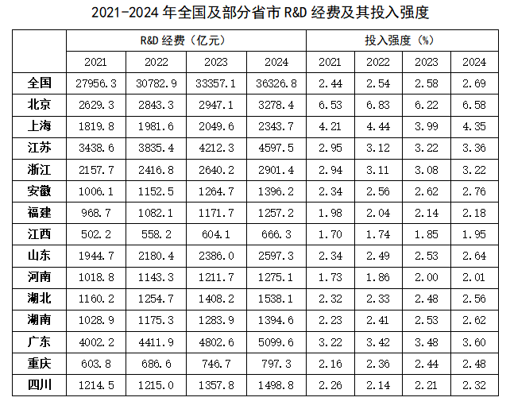
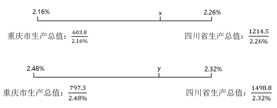
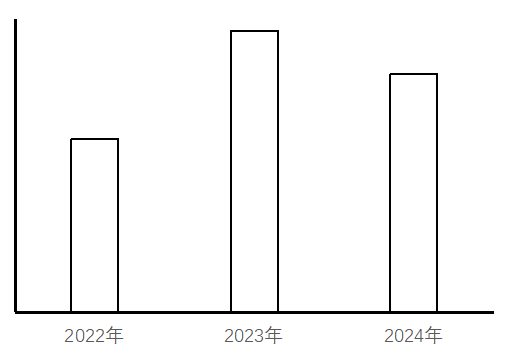

# 2026年贵州省公务员录用考试《行测》题（网友回忆版）

> 资料分析 · 21 题 · 贵州 2026

## 材料 1

### 第 1 题　qid 15833796 · 增长

2024年，全国R&D经费同比增量比上年：

- **A**. 低不到200亿元
- **B**. 低200亿元以上
- **C**. 高不到200亿元
- **D**. 高200亿元以上　✅

**答案**：D

**官方解析**

根据题干“2024年······同比增量比上年”，可判定本题为增长量计算问题。定位统计表可得，2022-2024年全国R&D经费分别为30782.9亿元、33357.1亿元、36326.8亿元。根据公式：增长量=现期量-基期量，则2024年全国R&D经费同比增量比上年相差：（36326.8-33357.1）-（33357.1-30782.9）=2969.7-2574.2=395.5亿元，即高395.5亿元，对应D项。
故正确答案为D。

---

### 第 2 题　qid 15833797 · 综合

表中2024年R&D经费投入金额最高的4个省市，当年R&D经费约占全国的：

- **A**. 40%
- **B**. 44%　✅
- **C**. 48%
- **D**. 52%

**答案**：B

**官方解析**

根据题干“······2024年······占······”，结合材料时间为2024年，可判定本题为现期比重问题。定位统计表可得：2024年全国及部分省市R&amp;D经费投入金额。比较可知，2024年R&amp;D经费投入金额最高的4个省市分别为广东（5099.6亿元）、江苏（4597.5亿元）、北京（3278.4亿元）、浙江（2901.4亿元）。2024年全国R&amp;D经费投入金额为36326.8亿元。根据公式：，则所求。

故正确答案为B。

---

### 第 3 题　qid 15833798 · 综合

2024年，川渝地区（四川和重庆）整体R&D经费投入强度比2021年上升了：

- **A**. 不到0.1个百分点
- **B**. 0.1～0.2个百分点　✅
- **C**. 0.2～0.3个百分点
- **D**. 0.3个百分点以上

**答案**：B

**官方解析**

根据题干“2024年，川渝地区（四川和重庆）整体R&amp;D经费投入强度比2021年上升了”，结合材料给出了2021年、2024年四川、重庆的R&amp;D经费投入强度，且R&amp;D经费投入强度，可判定本题为混合比重问题。定位统计表可得：2021年四川和重庆的R&amp;D经费分别为1214.5亿元、603.8亿元，投入强度分别为2.26%、2.16%；2024年四川和重庆的R&amp;D经费分别为1498.8亿元、797.3亿元，投入强度分别为2.32%、2.48%。根据线段法“距离（投入强度差）与量（全省（市）生产总值）成反比”，设2021年川渝地区（四川和重庆）整体R&amp;D经费投入强度为，2024年为，可列式：，，解得，。则题干所求为，即上升了0.14个百分点，在B项范围内。

故正确答案为B。

---

### 第 4 题　qid 15833799 · 增长

以下柱状图反映了哪个省市2022～2024年R&amp;D经费同比增量的变化趋势（横轴位置代表增量为0）？

- **A**. 安徽
- **B**. 江西
- **C**. 湖北　✅
- **D**. 湖南

**答案**：C

**官方解析**

根据题干“······反映了哪个省市2022-2024年······同比增量的变化趋势”，可判定本题为增长量比较问题。定位统计表可知2021-2024年安徽、江西、湖北、湖南四个省份各年的R&D经费。根据公式：增长量=现期量-基期量，可得选项中各指标同比增量如下：
A项，安徽：2022年，1152.5-1006.1=146.4亿元；2023年，1264.7-1152.5=112.2亿元。2022年同比增量＞2023年同比增量，不符合柱状图变化趋势，排除；
B项，江西：2022年，558.2-502.2=56亿元；2023年，604.1-558.2=45.9亿元。2022年同比增量＞2023年同比增量，不符合柱状图变化趋势，排除；
C项，湖北：2022年，1254.7-1160.2=94.5亿元；2023年，1408.2-1254.7=153.5亿元；2024年，1538.1-1408.2=129.9亿元。2023年同比增量＞2024年同比增量＞2022年同比增量，符合柱状图变化趋势，当选；
D项，湖南：2022年，1175.3-1028.9=146.4亿元；2023年，1283.9-1175.3=108.6亿元。2022年同比增量＞2023年同比增量，不符合柱状图变化趋势，排除。
故正确答案为C。

---

### 第 5 题　qid 15833800 · 综合

能够从上述资料中推出的是：

- **A**. 2021～2024年，北京年均R&D经费超过3000亿元
- **B**. 2022～2024年，河南R&D经费投入强度的3年同比增量持续递增
- **C**. 2021～2024年，上海、重庆R&D经费投入强度最高的年份是同一个
- **D**. 2024年，江苏、浙江和安徽R&D经费都比2021年增长了30%以上　✅

**答案**：D

**官方解析**

A项：定位统计表，2021~2024年各年份北京R&amp;D经费分别为2629.3亿元、2843.3亿元、2947.1亿元、3278.4亿元。根据公式：平均数，则2021~2024年，北京年均R&amp;D经费为亿元＜3000亿元，错误；

B项：定位统计表，2021~2024年各年份河南R&amp;D经费投入强度分别为1.73%、1.86%、2.00%、2.01%。根据公式：增长量=现期量-基期量，可得2022～2024年各年份河南R&amp;D经费投入强度同比增量分别为：2022年，1.86%-1.73%=0.13%；2023年，2.00%-1.86%=0.14%；2024年，2.01%-2.00%=0.01%。2024年同比增量＜2023年同比增量，非持续递增，错误；

C项：定位统计表，2021~2024年各年份上海R&amp;D经费投入强度分别为4.21%、4.44%、3.99%、4.35%；重庆R&amp;D经费投入强度分别为2.16%、2.36%、2.44%、2.48%。则2021～2024年，上海R&amp;D经费投入强度最高的年份是2022年（4.44%），重庆R&amp;D经费投入强度最高的年份是2024年（2.48%），非同一个年份，错误；

D项：定位统计表，2024年江苏、浙江和安徽R&amp;D经费分别为4597.5亿元、2901.4亿元、1396.2亿元；2021年江苏、浙江和安徽R&amp;D经费分别为3438.6亿元、2157.7亿元、1006.1亿元。根据公式：，可得2024年，江苏、浙江和安徽R&amp;D经费比2021年的增长率分别为：江苏，；浙江，；安徽，。都增长了30%以上，正确。 故正确答案为D。

---

## 材料 2

### 第 6 题　qid 16069826 · 平均数

2025年，我国服装整体市场规模比2020~2024年间的平均值高：

- **A**. 不到1000亿元
- **B**. 1000~1300亿元　✅
- **C**. 1300~1600亿元
- **D**. 1600亿元以上

**答案**：B

**官方解析**

根据题干“2025年······比2020~2024年间的平均值高”，可判定本题为现期平均数问题。定位统计表可得：2020~2025年我国服装整体市场规模分别为19600.7亿元、21938.2亿元、19950.5亿元、21619.5亿元、21698.2亿元、22049.5亿元。则所求亿元，在B项范围内。

故正确答案为B。

---

### 第 7 题　qid 16069828 · 比重

2025年，我国运动鞋类市场规模占鞋类市场规模的比重比运动服装占服装市场规模的比重高约多少个百分点？

- **A**. 37
- **B**. 41　✅
- **C**. 45
- **D**. 49

**答案**：B

**官方解析**

根据题干“2025年······比重高约多少个百分点”，可判定本题为现期比重问题。定位表格材料可得：2025年我国鞋类市场规模4787.7亿元，其中运动鞋类市场规模2393.7亿元；我国服装市场规模22049.5亿元，其中运动服装市场规模1982.8亿元。根据公式：比重，则题干所求，即高约41个百分点。

故正确答案为B。

---

### 第 8 题　qid 16069831 · 增长

如保持2025年同比增量不变，我国运动服装市场规模将在哪一年首次超过运动鞋类市场规模？

- **A**. 2034年　✅
- **B**. 2035年
- **C**. 2036年
- **D**. 2037年

**答案**：A

**官方解析**

根据题干“如保持2025年同比增量不变······将在哪一年首次超过······”，可判定本题为现期计算问题。定位统计表可得：2024年我国运动服装市场规模为1831.1亿元，运动鞋类市场规模为2292.6亿元；2025年我国运动服装市场规模为1982.8亿元，运动鞋类市场规模为2393.7亿元。根据公式：增长量=现期量-基期量，可得2025年我国运动服装市场规模同比增量=1982.8-1831.1=151.7亿元，我国运动鞋类市场规模同比增量=2393.7-2292.6=101.1亿元。根据公式：现期量=基期量+增长量×n，可列式：1982.8+151.7×n&gt;2393.7+101.1×n，解得n&gt;8.1，则n取整最小为9，即如保持2025年同比增量不变，我国运动服装市场规模将在2025+9=2034年首次超过运动鞋类市场规模。
故正确答案为A。

---

### 第 9 题　qid 16069832 · 增长

以下柱状图反映了2022~2025年间，哪一类商品市场规模同比增量的变化趋势（横轴位置代表增量为0）？

- **A**. 户外服装
- **B**. 时尚服装
- **C**. 功能鞋类　✅
- **D**. 时尚鞋类

**答案**：C

**官方解析**

根据题干“以下柱状图反映了2022~2025年间······同比增量的变化趋势（横轴位置代表增量为0）”，可判定本题为增长量比较问题。定位统计表可得2021~2025年我国户外服装、时尚服装、功能鞋类、时尚鞋类各年份市场规模。根据公式：增长量=现期量-基期量，结合柱形图变化趋势分析如下：
A项，户外服装，2022年同比增长量=260.7-221.9&gt;0，而柱状图中2022年同比增长量为负，不符合柱状图变化趋势，排除；
B项，时尚服装，2022年同比增长量=673.1−771.9=−98.8亿元，2023年同比增长量=753.4−673.1=80.3亿元，2022年同比增长量的绝对值（98.8亿元）&gt;2023年同比增长量的绝对值（80.3亿元），不符合柱状图变化趋势，排除；
C项，功能鞋类，2022年同比增长量=735.6−749.1=-13.5亿元，2023年同比增长量=857.0−735.6=121.4亿元，2024年同比增长量=915.2−857.0=58.2亿元，2025年同比增长量=973.6−915.2=58.4亿元，符合柱状图变化趋势，当选；
D项，时尚鞋类，2022年同比增长量=1094.3−1176.7=−82.4亿元，2023年同比增长量=1185.7−1094.3=91.4亿元，2023年同比增长量的绝对值（91.4亿元）是2022年同比增长量绝对值（82.4亿元）的1倍多，而柱状图中前者是后者的好几倍，不符合柱状图变化趋势，排除。
故正确答案为C。

---

### 第 10 题　qid 16069834 · 综合

不能从上述资料中推出的是：

- **A**. 2023~2025年，我国非运动服装市场规模不到6万亿元
- **B**. 2023~2025年，我国功能服装市场规模同比增速逐年加快　✅
- **C**. 2021~2025年，我国非运动鞋类市场规模比运动鞋类高不到1万亿元
- **D**. 2025年，我国功能鞋类市场规模同比增量占运动鞋类市场规模同比增量的一半以上

**答案**：B

**官方解析**

A项：定位统计表可得，2023~2025年各年份我国非运动服装市场规模分别为19946.3亿元、19867.1亿元、20066.7亿元。则2023~2025年，我国非运动服装市场规模为19946.3+19867.1+20066.7=59880.1亿元&lt;6万亿元，正确；

B项：定位统计表可得，2022~2025年各年份我国功能服装市场规模分别为495.9亿元、580.6亿元、612.5亿元、643.1亿元。根据公式：增长率，则2023年我国功能服装市场规模同比增速，2024年我国功能服装市场规模同比增速，2023年同比增速&gt;2024年同比增速，同比增速并非逐年加快，错误；

C项：定位统计表可得，2021~2025年各年份我国非运动鞋类和运动鞋类市场规模。则所求=2641.2+2286.9+2455.9+2414.3+2394.0-（2029.3+1947.5+2186.3+2292.6+2393.7）2600＋2300+2500+2400+2400-（2000+1900+2200+2300+2400）=12200-10800=1400亿元&lt;1万亿元，正确；

D项：定位统计表可得，2024年、2025年我国功能鞋类市场规模分别为915.2亿元、973.6亿元，运动鞋类市场规模分别为2292.6亿元、2393.7亿元。根据公式：增长量=现期量-基期量、比重，则所求，正确。

本题为选非题，故正确答案为B。

---

## 材料 3

        2025年1-9月，甲、乙平台唇部彩妆销售额分别为63.1亿元和75.3亿元。

### 第 11 题　qid 17467578 · 增长

如2025年和2026年中国唇部彩妆行业市场规模同比增量与2024年相同，则2022-2026年中国唇部彩妆行业市场总规模将在以下哪个范围？

- **A**. 不到1460亿元　✅
- **B**. 1460亿~1480亿元
- **C**. 1480亿~1500亿元
- **D**. 超过1500亿元

**答案**：A

**官方解析**

根据题干“如2025年和2026年······同比增量与2024年相同，则2022-2026年······总规模将在以下哪个范围”，可判定本题为现期计算问题。定位统计图可得：2022-2024年中国唇部彩妆行业市场规模分别为232.6亿元、262.8亿元、291.2亿元。根据公式：增长量=现期量-基期量，则2024年中国唇部彩妆行业市场规模同比增量=291.2-262.8=28.4亿元；根据公式：现期量=基期量+增长量，则2025年中国唇部彩妆行业市场规模=291.2+28.4=319.6亿元，2026年市场规模=319.6+28.4=348亿元。故2022-2026年中国唇部彩妆行业市场总规模=232.6+262.8+291.2+319.6+348233+263+291+320+348=1455亿元，在A项范围内。

故正确答案为A。

计算提示：2025年市场规模=2024年市场规模+2024年同比增量；2026年市场规模=2024年市场规模+2024年同比增量×2，则本题可列式为232.6+262.8+291.2×3+28.4×3233+263+（291.2+28.4）×3496+960=1456亿元，在A项范围内。

---

### 第 12 题　qid 16070145 · 增长

2016-2024年间，中国唇部彩妆行业市场规模同比增速超过20%的年份有几个？

- **A**. 1
- **B**. 2
- **C**. 3　✅
- **D**. 4

**答案**：C

**官方解析**

根据题干“2016-2024年间······同比增速超过20%的年份有几个”，可判定本题为一般增长率问题。定位统计图可得2015-2024年中国唇部彩妆行业市场规模。根据公式：增长率，可得2016-2024年中国唇部彩妆行业市场规模同比增速分别为：

2016年；

2017年；

2018年；

2019年；

2020年；

2021年；

2022年；

2023年；

2024年。

综上，同比增速超过20%的年份有2017年、2018年、2019年，共3个。

故正确答案为C。

计算提示：同比增速超过20%，即基期量+20%×基期量&lt;现期量。分析可知，2017年：71.0+71.0×20%&lt;94.2，满足；2018年：94.2+94.2×20%&lt;128.2，满足；2019年：128.2+128.2×20%&lt;167.3，满足。其余年份均不满足，故同比增速超过20%的年份有2017年、2018年、2019年，共3个。

---

### 第 13 题　qid 16070144 · 增长

2025年1-9月，K、L两个品牌在乙平台的总体销售额同比增长了约（    ）。

- **A**. 19%　✅
- **B**. 25%
- **C**. 31%
- **D**. 37%

**答案**：A

**官方解析**

根据题干“2025年1-9月······同比增长了约”，结合选项为百分数，且材料给出2025年1-9月K、L两个品牌在乙平台的销售额及其同比增速，可判定本题为混合增长率问题。定位统计表可得：2025年1-9月K、L两个品牌在乙平台的销售额分别为3.85亿元、3.70亿元，同比增速分别为-0.7%、49.0%。根据公式：基期量，可得2024年1-9月K、L两个品牌在乙平台的销售额分别为亿元、亿元。根据混合增长率口诀：“混合居中不正中，偏向基期量大的”可知，2025年1-9月K、L两个品牌在乙平台的总体销售额同比增速在-0.7%~49.0%之间；因，则混合后的同比增速更接近K品牌在乙平台销售额的同比增速，，则K、L两个品牌在乙平台的总体销售额同比增速在-0.7%~24.15%之间，对应A项。

故正确答案为A。

---

### 第 14 题　qid 16070147 · 比重

品牌集中度指标CR5代表销售额前5位品牌的销售额占总销售额的比重。2025年1-9月，甲平台唇部彩妆的CR5指标比乙平台（    ）。

- **A**. 低不到5个百分点
- **B**. 低5个百分点以上
- **C**. 高不到5个百分点
- **D**. 高5个百分点以上　✅

**答案**：D

**官方解析**

根据题干“品牌集中度指标CR5代表······占······的比重。2025年1-9月······”，，结合材料时间为2025年1-9月，可判定本题为现期比重问题。定位文字材料可得：2025年1-9月，甲、乙两大电商平台唇部彩妆销售额分别为63.1亿元和75.3亿元；定位统计表可知2025年1-9月甲、乙两大电商平台唇部彩妆销售额前5位品牌的销售额。则甲平台唇部彩妆销售额前5位品牌的销售额之和=6.52+4.70+4.57+2.33+2.17=20.29亿元，乙平台唇部彩妆销售额前5位品牌的销售额之和=3.85+3.70+3.13+3.09+2.97=16.74亿元。根据公式：比重，则甲平台唇部彩妆的CR5指标-乙平台唇部彩妆的CR5指标，即高5个百分点以上。

故正确答案为D。

---

### 第 15 题　qid 16070148 · 综合

能够从上述资料中推出的是（    ）。

- **A**. 2015-2019年，中国唇部彩妆行业市场规模超过550亿元
- **B**. 2024年1-9月，F品牌在甲平台的销售额高于在乙平台的销售额　✅
- **C**. 2025年1-9月，B、C、D三个品牌在甲、乙平台的总销售额均同比正增长
- **D**. 2025年1-9月，乙平台销售额同比增长的唇部彩妆前10位品牌中，过半是外国品牌

**答案**：B

**官方解析**

A项：定位统计图可知2015-2019年各年份中国唇部彩妆行业市场规模。则2015-2019年，中国唇部彩妆行业市场规模=61.8+71+94.2+128.2+167.362+71+94+128+167=522亿元，未超过550亿元，错误；

B项：定位统计表可得，2025年1-9月F品牌在甲平台的销售额为2.08亿元，同比增长-35.8%；2025年1-9月F品牌在乙平台的销售额为3.09亿元，同比增长46.2%。根据公式：基期量，则2024年1-9月F品牌在甲平台的销售额亿元；F品牌在乙平台的销售额亿元，即2024年1-9月，F品牌在甲平台的销售额高于在乙平台的销售额，正确；

C项：定位统计表可知2025年1-9月B、C、D三个品牌在甲平台的销售额以及同比增速，D品牌在乙平台的销售额及同比增速。材料未给出B、C品牌在乙平台的销售额数据，故无法推出B、C、D三个品牌在甲、乙平台的总销售额均同比正增长，错误；

D项：定位统计表可知2025年1-9月，乙平台唇部彩妆前10位品牌的销售额同比增速。同比增长（r&gt;0）的品牌有L、M、F、D、N、G、H共7个，其中外国品牌有D、G、H共3个，根据公式：比重，则外国品牌的占比&lt;50%，即未过半，错误。

故正确答案为B。

---

## 材料 4

        2009年，民营企业进出口3.45万亿元，占同期我国进出口总额的22.9%，比重首次超过国有企业。2019年，民营企业进出口13.49万亿元，占同期我国进出口总额的42.7%，首次成为第一大外贸经营主体并保持至今。2024年，民营企业进出口占同期我国进出口总额的55.5%。2025年前两个月，民营企业进出口3.69万亿元。

        2022年，我国有进出口实绩的民营企业数量迈上50万家台阶。2024年，我国有进出口实绩的民营企业数量达60.9万家，占我国有进出口实绩企业的87.1%。

        2024年，民营企业出口高新技术产品3.05万亿元，较2019年增长94.5%，占我国同类商品出口比重较2019年（下同）提升17.5个百分点至48.6%。手机、汽车（包括底盘）、蓄电池、电脑、船舶出口额较2019年分别增长123.8%、10.5倍、461.6%、83.9%、375%，占比分别提升30.1个、18.3个、19.4个、11.2个、20.3个百分点至59.7%、51.5%、69.4%、27.2%、38.6%。2025年前两个月，民营企业上述商品出口额同比分别增长11.8%、11%、20.3%、1.7%、25.2%。

        2024年，民营企业进口大宗商品1.91万亿元，较2019年增长107.8%。同期，国有企业、外商投资企业大宗商品进口额占我国大宗商品进口额比重分别较2019年下降8.6个、0.7个百分点至55.4%、9.3%。

        2025年前两个月，民营企业对传统市场（美国、欧盟、日本、我国香港地区、英国等）、东盟、拉美分别进出口1.26万亿元、6310.2亿元、3247.9亿元，同比分别增长4%、增长4.8%、下降1.3%。

### 第 16 题　qid 17467575 · 增长

2019年我国进出口总额比2009年约增加多少万亿元？

- **A**. 10
- **B**. 13
- **C**. 17　✅
- **D**. 20

**答案**：C

**官方解析**

根据题干“2019年······比2009年······约增加多少万亿元”，可判定本题为增长量计算问题。定位文字材料第一段可得：2009年，民营企业进出口3.45万亿元，占同期我国进出口总额的22.9%；2019年，民营企业进出口13.49万亿元，占同期我国进出口总额的42.7%。根据公式：整体、增长量=现期量-基期量，则题干所求万亿元，与C项最接近。

故正确答案为C。

---

### 第 17 题　qid 16069815 · 比重

将手机、蓄电池、船舶三类商品按2019年民营企业出口额占我国同类产品出口额比重从高到低排列，正确的是：

- **A**. 手机、船舶、蓄电池
- **B**. 蓄电池、船舶、手机
- **C**. 蓄电池、手机、船舶　✅
- **D**. 船舶、手机、蓄电池

**答案**：C

**官方解析**

根据题干“······按2019年······比重从高到低排列······”，结合材料时间为2024年，可判定本题为基期比重问题。定位文字材料第三段可得：2024年，手机、蓄电池、船舶出口额占比较2019年分别提升30.1个、19.4个、20.3个百分点至59.7%、69.4%、38.6%。则2019年这三类商品占比分别为：手机=59.7%-30.1%=29.6%、蓄电池=69.4%-19.4%=50%、船舶=38.6%-20.3%=18.3%。综上，2019年所占比重从高到低排列为蓄电池、手机、船舶。
故正确答案为C。

---

### 第 18 题　qid 16069817 · 综合

2019年，国有企业大宗商品进口额约是外商投资企业大宗商品进口额的多少倍？

- **A**. 5.2
- **B**. 5.8
- **C**. 6.4　✅
- **D**. 7.0

**答案**：C

**官方解析**

根据题干“2019年······是······的多少倍”，结合材料时间为2024年，可判定本题为基期倍数问题。定位文字材料第四段可得：2024年，国有企业、外商投资企业大宗商品进口额占我国大宗商品进口额比重分别较2019年下降8.6个、0.7个百分点至55.4%、9.3%。则2019年国有企业、外商投资企业大宗商品进口额占我国大宗商品进口额比重分别为55.4%+8.6%=64%、9.3%+0.7%=10%。则题干所求倍数。

故正确答案为C。

---

### 第 19 题　qid 16069865 · 比重

关于2025年前两个月民营企业进出口总额，以下饼图能准确反映传统市场（白色）、东盟（灰色）和其他地区（黑色）占比关系的是：

- **A**. 

　✅
- **B**. 

- **C**. 

- **D**. 

**答案**：A

**官方解析**

根据题干“······2025年前两个月······占比关系的是”，结合材料时间涉及2025年前两个月，可判定本题为现期比重问题。定位文字材料第一段可得：2025年前两个月，民营企业进出口3.69万亿元；定位文字材料第五段可得：2025年前两个月，民营企业对传统市场、东盟分别进出口1.26万亿元、6310.2亿元。根据公式：比重，

则民营企业进出口总额中，对传统市场和东盟所占比重之和为稍大于50%，排除C、D两项；民营企业对传统市场进出口额是对东盟进出口额的倍，排除B项。

故正确答案为A。

---

### 第 20 题　qid 16069885 · 综合

能够从上述资料中推出的是：

- **A**. 2024年3-12月民营企业进出口总额
- **B**. 2024年前两个月民营企业高新技术产品出口额
- **C**. 2024年前两个月民营企业手机、电脑进出口总额
- **D**. 2024年非民营企业高新技术产品出口额相较2019年增速　✅

**答案**：D

**官方解析**

A项：定位文字材料第一段可得：2024年民营企业进出口占同期我国进出口总额的55.5%，2025年前两个月民营企业进出口3.69万亿元。没有给出2024年3-12月民营企业进出口总额相关数据，无法推出，错误；

B项：定位文字材料第三段可得：2024年民营企业出口高新技术产品3.05万亿元。没有给出2024年前两个月民营企业高新技术产品出口额相关数据，无法推出，错误；

C项：定位文字材料第三段可得：2024年民营企业手机、电脑出口额较2019年的增速及比重变化，2025年前两个月民营企业手机、电脑出口额的同比增速。没有给出2024年前两个月民营企业手机、电脑进出口总额相关数据，无法推出，错误；

D项：定位文字材料第三段可得：2024年民营企业出口高新技术产品3.05万亿元，较2019年增长94.5%，占我国同类商品出口比重较2019年（下同）提升17.5个百分点至48.6%。则2024年非民营企业高新技术产品出口额=高新技术产品出口额-民营企业高新技术产品出口额万亿元，2019年非民营企业高新技术产品出口额万亿元。根据公式：增长率，2024年非民营企业高新技术产品出口额相较2019年的增速，可以推出，正确。

故正确答案为D。

---

### 第 21 题　qid 17467573 · 综合

某企业去年获得碳配额100万吨，实际排放115万吨，实际排放量和获得配额之间的缺口需购买配额弥补。已知缺口的10%以内可以用30元/吨的价格购买，其余部分需以50元/吨的市价购买。问共需要多少万元？

- **A**. 450
- **B**. 620
- **C**. 720　✅
- **D**. 750

**答案**：C

**官方解析**

根据题意，该企业实际排放量和获得配额之间的缺口为115-100=15万吨，其中15×10%=1.5万吨可以用30元/吨的价格购买，需要1.5×30=45万元，其余15-1.5=13.5万吨需以50元/吨的市价购买，需要13.5×50=675万元，则共需要45+675=720万元。
故正确答案为C。

---
