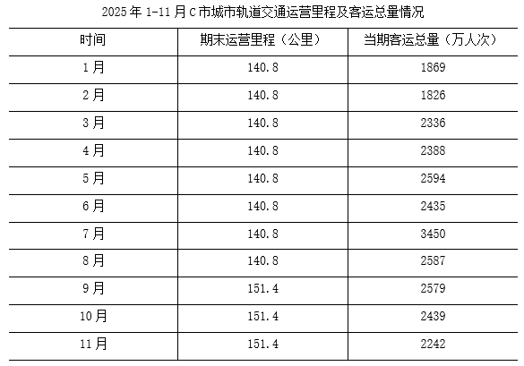
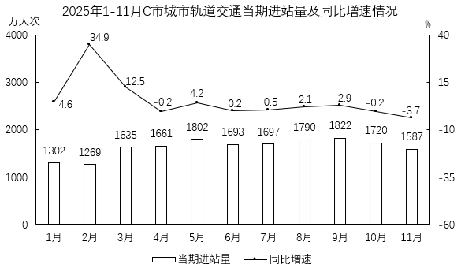
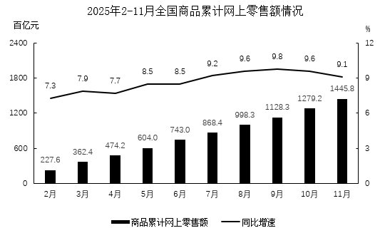
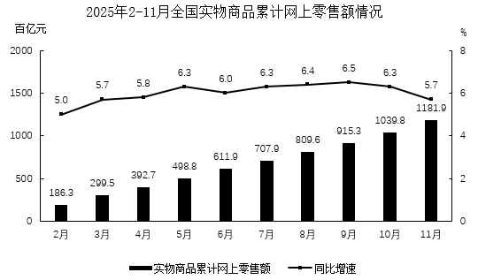
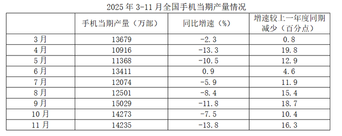
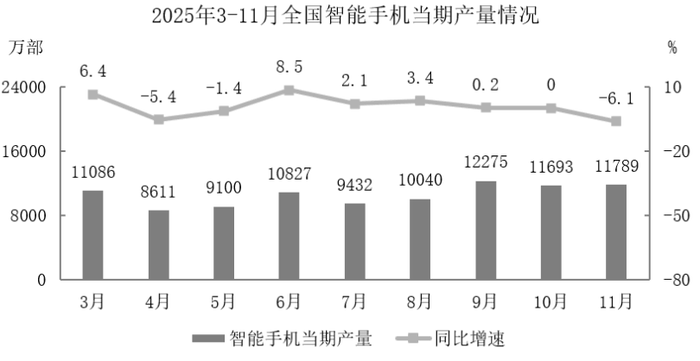

# 2026年辽宁省公务员录用考试《行测》题（网友回忆版）

> 资料分析 · 20 题 · 辽宁 2026

## 材料 1

        2025年10月全国规模以上互联网和相关服务企业（以下简称“互联网企业”）营业收入1769亿元，实现利润总额201亿元，研发费用98亿元。

        2025年1-10月，全国互联网企业实现营业收入16189亿元，同比增长9.6%，增速较上一年度同期提升4.4个百分点，较2025年1-9月减少3.9个百分点，实现利润总额1237亿元，同比下降1.9%，增速较上一年度同期减少19.3个百分点，较2025年1-9月提升8.1个百分点，研发费用累计支出862亿元，同比增长9.7%，增速较上一年度同期提升5.6个百分点，较2025年1-9月提升1.1个百分点。

        2025年10月东部地区互联网企业实现营业收入1566亿元，同比下降18.6%；中部地区互联网企业实现营业收入62亿元，同比增长36.3%；西部地区互联网企业实现营业收入138亿元，同比增长53.9%；东北地区互联网企业实现营业收入2亿元，同比下降14.3%。

        2025年1-10月东部地区互联网企业实现营业收入14523亿元，同比增长9.6%；中部地区互联网企业实现营业收入612亿元，同比下降1.7%；西部地区互联网企业实现营业收入1024亿元，同比增长18.1%；东北地区互联网企业实现营业收入30亿元，同比下降6.9%。

### 第 1 题　qid 15833707 · 综合

2023年1-10月，全国互联网企业实现利润总额在以下哪个范围内？

- **A**. 不到900亿元
- **B**. 900亿-1000亿元之间
- **C**. 1000亿-1100亿元之间　✅
- **D**. 超过1100亿元

**答案**：C

**官方解析**

根据题干“2023年1-10月······利润总额在以下哪个范围内”，结合材料时间为2025年1-10月，可判定本题为间隔基期问题。定位文字材料第二段可得：2025年1-10月，全国互联网企业实现利润总额1237亿元，同比下降1.9%（），增速较上一年度同期减少19.3个百分点。则2024年1-10月全国互联网企业实现利润总额的同比增速（）=-1.9%+19.3%=17.4%。根据公式：间隔增长率，可得间隔增长率。根据公式：基期量，可得所求亿元，在C项范围内。

故正确答案为C。

---

### 第 2 题　qid 15833706 · 综合

2024年1-9月，全国互联网企业实现营业收入在以下哪个范围内？

- **A**. 不到1.2万亿元
- **B**. 1.2万亿-1.3万亿元之间　✅
- **C**. 1.3万亿-1.4万亿元之间
- **D**. 超过1.4万亿元

**答案**：B

**官方解析**

根据题干“2024年1-9月······在以下哪个范围内”，结合材料时间为2025年10月及1-10月，可判定本题为基期计算问题。定位文字材料第一、二段可得：2025年10月全国规模以上互联网和相关服务企业（以下简称“互联网企业”）营业收入1769亿元；2025年1-10月，全国互联网企业实现营业收入16189亿元，同比增长9.6%，较2025年1-9月减少3.9个百分点。则2025年1-9月全国互联网企业实现营业收入为16189-1769=14420亿元，同比增速为9.6%+3.9%=13.5%。根据公式：基期量，则2024年1-9月全国互联网企业实现营业收入亿元万亿元，在B项范围内。

故正确答案为B。

---

### 第 3 题　qid 15833708 · 综合

2025年1-9月，全国互联网企业利润率（利润率=利润总额/营业收入）在以下哪个范围内？

- **A**. 不到7%
- **B**. 7%-7.5%之间　✅
- **C**. 7.5%-8%之间
- **D**. 超过8%

**答案**：B

**官方解析**

根据题干“2025年1-9月······利润率（利润率=利润总额/营业收入）在以下哪个范围内”，结合材料时间为2025年10月及2025年1-10月，可判定本题为基期比重问题。定位文字材料第一段可得：2025年10月全国规模以上互联网和相关服务企业（以下简称“互联网企业”）营业收入1769亿元，实现利润总额201亿元；定位文字材料第二段可得：2025年1-10月，全国互联网企业实现营业收入16189亿元，实现利润总额1237亿元。则2025年1-9月，全国互联网企业利润总额=1237-201=1036亿元、营业收入=16189-1769=14420亿元。根据公式：利润率，可得所求利润率，在B项范围内。

故正确答案为B。

---

### 第 4 题　qid 15833771 · 比重

2025年1-10月四个地区互联网企业实现营业收入占全国的比重较2024年同期上升的有几个地区？

- **A**. 0
- **B**. 1　✅
- **C**. 2
- **D**. 3

**答案**：B

**官方解析**

根据题干“2025年1-10月······占全国的比重较2024年同期上升的有几个地区”，可判定本题为两期比重问题。定位文字材料第二段可知：2025年1-10月，全国互联网企业实现营业收入同比增长9.6%（b）；定位文字材料第四段可知：2025年1-10月东部地区互联网企业实现营业收入同比增长9.6%（），中部地区同比下降1.7%（），西部地区同比增长18.1%（），东北地区同比下降6.9%（）。根据两期比重结论：a&gt;b，比重上升。则2025年1-10月四个地区互联网企业实现营业收入占全国的比重较2024年同期上升的只有西部地区，即1个。

故正确答案为B。

---

### 第 5 题　qid 15833710 · 综合

能够从上述资料中推出的是：

- **A**. 2025年1-10月，东部地区互联网企业实现营业收入同比增速较1-9月有所增加
- **B**. 2024年1-10月，西部地区互联网企业月平均实现营业收入超过88亿元
- **C**. 2025年10月，中部地区互联网企业实现营业收入同比增量超过15亿元　✅
- **D**. 2024年1-10月，全国互联网企业研发费用占营业收入的比重较2023年同期有所提高

**答案**：C

**官方解析**

A项：定位文字材料第三段可得：2025年10月东部地区互联网企业实现营业收入同比下降18.6%；定位文字材料第四段可得：2025年1-10月东部地区互联网企业实现营业收入同比增长9.6%。根据混合增长率口诀“混合后居中但不正中”可得，2025年10月增长率（-18.6%）＜2025年1-10月增长率（9.6%）＜2025年1-9月增长率，并非增加，错误；

B项：定位文字材料第四段可得：2025年1-10月，西部地区互联网企业实现营业收入1024亿元，同比增长18.1%。根据公式：基期量、平均数，可得所求为亿元，没有超过88亿元，错误；

C项：定位文字材料第三段可得：2025年10月，中部地区互联网企业实现营业收入62亿元，同比增长36.3%。根据公式：增长量，可得所求为亿元＞15亿元，正确；

D项：定位文字材料第二段可得：2025年1-10月，全国互联网企业实现营业收入同比增长9.6%，增速较上一年度同期提升4.4个百分点；2025年1-10月，全国互联网企业研发费用同比增长9.7%，增速较上一年度同期提升5.6个百分点。则2024年1-10月，全国互联网企业实现营业收入同比增长9.6%-4.4%=5.2%（b），全国互联网企业研发费用同比增长9.7%-5.6%=4.1%（a），根据两期比重比较结论：若部分增长率（a）&gt;整体增长率（b），则比重上升，比较可知4.1%（a）＜5.2%（b），并非上升，而是下降，错误。

故正确答案为C。

---

## 材料 2

### 第 6 题　qid 15833741 · 增长

2025年第二季度C市城市轨道交通客运总量的环比增速在下面哪个范围内？

- **A**. 不到20%
- **B**. 20%～25%　✅
- **C**. 25%～30%
- **D**. 超过30%

**答案**：B

**官方解析**

根据题干“2025年第二季度······环比增速······”，可判定本题为一般增长率问题。定位统计表可得：2025年1-6月各月C市城市轨道交通客运总量分别为1869万人次、1826万人次、2336万人次、2388万人次、2594万人次、2435万人次。2025年C市第一季度客运总量=1869+1826+2336=6031万人次；第二季度客运总量=2388+2594+2435=7417万人次。根据公式：增长率，则2025年第二季度C市城市轨道交通客运总量的环比增速，在B项范围内。

故正确答案为B。

---

### 第 7 题　qid 15833742 · 综合

2024年3月C市城市轨道交通当期进站量在下面哪个范围内？

- **A**. 不到1300万人次
- **B**. 1300万~1400万人次
- **C**. 1400万~1500万人次　✅
- **D**. 超过1500万人次

**答案**：C

**官方解析**

根据题干“2024年3月······进站量在下面哪个范围内”，结合材料时间为2025年1-11月，可判定本题为基期计算问题。定位统计图可得：2025年3月，C市城市轨道交通当期进站量1635万人次，同比增速12.5%。根据公式：基期量，则所求为万人次，在C项范围内。

故正确答案为C。

---

### 第 8 题　qid 15833743 · 综合

2025年4月份C市城市轨道交通客运强度（客运强度）在下面哪个范围内？

- **A**. 不到0.5万人次/公里·日
- **B**. 0.5万~0.55万人次/公里·日
- **C**. 0.55万~0.6万人次/公里·日　✅
- **D**. 超过0.6万人次/公里·日

**答案**：C

**官方解析**

根据题干“2025年4月份······交通客运强度（客运强度）······”，可判定本题为比值计算问题。定位统计表可得：2025年4月份C市城市轨道交通运营里程为140.8公里，当期客运总量为2388万人次。则2025年4月份C市城市轨道交通日均客运总量万人次/日，2025年4月份C市城市轨道交通客运强度万人次/公里·日，在C项范围内。

故正确答案为C。

---

### 第 9 题　qid 15833744 · 综合

2025年1-11月C市城市轨道交通当期换乘量（换乘量=客运总量-进站量）超过750万人次的月份有多少个？

- **A**. 4　✅
- **B**. 5
- **C**. 6
- **D**. 7

**答案**：A

**官方解析**

定位表格材料可知2025年1-11月各月的客运总量；定位柱形图可知2015年1-11月各月的进站量。根据换乘量=客运总量-进站量，可计算出2025年1-11月各月的换乘量： 

1月：万人次；

2月：万人次；

3月：2336-1635＝701万人次；

4月：万人次；

5月：万人次；

6月：万人次；

7月：万人次；

8月：万人次；

9月：万人次；

10月：万人次；

11月：万人次。

综上，2025年1-11月C市城市轨道交通当期换乘量超过750万人次的月份为5月、7月、8月、9月，共4个月份。

故正确答案为A。

---

### 第 10 题　qid 15833745 · 综合

2025年1-11月C市城市轨道交通客运强度最高与最低的月份，其当期进站量相差多少万人次？

- **A**. 110
- **B**. 395　✅
- **C**. 428
- **D**. 500

**答案**：B

**官方解析**

根据题干“2025年1-11月······客运强度最高与最低的月份，其当期进站量相差多少万人次”，结合客运强度，可判定本题为比值比较问题。定位统计表可得2025年1-11月C市城市轨道交通当期客运总量和期末运营里程；定位统计图可得2025年1-11月C市城市轨道交通当期进站量。因2025年1-8月每月运营里程相同、9-11月每月运营里程相同，可先分别比较1-8月、9-11月日均客运总量的大小，再对两时间段日均客运总量最高的月份及日均客运总量最低的月份进行比较。

1-8月的日均客运总量分别为：1月：，2月：，3月：，4月：，5月：，6月：，7月：，8月：。观察发现，7月日均客运总量（）大于100，其余均小于100，则7月日均客运总量最高，1月分子小于3-6月及8月，分母大于或等于3-6月及8月，则1月日均客运总量小于3-6月及8月，1月日均客运总量为，2月为，则1月日均客运总量最小。

9-11月的日均客运总量分别为：9月：，10月：，11月：，则9月日均客运总量最高，11月最低。

比较7月与9月的客运强度，7月为，9月为，前者分子大、分母小，则前者分数大，即7月客运强度最高。比较1月与11月的客运强度，1月为，11月为，则1月客运强度最低。1月当期进站量与7月相差1697-1302=395万人次。

故正确答案为B。

---

## 材料 3

### 第 11 题　qid 15833687 · 倍数

2025年3-11月全国商品当期网上零售额最高月份的网上零售额约是最低月份的几倍？

- **A**. 超过1.5倍
- **B**. 1.4倍-1.5倍之间　✅
- **C**. 1.3倍-1.4倍之间
- **D**. 不到1.3倍

**答案**：B

**官方解析**

根据题干“2025年3-11月······是······的几倍”，结合材料给出2025年2-11月全国商品累计网上零售额，可判定本题为现期倍数问题。定位统计图1可知2025年2-11月全国商品累计网上零售额。则2025年3-11月全国商品当期网上零售额分别为：

3月，百亿元；

4月，百亿元；

5月，百亿元；

6月，百亿元；

7月，百亿元；

8月，百亿元；

9月，1128.3-998.3=130百亿元；

10月，百亿元；

11月，百亿元。

比较发现，2025年11月当月全国商品网上零售额最高：1445.8-1279.2=166.6百亿元，4月当月全国商品网上零售额最低：474.2-362.4=111.8百亿元。则所求倍数为，在B项范围内。

故正确答案为B。

---

### 第 12 题　qid 15833688 · 增长

2025年6月全国商品当期网上零售额同比增量在以下哪个范围内？

- **A**. 不到5百亿元
- **B**. 5百亿-10百亿元之间
- **C**. 10百亿-15百亿元之间　✅
- **D**. 超过15百亿元

**答案**：C

**官方解析**

根据题干“2025年6月······同比增量在以下哪个范围内”，可判定本题为增长量计算问题。定位图1可得：2025年5月全国商品累计网上零售额为604.0百亿元，同比增长8.5%；6月为743.0百亿元，同比增长8.5%。则2025年6月全国商品当期网上零售额为743.0-604.0=139百亿元。

因为1-5月零售额+6月零售额=1-6月累计零售额，满足部分与整体的关系，且1-5月累计增长率与1-6月累计增长率均为8.5%，所以6月的增长率必然也为8.5%（在混合增长率中，若两个部分增长率相同，则整体增长率与部分增长率一致）。

根据公式：增长量，则题干所求百亿元，在C项范围内。

故正确答案为C。

---

### 第 13 题　qid 15833752 · 增长

2025年3-11月全国实物商品当期网上零售额同比增速高于累计网上零售额同比增速的月份有几个？

- **A**. 5
- **B**. 6　✅
- **C**. 7
- **D**. 8

**答案**：B

**官方解析**

根据题干“2025年3-11月······同比增速高于累计······同比增速的月份有几个”，结合材料给出2025年2-11月全国实物商品累计网上零售额的同比增速，可判定本题为混合增长率问题。定位图2可得2025年2-11月各月全国实物商品累计网上零售额的同比增速。当月累计网上零售额=上月累计网上零售额+当月网上零售额，要求当月网上零售额的同比增速高于当月累计网上零售额的同比增速，根据混合增长率口诀“混合后居中”，则所求月份应满足当月网上零售额的同比增速&gt;当月累计网上零售额的同比增速&gt;上月累计网上零售额的同比增速，即当月累计网上零售额的同比增速&gt;上月累计网上零售额的同比增速。故满足题意的有3月、4月、5月、7月、8月、9月，共6个月份。
故正确答案为B。

---

### 第 14 题　qid 15833690 · 比重

2025年第三季度，各月全国实物商品当期网上零售额占全国商品当期网上零售额的比重由高到低排序正确的是：

- **A**. 7月、8月、9月
- **B**. 7月、9月、8月
- **C**. 9月、7月、8月
- **D**. 9月、8月、7月　✅

**答案**：D

**官方解析**

根据题干“2025年第三季度······占······的比重由高到低排序正确的是”，结合材料时间为2025年2-11月，可判定本题为现期比重问题。定位图1可得2025年6-9月全国商品累计网上零售额；定位图2可得2025年6-9月全国实物商品累计网上零售额。根据公式：当期零售额=当期累计零售额-上期累计零售额、比重，则2025年7-9月全国实物商品当期网上零售额占全国商品当期网上零售额的比重分别为：

7月，；

8月，；

9月，。

比较可知，2025年第三季度，各月全国实物商品当期网上零售额占全国商品当期网上零售额的比重由高到低排序为9月、8月、7月。

故正确答案为D。

---

### 第 15 题　qid 15833691 · 增长

以下折线图反映了2025年哪4个月全国实物商品当期网上零售额环比增速的变化趋势？

- **A**. 5-8月
- **B**. 6-9月
- **C**. 7-10月
- **D**. 8-11月　✅

**答案**：D

**官方解析**

根据题干“以下折线图反映了······环比增速的变化趋势”，可判定本题为一般增长率问题。定位统计图2可得2025年3-8月全国实物商品累计网上零售额。根据公式：当期零售额=当期累计零售额-上期累计零售额，则2025年4-8月全国实物商品当期网上零售额分别为：4月，392.7-299.5=93.2百亿元；5月，498.8-392.7=106.1百亿元；6月，611.9-498.8=113.1百亿元；7月，707.9-611.9=96百亿元；8月，809.6-707.9=101.7百亿元。根据公式：增长率，可得2025年5-8月全国实物商品当期网上零售额环比增速分别为：；；；。

A项：，不符合折线图中第二个点低于第三个点的趋势，排除；

B项：（7%）（6%），不符合折线图中第一个点低于第三个点的趋势，排除；

C项：，不符合折线图中第一个点高于第二个点的趋势，排除。

故正确答案为D。

---

## 材料 4

### 第 16 题　qid 15833678 · 增长

2024年3月-11月，全国手机当期产量同比增速最高的是哪个月？

- **A**. 4月
- **B**. 6月
- **C**. 8月　✅
- **D**. 9月

**答案**：C

**官方解析**

根据题干“2024年3月-11月······同比增速最高的是哪个月”，可判定本题为一般增长率问题。定位统计表可知2025年3月-11月各月全国手机当期产量同比增速及增速较上一年度同期减少的百分点。则2024年选项各月全国手机当期产量同比增速分别为：4月，-13.3%+19.8%=6.5%；6月，0.9%+4.6%=5.5%；8月，-8.4%+15.4%=7.0%；9月，-11.8%+18.7%=6.9%。比较可知，同比增速最高的是8月。
故正确答案为C。

---

### 第 17 题　qid 15833679 · 综合

2023年7月，全国手机当期产量在以下哪个范围内？

- **A**. 不到1.2亿部
- **B**. 1.2亿-1.25亿部之间　✅
- **C**. 1.25亿-1.3亿部之间
- **D**. 超过1.3亿部

**答案**：B

**官方解析**

根据题干“2023年7月······产量在以下哪个范围内”，结合材料给出2025年7月相关数据，可判定本题为间隔基期问题。定位统计表可知，2025年7月全国手机当期产量为12074万部，同比增速为-5.9%（），增速较上一年度同期减少11.9个百分点。则2024年7月全国手机当期产量同比增速（）=-5.9%+11.9%=6%。根据公式：，则2025年7月全国手机当期产量较2023年7月的增长率。根据公式：间隔基期量，则题干所求亿部，在B项范围内。

故正确答案为B。

---

### 第 18 题　qid 15833680 · 增长

2025年3-11月，全国智能手机当期产量同比增量超过700万部的有几个月？

- **A**. 1　✅
- **B**. 2
- **C**. 3
- **D**. 4

**答案**：A

**官方解析**

根据题干“2025年3-11月······同比增量超过700万部······”，可判定本题为增长量计算问题。定位统计图可得2025年3-11月全国智能手机当期产量及同比增速。根据公式：增长量，可得2025年3-11月，全国智能手机当期产量的同比增量情况：

4月、5月、11月增速均为负，则增长量均为负，10月增速为0，则增长量为0，均无需计算；

3月：万部；

6月：万部；

7月：万部； 8月：万部；

9月：万部；

综上，2025年3-11月全国智能手机当期产量同比增量超过700万部的只有6月。

故正确答案为A。

---

### 第 19 题　qid 15833769 · 综合

2025年第三季度各月全国非智能手机当期产量由高到低排序正确的是：

- **A**. 7月、8月、9月
- **B**. 8月、9月、7月
- **C**. 9月、7月、8月　✅
- **D**. 9月、8月、7月

**答案**：C

**官方解析**

定位统计表、统计图分别可得2025年7-9月全国手机当期产量、全国智能手机当期产量。2025年第三季度（7-9月）全国非智能手机当期产量分别为：

7月：万部；

8月：万部；

9月：万部。

综上，由高到低排序为9月、7月、8月。

故正确答案为C。

---

### 第 20 题　qid 15833681 · 比重

2025年8月，全国智能手机当期产量比重较上一年度同期：

- **A**. 上升不到10个百分点　✅
- **B**. 上升超过10个百分点
- **C**. 下降不到10个百分点
- **D**. 下降超过10个百分点

**答案**：A

**官方解析**

根据题干“2025年8月······比重较上一年度同期”，结合选项为上升/下降+百分点，可判定本题为两期比重问题。定位统计表可得：2025年8月，全国手机当期产量为12501万部（B），同比增速为-8.4%（b）；定位统计图可得：2025年8月，全国智能手机当期产量为10040万部（A），同比增速为3.4%（a）。根据公式：两期比重差，可得所求为，即上升约9.6个百分点，在A项范围内。

故正确答案为A。

---
