# 天津市选调2018年应届优秀大学毕业生到基层培养锻炼考试题（网友回忆版）

> 资料分析 · 5 题 · 天津 2018

## 材料 1

### 第 1 题　qid 2166029 · 增长

某地区城镇人口自然增长率是多少？

- **A**. 

- **B**. 

- **C**. 

- **D**. 

　✅

**答案**：D

**官方解析**

由题干“······城镇人口自然增长率是······”，可判定本题为一般增长率计算问题。定位统计表中第三行，已知2014年末城镇人口数为1830万人，2015年末城镇人口数为1908万人，根据公式：，可得某地区城镇人口自然增长率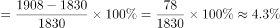，与D项最为接近。

故正确答案为D。

---

### 第 2 题　qid 2166030 · 增长

某地区城镇人口增长的幅度比乡村人口增长的幅度多几个百分点？

- **A**. 5.5　✅
- **B**. 5.3
- **C**. 4.6
- **D**. 3.1

**答案**：A

**官方解析**

由题干“······城镇人口增长的幅度比乡村人口增长的幅度多·····个百分点”，可判定本题为一般增长率计算问题。由上题可得某地区城镇人口增长的幅度为；定位统计表中第四行，已知2014年末乡村人口数为2426万人，2015年末乡村人口数为2398万人，根据公式可得某地区乡村人口增长的幅度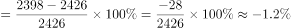；故某地区城镇人口增长的幅度比乡村人口增长的幅度多个百分点。

故正确答案为A。

---

### 第 3 题　qid 2166031 · 增长

从人口的年龄结构分析，出现负增长的有几个年龄段？

- **A**. 1个
- **B**. 2个　✅
- **C**. 3个
- **D**. 4个

**答案**：B

**官方解析**

定位统计表的年龄结构分析部分，0-15岁的2014年末比重（）2015年末比重（），16-25岁的2014年末比重（）2015年末比重（），其它年龄段都是正增长，故从人口的年龄结构分析出现负增长的有2个年龄段。

故正确答案为B。

备注：人口年龄结构指一定时点、一定地区各年龄组人口在全体人口中的比重，又称人口年龄构成。

---

### 第 4 题　qid 2166032 · 增长

根据人口年龄段的划分，哪一年龄段人口增长的幅度最大？

- **A**. 26-35岁
- **B**. 36-50岁
- **C**. 51-65岁　✅
- **D**. 66岁以上

**答案**：C

**官方解析**

由题干“哪一年龄段人口增长的幅度最大”，可判定此题为一般增长率比较问题。定位统计表的最后四行，根据公式：，可得26-35岁年龄段的人口增长率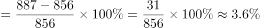；36-50岁年龄段的人口增长率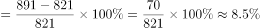；51-65岁年龄段的人口增长率；65岁以上年龄段的人口增长率。故51-65岁年龄段的人口增长的幅度最大。

故正确答案为C。

---

### 第 5 题　qid 2166033 · 增长

增长最快和最慢的两个年龄段的人口数占总人口的百分之多少？

- **A**. 
18

- **B**. 
25

- **C**. 
31
　✅
- **D**. 
34

**答案**：C

**官方解析**

根据题干“增长最快和最慢······”，可判定本题为一般增长率问题。定位统计表第二列和第四列数据，0-15岁年龄段的增长率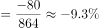，16-25岁年龄段的增长率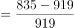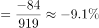，26-35岁年龄段的增长率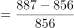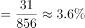，36-50岁年龄段的增长率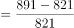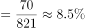，51-65岁年龄段的增长率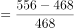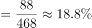，65岁以上年龄段的增长率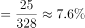。可得增长最快的年龄段是51-65岁，增长最慢的年龄段是0-15岁。定位统计表最后一列，可得0-15岁和51-65岁年龄段的人口数占总人口数的，与C选项最接近。

故正确答案为C。

---
