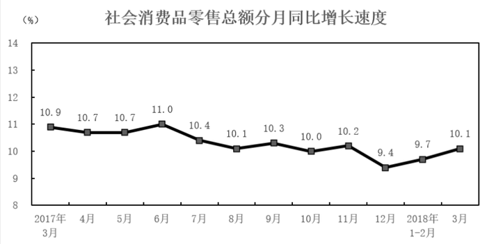
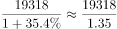
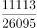

# 安徽省2019年面向全国重点高校定向招录选调生《行测》题（网友回忆版）

> 资料分析 · 5 题 · 安徽 2019

## 材料 1

        2018年第一季度，全国社会消费品零售总额90275亿元，同比增长9.8%。其中，3月份，社会消费品零售总额29194亿元，餐饮收入3099亿元，限额以上单位餐饮收入占餐饮总收入的23.2%；商品零售额26095亿元，限额以上单位商品零售总额11113亿元，同比增长8.9%。

        2018年1-3月份，全国网上零售额19318亿元，同比增长35.4%。其中，实物商品网上零售额14567亿元，增长34.4%，占社会消费品零售总额的比重为16.1%。在实物商品网上零售额中，吃、穿、用类商品分别增长46.5%、33.9%和33.3%。

### 第 1 题　qid 4743018 · 综合

2017年3月份全国社会消费品零售总额为（    ）亿元。

- **A**. 26324.62
- **B**. 26515.89　✅
- **C**. 26612.58
- **D**. 26685.56

**答案**：B

**官方解析**

根据题干“2017年3月份······总额······亿元”，结合材料时间为2018年3月份，可判定本题为基期计算问题。定位文字材料第一段及统计图可知，2018年3月份全国社会消费品零售总额29194亿元，同比增长速度为10.1%。根据公式：基期量，则2017年3月份全国社会消费品零售总额亿元，与B项最接近。

故正确答案为B。

---

### 第 2 题　qid 4743025 · 平均数

2017年第一季度，全国网上零售额平均每月（    ）亿元。

- **A**. 4755.79　✅
- **B**. 14267.356
- **C**. 6439.33
- **D**. 4855.67

**答案**：A

**官方解析**

根据题干“2017年第一季度······平均每月······亿元”，可判定本题为基期平均数问题。定位文字材料第二段可得：2018年1-3月份，全国网上零售额19318亿元，同比增长35.4%。根据公式：基期量，可求2017年第一季度全国网上零售额为亿元，平均每月亿元，与A项最接近。

故正确答案为A。

---

### 第 3 题　qid 4743029 · 比重

2018年第一季度，全国非实物的商品网上零售额占社会消费品零售总额的比重为（    ）。

- **A**. 16.1%
- **B**. 83.9%
- **C**. 5.26%　✅
- **D**. 24.59%

**答案**：C

**官方解析**

根据题干“2018年第一季度······占······的比重为”，可判定本题为现期比重问题。定位文字材料第一段和第二段可得：2018年第一季度，全国社会消费品零售总额90275亿元；全国网上零售额19318亿元，其中，实物商品网上零售额14567亿元。则2018年第一季度，全国非实物的商品网上零售额为19318-14567=4751亿元。根据比重公式：比重，则全国非实物的商品网上零售额占社会消费品零售总额的比重为，与C项最接近。

故正确答案为C。

---

### 第 4 题　qid 4743036 · 增长

相对于2016年3月，2018年3月的全国社会消费品零售总额增长：

- **A**. 10.1%
- **B**. 10.9%
- **C**. 22.1%　✅
- **D**. 20.7%

**答案**：C

**官方解析**

根据题干“相对于2016年3月，2018年3月的······增长”，结合选项为百分数，可判定本题为间隔增长率问题。定位图形材料可得：2017年3月全国社会消费品零售总额同比增长10.9%，2018年3月同比增长10.1%。根据间隔增长率公式：，则相对于2016年3月，2018年3月的全国社会消费品零售总额增长率为，与C项最接近。

故正确答案为C。

---

### 第 5 题　qid 4743044 · 综合

根据以上材料，可以判断（    ）。

- **A**. 2017年3月-2018年3月，我国社会消费品零售总额持续增加　✅
- **B**. 2017年3月-2018年3月，我国社会消费品零售总额增速持续下降
- **C**. 2018年第一季度我国实物商品网上零售额中，吃类商品占比最高
- **D**. 2018年3月份，限额以上单位商品零售额占商品零售总额的50%

**答案**：A

**官方解析**

A项：根据图形材料可得：2018年3月份社会消费品零售总额，以及2017年3月-2018年3月的每个月同比增速。但不知道每个月的环比增长情况，则无法判定我国社会消费品零售总额是否持续增加，错误；

B项：根据图形材料可得：2017年5月社会消费品零售总额同比增长10.7%，2017年6月社会消费品零售总额同比增长11.0%，前者低于后者，并非持续下降，错误；

C项：定位文字材料第二段可得：2018年1-3月份，实物商品网上零售额14567亿元。在实物商品网上零售额中，吃、穿、用类商品分别增长46.5%、33.9%和33.3%。仅给出吃类商品的同比增速，但无法计算其占比情况，则无法判断其是否最高，错误；

D项：定位文字材料第一段可得：（2018年）3月份······商品零售额26095亿元，限额以上单位商品零售总额11113亿元。根据比重公式：比重，可得限额以上单位商品零售额占商品零售总额的比重为，错误。

故本题无正确答案。

---
