# 安徽省2020年面向全国重点高校定向招录选调生《行测》题（网友回忆版）

> 资料分析 · 5 题 · 安徽 2020

## 材料 1

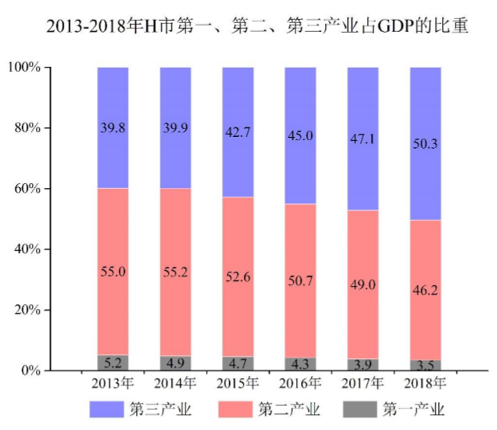

### 第 1 题　qid 2456402 · 增长

2018年H市第一、第二、第三产业产值增长幅度最大与最小的产业分别是：

- **A**. 第一产业，第三产业
- **B**. 第二产业，第一产业
- **C**. 第三产业，第二产业
- **D**. 第三产业，第一产业　✅

**答案**：D

**官方解析**

根据题干“2018年，……增长幅度最大与最小的产业分别是”，可判定本题为一般增长率的比较问题。定位第二个统计图可知，2018年第一、第二、第三产业占GDP的比重依次是、、，2017年第一、第二、第三产业占GDP的比重依次是、、。设2018年H市GDP为A，2017年H市GDP为B。结合公式：，，可得第一、第二、第三产业产值增长幅度如下：

第一产业：增长幅度；

第二产业：增长幅度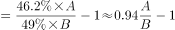；

第三产业：增长幅度；

比较可得，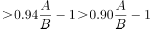，故增长幅度最大的是第三产业，最小的是第一产业。

故正确答案为D。

---

### 第 2 题　qid 2456405 · 增长

2015-2018年，H市GDP增长最快的年份是：

- **A**. 2015年
- **B**. 2016年
- **C**. 2017年
- **D**. 2018年　✅

**答案**：D

**官方解析**

根据题干“2015-2018年，······增长最快的年份是”，可判定本题为一般增长率的比较问题。定位第一个统计图可知，2014-2018年H市GDP依次为5180.56亿元、5660.27亿元、6274.38亿元、7003.05亿元、7822.91亿元。根据公式：可知，2015-2018年H市GDP的增长率如下：

2015年：增长率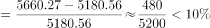；

2016年：增长率；

2017年：增长率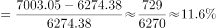；

2018年：增长率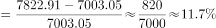。

则增长最快的年份是2018年。

故正确答案为D。

---

### 第 3 题　qid 2456407 · 增长

2018年H市第三产业产值增加值约为：

- **A**. 321亿元
- **B**. 475亿元
- **C**. 546亿元
- **D**. 637亿元　✅

**答案**：D

**官方解析**

根据题干“2018年H市第三产业产值的增加值约为”，可判定本题为增长量的计算问题。定位统计图可知，2017年、2018年H市GDP分别为7003.05亿元、7822.91亿元；2017年、2018年第三产业占GDP的比重分别为、。根据公式：；，所求亿元，与D项最接近。

故正确答案为D。

备注：本题问法不严谨，因为“增加值”在统计术语中指的就是产值，但本题题干已有“第三产业产值”，故推测这里的“增加值”指的是“增加额”，进而判断本题为增长量计算问题。

---

### 第 4 题　qid 2456411 · 增长

与2013年相比较，2018年H市第二产业产值大约增长：

- **A**. 

- **B**. 

　✅
- **C**. 

- **D**. 
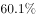

**答案**：B

**官方解析**

根据题干“与2013年相比较，2018年······大约增长”，结合选项为百分数，可判定本题为一般增长率的计算问题。定位统计图可知，2013年、2018年H市GDP分别为4684.00亿元、7822.91亿元；2013年、2018年第二产业占GDP的比重分别为、。根据公式：；，所求，与B项最接近。

故正确答案为B。

---

### 第 5 题　qid 2456417 · 综合

根据资料，下列判断正确的是：

- **A**. 
2013-2018年，H市生产总值年平均增长幅度超过
　✅
- **B**. 
2013-2018年，H市GDP增加值逐年增加

- **C**. 
2013-2018年，H市第一产业产值占GDP比重下降幅度呈上升趋势

- **D**. 
根据2013-2018年趋势，2019年H市第二产业产值占GDP比重将会下降

**答案**：A

**官方解析**

A项：定位第一个统计图可知，2013年、2018年H市GDP分别为4684.00亿元、7822.91亿元。代入年均增长率公式：，年份差，将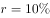代入原式，则有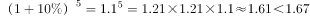，则说明年均增长率，正确；

B项：定位第一个统计图可知，2013-2018年H市GDP依次为4684.00亿元、5180.56亿元、5660.27亿元、6274.38亿元、7003.05亿元、7822.91亿元。2014年GDP的增长量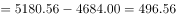亿元，2015年GDP的增长量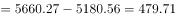亿元，并非上升，错误；（备注：根据38题可知，本篇资料中的“增加值”指的并非“产值”，而是“增加额”）

C项：定位第二个统计图可知，各年份第一产业占GDP的比重。可以计算出2014年较2013年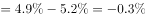；2018年较2017年。可以看出2013-2018年，H市第一产业产值占GDP比重下降幅度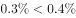呈上升趋势。正确；（备注：趋势是比较时间段的两端，这样本题就没有唯一正确答案了。）

D项：定位第二个统计图可知，第二产业占GDP的比重为先上升后下降的趋势，因此2019年H市第二产业占GDP的比重不一定会下降，错误。

故正确答案为A。

---
