# 广东省2019年选调优秀大学毕业生笔试 综合行政能力测验题（网友回忆版）

> 资料分析 · 15 题 · 广东 2019

## 材料 1

        2017年末，全国铁路营业里程达到12.7万公里，比上年增长，其中高铁营业里程2.5万公里。全国铁路路网密度132.2公里/万平方公里，比上年增加3.0公里/万平方公里。其中复线里程7.2万公里，复线率（铁路复线里程占铁路营业里程的比重），电气化里程8.7万公里，电化率（铁路电气化里程占铁路营业里程的比重）。西部地区铁路营业里程5.2万公里，比上年增长。

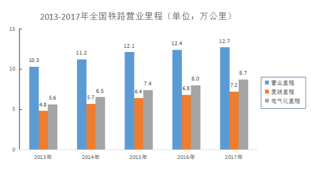

### 第 1 题　qid 2261967 · 综合

2016年末，我国铁路路网密度是（  ）公里/万平方公里。

- **A**. 126.2
- **B**. 129.2　✅
- **C**. 130.2
- **D**. 135.2

**答案**：B

**官方解析**

根据题干“2016年末我国铁路路网密度”，结合材料时间为2017年，可判定本题为基期计算问题。定位文字材料“2017年末，全国铁路路网密度132.2公里/万平方公里，比上年增加3.0公里/万平方公里”，根据公式：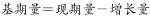，故2016年末我国铁路路网密度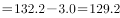公里/万平方公里。

故正确答案为B。

---

### 第 2 题　qid 2261968 · 增长

2017年，西部地区铁路营业里程比2016年增加约（  ）公里。

- **A**. 1661　✅
- **B**. 1761
- **C**. 1861
- **D**. 1961

**答案**：A

**官方解析**

根据题干“2017年······比2016年增加······公里”，可判定本题为增长量计算问题。定位文字材料“2017年末，西部地区铁路营业里程5.2万公里，比上年增长”，故2017年西部地区铁路营业里程同比增长量公里。

故正确答案为A。

---

### 第 3 题　qid 2261969 · 综合

2017年我国铁路复线率约比2016年（  ）。

- **A**. 提高4个百分点
- **B**. 降低4个百分点
- **C**. 提高2个百分点　✅
- **D**. 降低2个百分点

**答案**：C

**官方解析**

根据题干“2017年我国铁路复线率约比2016年”，结合选项为百分点，且材料给出复线率即为比重，可判定本题为两期比重问题。定位文字材料“2017年末，复线率（铁路复线里程占铁路营业里程的比重）”；定位图形材料可得：2016年，全国铁路复线里程6.8万公里，铁路营业里程12.4万公里，则2016年全国铁路复线率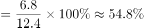。故2017年与2016年的比重差个百分点，与C项最接近。

故正确答案为C。

---

### 第 4 题　qid 2261975 · 增长

2014—2017年，我国电气化里程同比增速最快的是（  ）。

- **A**. 2014年　✅
- **B**. 2015年
- **C**. 2016年
- **D**. 2017年

**答案**：A

**官方解析**

根据题干“······同比增速最快的是”，可判定本题为一般增长率的比较问题。定位柱状图可知2014—2017年各年数据，根据公式：，可得：

A项，2014年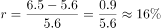；

B项，2015年；

C项，2016年；

D项，2017年。

所以我国电气化里程同比增速最快的是2014年，选A。

故正确答案为A。

---

### 第 5 题　qid 2261977 · 综合

以下说法不正确的是（  ）。

- **A**. 
2013年，我国铁路复线里程不到铁路营业里程一半

- **B**. 
2014—2017年，我国铁路电化率逐年增加 

- **C**. 
2017年，我国铁路营业里程比2013年约增加了

- **D**. 
2017年，我国高铁营业里程占全国铁路营业里程三成以上
　✅

**答案**：D

**官方解析**

A项，定位柱状图可知2013年我国铁路复线里程为4.8万公里，铁路营业里程为10.3万公里，则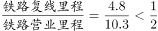，不到一半，正确；

B项，定位柱状图可知2014—2017年我国每一年的铁路电气化里程和铁路营业里程，可得2014年铁路电化率，2015年铁路电化率，2016年铁路电化率，2017年铁路电化率为，可见，我国铁路电化率逐年增加，正确；

C项，定位柱状图可知我国铁路营业里程2013年为10.3万公里，2017年为12.7万公里，根据增长率计算公式：，可得2017年我国铁路营业里程比2013年约增加了，正确；

D项，定位文字材料“2017年末，全国铁路营业里程达到12.7万公里，比上年增长，其中高铁营业里程2.5万公里”，可得，而非三成（）以上，错误。

本题为选非题，故正确答案为D。

---

## 材料 2

        对全国规模以上文化及相关产业5.9万家企业的调查显示，2018年上半年，上述企业实现营业收入42227亿元，比上年同期增长，继续保持较快增长。

        文化及相关产业9个行业的营业收入均实现增长。其中，新闻信息服务营业收入3744亿元，比上年同期增长；创意设计服务5143亿元，增长；内容创作生产8820亿元，增长；文化传播渠道4501亿元，增长；文化辅助生产和中介服务7783亿元，增长；文化消费终端生产7911亿元，增长；文化投资运营349亿元，增长；文化装备生产3313亿元，增长；文化休闲娱乐服务663亿元，增长。

        分区域看，东部地区规模以上文化及相关产业企业实现营业收入32443亿元；中部、西部和东北地区分别为5828亿元、3509亿元和447亿元。从增长速度看，西部地区比上年同期增长；东部地区增长；中部地区增长；东北地区增长，与上年同期下降相比，实现了正增长。

### 第 6 题　qid 2261934 · 综合

2016年上半年，东北地区规模以上文化及相关产业企业实现营业收入约（  ）亿元。

- **A**. 425.9
- **B**. 435.9
- **C**. 437.7
- **D**. 447.7　✅

**答案**：D

**官方解析**

根据题干“2016上半年，东北地区······实现营业收入”，结合材料时间为2018年，可判定本题为间隔基期计算问题。定位文字材料第三段可知，2018年东北地区实现营业收入为447亿元，增长，与上年同期下降相比，实现正增长，则2018年增长率，2017年增长率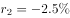，所以2018年较2016年的增长率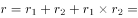，则2016年东北地区实现营业收入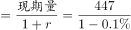，与D项最接近。

故正确答案为D。

---

### 第 7 题　qid 2261936 · 增长

2018年上半年，文化传播渠道营业收入比上年同期增加了约（  ）亿元。

- **A**. 410
- **B**. 409　✅
- **C**. 408
- **D**. 407

**答案**：B

**官方解析**

根据题干“······增加了（   ）亿元”，判定本题为增长量计算问题。定位文字材料第二段可得：2018年文化传播渠道4501亿元，增长。故2018年上半年，文化传播渠道营业收入比上年同比增量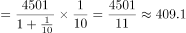，与B项最接近。

故正确答案为B。

---

### 第 8 题　qid 2261940 · 增长

与上年同期相比，2018年上半年我国规模以上文化及相关产业企业营业收入增速最快的是（  ）。

- **A**. 东部地区
- **B**. 中部地区
- **C**. 西部地区　✅
- **D**. 东北地区

**答案**：C

**官方解析**

定位文字材料第三段，可知西部地区比上年同期增长，东部地区增长，中部地区增长，东北地区增长，则西部地区增长最快。

故正确答案为C。

---

### 第 9 题　qid 2261943 · 综合

2017年上半年，我国文化及相关产业营业收入最高的行业是（  ）。

- **A**. 内容创作生产　✅
- **B**. 创意设计服务
- **C**. 文化休闲娱乐服务
- **D**. 文化消费终端生产

**答案**：A

**官方解析**

根据题干所求“2017年上半年······营业收入最高的行业是”，材料数据为2018年上半年，可判定此题为基期比较问题。定位文字材料第二段，“内容创作生产8820亿元，增长；创意设计服务5143亿元，增长；文化休闲娱乐服务663亿元，增长；文化消费终端生产7911亿元，增长”。代入公式：，则2017年上半年，营业收入分别为：

内容创作生产亿元；

创意设计服务亿元；

文化休闲娱乐服务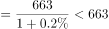亿元；

文化消费终端生产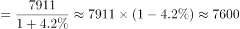亿元。

比较上述四个数字，营业收入最高的行业是内容创作生产。

故正确答案为A 。     

---

### 第 10 题　qid 2261945 · 综合

以下说法不正确的是（  ）。

- **A**. 2018年上半年，东部地区规模以上文化及相关文化产业企业营业收入总额超过中部、西部、东北地区的总和
- **B**. 2017年上半年，新闻信息服务营业收入占我国规模以上文化及相关产业总营业收入不到一成
- **C**. 2018年上半年，文化装备生产营业收入达到文化投资运营收入的10倍　✅
- **D**. 2017年上半年，东部地区规模以上文化及相关文化产业企业营业收入占全国比重七成以上

**答案**：C

**官方解析**

A项：定位文字材料第三段，“东部地区规模以上文化及相关产业企业实现营业收入32443亿元；中部、西部和东北地区分别为5828亿元、3509亿元和447亿元”。5828+3509+447=9784，32443＞9784，故东部地区营业收入超过中、西、东北地区之和，正确；

B项：定位文字材料第一段和第二段，“2018年上半年，上述企业实现营业收入42227亿元，比上年同期增长 ”“新闻信息服务营业收3744亿元，比上年同期增长”。根据基期比重公式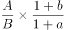，2017年上半年新闻信息服务营业收入占我国规模以上文化及相关产业总营业收入的比重为：，故不到一成，正确；

 C项：定位文字材料第二段，“文化投资运营349亿元，增长；文化装备生产3313亿元，增长”。2018年上半年，文化装备生产营业收入是文化投资运营收入的：，不到10倍，错误；

D项：定位文字材料第一段和第三段，“2018年上半年，上述企业实现营业收入42227亿元，比上年同期增长”，“东部地区规模以上文化及相关产业企业实现营业收入32443亿元······东部地区增长”。根据基期比重公式：，可得2017年上半年，东部地区规模以上文化及相关文化产业企业营业收入占全国比重为，在七成以上，正确。

本题为选非题，故正确答案为C。     

---

## 材料 3

### 第 11 题　qid 2261959 · 增长

与2012年相比，2013年下列社会服务机构中单位数增加最多的是（  ）。

- **A**. 社会福利院
- **B**. 儿童福利机构
- **C**. 老龄机构
- **D**. 基金会　✅

**答案**：D

**官方解析**

根据题干“······增加最多的是”，可判定本题为增长量比较问题。定位第一个表格第4列和第5列，。故社会福利院单位数的增长量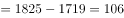，儿童福利机构单位数的增长量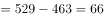，老龄机构单位数的增长量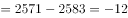，基金会单位数的增长量，故与2012年相比，2013年增加最多的为基金会。

故正确答案为D。

---

### 第 12 题　qid 2261961 · 增长

2015年，社会服务机构单位数比2011年增加约（  ）万个。

- **A**. 46
- **B**. 47　✅
- **C**. 48
- **D**. 49

**答案**：B

**官方解析**

根据题干“······比······增加······万个”，可判定本题为增长量计算问题。定位第一个表格可得：2015年社会服务机构单位数1765004，2011年社会服务机构单位数1293986，故社会服务机构单位数万。

故正确答案为B。

---

### 第 13 题　qid 2261963 · 比重

2012—2015年，老龄机构单位数占社会服务机构单位数的比重最大的是（  ）。

- **A**. 2012年　✅
- **B**. 2013年
- **C**. 2014年
- **D**. 2015年

**答案**：A

**官方解析**

根据题干“······占······的比重最大的是······”，可判定本题为现期比重比较问题。定位第一个表格可得：2012年-2015年老龄机构单位数占社会服务机构单位数的比重分别为：2012年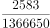，2013年，2014年，2015年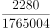。观察可知：2012年比重分子最大，分母最小，故2012年比重最大。

故正确答案为A。

---

### 第 14 题　qid 2261965 · 增长

2012—2015年，社区服务中心数量同比增加最多的年份是（  ）。

- **A**. 2012年
- **B**. 2013年
- **C**. 2014年　✅
- **D**. 2015年

**答案**：C

**官方解析**

根据题干“······同比增长最多的年份”，可判定本题为增长量比较问题，定位材料第二个表格中：社区服务中心数同比增量分别为2012年: 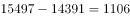个、2013年：个、2014年：个、2015年：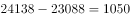个。因此增加最多的年份为2014年。

故正确答案为C。

---

### 第 15 题　qid 2261966 · 综合

以下说法不正确的是（  ）。

- **A**. 2015年，社会福利企业单位数较2014年有所减少
- **B**. 2011—2014年，社会福利医院单位数变化不大
- **C**. 2015年，社区服务机构数、社区服务站数较2013年均有所增加
- **D**. 2011—2015年，每年的社区服务机构覆盖率逐年提高　✅

**答案**：D

**官方解析**

A 项：定位材料第一个表格中，社会福利企业单位数2015年 14585个，2014年 16389个，2015年较2014年有所减少，正确；

B项：定位材料第一个表格中，社会福利医院单位数2011-2014年分别为：155个，156个，155个，156个，数量变化不大，正确；

C项：定位材料第二个表格中，社会服务机构数 2015年360956个,2013年 251939个；社区服务站数 2015年 128083个，2013年 108377个，两者均增加，正确；

D项：定位材料第二个表格中，社区服务机构覆盖率2011年，2012年，覆盖率下降，错误。

本题为选非题，故正确答案为D。

---
