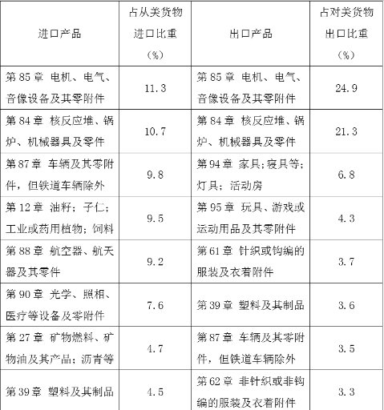
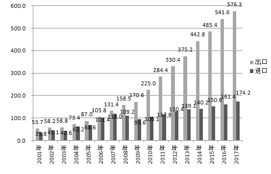
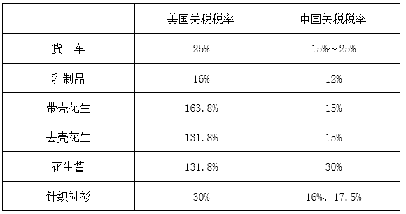

# 广西2019年定向招录选调生笔试

> 资料分析 · 6 题 · 广西 2019

## 材料 1

请阅读以下资料，回答第46至50题。

资料1：2017年中国对美国主要进、出口商品（HS2位码）

资料2：美国对中国服务贸易进出口（亿美元）

资料3：中国对美国支付知识产权使用费（亿美元）

资料4：2017年中美部分关税税率对比

### 第 1 题　qid 2271382 · 比重

2017年中国向美国出口的前三大类商品合计占比为（  ）。

- **A**. 

- **B**. 

- **C**. 

　✅
- **D**. 

**答案**：C

**官方解析**

定位资料1可得，2017年中国向美国出口的前三大类商品为第85章（）、第84章（）、第94章（），合计占比。

故正确答案为C。

---

### 第 2 题　qid 2271389 · 综合

不能从上述资料中推出的结论是（  ）。

- **A**. 中美双边服务贸易快速增长
- **B**. 美国关税比中国关税低　✅
- **C**. 中国对美国服务贸易逆差不断扩大
- **D**. 中国对美国支付知识产权使用费总体呈增长态势

**答案**：B

**官方解析**

A项：定位资料2可得，美国对中国服务贸易进出口总额快速增长，即中美双边服务贸易快速增长，正确；
B项：定位资料4，给出2017年中美部分关税的税率对比，表中给出的部分产品美国关税比中国关税高或者相等，错误；
C项：定位资料2可得，中国对美国服务贸易逆差即美国对中国服务贸易顺差（出口减进口），其数值不断扩大，正确；
D项：定位资料3可得，中国对美国支付知识产权使用费虽然个别年份有所下降，但总体呈增长态势，正确。
本题为选非题，故正确答案为B。
备注：本题C选项出题人表述不严谨，确实每年美国对中国服务贸易顺差不是一直扩大，但是呈扩大趋势，而B的错误更明显，所以选择B项。

---

### 第 3 题　qid 2271285 · 综合

为了彰显“三农”工作的重要地位，提升亿万农民的获得感、幸福感、光荣感，传承弘扬中华农耕文明和优秀文化传统，凝聚推动乡村振兴战略实施的强大力量，我国自2018年起将每年农历（  ）设立为“中国农民丰收节”，这是第一个在国家层面为农民设立的节日。

- **A**. 谷雨
- **B**. 芒种
- **C**. 立秋
- **D**. 秋分　✅

**答案**：D

**官方解析**

本题考查政治常识。2018年6月21日，《国务院关于同意设立“中国农民丰收节”的批复（国函〔2018〕80号）》发布，同意自2018年起将每年农历秋分设立为“中国农民丰收节”，是第一个在国家层面为农民设立的节日。
故正确答案为D。

---

### 第 4 题　qid 2271286 · 综合

继2008年成功举办第29届夏季奥运会之后，我国又将于2022年在北京和张家口举办（  ），在占世界五分之一的人口中更好地传播奥林匹克团结、友谊、和平的宗旨和理念，将为健康中国、国际奥林匹克运动做出新贡献。

- **A**. 第22届足球世界杯
- **B**. 第32届夏季奥运会
- **C**. 第4届夏季青奥会
- **D**. 第24届冬季奥运会　✅

**答案**：D

**官方解析**

本题考查政治常识。
A项错误，第22届世界杯足球赛将于2022年11月21日至12月18日在卡塔尔举行，也是世界杯首次在中东国家举行。
B项错误，第32届夏季奥林匹克运动会，将于2020年在东京举行。
C项错误，2018年10月国际奥委会在布宜诺斯艾利斯举行的会议上宣布：塞内加尔正式获得2022年第4届夏季青年奥运会的举办权。
D项正确，第24届冬季奥林匹克运动会，即2022年北京冬奥会，将于2022年2月4日—2月20日在中华人民共和国北京市和张家口市联合举行。这是中国历史上第一次举办冬季奥运会。
故正确答案为D。

---

### 第 5 题　qid 2271287 · 综合

2018年11月7-9日，以“创造互信共治的数字世界一一携手共建网络空间命运共同体”为主题的第五届世界互联网大会在（  ）召开。

- **A**. 博鳌
- **B**. 杭州
- **C**. 南宁
- **D**. 乌镇　✅

**答案**：D

**官方解析**

本题考查政治常识。11月7日至9日，以“创造互信共治的数字世界—携手共建网络空间命运共同体”为主题的第五届世界互联网大会在浙江乌镇举行。来自世界各地的宾客将再次聚首，“水乡论剑”，共商“网”事。
故正确答案为D。

---

### 第 6 题　qid 2271350 · 综合

“太快了，完全没有想到！收到包裹时我还在‘买买买’。”2018年的“双11”，西部某市的刘女士仅仅等待33分15秒就收到了自己网购的海淘商品。
下列观点与这段话无关的是（  ）。

- **A**. 跨境物流体系日臻完善
- **B**. 快递企业国际化布局的人才储备不足　✅
- **C**. “跨境”之争成为快递企业的新“战场”
- **D**. 每年“双11”最大的考验都在末端派送

**答案**：B

**官方解析**

根据提问方式可知，本题为细节判断题，将选项信息和原文信息进行对比即可。
A项，根据文段刘女士网购的便捷事例，可以推出“跨境物流体系日臻完善”，排除。
B项，“人才储备不足”，文段没有具体体现，当选。
C项，根据刘女士网上海淘商品的快速便捷之事，可以看出快递企业对于跨境贸易的争夺愈加激烈，所以可以推出“跨境”之争成为快递企业的新“战场”，排除。
D项，根据网购情况，“双11”购物数量最多，所以与最大的考验都在末端派送有关，排除。
本题为选非题，故正确答案为B。
【出处】《“聪明”快递 助推经济加速跑》

---
