# 江西省2018年市县两级法院、检察院统一考录公务员笔试《行测》题（网友回忆版）

> 资料分析 · 15 题 · 江西 2018

## 材料 1

一、根据以下资料，回答106-110题。

        9月份，全国一般公共预算收入12963亿元，同比增长。其中，中央一般公共预算收入5919亿元，同比增长；地方一般公共预算本级收入7044亿元，同比增长。全国一般公共预算收入中的税收收入10269亿元，同比增长；非税收入2694亿元，同比下降。

        1-9月累计，全国一般公共预算收入145831亿元，同比增长。其中，中央一般公共预算收入69582亿元，同比增长；地方一般公共预算本级收入76249亿元，同比增长。全国一般公共预算收入中的税收收入127486亿元，同比增长；非税收入18345亿元，同比下降。

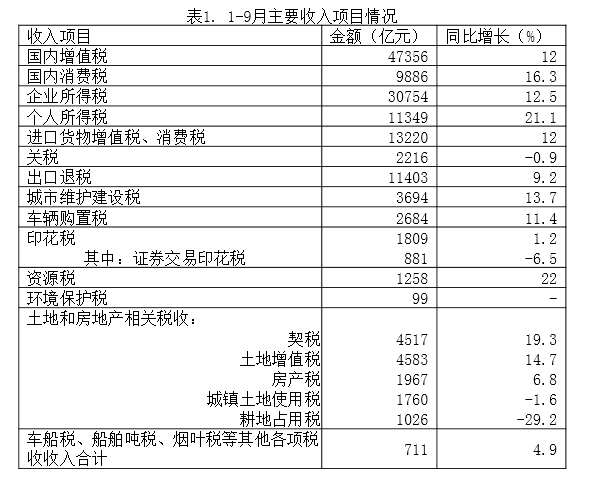

        9月份，全国一般公共预算支出22616亿元，同比增长，其中，中央一般公共预算本级支出2533亿元，同比增长；地方一般公共预算支出20083亿元，同比增长。

        1-9月累计，全国一般公共预算支出163289亿元，同比增长，为年初预算的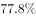，比序时进度快2.8个百分点。其中，中央一般公共预算本级支出22959亿元，同比增长；地方一般公共预算支出140330亿元，同比增长。

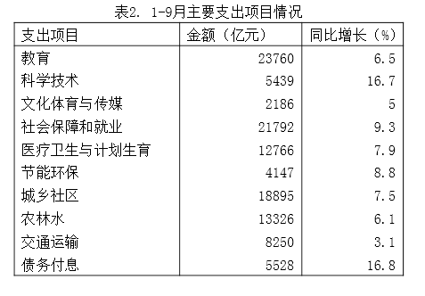

### 第 1 题　qid 2256372 · 综合

1-9月累计，契税占土地和房地产相关税收约为（    ）。

- **A**. 

- **B**. 

- **C**. 

　✅
- **D**. 

**答案**：C

**官方解析**

由题干“1-9月累计，······占······约为”，结合选项为百分数，可判定本题为现期比重问题。定位材料表格一可得：契税收入金额为4517亿元，土地和房地产相关税收金额为亿元，故比重为，C项最接近。

故正确答案为C。

---

### 第 2 题　qid 2256380 · 综合

1-9月累计，教育支出占全国一般公共预算支出约为（    ）。

- **A**. 

　✅
- **B**. 

- **C**. 

- **D**. 

**答案**：A

**官方解析**

由题干“1-9月累计，······占······约为”，结合选项为百分数，可判定本题为现期比重问题。定位材料表格二可得：教育支出金额为23760亿元，定位文字材料第四段可得：全国一般公共预算支出163289亿元，故比重为，A项最接近。

故正确答案为A。

---

### 第 3 题　qid 2256382 · 增长

1-9月主要收入项目中，同比增长率最大的是（    ）。

- **A**. 耕地占用税
- **B**. 个人所得税
- **C**. 国内增值税
- **D**. 资源税　✅

**答案**：D

**官方解析**

定位材料表格一可得：耕地占用税增长率为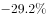，个人所得税增长率为，国内增值税增长率为，资源税增长率为，故增长率最大的为资源税。

故正确答案为D。

---

### 第 4 题　qid 2256386 · 综合

9月份，全国一般公共预算支出比收入多（    ）。

- **A**. 17458亿元
- **B**. 9653亿元　✅
- **C**. 5919亿元
- **D**. 2646亿元

**答案**：B

**官方解析**

定位文字材料第一段可得：9月份，全国一般公共预算收入为12963亿元。定位文字材料第三段可得：9月份，全国一般公共预算支出为22616亿元。故9月份，全国一般公共预算支出比收入多亿元。

故正确答案为B。

---

### 第 5 题　qid 2256390 · 综合

以下说法中，错误的是（    ）。

- **A**. 
1-9月累计，“国内增值税”与“企业所得税”之和超过全国一般公共预算收入的一半

- **B**. 
1-9月累计，“教育”与“社会保障和就业”两项支出之和超过全国一般公共预算支出的四分之一

- **C**. 
1-9月累计，税收收入约占全国一般公共预算收入的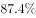

- **D**. 
1-9月累计，烟叶税收入约占全国一般公共预算收入的
　✅

**答案**：D

**官方解析**

A项，定位材料表格一可得：1-9月累计，国内增值税为47356亿元，企业所得税为30754亿元。定位文字材料第二段可得：1-9月，全国一般公共预算收入为145831亿元。，正确；

B项，定位材料表格二可得：1-9月累计，教育支出为23760亿元，社会保障和就业支出为21792亿元。定位文字材料第四段可得：1-9月，全国一般公共预算支出为163289亿元。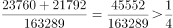，正确；

C项，定位文字材料第二段可得：1-9月累计，税收收入为127486亿元，全国一般公共预算收入为145831亿元。故占比为，正确；

D项，材料中只给出车船税、船舶吨税、烟叶税等其他各项税收收入合计值，并未单独给出烟叶税的相关数值，故无法得知，错误。

本题为选非题，故正确答案为D。

---

## 材料 2

        2018年前三季度，全国居民人均消费支出14281元，比上年同期名义增长，扣除价格因素，实际增长。其中，城镇居民人均消费支出19014元，增长，扣除价格因素，实际增长；农村居民人均消费支出8538元，增长，扣除价格因素，实际增长。

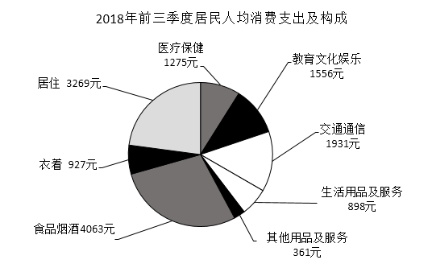

### 第 6 题　qid 2256374 · 平均数

2018年前三季度，农村居民人均消费支出是全国居民人均消费支出的（  ）。

- **A**. 

　✅
- **B**. 

- **C**. 

- **D**. 
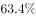

**答案**：A

**官方解析**

根据题干“2018年前三季度，农村······是全国的······”，结合选项为百分号、材料中给出2018年前三季度数据，可判定本题为现期比重问题。定位文字材料可得：2018年前三季度，全国居民人均消费支出14281元，农村居民人均消费支出8538元。故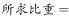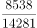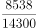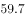与A项最接近。

故正确答案为A。

---

### 第 7 题　qid 2256384 · 平均数

2018年前三季度，全国居民人均消费支出中所占比例最大的是（  ）。

- **A**. 居住
- **B**. 医疗保健
- **C**. 食品烟酒　✅
- **D**. 教育文化娱乐

**答案**：C

**官方解析**

根据题干“2018年前三季度，······所占比例最大的”，结合材料中给出2018年前三季度数据，可判定本题为现期比重比较问题。根据，当整体相同时，只需比较部分的大小即可。定位饼状图可得：居住、医疗保健、食品烟酒、教育文化娱乐的人均消费支出分别为3269元、1275元、4063元、1556元。故所占比重最大的是食品烟酒。

故正确答案为C。

---

### 第 8 题　qid 2256388 · 平均数

2018年前三季度，全国居民人均消费支出中居住消费所占的比例约为（    ）。

- **A**. 

- **B**. 

　✅
- **C**. 

- **D**. 

**答案**：B

**官方解析**

根据题干“2018年前三季度······全国居民人均消费支出中······所占的比例”，结合材料中给出2018年前三季度数据，可判定本题为现期比重问题。定位文字材料可得：2018年前三季度，全国居民人均消费支出14281元。定位饼状图可得，居住消费支出为3269元。根据，故与B项最接近。

故正确答案为B。

---

### 第 9 题　qid 2256392 · 平均数

2017年前三季度，全国居民人均消费支出（  ）。

- **A**. 13162元　✅
- **B**. 13067元
- **C**. 13434元
- **D**. 13381元

**答案**：A

**官方解析**

根据题干“2017年前三季度，全国居民人均消费支出”，结合材料时间为2018年前三季度，可判定本题为基期计算问题。定位文字材料可得：2018年前三季度，全国居民人均消费支出14281元，比上年同期名义增长。根据，故2017年前三季度，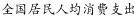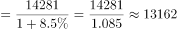。

故正确答案为A。

---

### 第 10 题　qid 2256398 · 增长

2018年前三季度，消费价格指数（CPI）增长了（  ）

- **A**. 

- **B**. 

- **C**. 

- **D**. 

　✅

**答案**：D

**官方解析**

根据题干“2018年前三季度，消费价格指数（CPI）增长了”，结合选项为百分数，可知本题为一般增长率计算问题。定位文字材料可得“2018年前三季度，全国居民人均消费支出14281元，比上年同期名义增长，扣除价格因素，实际增长”，根据公式，可知：，可知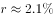，与D项最接近。

故正确答案为D。

注：名义增长率、实际增长率和CPI增长率三者之间的实际计算公式为：，但也可以用“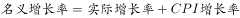”进行表述，由于三个增长率数值都比较小，用两个公式计算出来的结果很接近，因此在本题中也可以用“”，则CPI增长率为。

---

## 材料 3

        2018年9月份，规模以上工业增加值同比实际增长（以下增加值增速均为扣除价格因素的实际增长率），比8月份回落0.3个百分点。从环比看，9月份，规模以上工业增加值比上月增长。1-9月份，规模以上工业增加值同比增长，增速较1-8月份回落0.1个百分点。

        分三大门类看，9月份，采矿业增加值同比增长，增速较8月份加快0.2个百分点；制造业增长，回落0.4个百分点；电力、热力、燃气及水生产和供应业增长，加快1.1个百分点。

        分经济类型看，9月份，国有控股企业增加值同比增长；集体企业增长，股份制企业增长，外商及港澳台商投资企业增长3.2%。

        分行业看，9月份，41个大类行业中有38个行业增加值保持同比增长。其中，农副食品加工业增长，纺织业增长，化学原料和化学制品制造业增长，非金属矿物制品业增长，黑色金属冶炼和压延加工业增长，有色金属冶炼和压延加工业增长，通用设备制造业增长，专用设备制造业增长，汽车制造业增长，铁路、船舶、航空航天和其他运输设备制造业增长，电气机械和器材制造业增长，计算机、通信和其他电子设备制造业增长，电力、热力生产和供应业增长。

        分地区看，9月份，东部地区增加值同比增长，中部地区增长，西部地区增长，东北地区增长。

        分产品看，9月份，596种产品中有324种产品同比增长。其中，钢材9675万吨，同比增长；水泥20781万吨，增长；十种有色金属456万吨，增长；乙烯161万吨，增长；汽车242.6万辆，下降；轿车102.8万辆，下降；发电量5483亿千瓦时，增长；原油加工量5134万吨，增长。

        9月份，工业企业产品销售率为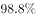，比上年同月下降0.4个百分点。工业企业实现出口交货值11839亿元，同比增长。

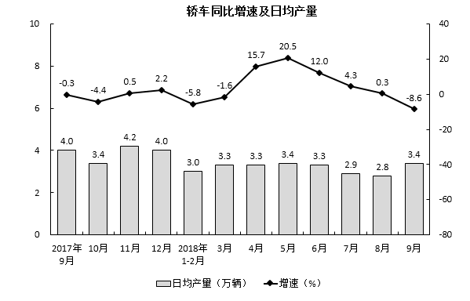

### 第 11 题　qid 2256426 · 综合

2017年9月至2018年9月，发电量最多的月份是（    ）。

- **A**. 2017年12月
- **B**. 2018年1月
- **C**. 2018年7月
- **D**. 2018年8月　✅

**答案**：D

**官方解析**

定位第三个图形材料可知，对于发电量而言，2018年8月日均产量最高，且8月有31天，故2018年8月是发电量最多的月份。
故正确答案为D。

---

### 第 12 题　qid 2256430 · 增长

2018年9月水泥产量比2017年同期增加约（    ）。

- **A**. 990万吨　✅
- **B**. 1039万吨
- **C**. 864万吨
- **D**. 948万吨

**答案**：A

**官方解析**

根据题干“2018年9月水泥产量比2017年同期增加······”，结合选项带单位，可判断此题为增长量计算问题。定位文字材料第六段，“9月份······水泥20781万吨，增长”，可得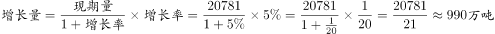，A项当选。

故正确答案为A。

---

### 第 13 题　qid 2256433 · 综合

2017年9月至2018年9月，轿车产量超过百万辆的月份有几个？

- **A**. 7个　✅
- **B**. 6个
- **C**. 5个
- **D**. 3个

**答案**：A

**官方解析**

根据题干“2017年9月至2018年9月，轿车产量超过百万辆的月份有几个”，定位第一个柱状图，材料数据为轿车各月份的日均产量，可判断本题为现期平均数问题。

解法1：各月轿车产量如下：

2017年9月，；2017年10月，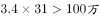；2017年11月，；2017年12月，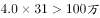；2018年1月，；2018年2月，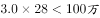；2018年3月，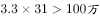；2018年4月，；2018年5月，；2018年6月，；2018年7月，；2018年8月，；2018年9月，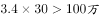。

可知，产量超过百万的月份有7个。

解法2：要满足每月产量超过百万，对于31天的月份而言，需日均产量超过，结合材料，可知2017年10月和12月，2018年3月和5月，共4个月份满足；同理，对于30天的月份而言，需日均产量超过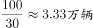，结合材料数据，可知2017年9月和11月，2018年9月，共3个月份满足；2018年2月有28天，日均产量需超过万辆，不满足。因此只有个月份满足。

故正确答案为A。

---

### 第 14 题　qid 2256436 · 增长

9月份，下列经济类型按照增加值同比增长率由高到低排列正确的是（  ）

- **A**. 国有控股企业——集体企业——股份制企业——外商港澳台投资企业
- **B**. 股份制企业——集体企业——国有控股企业——外商港澳台投资企业
- **C**. 股份制企业——国有控股企业——外商港澳台投资企业——集体企业　✅
- **D**. 集体企业——外商港澳台投资企业——国有控股企业——股份制企业

**答案**：C

**官方解析**

定位文字材料第三段，“分经济类型看，9月份，国有控股企业增加值同比增长；集体企业增长，股份制企业增长，外商及港澳台商投资企业增长”，可知经济类型按照增加值同比增长率由高到低排列为股份制企业——国有控股企业——外商港澳台投资企业——集体企业。

故正确答案为C。

---

### 第 15 题　qid 2256437 · 综合

以下说法中，错误的是（    ）。

- **A**. 
2018年8月，规模以上工业增加值同比实际增长

- **B**. 
2017年9月工业企业产品销售率为

- **C**. 
2017年9月至2018年9月规模以上工业增加值月同比增长速度都超过
　✅
- **D**. 
2018年9月轿车产量超过了8月轿车产量

**答案**：C

**官方解析**

A项：定位文字材料第一段，“2018年9月份，规模以上工业增加值同比实际增长，比8月份回落0.3个百分点”，可得2018年8月，规模以上工业增加值同比实际增长，正确；

B项：定位文字材料最后一段，“（2018年）9月份，工业企业产品销售率为，比上年同月下降0.4个百分点”，可得2017年9月工业企业产品销售率为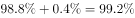，正确；

C项：定位第一个图形材料，可知2018年3月、6月、7月和9月规模以上工业增加值月同比增长速度分别为、、和，均未超过，错误；

D项：定位第二个图形材料，可得2018年9月轿车产量为，8月轿车产量为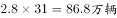，前者大于后者，正确。

本题为选非题，故正确答案为C。 

---
