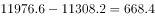

# 河北省2019年度定向招录选调生考试《基本素质和能力测试》题

> 资料分析 · 9 题 · 河北 2019

## 第 1 题　qid 2343358 · 综合

2018年12月25日，经党中央同意，国务院批复《河北雄安新区总体规划（2018—2035年）》，进一步明确了雄安新区规划建设目标、城乡空间布局、生态保护与环境治理等方面内容。规划建设雄安新区的意义包括<u>                </u>。

①有效缓解北京大城市病  ②促进北京市区三大产业均衡发展  ③有利于提升河北经济社会发展质量和水平  ④有利于调整优化京津冀城市布局和空间结构

- **A**. ①②③
- **B**. ①②④
- **C**. ①③④　✅
- **D**. ②③④

**答案**：C

**官方解析**

本题考查政治常识。
《河北雄安新区规划纲要》明确指出：“雄安新区作为北京非首都功能疏解集中承载地，与北京城市副中心形成北京发展新的两翼，共同承担起解决北京‘大城市病’的历史重任，有利于探索人口经济密集地区优化开发新模式；培育建设现代化经济体系的新引擎，与以2022年北京冬奥会和冬残奥会为契机推进张北地区建设形成河北两翼，补齐区域发展短板，提升区域经济社会发展质量和水平，有利于形成新的区域增长极；建设高水平社会主义现代化城市，有利于调整优化京津冀城市布局和空间结构，加快构建京津冀世界级城市群；创造‘雄安质量’，有利于推动雄安新区实现更高水平、更有效率、更加公平、更可持续发展，打造贯彻落实新发展理念的创新发展示范区，成为新时代高质量发展的全国样板。”可知①③④项符合建设雄安新区的意义。而②项所述内容在文件中没有得到体现，同时我们也知道北京市区不宜发展第一产业等耗地耗资源较大的产业。
故正确答案为C。

---

## 第 2 题　qid 2343374 · 增长

2019年2月11日新华社消息，2019年春节假期，全国旅游接待总人数4.15亿人次，同比增长，实现旅游收入5139亿元，同比增长；全国边检机关共查验出入境人员1253.3万人次，同比增长。2018年春节假期旅游收入多少亿元？

- **A**. 4532亿元
- **B**. 4625亿元
- **C**. 4749亿元　✅
- **D**. 4811亿元

**答案**：C

**官方解析**

根据“2018年春节假期旅游收入”，问题年份为材料年份的上一年，可判定本题为基期计算问题。定位材料文字部分，2019年春节假期实现旅游收入5139亿元，同比增长。根据公式，亿元，C项最为接近。

故正确答案为C。

---

## 第 3 题　qid 2343379 · 综合

经党中央批准、国务院批复，自2018年起我国将每年农历        设立为“中国农民丰收节”。

- **A**. 夏至
- **B**. 立秋
- **C**. 秋分　✅
- **D**. 中秋

**答案**：C

**官方解析**

本题考查政治常识。
经党中央批准、国务院批复，自2018年起我国将每年农历秋分设立为“中国农民丰收节”。“中国农民丰收节”是第一个在国家层面为农民设立的节日。设立这一节日将进一步强化“三农”工作在党和国家工作中的重中之重地位，营造重农强农的浓厚氛围，凝聚爱农支农的强大力量，推动乡村振兴战略实施，促进农业农村加快发展。
故正确答案为C。

---

## 第 4 题　qid 2343395 · 综合

2018年12月修订的《中华人民共和国公务员法》规定，公务员的考核应当接照管理权限，全面考核公务员的德、能、勤、绩、廉，重点考核                。考核分为平时考核、专项考核和定期考核等方式。定期考核以平时考核、专项考核为基础。

- **A**. 政治素质和工作能力
- **B**. 工作能力和工作态度
- **C**. 工作态度和工作实绩
- **D**. 政治素质和工作实绩　✅

**答案**：D

**官方解析**

本题考查法律常识。
2018年12月修订的《中华人民共和国公务员法》第三十五条规定：“公务员的考核应当按照管理权限，全面考核公务员的德、能、勤、绩、廉，重点考核政治素质和工作实绩。考核指标根据不同职位类别、不同层级机关分别设置。”
故正确答案为D。

---

## 第 5 题　qid 2343422 · 增长

2018年10月，我国个税起征点提高到5000元以后，第二波红利又接踵而至。12月13日，国务院印发《个人所得税专项附加扣除暂行办法》，自2019年1月1日起，实施子女教育、大病医疗、赡养老人等        专项附加扣除。

- **A**. 3项
- **B**. 4项
- **C**. 5项
- **D**. 6项　✅

**答案**：D

**官方解析**

本题考查政治常识。
《个人所得税专项附加扣除暂行办法》指出，个人所得税专项附加扣除，是指个人所得税法规定的子女教育、继续教育、大病医疗、住房贷款利息或者住房租金、赡养老人等6项专项附加扣除。《个人所得税专项附加扣除暂行办法》明确了专项附加扣除的原则和6项专项附加扣除的扣除范围、扣除标准、扣除方式，以及保障措施等内容。
故正确答案为D。

---

## 第 6 题　qid 2343426 · 综合

根据党的十九届三中全会审议通过的《深化党和国家机构改革方案》，2018年3月22日国务院公布了国务院机构设置和部委管理的国家局设置。改革后的国务院直属机构不包括：

- **A**. 中华人民共和国海关总署
- **B**. 国家医疗保障局
- **C**. 国家工商总局　✅
- **D**. 国家税务总局

**答案**：C

**官方解析**

本题考查政治常识。
A项正确，中国海关总署是中华人民共和国国务院下属的正部级直属机构，统一管理全国海关。《深化党和国家机构改革方案》指出：“将国家质量监督检验检疫总局的出入境检验检疫管理职责和队伍划入海关总署。”
B项正确，《深化党和国家机构改革方案》第三十九条提出：“将人力资源和社会保障部的城镇职工和城镇居民基本医疗保险、生育保险职责，国家卫生和计划生育委员会的新型农村合作医疗职责，国家发展和改革委员会的药品和医疗服务价格管理职责，民政部的医疗救助职责整合，组建国家医疗保障局，作为国务院直属机构。”
C项错误，《深化党和国家机构改革方案》第三十四条提出：“将国家工商行政管理总局的职责，国家质量监督检验检疫总局的职责，国家食品药品监督管理总局的职责，国家发展和改革委员会的价格监督检查与反垄断执法职责，商务部的经营者集中反垄断执法以及国务院反垄断委员会办公室等职责整合，组建国家市场监督管理总局，作为国务院直属机构。”即不再保留国家工商行政管理总局、国家质量监督检验检疫总局、国家食品药品监督管理总局。
D项正确，国家税务总局，是国务院主管税收工作的正部级直属机构。《深化党和国家机构改革方案》指出：“国税地税机构合并后，实行以国家税务总局为主与省（自治区、直辖市）政府双重领导管理体制。”
本题为选非题，故正确答案为C。

---

## 第 7 题　qid 2343453 · 增长

2018年，河北省经济运行总体平稳、稳中向好、稳中提质。前三季度，河北省生产总值25226.3亿元，同比增长。其中，第一产业增加值1941.5亿元，增长；第二产业增加值11308.2亿元，增长；第三产业增加值11976.6亿元，增长。2018年前三季度，河北省第三产业增加值超过工业增加值多少亿元？

- **A**. 668.4亿元　✅
- **B**. 697.5亿元
- **C**. 715.6亿元
- **D**. 734.7亿元

**答案**：A

**官方解析**

定位材料文字部分：2018年前三季度，河北省第二产业（即工业）增加值11308.2亿元，第三产业增加值11976.6亿元，第三产业增加值超过工业增加值：亿元。

故正确答案为A。

---

## 第 8 题　qid 2343466 · 综合

2019年1月11日，北京市级行政中心正式迁入北京城市副中心。中共北京市委、北京市人大常委会、北京市人民政府、北京市政协自即日起正式在新址办公。北京市级行政中心新址位于              。

- **A**. 大兴区
- **B**. 顺义区
- **C**. 通州区　✅
- **D**. 昌平区

**答案**：C

**官方解析**

本题考查政治常识。2019年1月11日，北京市级行政中心正式迁入北京城市副中心。中国共产党北京市委员会、北京市人大常委会、北京市人民政府、北京市政协分别举行揭牌仪式。北京市级行政中心新址位于通州区潞城镇北运河北岸，市委、市人大常委会、市政协办公区在北、东、西三面呈品字形排列，市政府办公区位于市委办公区北侧。
故正确答案为C。

---

## 第 9 题　qid 2343475 · 综合

2019年1月3日上午10时26分，                探测器成功在月球背面着陆，此次任务实现了人类探测器首次月背软着陆、首次月背与地球的中继通信。

- **A**. 玉兔二号
- **B**. 嫦娥四号　✅
- **C**. 天宫二号
- **D**. 鹊桥号

**答案**：B

**官方解析**

本题考查科技常识。
A项错误，玉兔二号巡视器为嫦娥四号携带的任务月球车，于2019年1月3日晚间与嫦娥四号着陆器分离，顺利驶抵月球表面。
B项正确，2018年12月8日2时23分，我国在西昌卫星发射中心用长征三号乙运载火箭成功发射嫦娥四号探测器；2019年1月3日上午10时26分，嫦娥四号探测器成功在月球背面南极-艾特肯盆地冯·卡门撞击坑着陆。
C项错误，2016年9月15日22时04分，我国第一个真正的空间实验室天宫二号成功发射，为空间站时代的到来打下坚实基础，中国太空科技事业发展迈上新起点。
D项错误，鹊桥号是嫦娥四号月球探测器的中继卫星，该中继星运行在地月引力平衡点L2点的晕（halo）轨道上，为嫦娥四号的着陆器和月球车提供地月中继通信支持，于2018年5月21日发射升空。
故正确答案为B。

---
