# 河南省2019年统一考试录用司法所公务员《行测》题（网友回忆版）

> 资料分析 · 15 题 · 河南 2019

## 材料 1

        2018年1-2月份，全国规模以上工业企业实现利润总额9689亿元，同比增长。其中，国有控股企业实现利润总额2918.1亿元，同比增长；集体企业实现利润总额36.9亿元，增长；股份制企业实现利润总额6829.5亿元，增长；外商及港澳台商投资企业实现利润总额2259.6亿元，增长；私营企业实现利润总额2830.8亿元，增长。按行业分其中采矿业实现利润总额877.9亿元，同比增长；制造业实现利润总额8100亿元，增长；电力、热力、燃气及水生产和供应业实现利润总额711.1亿元，增长。

### 第 1 题　qid 2452877 · 综合

2017年1-2月份全国规模以上工业企业实现利润总额：

- **A**. 8493亿元
- **B**. 8576亿元
- **C**. 8345亿元　✅
- **D**. 8129亿元

**答案**：C

**官方解析**

题干所求为“2017年1-2月份······实现利润总额······”，结合材料所给时间为2018年1-2月份，判定本题为基期计算问题。定位文字材料“2018年1-2月份，全国规模以上工业企业实现利润总额9689亿元，同比增长”，则，直除首数为83，C项最为接近。

故正确答案为C。

---

### 第 2 题　qid 2452878 · 增长

2018年1-2月份股份制企业实现利润总额比上年同期增长约：

- **A**. 864亿元
- **B**. 1434亿元
- **C**. 666亿元
- **D**. 1185亿元　✅

**答案**：D

**官方解析**

题干所求为“······比上年同期增长······亿元”，判定本题为增长量计算问题。定位文字材料“股份制企业实现利润总额6829.5亿元，增长”，则增长量，直除首数为11，D项最为接近。

故正确答案为D。

---

### 第 3 题　qid 2452886 · 比重

2018年1-2月份制造业实现利润总额占全国规模以上工业企业实现利润总额的比重为：

- **A**. 
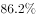

- **B**. 
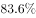
　✅
- **C**. 

- **D**. 

**答案**：B

**官方解析**

题干所求为“2018年1-2月份······占······比重为”，且材料时间为2018年1-2月，判定本题为现期比重问题。定位文字材料“2018年1-2月份，全国规模以上工业企业实现利润总额9689亿元······制造业实现利润总额8100亿元”，则2018年1-2月份制造业实现利润总额占全国规模以上工业企业实现利润总额的比重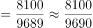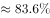，B项最为接近。

故正确答案为B。

---

### 第 4 题　qid 2452887 · 增长

2018年1-2月份按企业性质分类中实现利润总额同比增长额大于45亿元的有：

- **A**. 1个
- **B**. 2个
- **C**. 3个　✅
- **D**. 4个

**答案**：C

**官方解析**

题干所求为“同比增长额大于45亿元的有······”，判定本题为增长量比较问题。定位文字材料“国有控股企业实现利润总额2918.1亿元，同比增长；集体企业实现利润总额36.9亿元，增长；股份制企业实现利润总额6829.5亿元，增长；外商及港澳台商投资企业实现利润总额2259.6亿元，增长；私营企业实现利润总额2830.8亿元，增长”，则各类企业增长量情况如下：

国有控股企业：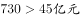；

集体企业：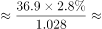；

股份制企业：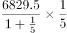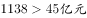；

外商及港澳台商投资企业：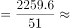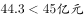；

私营企业：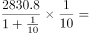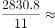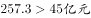。

则2018年1-2月份实现利润总额同比增长额大于45亿元的企业类型有国有控股企业、股份制企业、私营企业3种。

故正确答案为C。

---

### 第 5 题　qid 2452889 · 综合

下列说法正确的是：

- **A**. 2017年1-2月份制造业实现利润总额为7200亿元　✅
- **B**. 2018年1-2月份私营企业实现利润总额增量大于采矿业实现利润总额增量
- **C**. 2018年1-2月份外商及港澳台商投资企业实现利润总额增量最小
- **D**. 以上说法都不正确

**答案**：A

**官方解析**

A项：定位文字材料，“2018年1-2月份······制造业实现利润总额8100亿元，增长”，则2017年1-2月份制造业实现利润总额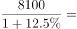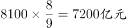。正确；

B项：定位文字材料，“2018年1-2月份······采矿业实现利润总额877.9亿元，同比增长”，采矿业实现利润总额增量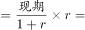。结合第109题，私营企业实现利润总额增量；即2018年1-2月份私营企业实现利润总额增量小于采矿业实现利润总额增量。错误；

C项：结合第109题，外商及港澳台商投资企业实现利润总额增量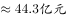；而集体企业实现利润总额增量，即2018年1-2月份外商及港澳台商投资企业实现利润总额增量不是最小的。错误；

D项：错误。

故正确答案为A。

---

## 材料 2

### 第 6 题　qid 2452875 · 增长

快递业务量与上年相比增长量最大的年份是：

- **A**. 2017年
- **B**. 2016年　✅
- **C**. 2014年
- **D**. 2015年

**答案**：B

**官方解析**

由题干“…增长量最大的年份”，可判定本题为增长量比较问题。定位柱状图，2013-2017年快递业务量分别为91.9亿件、139.6亿件、206.7亿件、312.8亿件、400.6亿件。根据增长量公式：，可得

2014年增长量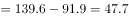亿件；

2015年增长量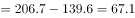亿件；

2016年增长量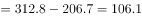亿件；

2017年增长量亿件。

则增长量最大的年份为2016年。

故正确答案为B。

---

### 第 7 题　qid 2452876 · 平均数

2013-2017年，快递业务量平均每年约收发：

- **A**. 206亿件
- **B**. 230亿件　✅
- **C**. 226亿件
- **D**. 246亿件

**答案**：B

**官方解析**

由题干“2013-2017年，…平均每年约收发”，结合材料时间，可判定本题为现期平均数问题。定位柱状图，2013-2017年快递业务量分别为91.9亿件、139.6亿件、206.7亿件、312.8亿件、400.6亿件。则2013-2017年，平均每年收发快递量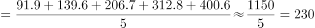亿件。

故正确答案为B。

---

### 第 8 题　qid 2452880 · 增长

2016年快递业务量比2015年约增长：

- **A**. 

　✅
- **B**. 

- **C**. 

- **D**. 

**答案**：A

**官方解析**

由题干“2016年…比2015年约增长”，结合选项都是百分数，可判定本题为一般增长率问题。定位柱状图，2015年和2016年快递业务量分别为206.7亿件、312.8亿件。根据增长率计算公式：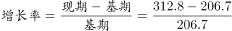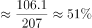。

故正确答案为A。

---

### 第 9 题　qid 2452882 · 增长

2017年比2013年快递业务量增加：

- **A**. 261亿件
- **B**. 312.8亿件
- **C**. 318.7亿件
- **D**. 308.7亿件　✅

**答案**：D

**官方解析**

由题干“2017年比2013年…增加”，结合选项有单位，可判定本题为增长量计算问题。定位柱状图，2013年和2017年快递业务量分别为91.9亿件、400.6亿件。根据增长量公式：亿件。

故正确答案为D。

---

### 第 10 题　qid 2452884 · 综合

以下说法不正确的是：

- **A**. 快递业务量增速最大年份是2013年
- **B**. 快递业务量增速最小年份是2017年
- **C**. 五年间快递业务量增加最多的年份也是业务量增速最快的年份　✅
- **D**. 2015年快递业务量比2014年增加67.1亿件

**答案**：C

**官方解析**

A项：定位折线图，增速最大的年份为2013年，正确；

B项：定位折线图，增速最小的年份为2017年，正确；

C项：定位柱状图，根据111题可知，快递业务量增加最多的年份为2016年；定位折线图，增速最快的年份为2013年，并非同一年，错误；

D项：定位柱状图，2014年和2015年快递业务量分别为139.6亿件、206.7亿件。根据增长量公式：亿件，正确。

本题为选非题，故正确答案为C。

---

## 材料 3

### 第 11 题　qid 2452879 · 增长

2017年，中国内地对韩国出口额比2016年同期约净增长：

- **A**. 6186亿元
- **B**. 756亿元
- **C**. 5250亿元
- **D**. 779亿元　✅

**答案**：D

**官方解析**

根据“2017年，中国内地对韩国出口额比2016年同期约净增长”，结合选项为亿元，判断本题为增长量计算问题。定位表格第七行，2017年我国内地对韩国出口额为6965亿元，比上年增长。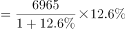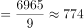亿元。D项最接近。

故正确答案为D。

---

### 第 12 题　qid 2452881 · 综合

中国内地进口额与出口额相差最大的国家和地区是：

- **A**. 欧盟
- **B**. 美国　✅
- **C**. 中国香港
- **D**. 中国台湾

**答案**：B

**官方解析**

定位表格第二、三、六、八行，

中国内地对欧盟的进口额、出口额分别为16543亿元、25199亿元，相差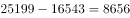亿元；

中国内地对美国的进口额、出口额分别为10430亿元、29103亿元，相差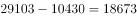亿元；

中国内地对中国香港的进口额、出口额分别为495亿元、18899亿元，相差亿元；

中国内地对中国台湾的进口额、出口额分别为10512亿元、2979亿元，相差亿元；

据上可知，中国内地对美国的进口额与出口额相差最大。

故正确答案为B。

---

### 第 13 题　qid 2452883 · 综合

2016年中国内地对日本的进口额约为：

- **A**. 8546亿元
- **B**. 6185亿元
- **C**. 9634亿元　✅
- **D**. 10501亿元

**答案**：C

**官方解析**

根据“2016年中国内地对日本的进口额约为”，结合材料时间为2017年数据，判断本题为基期计算问题。定位表格第五行，2017年中国内地对日本的进口额为11204亿元，比上年增长。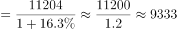亿元，与C项最接近。

故正确答案为C。

---

### 第 14 题　qid 2452885 · 综合

2017年中国内地与下列四个国家和地区中实现贸易逆差的是：

- **A**. 俄罗斯
- **B**. 东盟
- **C**. 中国台湾　✅
- **D**. 印度

**答案**：C

**官方解析**

贸易逆差即，即只需表格中第二列数据小于第五列数据即可。分别定位表格第四、八、十、十一行，中国内地只有对中国台湾的出口额（2979亿元）进口额（10512亿元），因此对其实现贸易逆差。

故正确答案为C。

---

### 第 15 题　qid 2452888 · 比重

2017年中国内地出口额占全部比重大于进口额占全部比重的国家和地区有：

- **A**. 3个
- **B**. 4个　✅
- **C**. 5个
- **D**. 6个

**答案**：B

**官方解析**

定位表格第四、七列，出口额占全部比重大于进口额占全部比重的国家和地区有欧盟（出口占比进口占比）、美国（出口占比进口占比）、中国香港（出口占比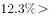进口占比）、印度（出口占比进口占比）。共4个国家和地区。

故正确答案为B。

---
